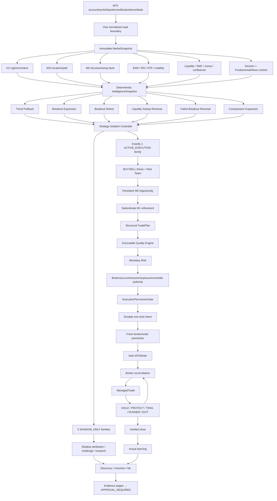
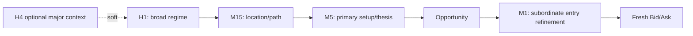
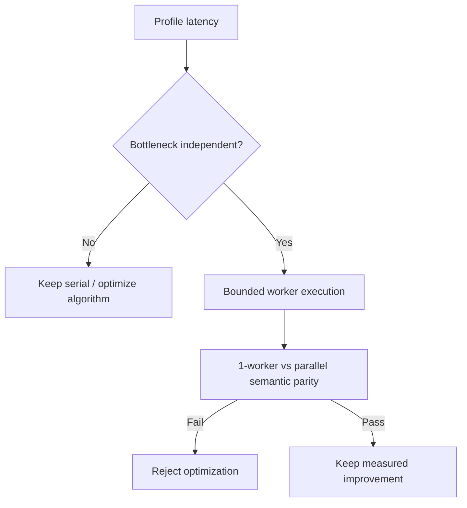
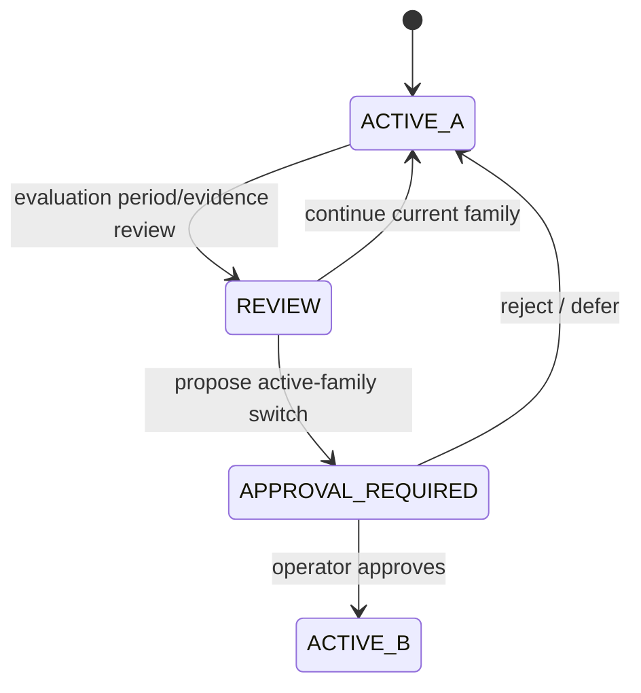
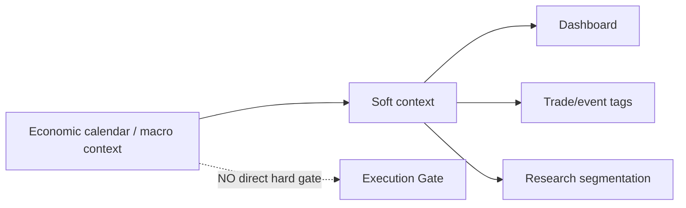
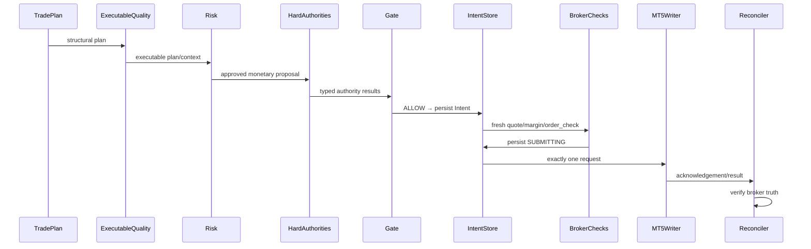
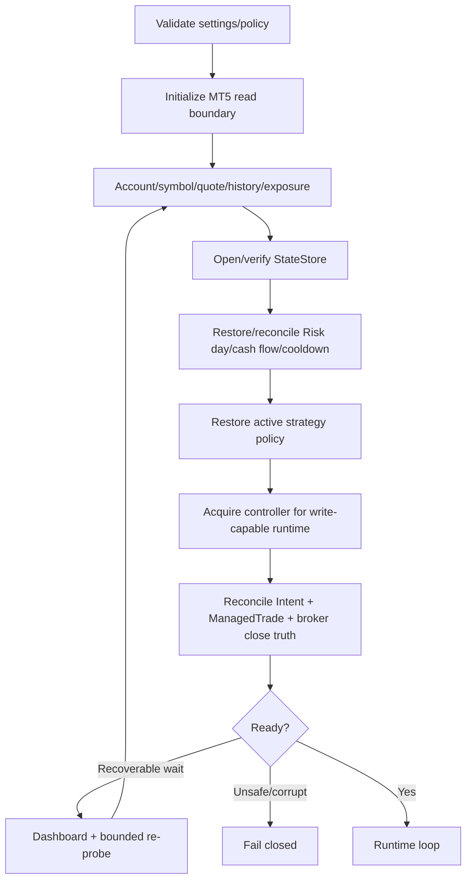
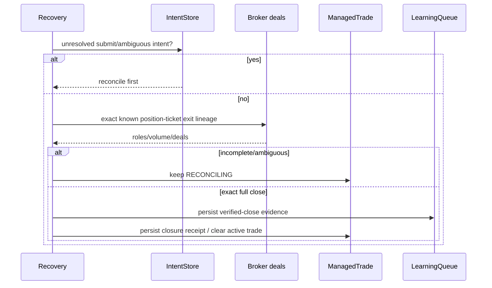

# GoldScalpTrader — Runtime Architecture

**Status:** APPROVED TARGET ARCHITECTURE — DOCUMENTATION RECONSTRUCTION / IMPLEMENTATION PROOF PENDING
**Version:** 2.0-hybrid-fast-accurate-scalp
**Authority:** Whole-system topology, dependency DAG, performance model, strategy isolation, ordered financial authority, runtime/recovery boundaries and presentation/research separation.

Canonical recovery architecture: [`BACKUP_SYNC_AND_RECOVERY_ARCHITECTURE.md`](../BACKUP_SYNC_AND_RECOVERY_ARCHITECTURE.md).

## 1. Purpose

This document explains how GoldScalpTrader fits together as one runtime. Detailed topic contracts own their local rules; this architecture owns:

- dependency order;
- reusable shared facts;
- what may run independently;
- where physical parallelism is useful;
- where execution must remain serial;
- active-family versus shadow-family behavior;
- M5→M1 entry sequence;
- executable-quality revalidation;
- startup/recovery/liveness;
- trade management and verified-close flow;
- learning/research background work;
- source/runtime backup boundaries;
- presentation isolation.

## 2. Architectural objective

GoldScalpTrader must be both **fast and accurate**.

The system therefore does not choose between “serial” and “parallel” globally. It uses a **hybrid dependency DAG**:

- parallelize only dependency-independent analytical work when profiling proves useful;
- share/calculate reusable facts once;
- preserve deterministic result ordering;
- keep money, lifecycle and broker authority strictly ordered;
- measure latency rather than assume concurrency is faster.

## 3. Whole-system topology



## 4. Data ownership and read boundaries

### 4.1 One analytical MT5 boundary

`market_data/mt5_reader.py` (planned owner) is the normal source for:

- account/server identity;
- symbol specification;
- bid/ask/current tick;
- completed H1/M15/M5 and optional H4/M1 history;
- positions/orders/deals as required;
- terminal/account/symbol trade permissions.

### 4.2 Immutable MarketSnapshot

Analytical workers consume the same normalized snapshot. This prevents:

- different desks seeing different candle cutoffs;
- repeated MT5 latency;
- hidden read-side race conditions;
- one strategy using information unavailable to another in the same cycle.

### 4.3 Legitimate fresh reads

The architecture permits fresh broker reads when **current** truth is required:

- final executable quote;
- spread/drift revalidation;
- margin/order-check;
- reconciliation;
- recovery;
- active-position management.

These fresh reads do not rewrite the causal historical snapshot.

## 5. Timeframe topology



M1 cannot independently create a production trade. It may improve timing only after a valid active-family M5 Opportunity exists.

## 6. Analytical dependency DAG

### Stage A — reusable primitives

Potentially independent work from immutable inputs:

- H1/M15/M5 candle/structure primitives;
- EMA/RSI/ATR/volatility calculations;
- session clock/context;
- optional News/Fundamental acquisition/context;
- M1 microstructure snapshot for already-armed opportunities.

### Stage B — dependent specialist intelligence

Consumes Stage A:

- technical zones/location;
- liquidity/sweeps/reclaims/FVG/OB;
- trendline/Fibonacci;
- volume/POC context;
- target-room/path analysis.

### Stage C — family evaluation

All six family analyzers may evaluate independently from one `IntelligenceSnapshot`.

### Stage D — isolation + ordered decision

The versioned strategy-isolation policy identifies exactly one trade-producing family. Shadow families remain non-authoritative for production entry.

## 7. Physical parallelism policy

Physical concurrency is not a correctness requirement.

Optimization order:

```text
1. avoid duplicate calculations
2. use efficient vectorized operations
3. cache immutable reusable values
4. profile end-to-end latency
5. parallelize only measured bottlenecks
6. re-test semantic parity
```



Constraints:

- immutable worker inputs;
- bounded worker count;
- deterministic canonical result order;
- exceptions/degradation visible;
- no worker-side broker writes;
- no worker-side lifecycle mutation;
- no different answer merely because scheduling changed.

## 8. Strategy Isolation Controller

The isolation controller is an analytical/governance component, not a broker writer.

Stored policy identity includes at least:

- `active_family`;
- policy/version ID;
- activation time/effective evaluation window;
- reason/approval lineage;
- optional benchmark/research episode ID.



A family switch must not rewrite old trade attribution.

## 9. Entry branch

```text
fresh immutable MarketSnapshot
→ IntelligenceSnapshot
→ all six family analyses
→ active-family BUY/SELL + Red Team
→ persistent M5 Opportunity
→ subordinate M1 refinement
→ TradePlan
→ fresh executable quote
→ fixed + aware spread/cost/drift/latency quality
→ monetary Risk
→ objective hard authorities
→ central Gate
→ durable Intent
→ fresh broker/order checks
→ sole writer
→ reconciliation
→ ManagedTrade only after verified OPEN
```

### 9.1 Why M1 is subordinate

M1 is valuable because waiting for another completed M5 bar can make a scalp late. But M1 noise is dangerous if allowed to invent standalone theses. The architecture therefore uses M1 for **precision**, not **permission to invent opportunity**.

## 10. Executable Quality Engine

This layer answers:

> “The structural trade idea is valid; is it still economically executable now?”

Inputs include:

- Approved Entry Reference;
- current Bid/Ask;
- absolute spread;
- spread/SL ratio;
- spread/target ratio;
- recent healthy spread baseline;
- estimated slippage allowance;
- cost/reward ratio;
- decision age / decision→send latency;
- price drift/chase;
- M1 trigger freshness;
- remaining target room.

Output is typed, reason-rich and separate from monetary Risk.

Excess latency/drift generally triggers revalidation. It becomes terminal only when the underlying Opportunity/geometry is no longer efficient or valid.

## 11. News/Fundamental lane



Provider failure affects News-context health, not broker permission. Real event-induced bad conditions are caught through measurable price/execution facts.

## 12. Session lane

Session has two meanings:

1. **analytical session context** — Asia/London/NY/overlap performance, soft;
2. **broker market/session safety** — OPEN/CLOSED/PRE_CLOSE/reopen conditions, hard.

These must not be conflated.

## 13. Risk/execution serial authority

From structural plan onward, ordering is explicit:



No physical parallelism is allowed to reorder this sequence.

## 14. Startup and recovery topology



Restored state is context. MT5 is current exposure authority.

## 15. Runtime liveness matrix

| Condition | Process | Analysis | New entry | Management | Dashboard |
|---|---|---|---|---|---|
| healthy/open | alive | active+shadow | governed | governed | full |
| News provider unavailable | alive | yes, News context degraded | **not blocked by News alone** | governed | show degraded |
| stale required market data | alive/wait | paused/limited | blocked by data owner | safe management as possible | exact reason |
| broker CLOSED | alive | research/context may continue | blocked | governed close/none as broker permits | full |
| PRE_CLOSE | alive | entry disabled | blocked | required flatten policy | full |
| unresolved Intent | alive/reconciling | optional read-only | blocked | reconciliation first | exact lifecycle |
| persistence corruption | fail/recover | paused | blocked | recovery-safe only | fault |
| active trade exists | alive | shadow research may continue | capacity governed | managed | full |

## 16. ManagedTrade branch

```text
fresh position/broker truth
→ restore/verify ManagedTrade identity
→ current structure + executable facts
→ HOLD / PROTECT / TRAIL / RUNNER / EXIT
→ any MODIFY/CLOSE becomes a governed Intent
→ sole writer
→ broker verification
→ update local lifecycle only after verification
```

Time-efficiency is first-class for scalping: an unproductive trade may EXIT rather than silently become a swing. Exact timing is calibrated.

## 17. Broker-side/manual close recovery



Unknown external positions are never adopted.

## 18. Learning/research architecture

Background learning/research may run independently of broker authority and may use compute parallelism appropriate to the workload.

Research lanes include:

- actual active-family trades;
- shadow-family counterfactuals;
- missed opportunities;
- blocked opportunities with exact blocker;
- invalidated setups;
- system-fault episodes;
- session/event tags;
- cost/latency/entry/exit efficiency;
- candidate invention/tuning/ML.

Production promotion remains approval-gated.

## 19. Dashboard architecture

Terminal dashboard is the primary operational view. Optional graphical dashboard is secondary/read-only.

Presentation consumes immutable/atomic DTOs and cannot:

- recalculate Risk;
- change active strategy;
- grant Gate permission;
- call MT5 writer;
- promote research candidates.

Dashboard updates may run at a faster read-only pulse than the strategy decision cycle.

## 20. Backup/recovery architecture

Runtime GitHub activity is zero.

Source/history:

```text
coherent development packet
→ Git commit/remote
→ operator git pull --ff-only
→ local full-history clone
→ optional clean ZIP/Drive recovery package
```

Runtime:

```text
transactional StateStore
→ rolling checkpoints
→ shutdown checkpoint
→ optional portable runtime/learning package
```

See the canonical backup document for cross-machine and off-site details.

## 21. Performance budgets and telemetry

Performance must be measured by stage, not guessed.

Planned telemetry categories:

| Stage | Example metrics |
|---|---|
| MT5 read | snapshot acquisition ms |
| intelligence | per-desk ms, total critical path |
| families | per-family ms, active-family ms |
| fusion/Opportunity | decision ms |
| M1 refinement | trigger age / evaluation ms |
| TradePlan/quality/Risk | evaluation ms |
| final revalidation | quote age/drift ms |
| writer | request latency |
| reconciliation | broker-confirmation latency |
| dashboard | render ms, isolated from strategy latency |
| research | asynchronous/offline throughput |

Concurrency is accepted only if it improves measured critical-path latency without semantic drift.

## 22. Current deferred architecture

Explicitly deferred:

- same-account active-active multi-machine broker writers;
- distributed DB/shared consensus/fencing infrastructure;
- sophisticated partial-close optimization as a release dependency;
- paid News API requirement;
- GitHub Actions/cloud compute dependency.

These are deferred, not accidentally omitted.

## 23. Final architecture invariant

> **Parallelize facts and hypotheses only where it makes the measured critical path faster; serialize money and broker authority; let exactly one strategy family produce live trades at a time for clean efficiency attribution; use M1 to sharpen a valid M5 opportunity rather than invent one; and let real executable market facts—not News labels—decide whether a scalp remains economically tradeable.**
