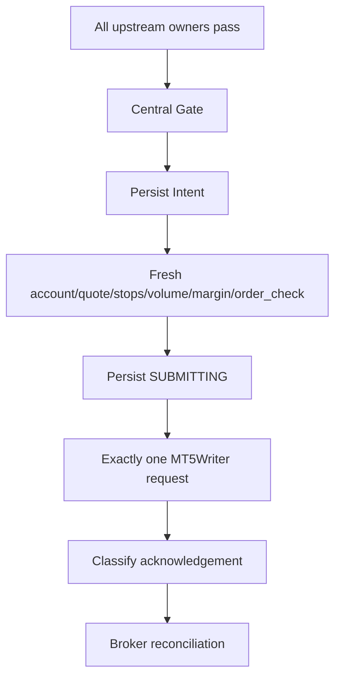

# GoldScalpTrader — Build Phases

**Status:** APPROVED BUILD MODEL — DOCUMENTATION RECONSTRUCTION / IMPLEMENTATION NOT STARTED
**Version:** 2.0-institutional-dependency-build
**Authority:** Dependency order, phase ownership, implementation sequencing, evidence gates and release progression.

Canonical recovery architecture: [`BACKUP_SYNC_AND_RECOVERY_ARCHITECTURE.md`](../BACKUP_SYNC_AND_RECOVERY_ARCHITECTURE.md).

## 1. Why phases exist

Phases enforce dependency/evidence order. They are not a progress diary and do not permit later features to hide an incomplete earlier authority.


## 2. Phase 0 — Documentation and architecture freeze

**Purpose:** make Documents the reconstructable baseline before production code.

Required completion:

- latest 66-file reference tree reconciled;
- missing `GITHUB_STRICT_USE_POLICY.md` and `BACKUP_SYNC_AND_RECOVERY_ARCHITECTURE.md` added/adapted;
- all current compressed docs restored to reference-equivalent-or-better coverage;
- approved Scalp deltas integrated;
- diagrams/tables/state machines added where meaningful;
- one canonical owner per rule with detailed mirrored consumer explanations;
- folder-numbering migration completed and all links verified;
- 100+ challenge audit rerun;
- final operator approval.

**No production implementation begins before this phase is frozen.**

## 3. Universal feature packet

Every material implementation feature defines:

1. purpose;
2. explicit non-goals;
3. authority owner/non-authority;
4. typed inputs/outputs/units/identity/scope;
5. chronology/knowledge-time semantics;
6. state machine/lifecycle;
7. happy/WAIT/degraded/failure/UNKNOWN paths;
8. concurrency/order rules;
9. persistence/restart/recovery implications;
10. Risk/account impact;
11. broker/write impact;
12. operator/dashboard representation;
13. research/learning effect;
14. performance/latency expectations;
15. source/module ownership;
16. deterministic/integration/external proof;
17. calibration variables;
18. affected documentation graph;
19. rollback/supersession behavior where relevant.

## 4. Phase 1 — Package, configuration and domain contracts

**Purpose:** establish stable typed vocabulary before market logic.

Planned outputs:

- installable Python package;
- settings model with secret-safe configuration;
- enums/reason codes/IDs;
- immutable market/domain DTOs;
- active-strategy policy identity;
- Risk profile/aggressive overlay configuration;
- logging/health/reason infrastructure;
- financial-secret scanner.

Core source targets:

```text
config/settings.py
domain/ids.py
domain/enums.py
domain/market.py
domain/models.py
diagnostics/logging.py
diagnostics/reasons.py
diagnostics/health.py
security/financial_secrets.py
```

Exit evidence:

- import/package proof;
- settings validation;
- serialization/identity tests;
- no secret leakage;
- exact strategy-isolation/Risk config semantics.

## 5. Phase 2 — MT5 reads and normalized market truth

**Purpose:** create one narrow read boundary for Exness Gold facts.

Outputs:

- XAUUSDm/XAUUSD resolution;
- account/server identity;
- terminal/account/symbol permission facts;
- SymbolSpec including digits/point/volume/stops/filling;
- bid/ask/tick age;
- positions/orders/bounded deals;
- completed H1/M15/M5 plus optional H4 and M1 data;
- immutable MarketSnapshot;
- DataQuality and recovery truth.

Read code has no irreversible broker authority.

Exit proof:

- completed-bar chronology;
- alias/symbol facts;
- empty `[]` versus unavailable `None` semantics;
- quote age/data-quality tests;
- manual/foreign exposure classification;
- real Windows MT5 read proof classified external until run.

## 6. Phase 3 — Reusable market intelligence

**Purpose:** transform one snapshot into causal, reusable evidence.

Outputs:

- candle anatomy/sequences/swings/BOS/MSS;
- displacement/rejection/compression/expansion;
- support/resistance/zones/role flips;
- liquidity pools/sweeps/reclaim/acceptance;
- FVG/qualified OB/premium-discount/path;
- EMA20/50, RSI14, ATR14, volatility/extension;
- trendline/Fibonacci/POC/volume context;
- session context;
- Fundamental/News context tags/provider health;
- one IntelligenceSnapshot.

Important rule:

> Optional evidence can be strategically important without becoming a universal hard veto.

Performance rule: shared calculations first, physical concurrency only after profiling.

Exit proof:

- no-lookahead;
- causal availability;
- optional-evidence neutrality;
- stable typed reports;
- one-worker/parallel parity if physical concurrency is enabled.

## 7. Phase 4 — Six strategy families and Strategy Isolation

**Purpose:** independent hypotheses with clean live attribution.

Six families:

1. Trend Pullback Continuation
2. Breakout Expansion
3. Breakout Retest Continuation
4. Liquidity Sweep Reversal
5. Failed Breakout Reversal
6. Compression Expansion

Outputs:

- six typed FamilyReports;
- independent BUY/SELL cases;
- event/correlation lineage;
- exactly one `ACTIVE_EXECUTION` family;
- five `SHADOW_ONLY` families;
- active-family policy/version identity.

Exit proof:

- exactly-one-active invariant;
- shadow cannot create live Opportunity/Intent;
- active-family attribution survives restart;
- family switch does not rewrite history;
- all families remain available to research.

## 8. Phase 5 — Persistent Opportunity and M1 refinement

**Purpose:** separate “good setup exists” from “enter efficiently now.”

Outputs:

- Opportunity/Episode persistence;
- M5 setup authority;
- subordinate M1 refinement;
- ENTER/WAIT/MISSED/INVALID state machine;
- event age, M1 trigger freshness, chase distance, drift identity;
- fresh causal re-arm rules.

M1 may never create an independent production thesis.

Calibration items include:

- M1 refinement patterns;
- M1 trigger freshness;
- M5 event age;
- chase distance;
- approved-entry→current-price drift.

Exit proof includes restart state, terminal lock/re-arm and no M1-only trade regressions.

## 9. Phase 6 — Structural TradePlan and Executable Quality

**Purpose:** fix market geometry, then ask whether it remains economically tradeable.

### TradePlan outputs

- Approved Entry Reference;
- structural invalidation/SL;
- Immediate Obstacle;
- Primary Target;
- Expansion Target;
- optional Runner objective;
- immutable original R;
- gross room.

### Executable Quality outputs

- absolute spread;
- emergency fixed spread ceiling state;
- spread/SL ratio;
- spread/target ratio;
- recent healthy spread comparison;
- slippage allowance;
- cost/reward;
- quote age;
- decision→send latency state;
- price drift/chase;
- current net/cost-adjusted opportunity quality.

Swing's fixed 1.20R hard floor is not automatically imposed. Minimum gross R and minimum net quality are calibrated.

Exit proof:

- structural SL never tightened for money;
- no double-counted costs;
- stale quote revalidation;
- emergency-spread path;
- spread/SL and spread/target calculations;
- latency causes revalidation rather than arbitrary death when still valid.

## 10. Phase 7 — Monetary Risk, session facts and exposure

**Purpose:** independent affordability/account safety after valid executable geometry.

Preserved Risk profiles:

| Profile | Normal | Elevated | Hard entry ceiling | Daily lock |
|---|---:|---:|---:|---:|
| SMALL | 3.0–4.5% | >4.5–6.5% | 7% | 12% |
| MEDIUM | 2.0–3.0% | >3.0–4.5% | 5% | 9% |
| NORMAL | 1.0–2.0% | >2.0–3.5% | 4% | 7% |

Also:

- dynamic broker-aware volume;
- minimum-lot actual risk;
- margin;
- daily P/L/cash-flow state;
- one fresh same-episode re-entry baseline;
- 3 consecutive closed losses → at least 30m cooldown baseline;
- 0/1 independent Gold position capacity;
- aggressive 8%/16% overlay disabled by default.

Session context is soft; broker OPEN/CLOSED/PRE_CLOSE and symbol tradeability are hard factual states.

News/Fundamentals are **not** hard Risk/session permission.

Exit proof covers min-lot affordability, margin, daily lock, cooldown/restart, cash flow, exposure and PRE_CLOSE.

## 11. Phase 8 — Persistence and recovery foundation

**Purpose:** make later irreversible execution crash-safe.

Outputs:

- transactional local StateStore;
- schema/version/checksum/integrity;
- typed repositories;
- risk-day/cooldown state;
- active strategy policy;
- Opportunity/TradePlan;
- Intent repository;
- ManagedTrade/close receipt/learning queue;
- StrategyMemory/research/candidate state primitives;
- consistent checkpoint/restore.

Exit proof:

- corruption rejection;
- restore to new path;
- idempotency;
- no blind live-DB copy;
- no state reset after restart.

## 12. Phase 9 — Complete DRY_RUN trader

**Purpose:** prove the entire analytical/financial path without irreversible broker writes.

```text
MarketSnapshot
→ intelligence
→ all six family reports
→ strategy isolation
→ active-family decision
→ Opportunity + M1
→ TradePlan
→ Executable Quality
→ Risk
→ hard authority/Gate diagnostics
→ STOP before writer
```

Required outputs:

- reason-rich dashboard;
- throughput/blocker diagnostics;
- shadow-family counterfactual logging;
- timing/performance telemetry.

Exit proof includes multi-session historical/live dry-run stability and no write path invocation.

## 13. Phase 10 — Controlled DEMO execution, Intent and reconciliation

**Purpose:** introduce one auditable irreversible authority.



Rules:

- sole writer;
- positive DEMO environment proof before controlled writes;
- no blind retry;
- ambiguous acknowledgement = reconciliation;
- execution path contains no research/dashboard shortcut.

Future REAL capability remains separate and gated.

## 14. Phase 11 — Trade Manager and close recovery

Outputs:

```text
HOLD / PROTECT / TRAIL / RUNNER / EXIT
```

Includes:

- structural protection;
- time-efficiency EXIT;
- protection/trailing timing research;
- optional Runner conditions;
- broker-valid partial-management capability;
- PRE_CLOSE flatten;
- exact broker/manual close lineage;
- queue→closure receipt→clear active trade ordering.

Sophisticated partial-close optimization is deferred as a release dependency; basic broker-valid capability remains.

## 15. Phase 12 — Operator dashboard

Primary terminal dashboard becomes complete read-only operational UI.

Show:

- active strategy versus shadow families;
- H1/M15/M5/M1 context;
- Opportunity/Timing;
- gross/net quality;
- spread/SL, spread/target, cost burden;
- Risk profile/aggressive mode/cooldown;
- exact upstream blocker vs Gate state;
- open trade/manager state;
- News as context, not permission;
- learning/research/candidate status;
- backup/recovery/health;
- latency/throughput metrics.

Graphical dashboard is preserved and may be developed to expert quality; presentation remains non-authoritative.

## 16. Phase 13 — Research, continuous learning, invention and ML

**Purpose:** continuously improve candidates without silent production mutation.

This phase is not “deferred until someday”; the architecture/source is implemented once reliable evidence inputs exist.

Outputs:

- chronological replay;
- walk-forward/stress/ablation;
- actual/shadow/missed/blocked datasets;
- StrategyMemory;
- autonomous strategy invention candidates;
- parameter optimization candidates;
- advanced ML candidates;
- candidate registry/fingerprints;
- automated evidence-stage progression;
- `APPROVAL_REQUIRED` production boundary.

Final live/production promotion always requires explicit operator approval.

## 17. Phase 14 — Backup, source recovery and sequential machine handoff

Implements the canonical backup architecture:

- source/history recovery;
- rolling/final local checkpoints;
- optional clean source ZIP;
- optional Drive/off-site publication;
- secret scanning;
- restore verification;
- learning/candidate lineage preservation;
- fresh-machine sequential same-account handoff.

Same-account active-active/distributed writer and distributed DB/fencing remain deferred.

## 18. Phase 15 — Connected DEMO certification

Required drills include:

- real symbol/account/permission reads;
- current broker schedule/PRE_CLOSE evidence;
- controlled OPEN;
- fill/slippage/deviation evidence;
- MODIFY/PROTECT/TRAIL;
- TP/SL/broker-side close;
- governed CLOSE;
- manual close of known bot trade;
- ambiguous acknowledgement/no duplicate when safely exercisable;
- restart during active lifecycle;
- strategy-isolation attribution;
- M1 refinement timing evidence;
- cost/spread/latency telemetry;
- 3-loss/cooldown persistence;
- checkpoint/restore/handoff;
- actual/shadow learning report.

Mocks prepare these drills but do not replace them.

## 19. Phase 16 — Future REAL release gate

REAL is a preserved future capability, not initial default.

It requires a separate approved release contract that includes at least:

- sufficient controlled DEMO evidence;
- verified execution/recovery lifecycle;
- calibrated costs/latency;
- stable Risk behavior;
- secret/security checks;
- operator controls;
- explicit operator approval.

No UI/config shortcut may silently enable REAL.

## 20. Universal exit gate

A phase is complete only when:

```text
CANONICAL DOCS COMPLETE
+ CODE EXISTS
+ FOCUSED TESTS PASS
+ INTEGRATION/QUALITY GATES PASS
+ FAILURE/UNKNOWN/RESTART/IDEMPOTENCY COVERED
+ SOURCE/TEST/OPERATOR MAP SYNCHRONIZED
+ PERFORMANCE/SECURITY EFFECT CLASSIFIED
+ CALIBRATION/EXTERNAL PROOF HONESTLY CLASSIFIED
+ NO KNOWN CRITICAL CONTRADICTION
```

## 21. Current status

At this documentation-reconstruction stage:

- Phase 0 is **IN PROGRESS**;
- the current small Python scaffold is provisional and not canonical implementation proof;
- Phases 1–16 are not claimed complete;
- coding must not advance ahead of the reconstructed/frozen documentation baseline.
