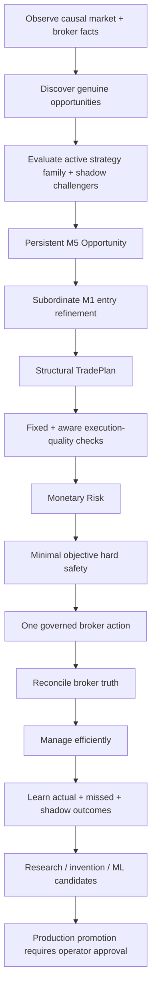
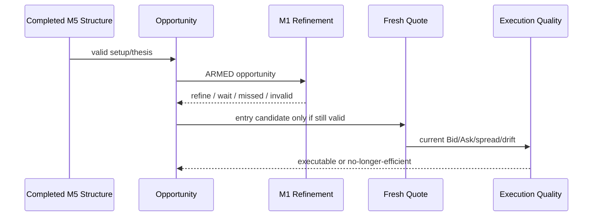

# GoldScalpTrader — Project Vision

**Status:** APPROVED PRODUCT DIRECTION — DOCUMENTATION RECONSTRUCTION / CALIBRATION PENDING
**Version:** 2.0-institutional-scalp-vision
**Authority:** Product purpose, trading personality, optimization objective, timeframe roles, strategy-isolation policy, safety philosophy, learning philosophy and non-goals.

## 1. Reader promise

After reading this document, a new developer, AI, reviewer or operator must understand:

- what GoldScalpTrader is trying to optimize;
- what “accurate” and “efficient” mean;
- why the system must find many opportunities without becoming a restriction machine;
- why M5 owns the setup while M1 refines entry;
- why only one strategy family may produce trades at a time during controlled efficiency evaluation;
- why News/Fundamentals are context, not a hard trading gate;
- why broker/account/execution safety remains hard;
- how backend learning, invention and ML can work continuously without silently mutating production.

## 2. Product mission

GoldScalpTrader is a local Exness MT5 XAUUSD/XAUUSDm **high-opportunity-recall, high-entry-precision Gold scalping system**.

Its primary objective is not “take fewer trades.” Its objective is:

> **Capture as much qualified after-cost trading edge as practical, with precise entry timing and objective broker/account safety, while continuously measuring why opportunities were taken, missed, blocked or poorly executed.**

The bot should be architecturally capable of high throughput when the market genuinely offers it. The operator-approved **120 trades/day** figure is a **research throughput benchmark**, not a mandatory quota.



## 3. Core optimization philosophy

GoldScalpTrader is:

> **Opportunity-First, Evidence-Weighted, Precision-Timed, Cost-Aware, Execution-Disciplined and Continuously-Learning.**

This means:

1. **Opportunity-First** — search broadly for genuine qualified opportunities; do not require unrelated evidence to agree.
2. **Evidence-Weighted** — structure, liquidity, indicators, session and optional technical context inform the active strategy without becoming universal vetoes.
3. **Precision-Timed** — M5 proves the setup; M1 may improve the entry after the setup exists.
4. **Cost-Aware** — spread, slippage, drift, latency and target-room economics are first-class scalp facts.
5. **Execution-Disciplined** — hard broker/account/risk safety remains objective and serial.
6. **Continuously-Learning** — backend research may invent/tune/test candidates continuously, but production promotion remains approval-governed.

## 4. What the system must do

1. read trustworthy MT5 account, symbol, quote, candle, position and deal facts;
2. maintain strict causal chronology and completed-structure rules;
3. understand structure, location, liquidity, volatility, momentum, session and optional fundamental context;
4. maintain six independent strategy-family models;
5. operate in **Strategy Isolation Mode** so exactly one family is `ACTIVE_EXECUTION` at a time and the other five are `SHADOW_ONLY` for clean efficiency attribution;
6. preserve independent BUY/SELL reasoning and Red-Team challenge without letting shadow families manufacture a production trade;
7. create a persistent M5 Opportunity before entry timing;
8. allow subordinate M1 microstructure to refine timing after a valid M5 Opportunity exists;
9. create structural invalidation/SL/objectives before monetary sizing;
10. evaluate execution quality using **fixed emergency spread safety plus context-aware spread/SL, spread/target and cost/reward economics**;
11. preserve the current SMALL/MEDIUM/NORMAL Risk bands and percentages unless a future explicitly approved change supersedes them;
12. apply minimum-lot affordability, margin, daily risk, cooldown, position capacity and exposure rules;
13. keep News/Fundamentals as soft context/research labels rather than direct trading block/cooldown authority;
14. submit at most one irreversible broker operation per durable Intent and reconcile its outcome;
15. manage one verified bot trade through HOLD/PROTECT/TRAIL/RUNNER/EXIT without widening approved risk;
16. preserve runtime/learning/candidate state through restart and controlled migration;
17. measure actual, missed, blocked and shadow opportunities;
18. continuously run governed research, strategy invention, parameter optimization and advanced ML candidate work in the backend;
19. allow candidate/shadow progression only through evidence stages;
20. require explicit operator approval before a candidate becomes production-live policy.

## 5. Timeframe authority

| Timeframe | Role | Production authority |
|---|---|---|
| H4 | optional major context | soft only |
| H1 | broad regime / directional context | soft contextual authority |
| M15 | opportunity location, path, target context | soft/contextual |
| M5 | **primary setup/thesis + management structure** | required structural authority |
| M1 | **subordinate entry refinement** | cannot create an independent trade |
| tick/quote | current executable Bid/Ask/spread/drift | final execution truth, not historical structure |

### 5.1 Chronology rule

Completed candles are the structural clock. Forming candles/ticks may support current executable telemetry and approved M1 refinement, but cannot retroactively become confirmed historical M5/H1/M15 structure.



## 6. Strategy Isolation Mode

Six strategy families remain part of the production architecture:

1. Trend Pullback Continuation
2. Breakout Expansion
3. Breakout Retest Continuation
4. Liquidity Sweep Reversal
5. Failed Breakout Reversal
6. Compression Expansion

But initial efficiency evaluation uses one trade-producing family at a time.

```text
ACTIVE_EXECUTION = exactly one family
SHADOW_ONLY      = remaining five families
```

Rules:

- all six may analyze the same snapshot;
- all six publish comparable typed evidence;
- only the active family may originate a production Opportunity/trade;
- shadow families may challenge, label conflict and generate research outcomes;
- shadow output cannot “vote” a trade into existence;
- switching the active family is versioned/governed and produces a clean evaluation period;
- historical metrics remain attributable by active-family policy version;
- backend research may test all families concurrently/offline.

This policy exists to measure each strategy's real contribution rather than hiding performance inside blended voting.

## 7. What accuracy means

Accuracy is multidimensional. It is not equivalent to win rate and not equivalent to low trade count.

Primary objective:

> **Maximize qualified net edge captured per trading day after realistic costs, subject to preserved Risk policy and objective execution safety.**

Required metrics include:

| Metric | Meaning |
|---|---|
| Qualified Opportunity Recall | genuine opportunities discovered |
| Opportunity Capture Rate | qualifying opportunities actually traded |
| Precision / win behavior | outcome correctness, not alone sufficient |
| Net Expectancy | average after-cost return in R/money |
| Entry Efficiency | actual entry quality versus available structure |
| Capture Efficiency | fraction of available favorable move captured |
| Exit Efficiency | quality of protection/exit versus opportunity path |
| False Block Rate | good opportunities unnecessarily prevented |
| Missed Opportunity Cost | after-the-fact cost of valid missed setups |
| Cost Burden | spread/slippage/friction relative to expected edge |
| Throughput | trades/hour and trades/day by regime/session |
| Drawdown / streak behavior | survival/robustness |
| Safety violations | must remain zero |

A 90% win rate with poor payoff or hidden tail loss is not acceptable. A very high expectancy produced by three trades per day is not automatically optimal if many qualified opportunities were missed.

## 8. 120-trades/day benchmark

The operator-approved benchmark asks:

> **Can the architecture safely identify and execute roughly 120 genuinely qualifying Gold scalp trades/day under suitable market conditions without degrading after-cost expectancy, entry quality or safety?**

It is never implemented as:

```text
while trades_today < 120:
    lower standards and force trades
```

If 150 valid opportunities exist, architecture must not arbitrarily cap them at 20. If only 45 valid opportunities exist, it must not manufacture another 75.

Low throughput must be diagnosable by blocker category:

- insufficient opportunities;
- active strategy qualification;
- entry timing too late;
- M1 refinement unavailable/weak;
- chase/drift;
- spread/cost burden;
- Risk/min-lot affordability;
- occupied position time;
- cooldown;
- actual broker/session closure;
- implementation latency/fault.

## 9. Soft evidence versus hard authority

### Soft evidence

- H4/H1/M15 context;
- EMA/RSI/ATR;
- trendline/Fibonacci;
- FVG/OB;
- liquidity/SMC;
- POC/volume context;
- London/New York/Asia performance context;
- Fundamental/News context;
- shadow-family opinions.

Soft evidence can improve or weaken a family thesis. Missing optional evidence does not become a global block.

### Hard authority

Hard broker action can stop only for objective required facts such as:

- wrong/unknown account/server/symbol;
- broker market actually closed or symbol not tradeable;
- unresolved conflicting exposure/capacity;
- daily Risk lock/cooldown;
- unaffordable minimum-lot risk/margin;
- stale/invalid executable quote;
- emergency spread or unacceptable cost geometry;
- excessive drift/chase after revalidation;
- invalid stops/volume/filling;
- controller/ownership uncertainty;
- unresolved Intent/reconciliation;
- persistence corruption affecting required financial/lifecycle authority;
- failed broker precheck.

**News events, News API failure and post-News warmup are not hard trading authorities.** Actual market deterioration is detected from market/execution facts.

## 10. Spread and execution-quality philosophy

Spread safety is hybrid:

```text
absolute emergency spread ceiling
+
spread / structural SL distance
+
spread / target room
+
spread versus recent healthy baseline
+
total expected cost / expected reward
```

A clearly broken/abnormal spread may hard-stop entry. Normal elevated spread is judged in relation to the plan's actual risk/target economics.

Slippage allowance, broker deviation and decision→send latency are calibrated from broker evidence. Excess latency should normally trigger fresh quote/geometry revalidation rather than arbitrary permanent rejection.

## 11. Risk philosophy

Current reference monetary Risk architecture is preserved:

| Profile | DayStartEquity | Normal | Elevated | Hard entry ceiling | Daily loss lock |
|---|---:|---:|---:|---:|---:|
| SMALL | positive < $300 | 3.0–4.5% | >4.5–6.5% | 7% | 12% |
| MEDIUM | $300–$999.99 | 2.0–3.0% | >3.0–4.5% | 5% | 9% |
| NORMAL | >= $1,000 | 1.0–2.0% | >2.0–3.5% | 4% | 7% |

Operator-requested aggressive small-account mode remains disabled by default:

```text
8%  maximum single-trade monetary SL-risk ceiling — NOT target
16% maximum aggregate open risk
16% daily loss ceiling
```

Three consecutive closed bot losses retain the at-least-30-minute cooldown baseline. One genuinely fresh same-episode re-entry remains the baseline. These are preserved now and later calibrated through evidence without silently changing production.

## 12. News/Fundamental philosophy

Fundamental/News remains valuable for:

- macro context;
- dashboard awareness;
- event tagging;
- strategy/session performance analysis;
- post-trade attribution;
- research into whether specific events help or hurt specific families.

It does **not** directly:

- block entry merely because an event exists;
- trigger cooldown;
- require a post-event warmup;
- force-close an otherwise valid managed trade;
- make API/provider outage a trading kill switch.

## 13. Learning / autonomous improvement philosophy

Backend improvement is an active subsystem, not a postponed idea.

```mermaid
flowchart LR
    LIVE["Production evidence"] --> MEMORY["Durable observations"]
    MEMORY --> DISC["Discovery / invention / parameter search / ML"]
    DISC --> REPLAY["Chronological replay"]
    REPLAY --> WF["Walk-forward / stress / ablation"]
    WF --> HOLD["Locked holdout"]
    HOLD --> SHADOW["Shadow"]
    SHADOW --> DEMO["Controlled DEMO candidate"]
    DEMO --> ASK["APPROVAL_REQUIRED"]
    ASK -->|Operator approves| PROD["Versioned production promotion"]
```



The backend may automatically create/tune candidate strategies and ML models and progress them through automated evidence stages where contracts allow. It may **not silently change production/live policy**. Final production promotion requires explicit operator approval.

## 14. Performance philosophy

The system should be fast enough that analysis latency does not destroy scalp edge.

- immutable snapshot calculations should be shared, not recomputed per family;
- vectorization/caching precede blind concurrency;
- logical specialist independence is mandatory;
- physical analytical parallelism is profiling-driven;
- result order/semantics are deterministic regardless of worker count;
- broker/financial authority remains serial;
- performance telemetry includes decision latency, revalidation latency and execution timing.

## 15. Non-goals

- no guaranteed profit/win rate;
- no forced daily trade quota;
- no martingale/grid/averaging down;
- no News-based hard kill switch;
- no M1-only independent production strategy without a future approved architecture change;
- no shadow-family vote that secretly creates a production trade;
- no arbitrary fixed-pip stop/target system;
- no structural SL tightening merely to fit minimum volume;
- no blind resend after ambiguous broker acknowledgement;
- no hidden second broker writer;
- no live production self-modification without approval;
- no same-account active-active multi-machine writer in the current architecture;
- no distributed database/fencing dependency in the current architecture;
- no GitHub/cloud dependency for trading runtime.

## 16. Proof boundary

| Evidence | Proves | Does not prove |
|---|---|---|
| deterministic tests | contract/software behavior | market edge |
| chronological replay | historical behavior under declared assumptions | future return |
| strategy-isolation replay | family attribution/comparison | broker execution quality |
| connected MT5 readiness | account/symbol/read behavior | profitable write lifecycle |
| controlled DEMO | broker/runtime execution evidence | all future conditions |
| after-cost learning report | actual observed outcomes | permanent edge |
| final release audit | evidence for exact build/scope | permanent correctness |

## 17. Final product invariant

> **GoldScalpTrader should never improve apparent safety by becoming unnecessarily restrictive, and should never improve apparent trade frequency by weakening real broker/account safety. The architecture must maximize qualified opportunity discovery and precise after-cost execution while keeping objective financial/execution authority explicit, minimal and auditable.**
