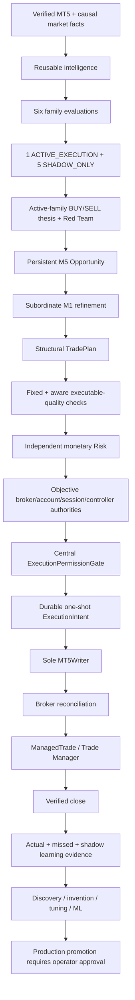
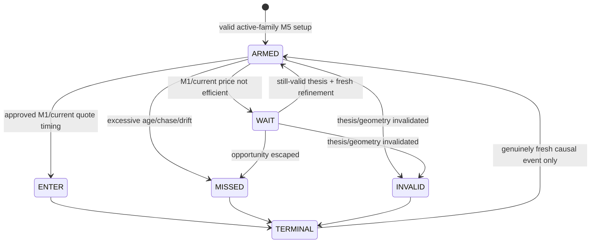
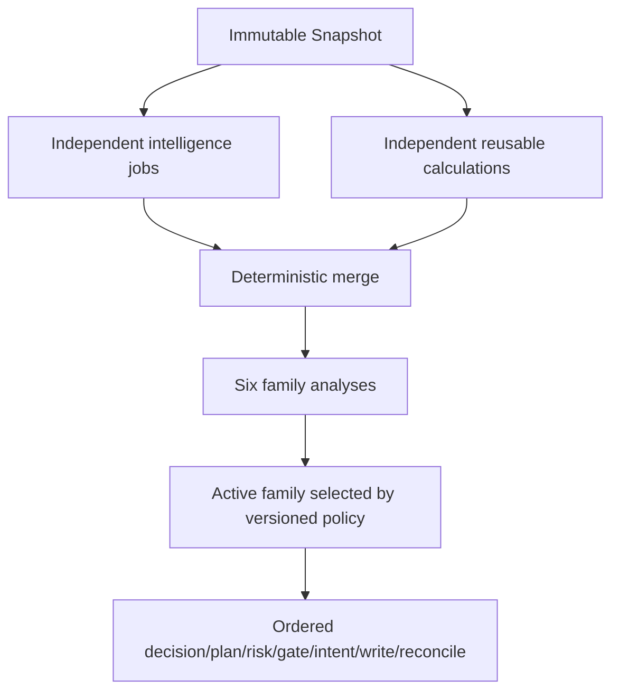
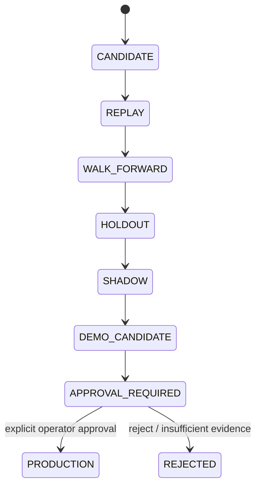

# GoldScalpTrader — System Contract

**Status:** APPROVED SYSTEM CONTRACT — DOCUMENTATION RECONSTRUCTION / IMPLEMENTATION PROOF PENDING
**Version:** 2.0-isolated-strategy-scalp-contract
**Authority:** Highest-level behavioural, chronology, attribution, monetary Risk, execution, recovery, learning and production-promotion invariants.

Canonical recovery architecture: [`BACKUP_SYNC_AND_RECOVERY_ARCHITECTURE.md`](../BACKUP_SYNC_AND_RECOVERY_ARCHITECTURE.md).
Canonical GitHub operating policy: [`GITHUB_STRICT_USE_POLICY.md`](../GITHUB_STRICT_USE_POLICY.md).

## 1. Purpose and conflict rule

This document is the constitution of GoldScalpTrader. Topic contracts add detail but cannot silently contradict it.

If any implementation/document/test changes:

- money/risk;
- broker exposure;
- strategy attribution;
- chronology/lookahead;
- ownership/controller authority;
- persistence/recovery;
- learning lineage;
- production-promotion authority;

then the owning contracts, decision ledger, test/evidence maps and operator documents must remain synchronized before implementation is considered complete.

## 2. Whole lifecycle contract



The system may say WAIT/MISSED/BLOCK/UNKNOWN at different owners. An upstream analytical or TradePlan/Risk rejection is **not** automatically proof that the central execution Gate itself returned BLOCK.

## 3. Timeframe and chronology contract

| Timeframe | Primary role | Production rule |
|---|---|---|
| H4 | optional major regime context | soft evidence only |
| H1 | broad directional/regime context | soft contextual evidence |
| M15 | location/path/target context | contextual evidence |
| M5 | primary setup/thesis and management structure | required structural authority |
| M1 | subordinate micro-entry refinement | cannot independently create a trade |
| live quote/tick | executable price/spread/drift/current health | current execution truth only |

Completed bars own structural confirmation. Pivot/event time, confirmation time and knowledge time are distinct. A forming M1/M5/tick observation cannot retroactively become confirmed historical structure.

Replay, learning and dashboards must preserve the same causal visibility rules as live operation.

## 4. One normalized market-read contract

One normalized MT5 read boundary owns analytical account/symbol/quote/candle/position/deal facts for a cycle. Descriptive intelligence and strategy families consume an immutable snapshot.

Fresh reads are allowed only where current broker truth is legitimately required, such as:

- execution precheck;
- current quote/drift/spread;
- reconciliation;
- recovery;
- active position management.

No strategy family opens a private MT5 read side-channel.

## 5. Strategy-family contract

The six preserved families are:

```text
TREND_PULLBACK_CONTINUATION
BREAKOUT_EXPANSION
BREAKOUT_RETEST_CONTINUATION
LIQUIDITY_SWEEP_REVERSAL
FAILED_BREAKOUT_REVERSAL
COMPRESSION_EXPANSION
```

### 5.1 Strategy Isolation Mode

Exactly one family is allowed to originate production trades during an evaluation policy period:

```text
ACTIVE_EXECUTION = 1
SHADOW_ONLY      = 5
```

All six may compute evidence and shadow outcomes. Only `ACTIVE_EXECUTION` may create the production Opportunity that can progress toward broker execution.

The other families:

- cannot outvote the active family into a trade;
- cannot directly create a second production Opportunity;
- may provide conflict/Red-Team evidence;
- may produce shadow/counterfactual outcomes for comparison;
- remain fully available for research/testing.

Changing the active production family is a versioned policy change with clean attribution.

## 6. Analytical evidence contract

Structure is primary language; indicators and optional confluence describe state/context.

Relevant evidence includes:

- candle/structure/BOS/MSS;
- support/resistance/role flips;
- liquidity/sweeps/reclaim/acceptance;
- FVG/qualified OB;
- EMA20/EMA50;
- RSI;
- ATR/volatility;
- trendline/Fibonacci;
- broker-local volume/POC context;
- session context;
- Fundamental/News context.

Rules:

- missing optional evidence is not bearish and is not score zero;
- important optional evidence may be strongly weighted by the family that needs it;
- no optional indicator becomes a universal global veto merely because it is important;
- opposing evidence remains visible;
- correlated evidence from one causal event cannot be counted repeatedly as independent certainty.

## 7. BUY/SELL and Red-Team contract

The active family evaluates BUY and SELL cases independently. A strong BUY is not merely absence of SELL evidence and vice versa.

Red-Team challenge may use:

- credible opposite thesis;
- poor evidence coverage;
- stale/late/chased entry;
- poor location/room;
- family-event correlation;
- contradictory M5/M1 microstructure;
- executable cost deterioration.

Red-Team analytical objections may reduce score, defer timing or invalidate the active-family thesis. It cannot impersonate monetary Risk or broker safety.

## 8. Opportunity and M1 timing contract

A valid active-family M5 setup creates a persistent Opportunity/Episode. Entry Timing then asks whether the current moment is efficient.



M1 refinement patterns, trigger freshness, M5 event age, chase distance and Approved Entry→Executable Price drift are calibration/evidence variables. They are not guessed merely to make the bot restrictive.

## 9. TradePlan contract

TradePlan exists before monetary sizing and owns:

- active family/policy identity;
- Opportunity/episode identity;
- Approved Entry Reference;
- structural invalidation and SL/buffer;
- Immediate Obstacle;
- Primary Target;
- optional Expansion Target;
- optional Runner objective;
- original immutable R;
- gross target-room quality;
- current cost-aware quality context.

There are no arbitrary fixed-pip SL/TP rules. Monetary Risk may reject a structural plan but must never tighten the structural stop merely to force minimum lot affordability.

Swing's historical 1.20R floor is **not automatically imposed as the hard Scalp floor**. Minimum gross R and minimum cost-adjusted quality are governed calibration variables approved for evidence-based tuning.

## 10. Executable-quality contract

Scalping requires a separate executable-quality layer between structural plan and irreversible broker action.

### 10.1 Fixed + aware spread policy

```text
A. absolute emergency spread ceiling
B. spread / structural SL distance
C. spread / current target room
D. spread versus recent healthy baseline
E. total estimated cost / expected reward
```

Spread/SL and spread/target ratios are approved design dimensions. Exact numeric thresholds are calibrated from real/DEMO evidence.

### 10.2 Slippage, deviation and latency

- **slippage allowance** estimates plausible fill deterioration for cost/quality analysis;
- **broker deviation** defines bounded price movement acceptable to the order request where the execution mode supports it;
- **decision→send latency** is measured explicitly.

If latency exceeds the governed budget, the normal response is fresh quote/geometry/Risk revalidation—not automatic permanent rejection if the opportunity remains executable.

## 11. Monetary Risk contract

The existing Risk architecture is preserved and must not be silently changed.

| Profile | DayStartEquity | Normal | Elevated | Hard entry ceiling | Daily loss lock |
|---|---:|---:|---:|---:|---:|
| SMALL | positive < $300 | 3.0–4.5% | >4.5–6.5% | 7% | 12% |
| MEDIUM | $300–$999.99 | 2.0–3.0% | >3.0–4.5% | 5% | 9% |
| NORMAL | >= $1,000 | 1.0–2.0% | >2.0–3.5% | 4% | 7% |

No arbitrary $100 eligibility floor exists. Actual executable minimum-lot risk, margin, exposure and structural stop geometry decide affordability.

### 11.1 Aggressive small-account overlay

Preserved operational capability, disabled by default:

```text
eligible baseline: positive DayStartEquity < $1,000
8%  maximum single-trade monetary SL-risk ceiling — NOT target
16% maximum aggregate open risk
16% daily loss ceiling
```

It never auto-enables merely because the account is small.

### 11.2 Cooldown / re-entry

Preserved baseline:

- one genuinely fresh same-episode re-entry;
- three consecutive closed bot losses → at least 30 minutes global cooldown;
- release additionally requires the owning fresh/healthy conditions.

These remain production defaults while later research may propose alternatives. Research does not silently mutate them.

## 12. Risk-day/accounting contract

The current UTC risk-day behavior remains the baseline unless a separately approved future policy changes it. The architecture may expose the boundary as a typed/configured policy identity, but changing it cannot be used as a runtime shortcut to erase daily-loss state.

```text
AccountSafetyPL
= CurrentVerifiedEquity - DayStartEquity - NetNonTradingCashFlow
```

Account Safety P/L and bot trading performance P/L remain separate. Unknown cash-flow/deal history is never treated as zero.

## 13. News/Fundamental contract

News/Fundamental is **soft analytical/research context only**.

It may provide:

- macro/event labels;
- dashboard awareness;
- research segmentation;
- session/family performance attribution;
- post-trade explanation.

It does **not** directly:

- BLOCK an otherwise valid new trade;
- trigger a News cooldown;
- require POST_NEWS_WARMUP;
- force close an existing trade;
- make provider/API failure a trading kill switch.

If a news event causes real market deterioration, the trade is governed by current measurable facts such as spread, drift, quote health, gap/dislocation, cost burden, latency/slippage and broker permission.

Provider state remains visible and truthful; unavailable News is never relabelled CLEAR.

## 14. Session contract

Session context (Asia/London/New York) is soft analytical/research context. Actual broker market-open/closed, symbol trade mode and PRE_CLOSE risk are hard factual authorities.

Preserved baseline pending current broker verification:

```text
Daily no-entry / mandatory flatten:    T-20 / T-10
Weekend no-entry / mandatory flatten:  T-60 / T-30
Daily reopen:                          1 clean completed M5
Weekend reopen:                        2 clean completed M5 + gap assessment
```

PRE_CLOSE timing/reopen-gap thresholds are approved calibration/external-proof items. Removing session safety merely to increase trade count is prohibited.

## 15. Hard safety contract

A strategy score cannot override:

- corrupt/insufficient required market data;
- wrong/unknown account/server/symbol;
- terminal/account/symbol trade-permission denial;
- daily-loss lock/cooldown;
- actual broker market CLOSED/PRE_CLOSE restrictions;
- unaffordable monetary Risk/minimum volume/margin;
- conflicting/manual/foreign/unknown exposure that violates capacity;
- stale/invalid quote;
- emergency spread or unacceptable executable cost geometry;
- excessive drift/chase after revalidation;
- invalid stops/volume/filling mode;
- unresolved Intent/broker lifecycle;
- persistence corruption affecting required authority;
- controller ownership uncertainty;
- failed broker precheck.

News itself is absent from this hard list.

## 16. Capacity / position contract

Initial production capacity is one independently risk-bearing Gold position per account/symbol scope.

Manual/foreign exposure is never silently adopted as bot-owned. Unknown exposure is never zero.

A position slot occupied by the active trade may reduce raw trade throughput; research must measure whether management duration causes missed valid opportunities rather than weakening ownership/risk safety.

## 17. Execution/controller contract

```text
active-family approved decision
→ TradePlan
→ executable-quality revalidation
→ monetary Risk
→ objective hard authorities
→ current controller authority
→ central Gate
→ persist Intent
→ fresh broker precheck
→ persist SUBMITTING
→ exactly one sole-writer request
→ classify acknowledgement
→ broker reconciliation
```

Every bot-managed OPEN/MODIFY/CLOSE travels through the same irreversible authority boundary.

- only `execution/mt5_writer.py` owns raw broker writes;
- one Intent ID sends at most once;
- ambiguous acknowledgement enters reconciliation only;
- no blind retry;
- dashboard/research/learning/backup cannot call writer;
- physical analytical concurrency never extends into broker authority.

## 18. Serial versus parallel contract

Logical specialist independence is mandatory. Physical analytical concurrency is **profiling-driven**, not a mandatory correctness feature.



Rules:

- vectorization/shared calculations/cache first;
- add bounded concurrency only where profiling shows latency benefit;
- immutable worker inputs;
- deterministic canonical output order;
- one-worker and parallel modes must preserve semantics;
- no analytical worker mutates broker/lifecycle authority;
- money/broker sequence remains serial.

## 19. ManagedTrade / close contract

Trade Manager actions:

```text
HOLD | PROTECT | TRAIL | RUNNER | EXIT
```

- protection/trailing timing is calibrated through evidence;
- time/efficiency weakness may be an EXIT reason;
- Runner is optional and requires fresh continuation/remaining objective quality;
- partial close is optional and only where broker-valid/divisible;
- correctness at 0.01 lot cannot depend on partial close;
- approved risk is never intentionally widened;
- broker-side/manual close of a known bot position requires exact ownership/volume/deal proof before local lifecycle is cleared.

## 20. Learning / AI / invention contract

Backend improvement remains active.

The system may automatically:

- create declarative strategy candidates;
- tune candidate parameters;
- train/test advanced ML candidates;
- run replay/walk-forward/stress/ablation;
- advance candidates through eligible automated evidence stages;
- maintain shadow comparisons against production.

It may not automatically:

- alter current production strategy/policy parameters;
- change hard Risk/safety;
- grant broker authority;
- promote to live production without explicit operator approval.



## 21. Persistence/recovery contract

Restart is not a new Risk day and not permission to forget unresolved broker actions.

Restore provides context only. Fresh MT5 truth remains authoritative for current exposure.

Preserve/reconcile at least:

- Risk/cash-flow/cooldown/re-entry state;
- active strategy isolation policy/version;
- Opportunity/TradePlan;
- Intent lifecycle;
- ManagedTrade;
- closure receipt/pending learning queue;
- StrategyMemory;
- research/candidate/promotion state;
- controller identity/fencing context.

Same-account active-active multi-machine execution and distributed DB/fencing are deferred. Sequential handoff is the supported architecture.

## 22. Dashboard/operator contract

The primary operator surface is read-only and reason-rich.

It must distinguish:

- active strategy family versus shadow families;
- Opportunity/Timing state;
- upstream blocker versus actual Gate state;
- gross versus cost-aware quality;
- current Risk profile/aggressive overlay;
- exact execution-quality blocker;
- News/provider context without implying hard authority;
- actual bot trade versus manual/external activity;
- live production metrics versus shadow/counterfactual metrics;
- candidate/ML research state versus production policy;
- unknown/not-evaluated values versus fake zero.

## 23. Documentation/code/test synchronization contract

Documents are the project baseline and implementation guide.

For every material component, canonical documentation must explain where applicable:

- purpose/scope/authority/non-authority;
- inputs/outputs/types;
- invariants/state machine;
- chronology;
- happy/wait/failure/recovery paths;
- concurrency/order;
- Risk/broker/persistence implications;
- dashboard/operator meaning;
- research/learning behavior;
- performance/latency;
- source ownership;
- deterministic/integration/connected proof;
- calibration/external-proof items;
- diagrams/tables/examples.

Code must not get ahead of the documents.

## 24. Final invariant

> **One active strategy may seek as many genuine opportunities as the market provides; soft evidence must improve judgment rather than become universal restriction; M1 must improve timing without inventing a thesis; execution cost must be measured realistically; and only objective monetary/broker/lifecycle authority may block the irreversible broker action. Learning may innovate continuously, but production changes remain explicitly approval-governed.**
