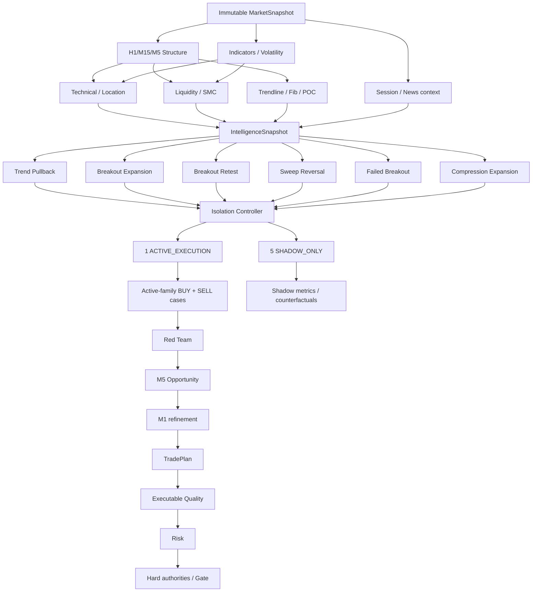

# GoldScalpTrader — Trading Floor Architecture

**Status:** APPROVED FLOOR ARCHITECTURE — DOCUMENTATION RECONSTRUCTION / CALIBRATION PENDING
**Version:** 2.0-isolated-active-family-floor
**Authority:** Specialist-team ownership, analytical dependency graph, strategy isolation, opportunity capture, Red-Team behavior, performance model and authority limits.

## 1. Why a trading floor

GoldScalpTrader is not one giant strategy function and not a checklist bot that requires every indicator to agree. It is an institutional-style set of specialist desks with bounded questions, typed outputs and explicit non-authority.

The floor must satisfy four objectives simultaneously:

1. **Opportunity Recall** — discover as many genuine scalp opportunities as practical;
2. **Attribution** — know exactly which strategy family produced each live trade;
3. **Entry Efficiency** — use M1/current quote to improve a valid M5 opportunity rather than chase it;
4. **Safety Separation** — keep soft analysis separate from hard money/broker authority.

## 2. Governing mental model

```text
soft analytical disagreement
→ score / conflict / WAIT / shadow evidence / research

active-family setup invalid
→ analytical INVALID / no Opportunity

trade economically poor now
→ executable-quality rejection/revalidation

financial/broker/lifecycle fact unsafe
→ hard BLOCK / UNKNOWN at owning authority
```

The system must not convert every analytical desk into a mandatory gate.

## 3. Institutional team map

| Team / desk | Planned owner | Publishes | Must never do |
|---|---|---|---|
| Market Data | `market_data/*` | normalized account/symbol/quote/candles/positions/deals | raw broker write |
| Candle Structure | `intelligence/candle_structure.py` | swings, BOS/MSS, displacement/rejection/compression | monetary sizing |
| Indicator / Quant | `intelligence/indicators.py` | EMA/RSI/ATR/volatility/extension | universal veto by itself |
| Technical / Location | `intelligence/technical.py` | zones, role flips, obstacles, target room | redefine broker truth |
| Liquidity / SMC | `intelligence/liquidity.py` | pools, sweeps, reclaim, FVG, qualified OB, path | label every wick a sweep |
| Confluence | `intelligence/confluence.py` | trendline/Fib/POC/volume context | become compulsory global checklist |
| Session Context | `intelligence/session.py` | Asia/London/NY/overlap context | fabricate broker OPEN/CLOSED |
| Fundamental / News | `intelligence/news.py` | macro/event context/provider health | hard-block trade merely due event/API |
| Six Family Teams | `strategies/*` | independent family BUY/SELL evidence | size money / write broker |
| Strategy Isolation Controller | `strategies/isolation.py` | active family + shadow states + version | silently switch production family |
| Active BUY/SELL Thesis | `decisions/fusion.py` | active-family directional thesis | accept shadow family as trade origin |
| Red Team | `decisions/fusion.py` | objections/conflict/correlation/chase | impersonate Risk/Gate |
| Opportunity Engine | `decisions/opportunity.py` | persistent episode/opportunity | call broker |
| Entry Timing | `decisions/timing.py` | M5/M1 ENTER/WAIT/MISSED/INVALID | create M1-only production thesis |
| TradePlan | `decisions/trade_plan.py` | entry reference, SL/invalidation, objectives, original R | monetary sizing |
| Executable Quality | `decisions/executable_quality.py` or equivalent | spread/cost/drift/latency quality | move structural SL to improve metrics |
| Risk | `risk/*` | affordability, profile, lot, margin, daily state/cooldown | rescue weak geometry |
| Execution Manager | `execution/*` | Gate/Intent/precheck/reconcile | decide strategy direction |
| MT5Writer | `execution/mt5_writer.py` | one irreversible broker operation | strategy/research logic |
| Trade Manager | `management/*` | HOLD/PROTECT/TRAIL/RUNNER/EXIT | bypass writer/Gate path |
| Learning | `research/live_learning.py` | verified actual observations | self-promote production |
| R&D / ML / Invention | `research/*` | candidates, tests, shadow evidence | live production mutation without approval |
| Persistence / Recovery | `persistence/*`, `app/recovery*` | durable state/checkpoints/recovery context | override MT5 truth |
| Diagnostics | `diagnostics/*` | health, reasons, latency, faults | grant trading permission |
| Operator | `operator/*`, dashboard composition | read-only presentation | recalc authority |

## 4. Staged floor topology



## 5. Strategy Isolation Mode — production rule

The operator approved one-at-a-time live strategy evaluation so performance can be measured cleanly.

### 5.1 States

```text
ACTIVE_EXECUTION
SHADOW_ONLY
DISABLED_RESEARCH_ONLY   # only when a governed policy explicitly disables evaluation
```

Exactly one of the six production families is `ACTIVE_EXECUTION` at a time.

### 5.2 Active family

The active family may:

- qualify BUY/SELL cases;
- create production Opportunity/Episode lineage;
- progress to M1 timing, TradePlan, Risk and execution.

### 5.3 Shadow families

Shadow families may:

- evaluate the same causal snapshot;
- publish what they would have done;
- provide bounded Red-Team conflict context;
- record hypothetical entry/timing/target results;
- contribute to research/ML/discovery;
- be compared against the active family.

They may not:

- create the live trade;
- vote the active family into a trade it did not qualify;
- consume a second live position slot;
- change the live Risk proposal;
- trigger broker writes.

## 6. Why isolation is required initially

Blended live fusion can hide which strategy actually has edge. Isolation produces clean evidence:

| Question | Isolation evidence |
|---|---|
| Which family wins most? | actual active-family outcomes |
| Which family has best Net R? | same |
| Which family finds most valid opportunities? | active + shadow recall comparison |
| Which family enters most efficiently? | entry-efficiency metric by family |
| Which family suffers highest cost burden? | spread/slippage/cost data by family |
| Which family misses moves due M1/timing? | timing attribution |
| Which family works by session/regime? | segmented actual/shadow evidence |
| Would a shadow family outperform the active one? | counterfactual/shadow dataset |

The system may rotate families only through a governed policy change. Old trades keep their original family/version attribution forever.

## 7. Active-family BUY and SELL cases

The active strategy family produces separate directional cases.

Example typed concept:

```text
FamilyReport
  family
  mode: ACTIVE_EXECUTION | SHADOW_ONLY
  buy_case
  sell_case
  coverage
  required_evidence
  optional_support
  conflicts
  causal_event_ids
  setup_age
  location_quality
  target_room
  timing_profile
  reasons[]
```

A strong BUY is not the absence of SELL; both sides are evaluated honestly.

## 8. Red-Team role under isolation

Red Team challenges the **active family** rather than blending six strategy votes into one live signal.

Valid challenges include:

- active BUY versus credible active-family SELL case;
- poor evidence coverage;
- stale setup;
- chase/extension;
- poor location/room;
- correlated evidence pretending to be multiple confirmations;
- M1 microstructure no longer supporting efficient entry;
- executable cost deterioration;
- active family contradicting major structural facts.

Shadow-family signals can be shown as context, but do not become an independent production permission source.

## 9. Correlation control

Correlation control is about **evidence de-duplication**, not restricting the number of strategies.

Suppose one breakout event causes:

```text
Breakout Expansion BUY
Breakout Retest BUY
Compression Expansion BUY
```

Those three reports may share one causal event. Research may compare all three, but fusion must not pretend that one event equals three independent confirmations.

Planned lineage concepts:

- structural event ID;
- breakout/sweep/reclaim ID;
- zone/liquidity-object identity;
- parent event;
- family interpretation.

Exact family-correlation caps/weighting are calibration items; de-duplication itself is required.

## 10. Important indicators/confluence — strong but non-universal

Some evidence can be extremely important without being a global blocker.

Examples:

### Trend Pullback family may strongly value

- EMA20/50 relationship;
- pullback location;
- trendline;
- Fibonacci retracement;
- RSI/momentum phase;
- M15/H1 directional context.

### Liquidity Sweep Reversal may strongly value

- liquidity pool quality;
- sweep/displacement;
- reclaim/rejection;
- FVG/OB context;
- premium/discount/location;
- opposite-side target path.

Rule:

> **A family may require evidence central to its own definition. That requirement must not automatically become a universal requirement for unrelated families.**

## 11. Session performance

Asia/London/New York/overlap are research/performance dimensions.

Track per family:

- opportunities/session;
- executed trades/session;
- win rate;
- Net R;
- average R;
- spread/slippage/cost burden;
- entry efficiency;
- capture efficiency;
- drawdown/streaks;
- missed/false-block rates.

Session evidence may later tune family thresholds if statistically justified. It is not a blanket “Asia=no trade” type rule unless a future explicit evidence-backed policy is approved.

## 12. Fundamental/News desk

News/Fundamental publishes context only:

```text
provider_health
source/provenance
known event labels
Gold/USD/rates macro tags
next event/countdown
research-event category
```

It has no direct live trading block/cooldown/warmup authority. A temporary API failure must not prevent a trade merely because context is missing.

## 13. Opportunity-first design

The floor must not optimize for a pretty rejection rate.

```text
valid active-family setup
→ preserve Opportunity
→ WAIT for efficient timing when possible
→ use M1 to improve entry
→ revalidate current economics
→ trade when still qualified and safe
```

It should not:

```text
optional indicator neutral
→ delete valid setup
```

nor:

```text
one missed micro-trigger
→ permanently forget surviving M5 opportunity
```

Fresh re-arm still requires genuinely new causal evidence after a terminal episode.

## 14. Throughput and over-restriction diagnostics

The operator-approved 120/day benchmark makes over-restriction measurable.

The floor must record why opportunities fail to become trades:

| Stage | Example non-execution reason |
|---|---|
| discovery | no active-family setup |
| Red Team | thesis conflict/coverage |
| Opportunity | stale/invalid geometry |
| M1 timing | no efficient micro entry / missed |
| quality | spread/SL, spread/target, cost/reward, drift |
| Risk | min-lot actual risk, margin, daily lock/cooldown |
| broker/session | actual CLOSED/PRE_CLOSE/permission |
| lifecycle | existing position/unresolved Intent |
| fault | data/persistence/controller issue |

Research must distinguish **good restriction** from **false block**.

## 15. Parallel performance model

Six families can be computationally independent, but parallel execution is enabled only where profiling shows a net critical-path win.

### Required invariants

- same immutable input;
- deterministic result ordering;
- no state mutation in worker tasks;
- one-worker semantic fallback;
- bounded workers;
- no broker calls from family workers;
- timing metrics per task/stage.

The floor should prefer shared precomputation over six copies of the same EMA/ATR/structure work.

## 16. TradePlan / quality / Risk handoff

The active family owns thesis identity; it does not own money.

```text
active family
→ Opportunity
→ M1 timing
→ TradePlan geometry
→ Executable Quality
→ Risk
→ hard authorities
→ Gate
```

TradePlan freezes structural SL/objectives. Executable Quality tests current economics. Risk sizes/checks affordability. Those responsibilities must not be merged because each failure means something different.

## 17. Learning and candidate comparison

Research datasets maintain at least:

```text
actual_active_trade
active_setup_not_traded
shadow_family_hypothetical
missed_opportunity
hard_blocked_opportunity
invalidated_setup
system_fault_episode
```

This allows family rotations to be evidence-driven rather than subjective.

## 18. Autonomous improvement boundary

Invention/ML/tuning may run in backend on all families and create candidate families/parameters. Automated evidence stages may continue until `APPROVAL_REQUIRED`.

No research worker changes `ACTIVE_EXECUTION` production identity or live parameters without governed operator approval.

## 19. Floor proof requirements

Before this floor is considered implemented:

- all six family outputs are typed and attributable;
- exactly-one-active invariant is tested;
- shadow family cannot create Intent/write;
- active-family switch preserves old attribution;
- BUY/SELL independence tested;
- correlation lineage/de-dup tested;
- optional evidence neutrality tested;
- M1 cannot create Opportunity alone;
- one-worker vs parallel semantics identical;
- false-block/missed-opportunity reason attribution exists;
- active/shadow research records are distinguishable.

## 20. Final floor invariant

> **All six strategies may think; exactly one may trade at a time. Optional evidence may improve a strategy without becoming a universal veto. Shadow families exist to challenge and learn, not to contaminate live attribution. The floor maximizes genuine opportunity discovery while handing every irreversible decision to separate TradePlan, executable-quality, Risk and broker-authority layers.**
