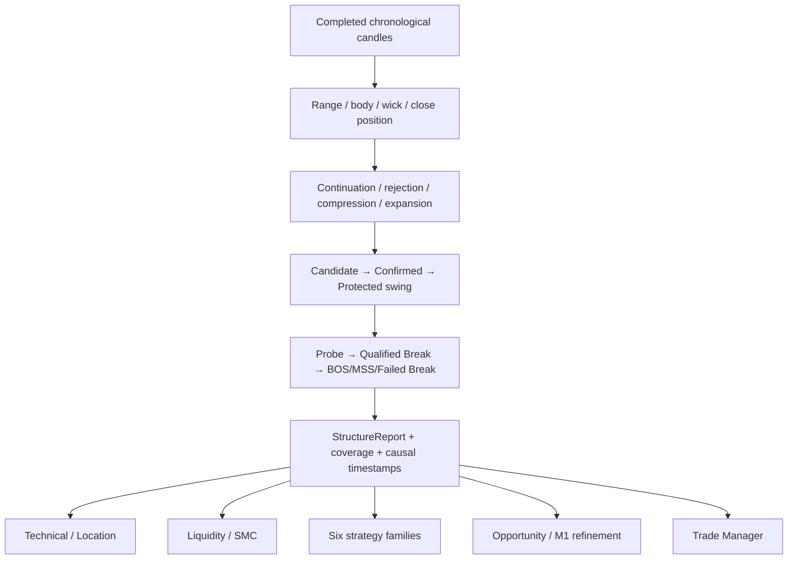
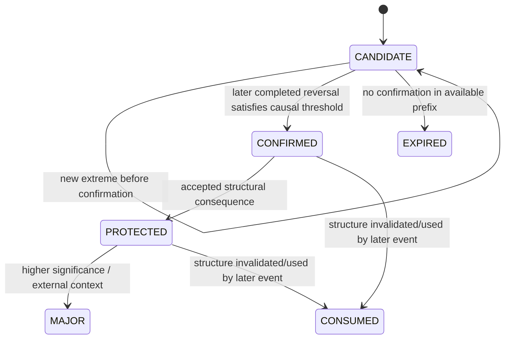
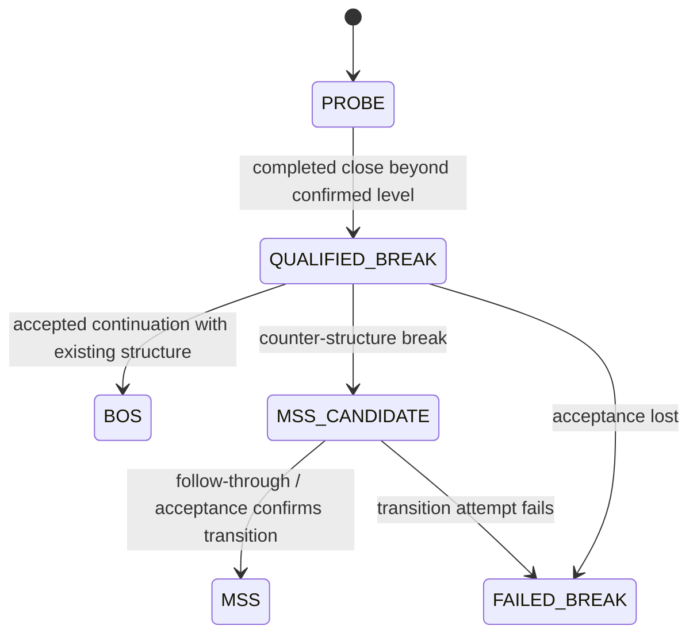

# GoldScalpTrader — Candle Structure and Price Behaviour

**Status:** APPROVED INTELLIGENCE CONTRACT — DOCUMENTATION RECONSTRUCTION / CALIBRATION PENDING
**Version:** 2.0-scalp-causal-structure
**Authority:** Candle anatomy, causal sequences, swings, protected structure, BOS/MSS maturity, displacement, rejection, compression/expansion, event knowledge-time and M5/M1 structural boundaries.

## 1. Purpose

The Candle/Structure desk answers:

> **What did price actually do, and when did that fact become knowable without hindsight?**

It provides causal market facts to Technical, Liquidity/SMC, strategy families, Opportunity/Timing, TradePlan, Trade Manager and research.

It does **not**:

- select the live strategy family;
- create broker permission;
- size money;
- set final broker SL/TP;
- turn M1 noise into an independent trade;
- use future bars to improve historical labels.

## 2. Core invariants

| Invariant | Required behavior |
|---|---|
| Completed-bar structural authority | Forming H1/M15/M5 candles never become confirmed structural proof. |
| Causal knowledge time | Any fact requiring a completed candle becomes knowable no earlier than that candle's close. |
| Pivot vs confirmation | `pivot_time` identifies geometry; `confirmed_at` identifies when the swing became knowable. |
| No lookahead | Replay prefix before `confirmed_at/event_time` cannot contain the future fact. |
| Per-timeframe ownership | M5 cannot rewrite H1/M15; M1 cannot rewrite M5 thesis structure. |
| Graduated evidence | Candidate, confirmed, protected and major/external structure remain distinct. |
| Shared inputs | ATR/normalized inputs are reused from the shared intelligence pipeline where available. |
| Soft analytical output | Structure supports/contradicts a thesis but does not grant broker permission. |
| Explicit missingness | Insufficient history yields UNKNOWN/reduced coverage, never fabricated trend. |

## 3. Causal structure pipeline



## 4. Time identity and knowledge identity

MT5 candle timestamp is treated as bar-open identity:

```text
bar_open_time  = candle.time_utc
bar_close_time = candle.time_utc + timeframe_duration
```

A derived structural fact may preserve both:

```text
geometry time     = where price extreme/event occurred
knowledge time    = when enough completed evidence existed to know it
```

This distinction is mandatory in live, replay and learning.

### Example

Suppose a possible swing high occurs on an M5 bar opening at 10:00, but the reversal needed to confirm that high only completes on the 10:10 bar at 10:15.

```text
pivot_time   = 10:00
confirmed_at = 10:15
```

A replay decision at 10:05 or 10:10 cannot use that confirmed swing.

## 5. Candle anatomy

For a completed candle:

```text
range       = high - low
body        = abs(close - open)
upper_wick  = high - max(open, close)
lower_wick  = min(open, close) - low
body_ratio  = body / range                if range > 0
close_pos   = (close - low) / range       if range > 0
range_atr   = range / ATR                 if ATR > 0
body_atr    = body / ATR                  if ATR > 0
```

Direction labels describe price behavior only:

```text
close > open  → BULLISH_BAR
close < open  → BEARISH_BAR
close = open  → NEUTRAL_BAR
```

A single candle label is never a standalone trade command.

## 6. Sequence states

The desk may classify bounded multi-bar behavior such as:

```text
BULL_CONTINUATION
BEAR_CONTINUATION
BULL_EXPANSION
BEAR_EXPANSION
BULL_REJECTION
BEAR_REJECTION
COMPRESSION
MIXED
UNKNOWN
```

Sequence classification uses normalized body/range/overlap/close behavior rather than named-pattern folklore.

### Scalping requirement

M5 sequence quality is a first-class setup/timing fact. M1 sequence may refine an already-valid M5 Opportunity, but cannot promote itself into an independent production thesis.

## 7. Swing lifecycle



### Candidate

Emerging pivot with no completed reversal proof. It may move. It has no confirmed structural authority.

### Confirmed

A later completed bar supplies the required ATR-normalized reversal/confirmation. Output records at least:

```text
side
price
pivot_time
confirmed_at
timeframe
significance_atr
source_ids
```

### Protected

A swing whose structural consequence gives it stronger invalidation/management meaning. It remains market geometry; TradePlan owns actual stop construction.

### Major/external

Higher-significance context used mostly by H1/H4/M15. A later future extreme cannot relabel an earlier decision retroactively.

## 8. Structure state

Per timeframe:

```text
BULLISH
BEARISH
RANGE
TRANSITION
UNDETERMINED
```

Typical interpretation:

- higher confirmed highs + higher confirmed lows → BULLISH;
- lower confirmed highs + lower confirmed lows → BEARISH;
- mixed progression / competing changes → TRANSITION;
- bounded repeated geometry → RANGE;
- insufficient confirmed structure → UNDETERMINED.

This is **context**, not a universal entry veto. A reversal family may intentionally operate against the prevailing local trend when its own causal conditions are satisfied.

## 9. Break / BOS / MSS lifecycle



| Event | Minimum meaning |
|---|---|
| PROBE | price traded through/touched known level; no acceptance yet |
| QUALIFIED_BREAK | completed close exceeded level by configured normalized amount |
| BOS | accepted break consistent with existing structural direction |
| MSS_CANDIDATE | qualified counter-structure break |
| MSS | later completed evidence confirms transition attempt |
| FAILED_BREAK | accepted-break attempt loses acceptance / returns through level |

A wick-only penetration is not automatically BOS/MSS.

## 10. M5 authority and M1 subordinate structure

### M5

Owns production setup/thesis structure and normal management structure.

M5 may establish:

- fresh break/retest;
- sweep/reclaim;
- pullback structure;
- compression/expansion setup;
- failed break;
- local invalidation geometry.

### M1

May publish micro-structure **only after** a valid M5 Opportunity exists for production timing.

Allowed M1 refinement examples:

- micro reclaim;
- micro rejection;
- pullback completion;
- micro continuation;
- failed micro-break;
- excessive micro extension/chase warning.

M1 cannot:

- create an independent production Opportunity;
- override invalid M5 structure;
- relabel H1/M15/M5 confirmed facts;
- become a hidden seventh strategy.

## 11. Timeframe contract

| Timeframe | Structural role | Production interpretation |
|---|---|---|
| H4 | optional major/external context | soft only |
| H1 | broad regime/directional structure | soft contextual support/conflict |
| M15 | opportunity location/path structure | contextual setup support |
| M5 | **primary setup/thesis + management structure** | required for production setup |
| M1 | **subordinate micro entry refinement** | only after M5 Opportunity |

Reports remain separate in the shared IntelligenceSnapshot.

## 12. Correlation and event lineage

One market episode may simultaneously produce:

- rejection;
- sweep;
- MSS;
- FVG;
- failed break.

These are not automatically five independent confirmations.

Every meaningful event should retain causal/source IDs so downstream strategy/Red-Team logic can distinguish:

```text
same event interpreted several ways
vs
truly separate evidence
```

## 13. Restart / replay determinism

Given the same completed candle prefix, configuration and normalized inputs, the same StructureReport must be reproducible.

Replay sequence:

1. expose only bars whose close time is already knowable;
2. calculate indicators/ATR on that prefix;
3. derive candidates;
4. confirm swings only when confirmation bar closes;
5. emit break/BOS/MSS/failed-break only at causal knowledge time;
6. pass downstream without final-series hindsight.

This is essential for M5 event-age and M1 timing research.

## 14. Failure behavior

| Condition | Result |
|---|---|
| no bars | explicit unavailable/analysis failure |
| insufficient ATR/history | UNKNOWN/reduced coverage |
| non-chronological/corrupt bars | reject upstream / no trusted structure |
| forming bar passed as completed structure | contract violation |
| no confirmed swings | no fabricated structure |
| M1 data unavailable | M5 Opportunity may remain WAIT/other approved timing path; never invent micro confirmation |

## 15. Operator / dashboard meaning

Example conceptual presentation:

```text
STRUCTURE
H1      BULLISH
M15     TRANSITION
M5      BULL_EXPANSION
M5 Event QUALIFIED_BREAK ↑ • age 1 bar
M1      MICRO_RECLAIM • subordinate timing
Protected Low  4312.40
Coverage       100%
```

The dashboard must distinguish M5 structural authority from M1 refinement.

## 16. Research data

Research stores at least:

- timeframe;
- config fingerprint;
- source/pivot IDs;
- pivot time;
- confirmed/event knowledge time;
- state/event type;
- ATR-normalized significance;
- coverage;
- active/shadow strategy consumer identity where relevant.

## 17. Planned implementation ownership

```text
intelligence/candle_structure.py
    anatomy / sequence / swings / BOS-MSS / causal timestamps

intelligence/snapshot.py
    shared per-timeframe structure reports

decisions/timing.py
    consumes M5/M1 facts; does not redefine structure
```

No structure module reads MT5 directly.

## 18. Planned proof

Tests must cover:

- anatomy formulas;
- completed-bar timestamps;
- pivot vs confirmation time;
- candidate→confirmed lifecycle;
- protected/consumed behavior;
- probe vs qualified break;
- BOS/MSS/failed break;
- no lookahead in replay;
- timeframe separation;
- M1 cannot create production Opportunity;
- M1 causal freshness;
- restart parity;
- event lineage/correlation identity.

## 19. Calibration

Evidence may tune:

- swing reversal threshold;
- break penetration/acceptance;
- displacement/rejection/compression thresholds;
- M5 event-age validity;
- M1 micro-pattern definitions;
- M1 trigger freshness;
- significance ranking.

Any production change remains versioned and governed.

## 20. Final invariant

> **Structure must be causal, timeframe-bounded and reproducible. M5 proves the production setup; M1 may sharpen timing but cannot invent the thesis. No future candle, forming bar or correlated relabeling may create false certainty.**
