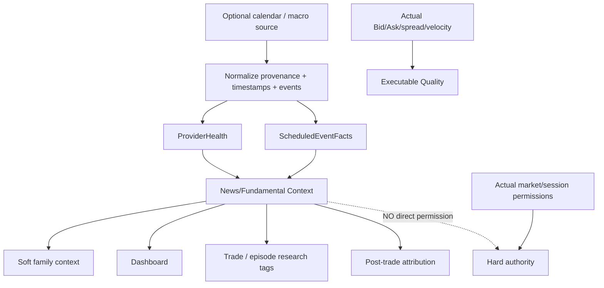
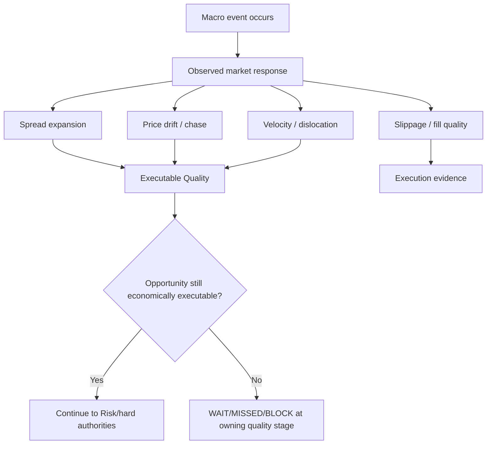

# GoldScalpTrader — Fundamental and News Intelligence

**Status:** APPROVED SOFT-CONTEXT CONTRACT — DOCUMENTATION RECONSTRUCTION / PROVIDER-RESEARCH PENDING
**Version:** 2.0-news-context-not-permission
**Authority:** Scheduled-event facts, provider health/provenance, optional Gold/USD macro context, research tagging and explicit non-authority over trading permission/cooldown.

## 1. Purpose

Fundamental/News exists because macro events can explain Gold behavior and are valuable research dimensions.

It does **not** exist to create a blanket no-trade machine.

Current approved rule:

> **News/Fundamentals are soft context, dashboard information and research attribution only. A news event, News UNKNOWN state or provider/API failure does not directly block trading, start a News cooldown or require a post-News warmup.**

Actual event-induced danger is detected from objective market/execution facts.

## 2. Authority split

| Information | Owner | May influence | Must never do |
|---|---|---|---|
| scheduled event | News desk | context/tag/research | direct Gate BLOCK merely because event exists |
| impact/tier/category | News desk | family/session analytics | become hidden mandatory blackout |
| provider health/freshness | provider layer | dashboard/research confidence | become trading kill switch |
| macro interpretation | Fundamental desk | bounded strategy context | override contrary causal price structure alone |
| spread/drift/dislocation | Executable Quality / broker facts | real execution suitability | be fabricated from event label |
| broker OPEN/CLOSED | broker session authority | hard permission | inferred solely from News absence/presence |

## 3. Soft-context topology



## 4. Provider independence

The bot must not require a paid third-party News API.

Potential providers may include:

- scoped local file;
- accepted free calendar source;
- operator-supplied data;
- future optional API adapter.

Provider architecture is replaceable and typed. No provider may call the broker writer.

## 5. Provider health

Suggested states:

```text
VERIFIED
DEGRADED
STALE
UNAVAILABLE
UNKNOWN
```

Provider health must be displayed/researched truthfully.

Examples:

```text
Provider UNAVAILABLE
→ News context unavailable
→ trading NOT blocked merely for this reason

Provider STALE
→ old events remain labelled stale
→ never relabel as current CLEAR
→ trading governed by market/strategy/Risk/broker facts
```

## 6. Context cache / LKG

A last-known-good cache is useful for continuity of context, dashboard and research.

Preserved reference baseline context TTL:

```text
1800 seconds
```

Important change:

- TTL expiry affects **context freshness**, not hard trading permission;
- refresh failure never rewrites original fetch/as-of/event timestamps;
- cache source/provenance remains visible;
- an expired cache cannot masquerade as current truth;
- no News cache is required to place a trade if all actual market/Risk/broker authorities pass.

Exact provider/cache implementation remains an engineering choice.

## 7. Event normalization

A normalized event may include:

```text
provider_event_id
title
currency
scheduled_at_utc
impact/tier/category
provider
fetched_at_utc
source/provenance
mapping_version
```

All timestamps are timezone-aware UTC.

Duplicate provider event IDs must be handled deterministically.

## 8. Event tiers are research/context labels

A deterministic mapping can classify events, e.g.:

```text
TIER_1 / CRITICAL
TIER_2 / HIGH
TIER_3 / CONTEXT
OTHER
```

Examples may include FOMC, CPI, NFP, PCE, GDP, ISM, employment/rates events.

But under current approved architecture:

```text
TIER_1 ≠ automatic trade block
TIER_2 ≠ automatic trade block
```

Tier labels are used to measure whether particular families, spreads, slippage or entry efficiency behave differently around events.

## 9. No News blackout / cooldown / warmup

Historical/reference models that used:

```text
-15/+15 blackout
-5/+5 blackout
NEWS_UNKNOWN block
POST_NEWS_WARMUP
```

are **superseded for GoldScalpTrader production permission**.

There is no automatic News-only state transition such as:

```text
NEWS event → BLOCK
NEWS event ends → mandatory wait
```

The system may still display event countdown and post-event elapsed time for research/operator awareness.

## 10. Real shock handling

News can cause real execution deterioration. The response is governed by actual facts:



Thus the system reacts to what the market **actually did**, not simply the event label.

## 11. Optional macro context

Potential soft inputs:

- USD/DXY direction;
- yields/rates expectations;
- Fed policy context;
- inflation/labor/growth context;
- geopolitical/risk sentiment;
- other high-quality macro facts.

Every macro adapter must expose:

- source;
- as-of/fetch time;
- freshness;
- confidence/coverage;
- counter-evidence where appropriate.

Macro context may support/explain a family thesis but cannot override clearly contrary completed price structure or objective broker safety.

## 12. Strategy-family use

Different families may use News context differently.

Examples:

- Breakout Expansion research may tag high-impact event-driven expansion;
- Failed Breakout Reversal may study false initial event spikes;
- Trend Pullback may study whether post-event pullbacks behave differently;
- Compression Expansion may study pre-event compression without automatically avoiding it.

The active strategy may receive bounded context, but News is not a required universal input unless that **specific future family version** explicitly defines it and is approved.

## 13. Session relationship

News and Session are separate:

```text
Session Context  = Asia/London/NY soft participation
Broker State     = OPEN/CLOSED/PRE_CLOSE hard fact
News Context     = event/macro soft context
```

Do not compose them into one opaque “market permission” state.

## 14. Open-trade behavior

News event/context alone does not:

- force-close;
- force breakeven;
- disable protection;
- prevent safe EXIT;
- start a special cooldown.

Trade Manager responds to actual price/structure/volatility/execution conditions and PRE_CLOSE/broker safety.

## 15. Restart / replay

### Restart

Provider/cache context reload may continue if valid and truthful. Expired/stale context remains labelled accordingly.

### Replay

Historical event information is usable only when it would have been knowable at the simulated time under the declared dataset methodology.

If replay uses a finalized historical calendar unavailable in real time, evidence must clearly classify that limitation rather than pretending live parity.

## 16. Dashboard

```text
FUNDAMENTAL / NEWS CONTEXT
Provider       FILE / FREE_SOURCE / NONE
Health         VERIFIED / DEGRADED / STALE
Cache Age      12m • context only
Next Event     CPI • TIER_1 • 08:14
Macro Tag      USD HIGH-IMPACT
Trade Effect   SOFT CONTEXT — NO DIRECT BLOCK
```

Dashboard must never imply `NEWS_CLEAR` is required for execution.

## 17. Research requirements

News/event research should answer:

- does expectancy change by event tier/category?
- which strategy families benefit/suffer?
- what happens to spread/SL and spread/target ratios?
- how do slippage and decision→send drift change?
- does M1 refinement improve or worsen event-period entries?
- what is the effect on entry/capture/exit efficiency?
- does avoiding certain measured conditions improve Net R without destroying Opportunity Recall?

This creates evidence for later proposals without pre-emptive restriction.

## 18. Planned implementation ownership

```text
intelligence/news.py
    normalized events / optional macro context / mapping

app/session_news.py or equivalent provider adapter
    source acquisition / cache / provenance / health

operator/dashboard
    context display

research/*
    event/session segmentation
```

`risk/permissions.py` must **not** treat News context as a hard new-entry authority under the current design.

## 19. Planned proof

Tests cover:

- UTC normalization;
- provider health states;
- cache timestamps not laundered;
- 1800s baseline freshness labeling;
- event mapping/tagging;
- provider unavailable/stale does not direct-block trade;
- event tier does not direct-block trade;
- no News cooldown/warmup state;
- actual spread/drift quality layer remains independent;
- dashboard labels News as context;
- replay event chronology/coverage honesty.

## 20. External/calibration evidence

Open evidence:

- free provider reliability;
- event mapping quality;
- family/event performance;
- event-period costs/slippage/latency;
- macro adapters if later useful.

Paid provider is not a required dependency.

## 21. Final invariant

> **News may explain and help research Gold behavior, but it cannot veto a valid scalp merely because an event exists or a provider failed. GoldScalpTrader reacts to actual executable market conditions, while News remains truthful soft context and evidence.**
