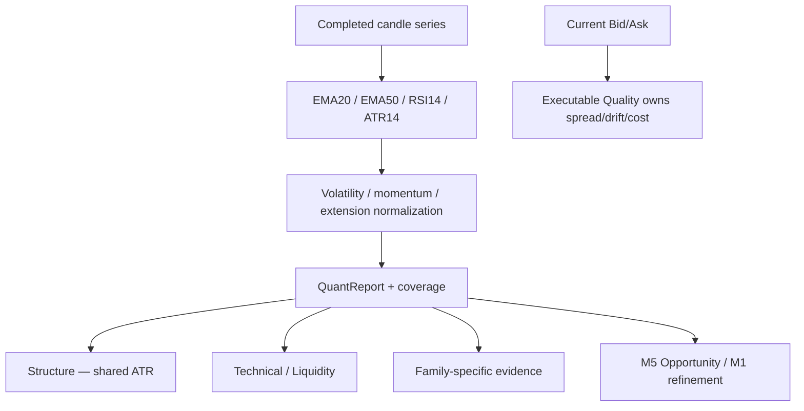

# GoldScalpTrader — Indicators and Volatility

**Status:** APPROVED QUANTITATIVE EVIDENCE CONTRACT — DOCUMENTATION RECONSTRUCTION / CALIBRATION PENDING
**Version:** 2.0-scalp-quant-context
**Authority:** EMA20/EMA50, RSI14, ATR14, volatility normalization, momentum phase, extension/chase context and shared quantitative series.

## 1. Purpose

The Quant desk makes Gold price behavior measurable across changing volatility regimes.

> **Indicators explain pressure, volatility, distance and efficiency. They do not independently create broker permission or become a universal checklist.**

The report supports Candle Structure, Technical, Liquidity, active/shadow strategies, M1 timing, TradePlan, Executable Quality and Trade Manager.

## 2. Invariants

| Rule | Meaning |
|---|---|
| Completed historical series | forming bars never become confirmed indicator history |
| One shared calculation | reusable EMA/RSI/ATR series are computed once per snapshot/prefix |
| Causal arrays | each index uses only then-known earlier/current completed values |
| Explicit missingness | unavailable value = `None/UNKNOWN`, not zero/bearish |
| Normalized geometry | ATR ratios preferred to arbitrary fixed Gold distances |
| Family-specific importance | an indicator may be essential to one family without becoming global veto |
| No filter soup | no requirement that H1/M15/M5/M1 indicators all agree |
| No broker authority | Quant never sizes/places/modifies/closes orders |

## 3. Quant pipeline



## 4. Preserved baseline indicators

```text
EMA fast = 20
EMA slow = 50
RSI      = 14, Wilder-style baseline
ATR      = 14, Wilder-style baseline
```

These are current baseline features. Their contribution may be researched, but they are not silently removed.

## 5. IndicatorSeries / QuantReport

Chronological series may include:

```text
ema_fast[]
ema_slow[]
rsi[]
atr[]
```

Report fields may include:

| Field | Meaning |
|---|---|
| timeframe | H4/H1/M15/M5/M1 owner |
| ema_fast/ema_slow | latest available values |
| ema_flow | BUY / SELL / NONE |
| rsi | current completed-bar RSI |
| atr | current ATR |
| volatility_state | current normalized volatility regime |
| volatility_ratio | current ATR / recent baseline |
| momentum_phase | pressure/expansion/maturity/exhaustion/reversal context |
| extension_state | fresh/normal/extended/severely extended |
| extension_atr | distance from selected baseline divided by ATR |
| coverage | input availability |

## 6. EMA20 / EMA50

EMA relationship provides trend/pullback context:

```text
EMA20 > EMA50 → bullish flow support
EMA20 < EMA50 → bearish flow support
otherwise     → neutral/unknown
```

But a cross is not automatically a trade.

Family relevance examples:

- Trend Pullback may rely heavily on EMA flow/pullback position;
- Breakout may use EMA alignment as support rather than a mandatory trigger;
- Sweep Reversal may intentionally oppose current EMA flow when causal reversal evidence is strong.

## 7. RSI14

RSI describes momentum pressure, not a rigid reversal switch.

Wrong universal rules:

```text
RSI > 70 → always SELL
RSI < 30 → always BUY
```

Potential family-specific uses:

- pullback reset;
- momentum continuation;
- loss of momentum;
- divergence candidate;
- micro timing support.

Any divergence logic requires causal confirmation and research validation.

## 8. ATR14

ATR is the system's common volatility unit for:

- normalized candle strength;
- swing confirmation;
- zone width;
- liquidity clustering;
- stop/target context;
- extension/chase measurement;
- current drift distance;
- spread/SL and other executable ratios where relevant.

ATR does not set final SL/TP by itself.

## 9. Volatility states

A report may classify:

```text
UNKNOWN
QUIET
NORMAL
BUILDING
EXPANDING
EXTREME
DISLOCATED
```

Exact ratio bands are calibration parameters.

`EXTREME` or `DISLOCATED` from the Quant desk is descriptive/adverse evidence. Actual broker-action rejection belongs to later Executable Quality/Hard Authority based on current objective facts.

## 10. Momentum phase

Potential states:

```text
UNKNOWN
BUILDING
EXPANDING
MATURE
EXHAUSTING
REVERSING
```

Momentum can combine:

- EMA flow;
- close progress;
- body/ATR;
- RSI pressure;
- extension;
- recent sequence quality.

Strong momentum may still be a poor entry if price is too extended or current costs consume the target.

## 11. Extension / chase

Baseline dimension:

```text
abs(close - EMA20) / ATR
```

Possible labels:

```text
UNKNOWN
FRESH
NORMAL
EXTENDED
SEVERELY_EXTENDED
```

This is a timing-quality input, not an automatic universal veto.

The final entry decision also considers:

- M5 event age;
- M1 trigger quality;
- structural room;
- Approved Entry → current price drift;
- spread/SL;
- spread/target;
- cost/reward.

## 12. M5 and M1 quantitative roles

| Timeframe | Quant role |
|---|---|
| H4 | optional broad volatility context |
| H1 | regime/directional quantitative context |
| M15 | opportunity volatility/extension context |
| M5 | primary setup/timing momentum context |
| M1 | subordinate micro-entry refinement after M5 Opportunity |

M1 Quant data may answer:

- has pullback momentum stabilized?
- is micro continuation restarting?
- is price already severely micro-extended?

It cannot originate the M5 thesis.

## 13. Important but nonrestrictive principle

User-approved policy:

> **Some indicators/confluence tools are extremely important; importance does not make them global restrictions.**

Therefore family contracts classify inputs as:

```text
REQUIRED_FOR_THIS_FAMILY
STRONG_SUPPORT
OPTIONAL_SUPPORT
OPPOSITION
NOT_RELEVANT
UNKNOWN
```

A missing required indicator may prevent that family from qualifying. It must not automatically prevent another family whose definition does not require it.

## 14. Compression / expansion / exhaustion ownership

Quant publishes normalized numerical ingredients. Candle Structure owns multi-bar sequence labels. This prevents one observation from being double-counted by two desks.

Example:

```text
Quant: range/ATR 1.8, body/ATR 1.2, volatility EXPANDING
Structure: BULL_EXPANSION sequence
```

These are linked facts, not independent votes unless proven otherwise.

## 15. Restart / replay

The same completed series prefix and Quant configuration must reproduce the same values.

No final-series indicator may leak backward in replay.

Missing warm-up values remain `None`; they are never filled with zero merely to simplify scoring.

## 16. Failure behavior

| Condition | Result |
|---|---|
| insufficient warm-up | UNKNOWN/reduced coverage |
| non-finite prices | reject upstream/report corrupt |
| ATR zero/invalid | no normalized ratio claim |
| M1 missing | no M1 quantitative refinement; never invent support |
| one indicator conflicts | visible evidence/conflict, not automatic broker block |

## 17. Dashboard

```text
QUANT
H1 EMA Flow      BUY
M15 RSI          58.2
M5 ATR           3.84
M5 Volatility    EXPANDING • 1.42× baseline
M5 Momentum      BUILDING
M5 Extension     NORMAL • 0.61 ATR
M1 Momentum      RESTARTING • subordinate
Coverage         100%
```

## 18. Research

Research must test marginal value through ablation:

- EMA periods/flow/slope;
- RSI thresholds/divergence;
- ATR normalization;
- volatility bands;
- momentum labels;
- extension thresholds;
- M1 micro-quant timing;
- family-specific indicator relevance.

Evaluate:

```text
Net R
expectancy
Opportunity Recall
false blocks
trade throughput
entry efficiency
capture efficiency
cost burden
drawdown
```

not win rate alone.

## 19. Planned implementation ownership

```text
intelligence/indicators.py
    EMA / RSI / ATR / QuantReport

intelligence/snapshot.py
    compute once and share

decisions/timing.py
    consumes M5/M1 quant context
```

## 20. Planned proof

Tests must cover:

- EMA/RSI/ATR chronology;
- no forming/future values;
- warm-up missingness;
- shared calculation reuse;
- volatility/momentum/extension states;
- M5/M1 separation;
- family-specific required evidence;
- no universal indicator veto;
- restart/replay parity;
- no score/permission side effects.

## 21. Calibration

Open empirical dimensions:

- indicator periods if evidence proposes change;
- volatility bands;
- extension thresholds;
- family-specific EMA/RSI role;
- M1 momentum/refinement thresholds;
- divergence utility;
- correlations with other evidence.

## 22. Final invariant

> **Quantitative indicators must make Gold behavior measurable and help the active strategy enter efficiently. They may be highly important to a specific strategy, but they cannot replace structure, create an unrelated global veto or grant broker authority.**
