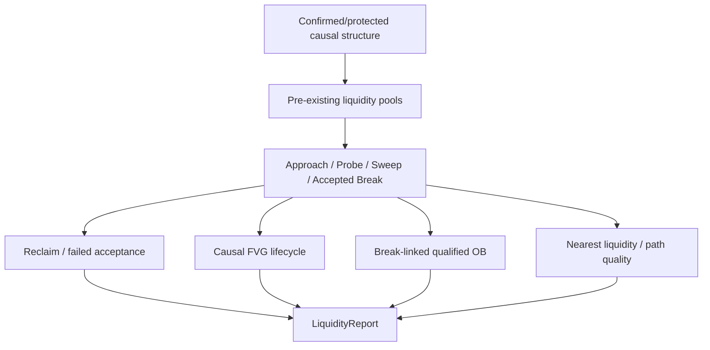
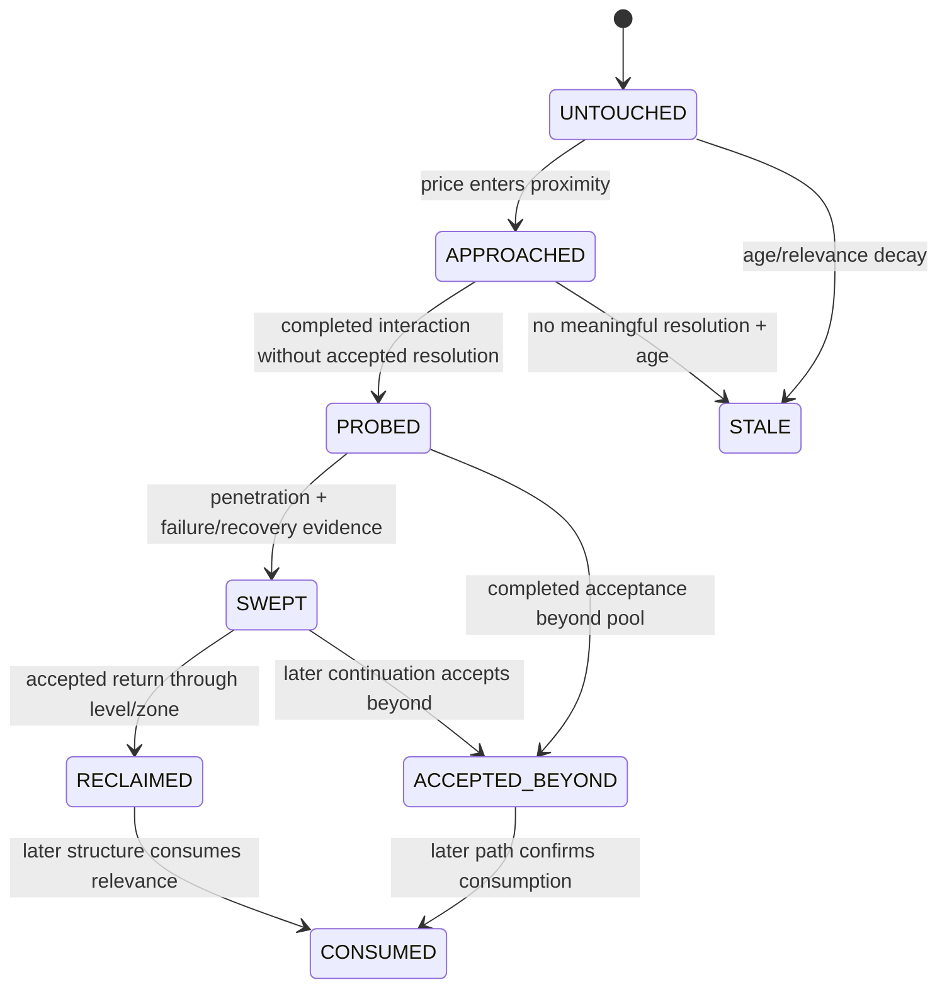

# GoldScalpTrader — Liquidity and SMC Evidence

**Status:** APPROVED INTELLIGENCE CONTRACT — DOCUMENTATION RECONSTRUCTION / CALIBRATION PENDING
**Version:** 2.0-scalp-causal-liquidity
**Authority:** Liquidity pools, equal-high/low clustering, probes/sweeps/reclaims/acceptance, FVG, qualified Order Blocks, premium/discount context, liquidity path and causal event lineage.

## 1. Purpose

The Liquidity/SMC desk translates observable price behavior around known levels into causal, testable facts.

SMC terminology is descriptive shorthand—not automatic trading authority.

> **The important fact is not that a label exists; it is what price did around a pre-existing level, when that behavior became knowable, and whether the active strategy family actually needs it.**

This desk does not:

- place orders;
- size Risk;
- set final stops;
- call every wick a sweep;
- label every opposite candle an Order Block;
- force every strategy to require FVG/OB/premium-discount.

## 2. Causal dependency rule

A liquidity fact must have existed before the interaction it claims to explain.



A pool cannot be “swept” by a candle that occurred before the pool itself was causally known.

## 3. Knowledge-time semantics

MT5 candle timestamps identify bar-open time. Any liquidity fact that needs final high/low/close becomes knowable at that bar's close.

Examples:

```text
pool created_at       = latest causal confirmation time of required sources
sweep event_time      = close time of sweep/reclaim bar
FVG created_at        = close time of third candle
OB origin_time        = source candle identity
OB qualified_at       = causal structural consequence time
```

This separation is mandatory in replay and learning.

## 4. Liquidity pools

Primary initial sources include causal confirmed/protected swings and validated equal-high/low clusters.

Cluster tolerance is normalized:

```text
cluster_tolerance
= max(min_cluster_ticks × tick_size,
      ATR × cluster_atr_fraction)
```

Several nearby highs/lows become one pool, not several independent votes.

A pool records at least:

```text
pool_id
side: BUY_SIDE | SELL_SIDE
scope/timeframe
lower / upper
created_at
source_ids
source_count
significance
state
```

## 5. Pool lifecycle



Exact transitions/decay are calibrated, but causality is not optional.

## 6. Probe, sweep, reclaim and accepted break

Conceptual rules:

```text
pre-existing pool
+ trade/touch into area
+ no completed acceptance evidence
→ PROBE

pre-existing pool
+ penetration through boundary
+ completed failure/recovery back through area
→ SWEEP

SWEEP / failed break
+ completed acceptance back through reference
→ RECLAIMED

pre-existing pool
+ completed close beyond
+ required acceptance/follow-through
→ ACCEPTED_BEYOND
```

A wick alone is insufficient to claim a high-quality sweep.

## 7. Fair Value Gap

Baseline deterministic three-candle geometry:

```text
bullish FVG: candle3.low  > candle1.high
bearish FVG: candle3.high < candle1.low
```

`created_at` = third candle close time.

Lifecycle:

```text
FRESH
PARTIAL
MITIGATED
INVALIDATED   # if the governing implementation defines/proves it
```

FVG can be very important to a strategy such as a sweep/reversal or displacement continuation, but absence of FVG is not a universal no-trade rule.

## 8. Qualified Order Block

The desk must not label “last opposite candle” automatically.

An OB is qualified only when the source candle/zone has a traceable causal relationship to a meaningful structural consequence.

Minimum metadata:

```text
ob_id
direction
timeframe
lower / upper
origin_time
qualified_at
source_break/event_id
state
```

Potential states:

```text
FRESH
TESTED
WEAKENING
INVALIDATED
CONSUMED
```

Later state transitions must be chronological.

## 9. Liquidity path

Nearest relevant pools/zones and normalized density produce path context:

```text
OPEN
MIXED
CROWDED
UNKNOWN
```

Path asks:

> **If the active strategy is correct, is there usable structural/liquidity room in that direction?**

A pool is not a guaranteed target. TradePlan owns objectives; Executable Quality later accounts for costs/current price.

## 10. Premium / discount

Premium/discount is valid only relative to a meaningful, causally known dealing range.

Do not:

- select arbitrary hindsight high/low;
- treat exact 50% as hard authority;
- use future-confirmed pivots;
- convert premium/discount alone into BUY/SELL permission.

It is family-specific location context.

## 11. Correlation / double counting

One episode can generate:

```text
sweep
rejection
MSS candidate
FVG
displacement
qualified OB
```

Those labels may share one causal parent.

Report/source models should preserve lineage:

```text
parent_event_id
pool_id
structure_event_id
source_candle_ids
family interpretation
```

Downstream Red-Team/family logic must not treat every label as independent confirmation.

## 12. Strategy-family relevance

| Family | Typical high-value liquidity evidence |
|---|---|
| Trend Pullback Continuation | supportive pool/zone, unconsumed structure, open continuation path |
| Breakout Expansion | accepted break, continuation liquidity, displacement/path |
| Breakout Retest Continuation | broken level/pool, retest, acceptance/reclaim structure |
| Liquidity Sweep Reversal | pre-existing pool, penetration, reclaim/rejection, opposing path |
| Failed Breakout Reversal | attempted acceptance beyond structure followed by failure |
| Compression Expansion | clustered liquidity/range pressure + normalized release |

No family requires every liquidity primitive.

## 13. M5 / M1 roles

| Timeframe | Liquidity role |
|---|---|
| H4 | optional broad/external pools |
| H1 | major structural pools/path |
| M15 | opportunity pools/location/target path |
| M5 | primary setup liquidity event |
| M1 | subordinate micro sweep/reclaim/timing after M5 Opportunity |

M1 micro sweep can refine entry timing but cannot establish an independent production setup.

## 14. Restart / replay

Normal deterministic rebuild:

```text
completed prefix
→ causal structure
→ pre-existing pools
→ post-creation interactions
→ FVG/OB/path
→ LiquidityReport
```

Replay must prove:

- pool existed before interaction;
- no FVG before third candle close;
- no OB before qualifying consequence;
- no later fill/test/consumption state visible early;
- M1 refinement uses only then-known micro facts.

## 15. Failure behavior

| Condition | Result |
|---|---|
| no ATR | reduced coverage / no normalized density claim |
| no confirmed structure | no fabricated pools |
| no FVG/OB | optional evidence absent |
| duplicate/correlated labels | preserve lineage; bounded contribution |
| corrupt chronology | fail upstream / no trusted report |
| no M1 liquidity data | no fabricated M1 timing support |

## 16. Dashboard example

```text
LIQUIDITY / SMC
M15 BSL          4348.2–4349.0
M15 SSL          4311.0–4312.1
M5 Event         SSL SWEPT + RECLAIMED
M1 Refinement    MICRO RECLAIM • 1 bar old
FVG              M5 BULLISH • PARTIAL
OB               M5 FRESH • break-linked
Path Up / Down   OPEN / CROWDED
Coverage         100%
```

The dashboard does not imply that FVG/OB labels themselves authorize execution.

## 17. Research

Research should measure marginal value of:

- pool quality/source count;
- sweep depth/reclaim speed;
- FVG size/fill state;
- OB quality/mitigation;
- path density;
- premium/discount;
- M1 micro-liquidity refinement;
- session/regime interaction;
- correlation de-duplication.

Metrics must include Opportunity Recall and false-block effects—not just win rate.

## 18. Planned implementation ownership

```text
intelligence/liquidity.py
    pools / interactions / sweeps / FVG / OB / path / lineage

intelligence/candle_structure.py
    causal structure-event timestamps consumed here

intelligence/snapshot.py
    report assembly
```

## 19. Planned proof

Tests cover:

- cluster construction;
- pool-before-sweep causality;
- bar-close event timestamps;
- wick probe versus real sweep;
- reclaim/accepted-break distinctions;
- FVG creation/fill chronology;
- OB qualification linkage;
- path state;
- M5/M1 separation;
- no universal FVG/OB gate;
- event-lineage de-duplication;
- replay/restart parity.

## 20. Calibration

Open evidence dimensions:

- cluster tolerance;
- sweep penetration/reclaim quality;
- FVG minimum size;
- OB qualification/weakening;
- path-density thresholds;
- dealing-range selection;
- family-specific contribution weights;
- M1 micro-liquidity freshness.

## 21. Final invariant

> **Liquidity evidence must be causal, pre-existing, traceable and family-relevant. Labels may make the active strategy more accurate, but they must never become a hindsight SMC checklist or an unrelated universal restriction.**
