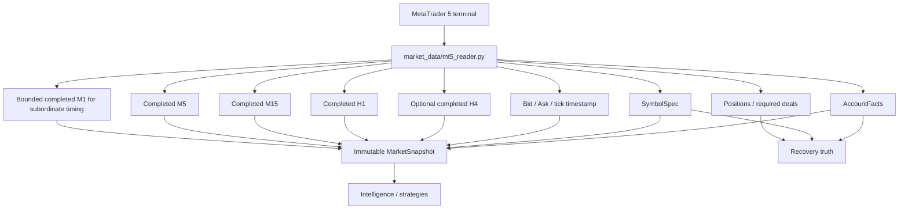
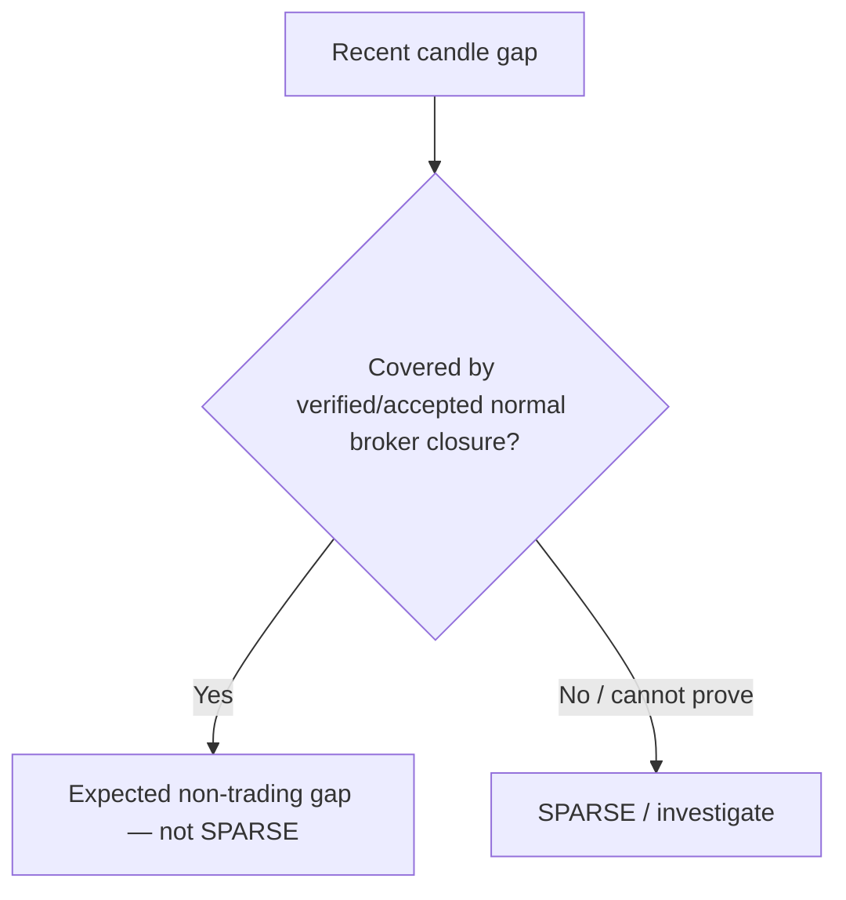
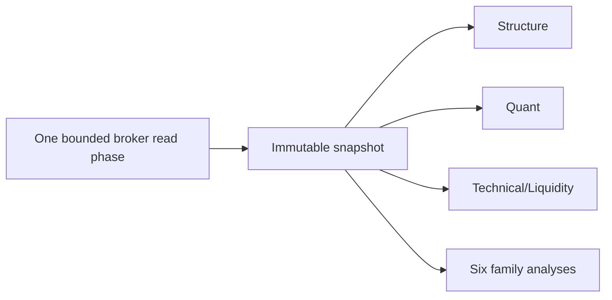

# GoldScalpTrader — Market Data and History

**Status:** APPROVED READ CONTRACT — DOCUMENTATION RECONSTRUCTION / CONNECTED FRESHNESS PROOF PENDING
**Version:** 2.0-scalp-m1-aware-read-boundary
**Authority:** Normalized MT5 facts, completed-candle chronology, quote integrity, data quality, history gaps, current exposure reads and immutable MarketSnapshot construction.

## 1. Reader promise

This document explains how raw MT5 data becomes trustworthy typed facts.

It does not decide:

- strategy direction;
- which family is active;
- whether a setup is attractive;
- monetary affordability;
- News policy;
- final broker permission.

## 2. One normalized MT5 read boundary



Intelligence modules do not create private MT5 clients/read loops.

Raw irreversible writes belong only to the execution writer.

## 3. Core normalized facts

| Fact | Meaning | If unavailable/corrupt |
|---|---|---|
| AccountFacts | login/server/currency/equity/account mode/trade flags | identity/read unavailable; fail owning authority |
| SymbolSpec | digits/point/tick/contract/volume/stops/filling/trade mode | symbol/spec unknown |
| Quote | Bid/Ask/capture/source timestamp/spread | stale/unavailable/corrupt |
| Candle | UTC OHLC + volume + timeframe | invalid/corrupt if impossible/non-finite |
| CandleSeries | ordered completed-bar prefix | insufficient/stale/sparse/corrupt |
| PositionFacts | broker ticket/symbol/side/volume/open/SL/TP/magic/comment | unavailable ≠ zero |
| DealFacts | bounded deal/position lineage for recovery/close proof | unavailable where required → reconciliation cannot complete |
| MarketSnapshot | reusable causal cycle facts | quality reflects required inputs |

## 4. Gold symbol resolution

Typical resolution policy:

```text
configured preferred symbol
→ configured approved aliases
→ SYMBOL_NOT_FOUND
```

Current project target includes `XAUUSDm` with approved `XAUUSD` alias support where configuration/broker facts permit.

Resolved symbol identity must be persisted/reported in:

- runtime scope;
- Risk/exposure context;
- Intent;
- ManagedTrade;
- recovery state;
- evidence/research records.

## 5. Completed-candle rule

MT5 position/index 0 is normally the currently forming candle. Structural history starts from completed bars.

```text
forming H1/M15/M5 → not confirmed structure
completed H1/M15/M5 → causal structural input
```

M1 is subordinate timing data. Production M1 structural/micro-pattern evidence also follows explicit causal completion rules unless a future approved timing contract permits a narrowly defined forming-bar telemetry field. It may not silently mix forming values into historical arrays.

## 6. Candle normalization

Every Candle must be checked for:

- timezone-aware UTC timestamp;
- finite OHLC;
- `high >= max(open,close,low)`;
- `low <= min(open,close,high)`;
- chronological ordering;
- duplicate identity;
- timeframe alignment where required;
- materially future-dated corruption;
- volume fields represented honestly.

Sorting a corrupt series must not silently hide duplicated/impossible input.

## 7. History windows

Reference windows such as hundreds/thousands of completed bars are useful implementation baselines but not trading-edge claims.

The Scalp implementation needs enough causal history for:

| Series | Minimum purpose |
|---|---|
| H4 | optional major context |
| H1 | regime/structure/major levels |
| M15 | location/liquidity/target path |
| M5 | setup/events/replay/management |
| M1 | bounded subordinate timing/refinement |

Exact bar counts are implementation/performance choices validated against indicator warmup, structural lookback and memory/latency requirements. M1 history should be bounded to actual timing needs rather than loaded excessively without benefit.

## 8. Quote integrity and age

Quote normalization preserves:

```text
bid
ask
spread = ask - bid
source/server timestamp where available
local capture timestamp
quote age
```

A quote that is materially stale or unreasonably future-dated is not “fresh” merely because an absolute/signed calculation looks small.

Conceptual states:

```text
FRESH
STALE
UNAVAILABLE
CORRUPT
```

Final execution re-reads current quote as required; the analytical snapshot cannot override a fresher broker precheck.

## 9. Data-quality model

```text
HEALTHY
INSUFFICIENT
STALE
SPARSE
CORRUPT
UNKNOWN
```

Suggested semantics:

| State | Meaning |
|---|---|
| HEALTHY | required facts available and chronologically plausible |
| INSUFFICIENT | warm-up/history not yet enough |
| STALE | expected updates not advancing |
| SPARSE | unexplained gaps/missing bars |
| CORRUPT | impossible/inconsistent/future-clock/duplicate data |
| UNKNOWN | availability cannot be established |

These states are facts, not strategy scores.

## 10. Expected broker closure gaps vs missing history

A timestamp jump is not automatically data loss.

Known normal market closure/maintenance/weekend intervals can create legitimate candle gaps.



Important separation:

- Market Data decides whether a gap looks like missing history versus expected no-trade interval.
- Broker Session authority decides whether the market is currently OPEN/CLOSED/PRE_CLOSE.
- News context does not decide either.

Exact Exness XAU closure schedules require current external verification.

## 11. Open-position truth

The read boundary distinguishes:

```text
positions_get returns []
→ positively verified zero current positions

positions_get returns None / error
→ POSITION_DATA_UNAVAILABLE
→ NEVER reinterpret as zero
```

Normalize:

- position ticket;
- symbol;
- direction;
- volume;
- open price;
- SL/TP (`0` broker sentinel may normalize to `None` where contract says so);
- magic/comment;
- account/server/scope.

Broker position does not alone prove bot ownership. Durable Intent/ManagedTrade lineage owns attribution.

## 12. Deal/history reads

Deal history is bounded and purpose-specific for:

- unresolved Intent reconciliation;
- known-position close proof;
- non-trading cash-flow/risk-day reconciliation;
- learning lineage after verified close.

Unknown/failed history reads are not empty history.

Avoid excessive broad history reads in every fast scalp cycle. Fetch/reuse only what the owning lifecycle needs.

## 13. Snapshot architecture

A MarketSnapshot should be immutable and identify:

```text
scope/account/server/symbol
captured_at
quote
SymbolSpec
H1/M15/M5 series
optional H4
bounded M1
current positions/exposure facts as required
DataQuality per required component
```



Shared snapshots increase speed and prevent analytical races.

## 14. Fresh-read exceptions

Normal snapshot reuse ends where current broker truth must be revalidated.

Fresh reads are expected for:

- executable Bid/Ask;
- spread/drift immediately before execution;
- account/margin/order-check inputs;
- current positions before ambiguous action/reconciliation;
- active trade management where current position truth matters;
- startup/recovery.

Fresh execution reads may change whether the action is still efficient/safe without changing the original M5 structural history.

## 15. M1 performance considerations

M1 can increase read/computation frequency substantially.

Architecture rules:

- M1 is fetched/analyzed only at the cadence/coverage justified by timing needs;
- no separate M1 terminal client;
- reuse bounded M1 series;
- do not recalculate full H1/M15/M5 history on every M1 pulse if facts are unchanged;
- measure acquisition + analysis latency;
- preserve causal completed-bar semantics.

## 16. Restart / recovery

Recovery read adapter obtains fresh current facts:

```text
account
→ resolved symbol/spec
→ quote
→ positions
→ required deals
→ recovery snapshot
```

Restored local state is compared to fresh broker truth. It never invents missing broker exposure.

## 17. Failure / operator meaning

| Failure | Meaning | Runtime consequence |
|---|---|---|
| MT5 unavailable | terminal/read connection failure | no readiness/write |
| symbol not found | intended Gold symbol unresolved | block affected runtime |
| quote stale | executable feed not advancing | no new write; visible reason |
| quote future-corrupt | clocks/truth unreliable | fail owning authority |
| insufficient bars | warm-up incomplete | WAIT/limited analysis |
| expected closure gap | normal non-trading history interval | do not fabricate SPARSE |
| unexplained in-session gap | data hole | SPARSE / no trusted strategy path |
| positions unavailable | exposure unknown | no new entry/reconciliation incomplete |

## 18. Dashboard

```text
MARKET DATA
Symbol        XAUUSDm
Bid / Ask     4318.42 / 4318.66
Spread        0.24
Quote Age     110 ms
H1/M15/M5     HEALTHY / HEALTHY / HEALTHY
M1 Timing     HEALTHY • latest completed 14:35
Positions     verified 0 / or explicit UNKNOWN
```

Never display an unavailable read as zero.

## 19. Planned source/test ownership

```text
market_data/mt5_reader.py
market_data/snapshot.py
market_data/activity.py
domain/market.py
app/recovery_mt5.py
```

Tests cover:

- symbol resolution;
- forming-bar exclusion;
- M1 bounded completed history;
- quote age/future corruption;
- bar validation/order/duplicates;
- expected closure gap vs real sparse gap;
- `[]` vs `None` positions;
- SymbolSpec normalization;
- no-write reader boundary;
- shared snapshot determinism;
- fresh execution reads not mutating history;
- recovery truth semantics.

## 20. External proof

Connected Windows/Exness evidence must verify:

- actual XAUUSDm/XAUUSD symbol/spec;
- timestamp/clock behavior;
- current history availability;
- weekend/daily closure gaps;
- positions/deals APIs;
- realistic read latency;
- M1 data stability/performance.

## 21. Final invariant

> **Market Data must tell the truth even when that truth is “unavailable.” One normalized causal snapshot feeds analysis; only explicit fresh broker reads may update current execution/recovery truth. M1 adds timing resolution without creating a second uncontrolled market-data universe.**
