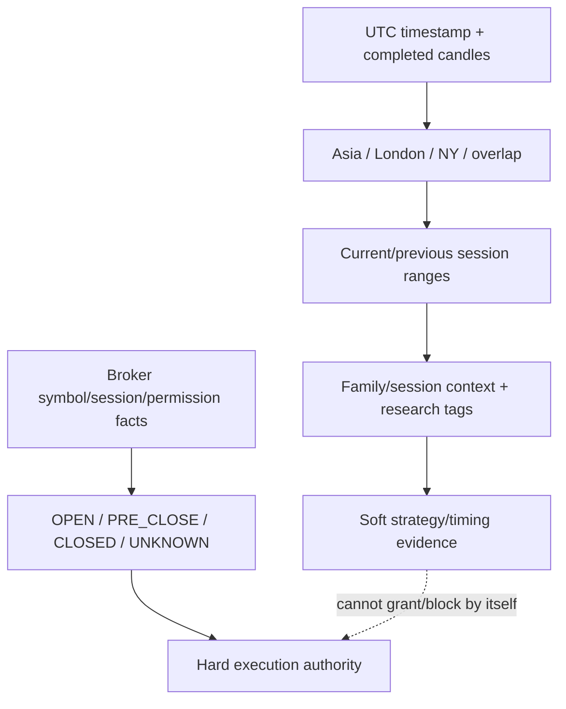
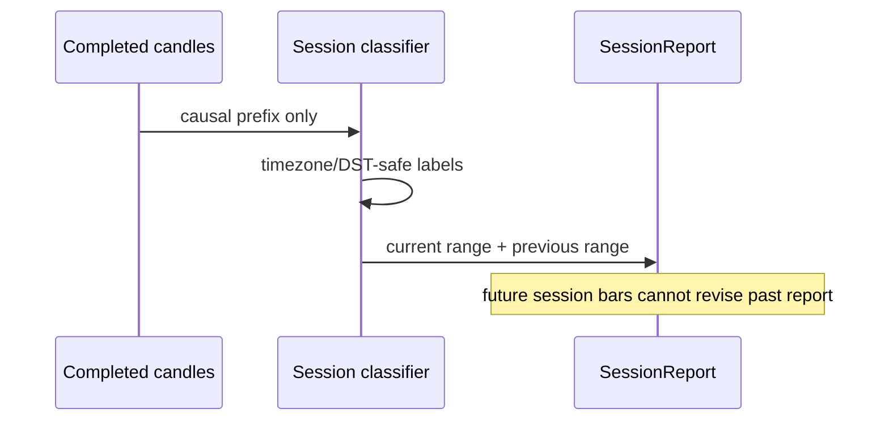

# GoldScalpTrader — Session Context

**Status:** APPROVED INTELLIGENCE CONTRACT — DOCUMENTATION RECONSTRUCTION / BROKER-SCHEDULE PROOF PENDING
**Version:** 2.0-soft-session-hard-broker-separation
**Authority:** Asia/London/New York/overlap context, chronological session ranges, session-performance attribution and separation from broker market-state authority.

## 1. Purpose

Session Context answers:

> **Which participation window surrounds the opportunity, what range/liquidity context did it build, and how does the active strategy historically perform in that environment?**

Session Context is **soft market intelligence**.

It does not own:

- whether Exness/XAU is currently tradeable;
- PRE_CLOSE;
- mandatory flatten;
- daily Risk lock;
- News permission (News has no hard permission role in current design);
- broker order acceptance.

## 2. Soft session versus hard broker state



A London label cannot prove that the symbol is open. A broker CLOSED fact cannot be overridden by a historically strong London result.

## 3. Session labels

Descriptive labels may include:

```text
ASIA
LONDON
NEW_YORK
LONDON_NY_OVERLAP
OFF_HOURS
```

Initial descriptive baselines may follow conventional session windows with timezone/DST-safe conversion, but exact labels/boundaries are research/configuration facts rather than universal trade bans.

Use timezone-aware rules (`zoneinfo` or equivalent), not manually hardcoded seasonal UTC assumptions for London/New York.

## 4. Inputs / outputs

Inputs:

- timezone-aware UTC timestamps;
- completed M5 and, where useful, M15/H1 candles;
- causal `as_of_utc`;
- session configuration/version;
- optional holiday/participation context.

SessionReport may publish:

| Field | Meaning |
|---|---|
| current_session | descriptive current window |
| overlap | London/NY overlap flag |
| current_high/low/range | range built from then-known completed bars |
| previous_session | latest previous chronological session |
| previous_high/low/range | prior session range |
| session_open_time / elapsed | descriptive context |
| holiday_context | soft participation label |
| coverage | evidence availability |

## 5. Chronological range construction

At every replay/live decision point:

1. classify each known completed candle by session;
2. use only candles known at `as_of_utc`;
3. build current range from the current known group;
4. expose the latest prior group where available;
5. never extend an earlier replay point's session high/low with future candles.



## 6. Why session context matters for scalping

Session may explain:

- Asia range/compression;
- London expansion/sweep/break;
- New York continuation/reversal;
- overlap liquidity/volatility;
- spread/participation differences;
- family-specific opportunity frequency;
- target-room behavior;
- hold-time distributions;
- M1 timing quality.

But the design does **not** assume:

```text
Asia = no trade
London = always best
New York = automatic reversal
```

Those are empirical questions.

## 7. Family-by-session performance

Because exactly one strategy family is live-active at a time, session attribution is especially clean.

Track by family/session:

| Metric | Purpose |
|---|---|
| opportunities | strategy availability |
| actual trades | realized throughput |
| shadow trades | comparison |
| win/loss | descriptive only |
| Net R / expectancy | after-cost quality |
| entry efficiency | timing quality |
| capture efficiency | move capture |
| spread/slippage | session friction |
| hold time | capital/slot occupancy |
| false blocks/missed | over-restriction diagnosis |

Later evidence may justify bounded family/session adjustments. It does not silently create session bans.

## 8. M5/M1 roles around session transitions

M5 may establish the active-family setup around:

- session range break;
- sweep/reclaim;
- compression release;
- failed break;
- continuation pullback.

M1 may refine the entry after that M5 setup, especially during fast session transitions.

M1 does not make “London open” an independent signal.

## 9. Holiday / thin participation context

Holiday context can mean:

- reduced liquidity;
- abnormal range development;
- unusual spread/volatility;
- lower historical strategy quality.

But it is **soft context** unless actual broker schedule/permission facts establish CLOSED/PRE_CLOSE/UNKNOWN.

A holiday calendar label does not itself hard-block a trade under the approved News/Fundamental policy.

## 10. Broker session authority is separate

Hard broker/session facts belong to Risk/Execution owners:

```text
OPEN
PRE_CLOSE
CLOSED
REOPEN_WARMUP / reopen condition
UNKNOWN
```

Preserved baseline pending external Exness verification:

```text
Daily:   T-20 no new entry / T-10 mandatory flatten
Weekend: T-60 no new entry / T-30 mandatory flatten
Daily reopen:   1 clean completed M5
Weekend reopen: 2 clean completed M5 + gap assessment
```

This document describes session participation. It does not redefine those safety values.

## 11. News relationship

News/event context may be displayed alongside session context for research, but it is not a hard session permission input.

Valid display example:

```text
Session Context: LONDON_NY_OVERLAP
Broker State:    OPEN
News Context:    CPI in 8m
News Provider:   DEGRADED
Trading:         governed by strategy/quality/Risk/broker facts — not News label
```

## 12. Restart / replay

SessionReport is reproducible from:

- causal completed-candle prefix;
- exact timezone rules/version;
- session configuration;
- `as_of_utc`.

Timezone/config changes are versioned evidence changes.

## 13. Failure behavior

| Condition | Result |
|---|---|
| naive timestamp | reject/normalize only through explicit owner |
| no candles | no range + zero/low coverage |
| uncertain soft session label | UNKNOWN/OFF_HOURS context; not fabricated |
| broker schedule unavailable | hard broker owner decides UNKNOWN; soft session report still descriptive |
| News provider unavailable | News context degraded; session classification remains usable |

## 14. Dashboard

```text
SESSION CONTEXT
Current          LONDON → NEW YORK overlap
Current Range    4310.2–4338.6
Previous         ASIA • 4302.8–4314.1
Active Family    BREAKOUT_RETEST
Family Session   research: sample / expectancy / cost
Broker State     OPEN
News Context     soft only
```

Do not merge soft session label and hard broker state into one ambiguous “Session OK”.

## 15. Planned implementation ownership

```text
intelligence/session.py
    DST-safe labels / chronological ranges / SessionReport

intelligence/snapshot.py
    attaches session context

risk/permissions.py / broker-session owner
    hard market state; separate authority
```

## 16. Planned proof

Tests cover:

- timezone-awareness;
- DST transitions;
- overlap classification;
- chronological range construction;
- replay no-lookahead;
- holiday context remains soft;
- session context does not grant broker permission;
- M1/M5 session-timing separation;
- family/session research attribution;
- hard broker session state remains separate.

## 17. Calibration / external proof

Calibration:

- descriptive session boundaries if needed;
- family/session performance adjustments;
- transition labels;
- range lookbacks.

External proof:

- actual Exness XAU open/close/PRE_CLOSE behavior;
- DST/holiday schedule behavior;
- spread/liquidity distributions by session.

## 18. Final invariant

> **Session tells the strategy what participation environment it is in; only actual broker/session facts can say whether the symbol may be traded. Session performance may improve family accuracy, but it must not become an undocumented blanket restriction.**
