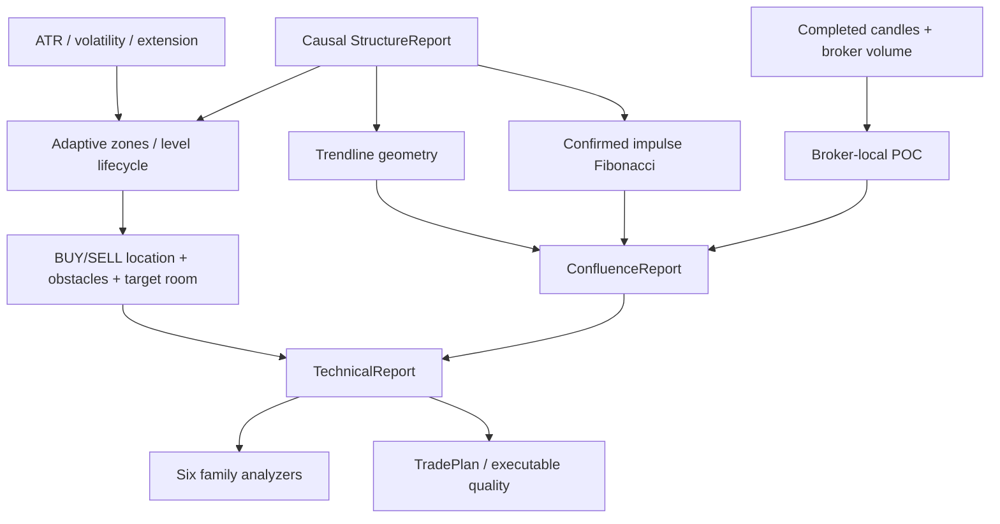
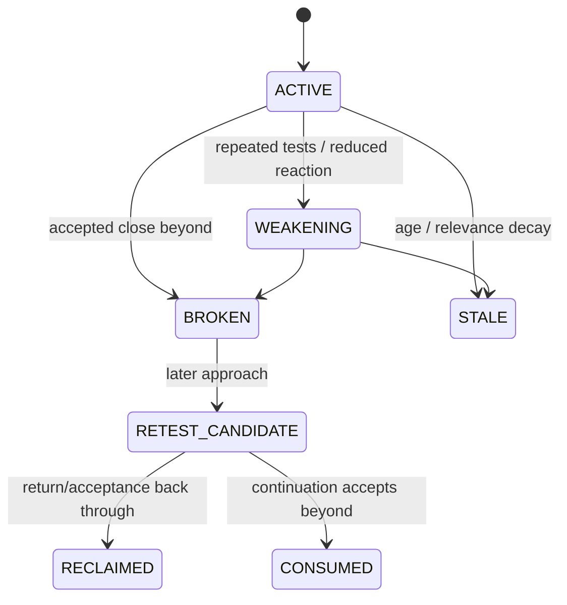

# GoldScalpTrader — Technical Structure and Levels

**Status:** APPROVED LOCATION / CONFLUENCE CONTRACT — DOCUMENTATION RECONSTRUCTION / CALIBRATION PENDING
**Version:** 2.0-scalp-location-room-confluence
**Authority:** Support/resistance zones, structural level lifecycle, location quality, target room, trendline/Fibonacci geometry, broker-local volume/POC context and family-specific confluence semantics.

## 1. Purpose

The Technical/Location desk answers:

> **Where is current price relative to confirmed market geometry, and how much usable room remains before meaningful opposing structure?**

It consumes causal Structure/Quant facts. It does not:

- redefine swings/BOS/MSS;
- choose the active strategy family;
- set monetary Risk;
- grant broker permission;
- force every strategy to require Fib/FVG/OB/Trendline/POC;
- manufacture direction from a single confluence tool.

## 2. Core outputs

| Output | Question | Universal hard gate? |
|---|---|---:|
| adaptive zones | where are confirmed support/resistance areas? | no |
| location | is current price efficiently located for BUY/SELL? | no |
| target room | how much structural room remains? | no by itself; TradePlan/quality consume it |
| trendline | is causal support/resistance line touched/broken/reclaimed? | no |
| Fibonacci | where is price in a confirmed impulse retracement/extension? | no |
| POC/volume profile | where is broker-local volume concentrated? | no |
| conflict | are opposing structures crowded/overlapping? | analytical conflict, not broker safety |

Important evidence may be **family-required** without becoming a **global requirement**.

## 3. Pipeline



No second MT5 read occurs here.

## 4. Inputs

Expected inputs include:

- same-timeframe StructureReport;
- same-timeframe QuantReport;
- completed candles where needed for POC;
- current/reference price appropriate to analytical stage;
- broker tick size;
- technical/confluence policy/config;
- causal `as_of` timestamp.

All geometry must be derived only from facts knowable at `as_of`.

## 5. Adaptive support/resistance zones

Zones are areas, not magic exact prices.

Conceptual half-width:

```text
zone_half_width
= max(min_zone_ticks × tick_size,
      ATR × zone_atr_fraction)
```

Zone quality may reflect:

- confirmed/protected swing significance;
- source count;
- reaction strength;
- age;
- role flip history;
- higher-timeframe relevance;
- consumption/invalidation state.

### Lifecycle



Lifecycle transitions must be causal; replay cannot populate later states early.

## 6. Location quality

BUY and SELL location are evaluated independently.

Suggested descriptive states:

```text
EXCELLENT
GOOD
NEUTRAL
POOR
DANGEROUS
UNKNOWN
```

Location may consider:

- support/resistance proximity;
- position inside/outside range;
- obstacle density;
- liquidity path;
- current extension;
- target room;
- family-specific preferred zone relation.

A good BUY location does not automatically make SELL impossible. A breakout family may like price pressing a resistance that a pullback family considers poor room.

## 7. Target room

For each direction, record factual distance to credible opposing structure/liquidity before TradePlan chooses objectives.

```text
BUY room  = distance toward nearest credible upside obstacle/objective
SELL room = distance toward nearest credible downside obstacle/objective
```

Target room must preserve:

- obstacle identity;
- source/timeframe;
- distance in price/ticks/ATR where useful;
- whether geometry is consumed/stale;
- confidence/coverage.

TradePlan owns final objective selection and gross R. Executable Quality owns cost-adjusted usability.

## 8. Trendline geometry

Only already-confirmed causal anchors may be used.

Possible facts:

```text
SUPPORT_LINE / RESISTANCE_LINE
ASCENDING / DESCENDING / FLAT
TOUCH / BREAK / RECLAIM / NONE
projected_price
normalized_distance
anchor_ids
```

Trendline may be **important** for a Trend Pullback family but still not globally required for a Liquidity Sweep family.

No future pivot may be used to draw a historical trendline.

## 9. Fibonacci geometry

Fibonacci anchors come from a confirmed structural impulse pair, not arbitrary hindsight extremes.

Useful levels may include:

```text
0.382
0.500
0.618
0.786
1.272
1.618
2.000
```

Fibonacci output preserves anchor identities and knowledge time.

A retracement zone can be highly informative for the relevant active strategy, but “not at 0.618” is not a universal no-trade rule.

## 10. Broker-local volume profile / POC

Gold MT5 volume is broker-local context, not centralized exchange truth.

Source label:

```text
REAL_VOLUME   when meaningful broker real volume exists
TICK_VOLUME   otherwise
```

POC output may include:

- price;
- source type;
- bounded lookback;
- bin count/width;
- price relation ABOVE/BELOW/NEAR;
- normalized distance.

POC is direction-neutral. It can support location/acceptance/path reasoning but cannot create BUY/SELL authority alone.

## 11. Family-specific importance without filter soup

### Example: Trend Pullback Continuation

Potentially high-value evidence:

- EMA flow;
- M15/H1 trend context;
- support/resistance zone;
- trendline;
- Fib pullback area;
- RSI/momentum reset;
- sufficient continuation room.

### Example: Liquidity Sweep Reversal

Potentially high-value evidence:

- pool quality;
- sweep/reclaim;
- FVG/OB context;
- premium/discount/location;
- opposing target path;
- rejection/displacement.

### Governing rule

```text
required_by_this_family
≠
required_by_every_family
```

This distinction is mandatory for Opportunity Recall.

## 12. M5 and M1 location roles

| Timeframe | Technical role |
|---|---|
| H4 | optional broad/major zones |
| H1 | major directional/context zones |
| M15 | primary opportunity location/path/target context |
| M5 | setup/entry structural location |
| M1 | micro-location refinement after valid M5 Opportunity |

M1 may identify a more efficient micro pullback/reclaim level. It cannot make invalid M5 location magically valid.

## 13. Confluence and correlation

Optional confluence must be bounded and lineage-aware.

A trendline touch, Fib 0.618 touch and support-zone touch may all originate from the same underlying swing geometry. Do not count them as three independent facts merely because they have three labels.

Confluence report should preserve:

- source IDs;
- anchor IDs;
- causal event IDs;
- support/opposition;
- family relevance;
- confidence/coverage.

## 14. Restart / replay

On restart/replay:

- zones rebuild from causal structure prefix;
- trendline/Fib anchors must already be confirmed;
- POC uses only available completed candles;
- later tests/breaks/reclaims cannot alter earlier reports;
- current price context is timestamped separately from historical geometry.

## 15. Failure behavior

| Condition | Output |
|---|---|
| no confirmed swings | no fabricated zones |
| ATR unavailable | reduced/UNKNOWN normalized location |
| optional Fib/trendline/POC unavailable | relevant optional evidence absent; no global block |
| opposing zones overlap | conflict visible |
| corrupt chronology | rejected upstream |
| broker volume unavailable | use explicitly labelled tick volume if allowed; otherwise UNKNOWN |

## 16. Dashboard / operator meaning

Example:

```text
TECHNICAL / LOCATION
M15 BUY Location   GOOD
M15 SELL Location  POOR
Nearest Support    4312.4–4314.1
Nearest Resistance 4322.8–4324.0
Gross Room Up      8.7
Trendline           SUPPORT TOUCH
Fib                 0.618 NEAR
POC                 4318.6 • TICK_VOLUME
Conflict            LOW
```

Dashboard must not imply that optional confluence is broker permission.

## 17. Research

Record family-specific marginal value of:

- zones/location;
- trendline;
- Fibonacci;
- POC/volume;
- role flips;
- M1 micro-location;
- target-room thresholds.

Use ablation and out-of-sample evidence. Track Opportunity Recall and false-block rate alongside expectancy.

## 18. Planned source/test ownership

```text
intelligence/technical.py
    zones / location / room / lifecycle / conflict

intelligence/confluence.py
    trendline / Fibonacci / POC

intelligence/snapshot.py
    shared causal inputs and reports
```

Tests must prove:

- zone width/merge/lifecycle chronology;
- no future anchors;
- independent BUY/SELL location;
- target-room provenance;
- POC source labels;
- optional evidence neutrality;
- family-specific required evidence without universal gating;
- M1 subordinate-only use;
- restart/replay parity.

## 19. Calibration

Open empirical items:

- zone width/merge tolerance;
- lifecycle weakening/staleness;
- trendline touch/break tolerance;
- Fib impulse-quality selection;
- POC lookback/binning;
- family-specific confluence contribution;
- location/room thresholds;
- correlation caps.

## 20. Final invariant

> **Location and confluence must make a valid strategy smarter, not turn the entire bot into one universal checklist. Geometry must be causal, family-relevant and traceable; TradePlan and Executable Quality remain the later owners of actual target economics.**
