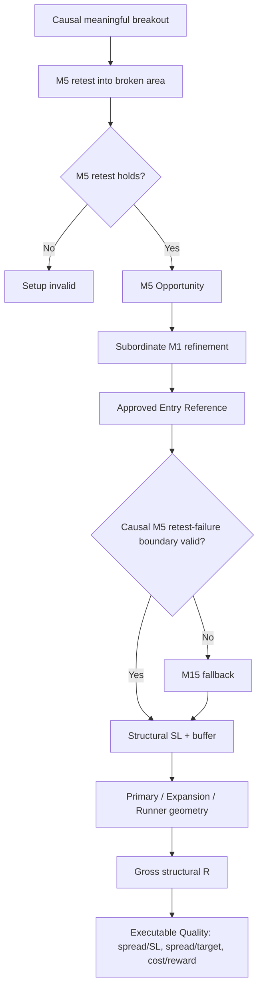

# GoldScalpTrader — Breakout Retest Geometry Extension

**Status:** APPROVED CANONICAL EXTENSION — DOCUMENTATION RECONSTRUCTION / CALIBRATION PENDING
**Version:** 2.0-m5-retest-scalp-geometry
**Authority:** Breakout Retest Continuation invalidation ordering, M5 retest-failure geometry and preservation of honest gross/cost-adjusted quality without inheriting Swing's fixed 1.20R floor.

## 1. Relationship to TradePlan

This document specializes `TRADE_PLAN.md` for:

```text
BREAKOUT_RETEST_CONTINUATION
```

It does not alter:

- monetary Risk profiles;
- minimum-lot affordability;
- hard broker safety;
- one-shot execution;
- Strategy Isolation Mode;
- M1's subordinate role.

## 2. Why Breakout Retest is different

A breakout-retest thesis is often invalidated first by failure of the **actual retest structure**, not by a much broader M15 swing.

If a clear causal M5 retest-failure boundary exists but planner uses broad M15 structure first:

```text
stop becomes unnecessarily wide
→ gross R deteriorates artificially
→ spread/SL and cost ratios become distorted
→ otherwise efficient scalp may be rejected
```

Correcting this is not “loosening safety”. It is using the actual strategy thesis.

## 3. Invalidation order

Baseline:

```text
Breakout Retest Continuation
→ M5 retest-failure/protected structure
→ M15 structural fallback
→ H1 fallback
```

Within each allowed timeframe:

```text
family-specific failure boundary
→ protected swing
→ confirmed swing
→ relevant technical zone
```

Every level must be:

- causally known;
- on the correct side of Approved Entry Reference;
- structurally relevant;
- traceable to source IDs.

## 4. M1 relationship

M1 can refine **entry timing** after the M5 breakout-retest Opportunity exists.

M1 may improve entry price via:

- micro hold;
- reclaim;
- micro continuation restart;
- micro failed retest against the entry direction.

But M1 does not automatically replace the M5 retest-failure invalidation with a tighter micro stop.

A micro boundary can become structural invalidation only if a future explicitly approved family contract proves that it represents the actual thesis failure rather than mere noise.

## 5. Geometry sequence



## 6. Structural target quality

This extension does **not** preserve Swing's fixed `1.20R` hard floor as the Scalp rule.

Current Scalp policy:

- report exact Primary/Expansion gross R;
- use family-correct stop geometry;
- calibrate minimum gross R from Scalp evidence;
- evaluate current cost-adjusted quality separately;
- do not lower the stop merely to manufacture R;
- do not reject efficient short-duration setups merely because they fail an inherited Swing number without Scalp evidence.

## 7. Failure cases

### No causal retest boundary

Fallback to broader valid structure. Do not fabricate a tight M5 stop.

### Retest boundary already violated

Opportunity invalidates; do not “retest again” without a fresh episode.

### Entry moved too far from retest

TradePlan may remain structurally coherent but Executable Quality/M1 timing can mark it late/MISSED.

### Costs dominate

A good structural R can still fail current after-cost quality. That is not a reason to rewrite the stop/target.

## 8. Example geometry

Conceptual BUY example:

```text
Breakout Level          4320.00
M5 Retest Low           4319.40
Approved Entry Ref      4320.20
Buffered Structural SL  4319.10
Primary Target          4321.60
Expansion               4323.10

Risk distance           1.10
Primary gross R         1.27R
Expansion gross R       2.64R
```

Whether 1.27R is acceptable is governed by the versioned Scalp gross/net quality policy—not by the old Swing 1.20R rule merely because the number exists in reference history.

## 9. Dashboard

```text
BREAKOUT RETEST GEOMETRY
Break Level      4320.00
Retest Boundary  4319.40
Entry Ref        4320.20
SL               4319.10
Primary          4321.60 • 1.27R gross
Expansion        4323.10 • 2.64R gross
M1 Timing        HOLD + micro reclaim
Source           M5:RETEST_FAILURE_LOW
```

## 10. Research

Compare:

- M5-first vs broader M15-first stop selection;
- opportunity recall;
- stop-out behavior;
- gross and after-cost R;
- spread/SL burden;
- entry efficiency;
- M1 refinement contribution;
- false `TARGET_ROOM_POOR` rejection rates.

## 11. Planned implementation ownership

```text
decisions/family_trade_plan.py
    breakout-retest boundary proof/selection

decisions/trade_plan.py
    buffers/objectives/gross-R state

decisions/timing.py
    M1 timing only
```

## 12. Planned proof

Tests cover:

- M5 retest boundary preferred when valid;
- broader fallback when unavailable;
- correct BUY/SELL side;
- no future/unconfirmed retest structure;
- M1 does not arbitrarily tighten stop;
- no fixed Swing R-floor dependency;
- current cost-quality handoff remains separate;
- no Risk/MT5 authority.

## 13. Final invariant

> **A Breakout Retest scalp must be judged against the actual retest thesis. Use the nearest valid causal failure boundary, never an invented tight stop and never an unnecessarily broad stop merely because it existed in a Swing-oriented hierarchy.**
