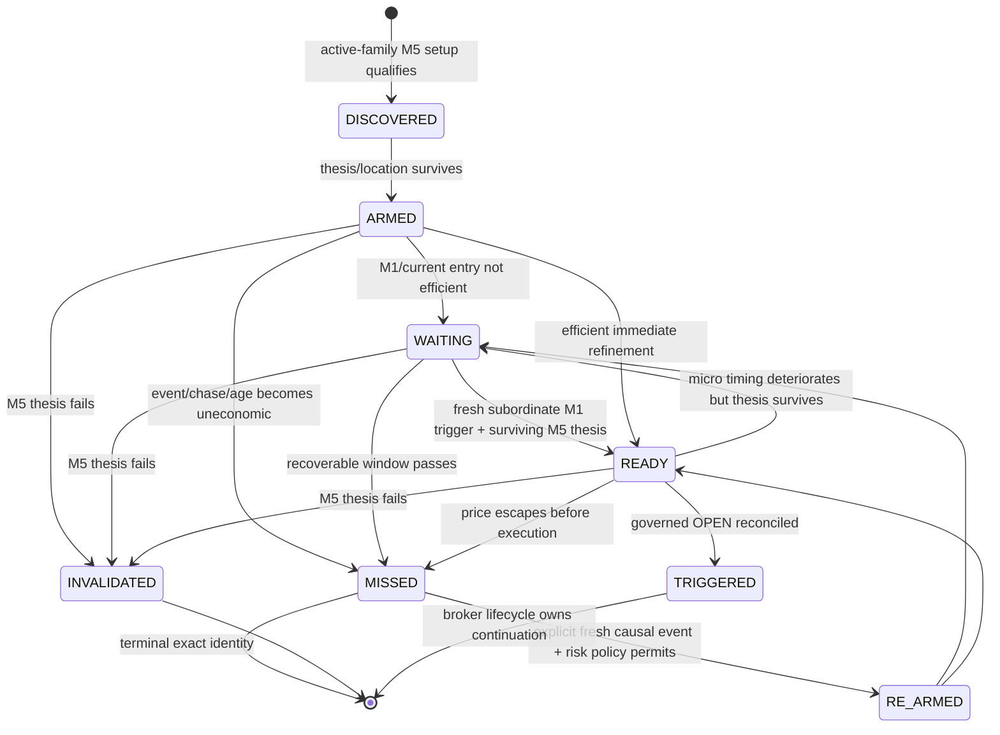
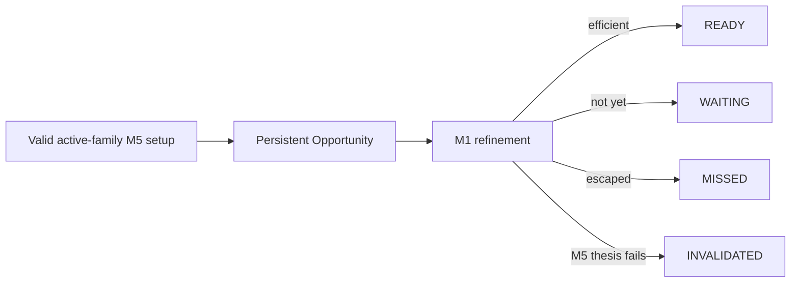

# GoldScalpTrader — Entry Timing and Opportunity Lifecycle

**Status:** APPROVED TIMING CONTRACT — DOCUMENTATION RECONSTRUCTION / THRESHOLDS CALIBRATABLE
**Version:** 2.0-m5-opportunity-m1-refinement
**Authority:** Opportunity identity/lifecycle, M5 setup persistence, subordinate M1 entry refinement, freshness/chase/missed/re-arm rules and timing persistence.

## 1. Purpose

A valid setup and a good executable entry are different things.

This contract prevents:

- chasing a move because the thesis is attractive;
- deleting a valid M5 opportunity merely because the current micro-entry is not efficient;
- letting M1 invent a standalone trade;
- repeatedly rearming the same missed episode without new causal evidence.

Approved hierarchy:

```text
H1  broad context
M15 location/path/target context
M5  primary setup/thesis authority
M1  subordinate entry refinement
Quote current executable condition
```

## 2. Opportunity lifecycle



`STALE` may exist as domain vocabulary if later useful, but no undocumented generic timer is allowed.

## 3. Opportunity identity

Persist at least:

```text
opportunity_id
episode_id
active_family
active_family_policy_version
direction
created_at / updated_at
M5 source event IDs
M5 source event knowledge time
lifecycle state
thesis quality / coverage
preferred M1 timing profile
last fresh timing event
terminal reason
```

A surviving same episode keeps identity through WAIT/READY.

A genuinely new market thesis gets a new Episode/Opportunity identity.

## 4. M1 subordinate authority

M1 is now an approved production timing input, but only after M5 Opportunity exists.

### M1 may answer

- has the pullback completed?
- did a micro reclaim/rejection occur?
- is micro continuation restarting?
- did a micro failed break improve timing?
- is current micro extension already too late?

### M1 may not

- create an Opportunity when M5 has none;
- reverse an invalidated M5 thesis;
- become an independent live strategy;
- rewrite M5/H1/M15 historical structure;
- bypass TradePlan/Risk/Gate.



## 5. Timing evidence

Possible inputs:

- M5 setup/event identity and age;
- M15 location/room;
- M5 momentum/extension;
- M5 liquidity event;
- completed M1 structure/sequence;
- M1 momentum/extension;
- M1 reclaim/rejection/continuation pattern;
- family preferred entry profile;
- Approved Entry Reference where already established;
- current quote/drift diagnostics where appropriate.

M1 patterns and their exact thresholds are calibration items.

## 6. Timing outcomes

```text
READY_BUY
READY_SELL
WAIT
MISSED
INVALID
```

Timing does **not** output monetary/broker BLOCK.

### WAIT

Setup survives but current micro entry is not efficient.

### MISSED

The setup may have been valid but current price/event age/chase makes this exact entry opportunity no longer efficient.

### INVALID

Underlying M5 thesis no longer survives.

### READY

Analytically ready only. Next:

```text
TradePlan
→ Executable Quality
→ Risk
→ hard authorities
→ Gate
```

## 7. Freshness dimensions

Approved calibration dimensions:

### M5 event age

How many seconds/bars since the causal setup event became knowable?

### M1 trigger freshness

How old is the micro event that justifies the current entry?

### Chase distance

How far has current executable price moved beyond the intended structural/timing area?

### Approved Entry → Executable Price drift

How much has the market moved since the geometry/reference was approved?

All must preserve units and policy version.

## 8. Late entry protection without restriction bias

Wrong behavior:

```text
one timing imperfection
→ delete Opportunity permanently
```

Also wrong:

```text
strong thesis
→ chase indefinitely
```

Correct behavior:

```text
M5 thesis valid
+ M1 not ready
→ WAIT

M5 thesis valid
+ micro timing improves
→ READY

M5 thesis valid
+ price escaped / economics deteriorated materially
→ MISSED
```

Research must measure both bad chases and good opportunities missed by over-strict timing.

## 9. Family-aware timing profiles

| Family | Typical refinement question |
|---|---|
| Trend Pullback | has micro pullback/reclaim/resumption completed? |
| Breakout Expansion | is break acceptance still fresh without late chase? |
| Breakout Retest | did micro retest hold and continuation restart? |
| Liquidity Sweep Reversal | did micro reclaim/rejection confirm efficient reversal timing? |
| Failed Breakout Reversal | did failed acceptance produce a fresh micro reversal? |
| Compression Expansion | did release occur with controlled follow-through rather than exhausted spike? |

A shared timing engine can support family-specific parameter sets; six duplicated engines are unnecessary unless evidence later justifies them.

## 10. Re-arm contract

A MISSED opportunity can re-arm only when all applicable conditions pass:

- M5 thesis still relevant;
- explicit fresh structural/timing event exists;
- fresh event has a later causal knowledge time;
- structural plan can still be rebuilt validly;
- Risk's one-same-episode-re-entry baseline permits it;
- current entry is no longer merely a continuation of the same chase.

No “next polling cycle = fresh event” shortcut.

## 11. Terminal identity vs active slot

`MISSED`/`INVALIDATED` are terminal for that exact Opportunity identity.

A terminal record should not permanently freeze future discovery.

```text
same unchanged thesis
→ keep terminal lineage; no fake new ID

genuinely new thesis/event
→ retire stale plan if any
→ create new Episode + Opportunity identity
```

`TRIGGERED` is broker-lifecycle lineage and cannot be analytically replaced while the trade remains unresolved/open.

## 12. Persistence ordering

When replacing a terminal analytical opportunity with a genuinely new one:

```text
1. preserve old terminal event in append-only journal
2. clear mismatched old TradePlan
3. persist new Opportunity identity
4. build/save new TradePlan only after new READY timing
```

This ordering avoids a crash leaving the wrong TradePlan attached to a new Opportunity.

## 13. Restart

Restored Opportunity is context only.

After restart:

- read fresh market facts;
- rebuild current intelligence;
- verify active strategy policy/version;
- revalidate M5 thesis;
- re-evaluate M1 timing;
- do not resurrect READY permission merely from persisted state.

## 14. Research / counterfactuals

Record separately:

```text
READY then traded
WAIT then later READY
MISSED
INVALIDATED
hard-blocked downstream
system fault
shadow-family timing hypothetical
```

For MISSED opportunities, research may calculate after-the-fact path outcomes, but those are counterfactuals—not executed P/L.

## 15. Throughput diagnostics

Timing must expose why an armed opportunity did not become a trade:

- M1 never refined;
- M1 trigger stale;
- M5 event too old;
- chase distance exceeded;
- price drift;
- later cost stage failed;
- Opportunity invalidated;
- position capacity/Risk/broker authority blocked later.

This is essential for the 120/day benchmark.

## 16. Dashboard

```text
ENTRY TIMING
Opportunity   OPP-...
Episode       EP-...
Active Family Breakout Retest
M5 Setup      ARMED • 1 bar old
M1            RECLAIM • fresh
Timing        READY_BUY
Chase         0.18 ATR
Reason        retest held + micro continuation restarted
```

READY does not mean “order sent”.

## 17. Planned implementation owners

```text
decisions/opportunity.py
decisions/timing.py
decisions/snapshot.py
persistence/runtime_state.py
```

## 18. Planned proof

Tests must cover:

- identity persistence across WAIT/READY;
- M1 cannot create Opportunity alone;
- M1 causal completion/freshness;
- event-age/chase/drift semantics;
- terminal MISSED/INVALID behavior;
- fresh-event-only rearm;
- one same-episode re-entry integration with Risk;
- plan-clear-before-new-opportunity ordering;
- restart revalidation;
- no timing→MT5 write path;
- counterfactual vs actual evidence separation.

## 19. Calibration

Approved open variables:

- M1 entry patterns;
- M1 trigger freshness;
- M5 event age;
- chase distance;
- Approved Entry→Executable Price drift;
- family-specific timing thresholds;
- generic STALE policy if ever proposed;
- entry-efficiency scoring.

## 20. Final invariant

> **A good M5 opportunity may wait for a better M1 entry, but it may not be chased forever. M1 improves timing only; it never invents the trade. Terminal episodes remain auditable, and every re-arm requires genuinely fresh causal evidence.**
