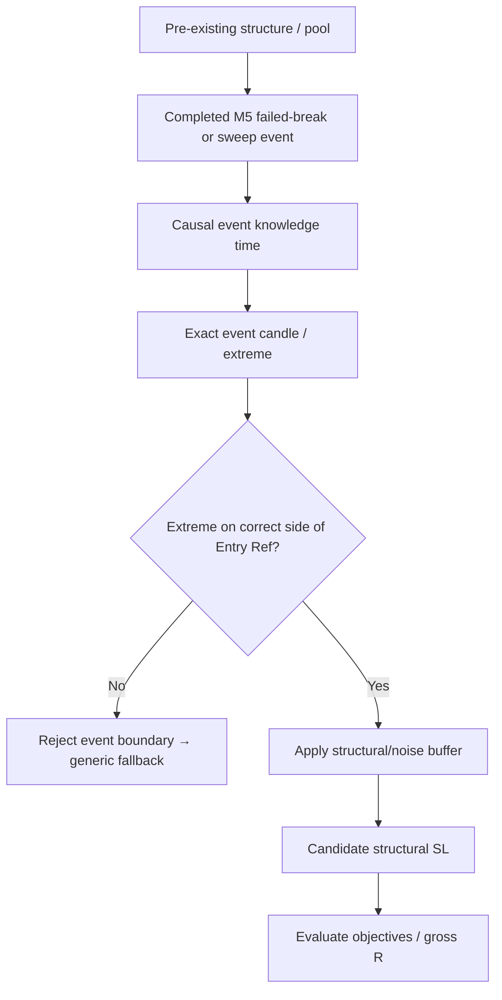

# GoldScalpTrader — Reversal Event Geometry

**Status:** APPROVED CANONICAL EXTENSION — DOCUMENTATION RECONSTRUCTION / CALIBRATION PENDING
**Version:** 2.0-causal-reversal-extreme
**Authority:** Thesis-specific M5 invalidation for Failed Breakout Reversal and Liquidity Sweep Reversal before conservative structural fallback.

## 1. Purpose

Reversal strategies are often invalidated by the exact event that created the thesis.

Examples:

- Failed Breakout Reversal → failed-break event extreme;
- Liquidity Sweep Reversal → sweep/reclaim event extreme.

Using a distant generic swing first can make the stop unnecessarily wide and distort a short-duration scalp's true geometry.

This extension allows event-specific invalidation **only when causally proven**.

## 2. Failed Breakout Reversal

For a proposed BUY reversal:

1. identify the relevant completed M5 `FAILED_BREAK` event in the attempted bearish direction;
2. identify the exact completed event candle/source geometry;
3. use the event low as candidate invalidation if it is on the correct side of Approved Entry Reference;
4. apply normal structural/noise buffer and tick normalization.

SELL is symmetric using the event high.

Suggested source label:

```text
M5:FAILED_BREAK_EXTREME
```

## 3. Liquidity Sweep Reversal

For BUY:

1. identify the relevant pre-existing sell-side liquidity pool;
2. verify a causal completed sweep/reclaim event;
3. identify exact event-candle extreme;
4. use the sweep low as candidate invalidation when structurally valid;
5. apply normal buffer/tick rules.

SELL is symmetric using the sweep high.

Suggested source:

```text
M5:SWEEP_EXTREME
```

## 4. Causal proof chain



Every arrow must be traceable from the same causal snapshot/prefix.

## 5. Fail-safe fallback

If any required event fact is missing or ambiguous:

```text
NO synthetic event extreme
→ generic M5 protected structure
→ M5 confirmed swing
→ M5 relevant zone
→ M15 fallback
→ H1 fallback
```

Fallback is conservative and explicit.

## 6. M1 relationship

M1 may refine entry after the M5 reversal Opportunity exists:

- micro reclaim;
- micro rejection;
- micro failed break;
- continuation away from the swept/failed area.

M1 cannot retrospectively redefine the M5 event extreme.

A better M1 entry may improve actual R/cost ratios while structural invalidation remains tied to the M5 causal thesis.

## 7. Target / R policy

This extension does not specify one fixed Scalp R threshold.

It preserves:

- event-correct invalidation;
- honest gross R;
- separate cost-adjusted quality;
- monetary Risk independence.

Minimum gross R and net/cost-adjusted quality are calibrated under current approved Scalp policy.

## 8. Event correlation

A single reversal episode may contain:

```text
sweep
failed break
rejection
MSS
FVG
OB
```

The exact family identity matters.

If active family = `FAILED_BREAKOUT_REVERSAL`, failed-break geometry is primary when proven.

If active family = `LIQUIDITY_SWEEP_REVERSAL`, sweep geometry is primary when proven.

Do not select whichever extreme happens to produce the prettiest R after the fact.

## 9. Example — Liquidity Sweep BUY

Conceptual:

```text
Sell-side pool        4310.80–4311.10
Sweep low             4310.35
M5 reclaim close      4311.45
M1 refined entry      4311.30
Buffered SL           4310.15
Primary objective     4312.85
Expansion             4314.30
Invalidation source   M5:SWEEP_EXTREME
```

The event low is accepted because it is part of the exact causal setup—not because it happens to make the stop small.

## 10. Restart / replay

Replay must prove:

- pre-existing pool/structure existed before the event;
- event candle was completed;
- event timestamp was already knowable;
- exact extreme belongs to the event;
- no later hindsight relabeling;
- family identity was the active production family at that time.

Restart rebuilds current geometry from fresh causal facts; persisted event IDs are context, not permission.

## 11. Dashboard

```text
REVERSAL GEOMETRY
Family         Liquidity Sweep Reversal
M5 Event       SSL SWEEP + RECLAIM
Event Extreme  4310.35
Entry Ref      4311.30
SL             4310.15
Source         M5:SWEEP_EXTREME
M1 Timing      micro continuation
```

## 12. Research

Measure event-specific versus generic structural invalidation:

- stop distance;
- stop-out rate;
- gross/net R;
- opportunity recall;
- false geometry rejects;
- M1 entry efficiency;
- family-specific expectancy;
- correlated evidence behavior.

## 13. Planned implementation ownership

```text
decisions/family_trade_plan.py
    event proof and candidate boundary

decisions/trade_plan.py
    buffer / objectives / plan state
intelligence/liquidity.py
    sweep event truth
intelligence/candle_structure.py
    failed-break truth
```

## 14. Planned proof

Tests cover:

- failed-break BUY/SELL extreme selection;
- sweep BUY/SELL extreme selection;
- exact event-candle identity;
- causal timestamps;
- correct-side checks;
- conservative fallback;
- family identity controls chosen geometry;
- M1 cannot redefine M5 event;
- no fixed inherited Swing R-floor shortcut;
- no monetary/broker authority.

## 15. Final invariant

> **A reversal stop may use the exact M5 event extreme only when that event is causally and unambiguously part of the active-family thesis. If the proof is missing, fall back—never invent a tighter boundary or select geometry merely to improve apparent R.**
