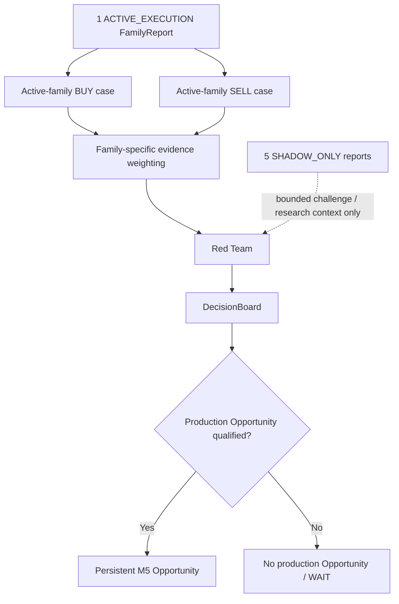

# GoldScalpTrader — Scoring, Active-Family Fusion and Red Team

**Status:** APPROVED DECISION CONTRACT — DOCUMENTATION RECONSTRUCTION / CALIBRATION PENDING
**Version:** 2.0-active-family-buy-sell-debate
**Authority:** Active-family BUY/SELL thesis construction, evidence weighting, Red-Team challenge, coverage, correlation, Opportunity qualification and shadow-family separation.

## 1. Purpose

The Decision/Fusion layer turns the **currently active strategy family's** evidence into two competing theses:

```text
BUY thesis
SELL thesis
```

It then asks Red Team to challenge the stronger thesis before a production Opportunity is armed.

Unlike the earlier blended multi-family live fusion design:

> **Shadow families do not vote in live direction.**

Their reports remain available for context, counterfactual comparison and research only.

## 2. Decision topology



## 3. Why BUY and SELL stay independent

The system must not compute one scalar direction and assume the other side is simply its inverse.

Example:

```text
BUY = strong continuation case
SELL = also credible failed-break reversal case
```

This is genuine conflict, not “BUY minus SELL = neutral”.

Each directional case preserves:

- family identity;
- direction;
- required evidence status;
- weighted support;
- opposition;
- coverage;
- location/room;
- event lineage;
- preferred timing profile;
- reasons.

## 4. Evidence weighting

Weights exist to express the relative importance of evidence **inside the active family's own definition**.

Examples:

### Trend Pullback

Possible stronger contributions:

- directional H1/M15 structure;
- valid pullback location;
- M5 resumption;
- EMA flow;
- available room.

### Sweep Reversal

Possible stronger contributions:

- real pre-existing pool;
- sweep/reclaim;
- M5 reversal response;
- location/path.

Exact weights are `CALIBRATE`.

They are not probabilities and they never change monetary Risk.

## 5. Optional evidence treatment

Evidence states:

```text
required and present
required and absent
supportive
opposing
neutral/not relevant
unknown
```

Rules:

- missing family-required evidence can prevent that active family from qualifying;
- missing optional evidence is not silently score zero;
- important optional evidence can add meaningful support;
- opposing evidence remains visible;
- no optional confluence becomes a global system veto;
- no score bypasses hard execution authority.

## 6. Red Team

Red Team's purpose is **quality control without turning the system restrictive**.

It asks:

> What is the strongest credible reason this active-family trade thesis may be wrong, late, correlated, poorly located or economically unattractive?

Potential objections:

```text
STRONG_ACTIVE_FAMILY_OPPOSING_THESIS
LOW_REQUIRED_EVIDENCE_COVERAGE
CORRELATED_EVIDENCE
M5_EVENT_STALE
M1_TRIGGER_WEAK
ENTRY_EXTENDED
LOCATION_POOR
TARGET_ROOM_POOR
FAMILY_CONFLICT
SHADOW_FAMILY_STRONG_CONTRARY_CASE   # context, not live vote
```

Red Team may:

- reduce thesis quality;
- keep Opportunity unarmed;
- produce WAIT;
- demand fresh timing evidence;
- invalidate the analytical setup if its own family contract is actually broken.

It may not:

- size lots;
- invent Risk blocks;
- call MT5;
- treat News as hard veto;
- allow a shadow family to originate the live trade.

## 7. Shadow-family context

Shadow outputs are useful in two ways:

### Live challenge context

If five shadow families independently disagree with the active family, the operator/research system should know. But they cannot mechanically outvote it.

### Counterfactual research

Record:

```text
active family action/outcome
vs
shadow family hypothetical actions/outcomes
```

This is essential for deciding whether a different family should become active later.

## 8. Correlation control

Within the active family, several evidence items may describe the same event.

Example:

```text
M5 rejection
+ sweep reclaim
+ failed break
+ FVG
```

If they all derive from the same causal move, weighting must avoid pretending they are independent confirmations.

Use causal IDs/source lineage and calibrated caps.

## 9. Coverage

Coverage tells how much expected evidence was available.

Coverage is separate from evidence quality.

Example:

```text
high score + 45% coverage
≠ automatically high confidence
```

Unknown optional evidence should reduce certainty/coverage where appropriate rather than become negative direction.

## 10. DecisionBoard

A production-facing DecisionBoard should contain:

```text
active_family
policy_version
buy_thesis
sell_thesis
leading_direction
leading_quality/score
opposing_quality/score
coverage
Red-Team objections[]
causal event IDs
M5 setup identity/age
preferred M1 profile
location/room summary
shadow_context_summary
Opportunity recommendation
reasons[]
```

No lot/SL broker request fields belong here.

## 11. Opportunity qualification

Decision Board asks:

> Is there a coherent active-family M5 idea worth tracking?

Entry Timing later asks:

> Is the current M1/current-price moment efficient enough to act?

This split avoids two errors:

- deleting a good setup because the exact entry moment is not ready;
- treating a high score as permission to chase.

## 12. Score interpretation

Scores are explanatory/relative analytical tools.

They are not:

- probability of winning;
- permission to increase risk;
- permission to ignore poor target economics;
- broker authority.

Calibration should optimize jointly:

```text
Net expectancy
Opportunity Recall
trade throughput
entry efficiency
capture efficiency
false blocks
missed opportunities
cost burden
drawdown
```

A threshold that improves historical win rate by eliminating most good opportunities is not automatically better.

## 13. Throughput implications

The approved 120/day benchmark makes the Decision Board responsible for transparent opportunity accounting.

Track:

```text
active-family setups discovered
armed opportunities
WAITs
invalidations
M1 misses
quality-stage rejects
Risk/broker blocks
actual trades
```

Do not hide low trade count behind one generic “NO SIGNAL”.

## 14. News / session handling

News/Fundamentals may appear as soft context tags.

Session labels may influence family performance context.

Neither becomes a Red-Team hard veto unless actual market/strategy evidence justifies it under the active family definition.

Actual broker CLOSED/PRE_CLOSE is downstream hard authority, not a score.

## 15. Persistence and research

Persist/journal enough decision evidence to reproduce why a trade was or was not pursued:

- active family/version;
- BUY/SELL cases;
- weights/policy fingerprint;
- coverage;
- objections;
- source events;
- Opportunity ID;
- shadow reports;
- later timing/quality/Risk/block/outcome.

This lets research distinguish:

```text
bad strategy
bad entry timing
bad cost economics
hard safe block
capacity block
system fault
```

## 16. Dashboard

```text
DECISION BOARD
Active Family   Trend Pullback
BUY Thesis      84 • strong
SELL Thesis     29 • weak
Coverage        92%
Red Team        M1 timing not ready
Shadow Conflict Sweep Reversal SELL 71 • research only
Decision        ARM BUY OPPORTUNITY
```

Shadow evidence must visibly say **research only**.

## 17. Planned implementation owners

```text
strategies/floor.py
    family BUY/SELL cases

strategies/confluence.py
    family-specific optional evidence mapping/caps

decisions/fusion.py
    active-family BUY/SELL synthesis + Red Team

decisions/snapshot.py
    orchestration / DecisionBoard
```

## 18. Planned tests

- independent active BUY/SELL cases;
- active-family isolation;
- shadow cannot create production Opportunity;
- strong shadow opposition remains context only;
- required vs optional evidence;
- UNKNOWN not silently zero;
- causal correlation caps;
- deterministic scoring order;
- no score→Risk/write shortcut;
- strategy-policy version attribution;
- opportunity-threshold sensitivity research hooks.

## 19. Calibration

Open evidence dimensions:

- family-specific weights;
- qualification thresholds;
- minimum coverage;
- conflict penalties;
- Red-Team thresholds;
- correlation caps;
- session/regime modifiers;
- strategy evaluation/rotation policy.

## 20. Final invariant

> **Live decision fusion belongs to the one active strategy family, not a blended six-strategy vote. BUY and SELL remain independent, Red Team challenges rather than suffocates, shadow families remain measurable, and scores never impersonate money or broker permission.**
