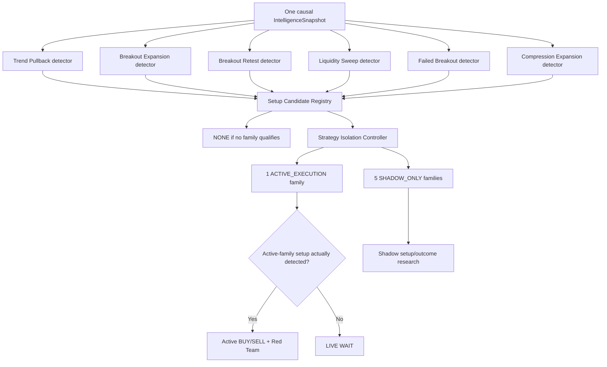

# GoldScalpTrader — Strategy Floor

**Status:** FINAL STRATEGY CONTRACT — DOCUMENTATION FREEZE BASELINE / CALIBRATION PENDING
**Version:** 2.1-market-first-setup-detection
**Authority:** Six strategy-family definitions, market-first setup detection, Strategy Isolation Mode, live-vs-shadow attribution, family evidence semantics and analytical scheduling.

## 1. Core rule

> **The chart/market decides what setup exists. The currently active strategy is never forced into every trade.**

The Strategy Floor has two distinct steps:

```text
1. SETUP DETECTION
   What family setup(s), if any, genuinely exist in the current causal market facts?

2. STRATEGY ISOLATION
   Is any detected setup eligible for live execution under the current one-family-at-a-time evaluation policy?
```

These steps must never be reversed.

## 2. Six preserved families

```text
TREND_PULLBACK_CONTINUATION
BREAKOUT_EXPANSION
BREAKOUT_RETEST_CONTINUATION
LIQUIDITY_SWEEP_REVERSAL
FAILED_BREAKOUT_REVERSAL
COMPRESSION_EXPANSION
```

Every family owns a distinct causal setup definition. It may return:

```text
QUALIFIED_BUY
QUALIFIED_SELL
POSSIBLE / INCOMPLETE
NOT_PRESENT
UNKNOWN
```

No family is required to produce a setup merely because it is currently active.

## 3. Market-first topology



## 4. Setup Detector contract

Setup detection consumes only causal, reusable market intelligence and current family definitions.

Each `SetupCandidate` should preserve at least:

```text
candidate_id
family
direction
qualification state
required evidence status
supporting evidence
opposing evidence
coverage
M5 source event IDs / knowledge time
location/path/room
preferred M1 refinement profile
correlation/source lineage
reasons
```

The detector may produce:

- no candidate;
- one candidate;
- several genuinely independent/overlapping candidates.

It must not:

- use active-family identity to fabricate qualification;
- size money;
- call Risk/Gate/MT5;
- convert shadow setup into live trade;
- count correlated labels as independent certainty.

## 5. Strategy Isolation Mode

During controlled efficiency evaluation:

```text
ACTIVE_EXECUTION = exactly one family
SHADOW_ONLY      = remaining five families
```

### Active family

May originate a production Opportunity only if:

1. its own setup is genuinely detected/qualified;
2. active BUY/SELL + Red Team accepts the thesis;
3. downstream M1 timing, TradePlan, Executable Quality, Risk and hard authorities later pass.

### Shadow families

May:

- detect setups;
- publish hypothetical BUY/SELL cases;
- generate counterfactual timing/plans/outcomes;
- challenge/contextualize research;
- feed learning/discovery/ML.

May not:

- create live Opportunity;
- vote an active-family non-setup into existence;
- create Intent;
- consume live position capacity;
- change production Risk.

## 6. Canonical examples

### Example A — matching active setup

```text
Detected Setup      BREAKOUT_RETEST_CONTINUATION
Active Test Family  BREAKOUT_RETEST_CONTINUATION
→ live analytical path may continue
```

### Example B — different setup detected

```text
Detected Setup      LIQUIDITY_SWEEP_REVERSAL
Active Test Family  BREAKOUT_RETEST_CONTINUATION
→ LIVE WAIT
→ Liquidity Sweep = SHADOW_ONLY research evidence
→ do NOT force Breakout Retest conditions onto the chart
```

### Example C — no setup

```text
Detected Setup      NONE
→ LIVE WAIT
→ no family score is allowed to manufacture a trade
```

### Example D — multiple genuine candidates

```text
Breakout Expansion qualified
Compression Expansion qualified
```

Keep both causal candidate records. Current active-family policy determines which, if any, may enter the live path. Correlation lineage prevents one event from being counted repeatedly.

## 7. Trend Pullback Continuation

Question:

> Is an established move resuming after an efficient pullback rather than already being chased?

Potential high-value evidence:

- H1/M15 directional structure;
- M5 pullback/resumption;
- useful location/room;
- EMA20/50 flow;
- RSI/momentum reset;
- ATR/volatility;
- optional trendline/Fib/POC context.

A Trend Pullback setup is `NOT_PRESENT` if its defining pullback/resumption behavior does not exist; active status cannot override this.

## 8. Breakout Expansion

Question:

> Is a meaningful structure break being accepted with enough momentum/path to expand rather than fail?

Potential evidence:

- causal break;
- completed acceptance;
- displacement/expansion;
- volatility/momentum build;
- open path/room;
- freshness/anti-chase.

It does not require a perfect retest.

## 9. Breakout Retest Continuation

Question:

> Did a meaningful breakout hold on retest with credible continuation and efficient invalidation geometry?

Potential evidence:

- causal breakout;
- retest of broken structure/zone;
- M5 hold/rejection/resumption;
- target room;
- M1 refinement after Opportunity;
- optional trendline/Fib/POC support.

If there is no real breakout+retest sequence, the family is not present regardless of active status.

## 10. Liquidity Sweep Reversal

Question:

> Did price take a pre-existing meaningful liquidity pool and reject/reclaim it sufficiently for reversal?

Potential evidence:

- pre-existing pool;
- real penetration/sweep;
- reclaim/rejection;
- M5 transition;
- opposing path;
- M1 micro reclaim/refinement.

A wick alone is insufficient.

## 11. Failed Breakout Reversal

Question:

> Did attempted structural acceptance fail and produce a credible opposing response?

Potential evidence:

- accepted-break attempt;
- loss of acceptance / return through level;
- M5 opposing response/MSS;
- location/path;
- M1 reversal refinement.

It remains a separate family even where evidence overlaps a sweep episode.

## 12. Compression Expansion

Question:

> Did meaningful compression release with actual direction, fresh expansion and enough room?

Potential evidence:

- causal compression;
- release/break;
- directional expansion;
- volatility/momentum;
- path/room;
- no severe late chase;
- optional M1 refinement.

Do not guess direction before release evidence.

## 13. Important evidence is family-specific

Evidence classification:

```text
REQUIRED_FOR_FAMILY
STRONG_SUPPORT
OPTIONAL_SUPPORT
OPPOSITION
NOT_RELEVANT
UNKNOWN
```

EMA/RSI/Fib/FVG/OB/Trendline/POC can be highly important without becoming global requirements.

Rule:

```text
required by one setup definition
≠
required by every setup/trade
```

## 14. Active BUY/SELL / Red Team handoff

Only a **qualified active-family SetupCandidate** reaches live decision fusion.

```text
qualified active SetupCandidate
→ independent BUY case
→ independent SELL case
→ Red Team
→ production Opportunity recommendation
```

Shadow reports remain attached for research but cannot become live votes.

## 15. Correlation control

A single causal episode may look like:

```text
breakout
compression release
FVG
displacement
liquidity event
```

Preserve parent event/source IDs. Do not count one event as several independent confirmations merely because multiple family detectors describe it.

## 16. Session / News

Session and News may tag/contextualize family performance.

- session may later support evidence-backed family conditioning;
- News remains soft context/research;
- neither becomes a universal family setup requirement by default.

## 17. Analytical scheduling

All six family detectors are logically independent from the same immutable input.

Physical execution may be serial or bounded-parallel depending on profiling.

Required invariants:

- immutable input;
- deterministic canonical results/order;
- no side effects;
- one-worker parity;
- bounded resources;
- no broker/lifecycle calls.

## 18. Throughput / efficiency research

Track separately:

```text
all-family detected setups/day
active-family detected setups/day
shadow-family detected setups/day
active Opportunities/day
M1 READY/day
actual trades/day
Net expectancy
false blocks
missed opportunity cost
entry/capture/exit efficiency
cost burden
position-slot suppression
```

This distinguishes “market had no setups” from “current active family was not present”.

## 19. Active-family switching

A switch is versioned/governed and preserves historical attribution.

Current production switch requires operator approval through promotion governance.

A future Dynamic Strategy Router may be researched after isolation evidence is sufficient, but it is not silently enabled by this contract.

## 20. Dashboard

Required presentation:

```text
DETECTED SETUP       Liquidity Sweep Reversal
ACTIVE TEST FAMILY   Breakout Retest
LIVE ACTION          WAIT
REASON               Active-family setup not present
SHADOW                Liquidity Sweep • QUALIFIED • research only
```

## 21. Planned proof

Tests must prove:

- all six detectors;
- detector can return NONE;
- active family cannot bias/force detection;
- one/multiple candidates;
- exactly one active + five shadow;
- shadow cannot live-originate;
- active-family setup required before Opportunity;
- evidence required/supportive semantics;
- event correlation lineage;
- switch/restart attribution;
- serial/parallel semantic parity if parallelism enabled.

## 22. Final invariant

> **The market creates setups; policy only decides which detected setup is currently allowed to become a live trade. All six strategies may observe and learn, exactly one may execute during isolation testing, and no active strategy may be forced into a chart that does not actually satisfy its definition.**
