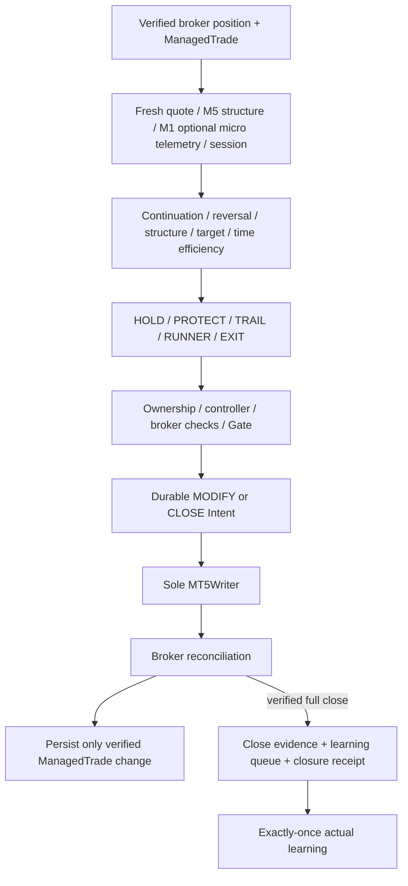
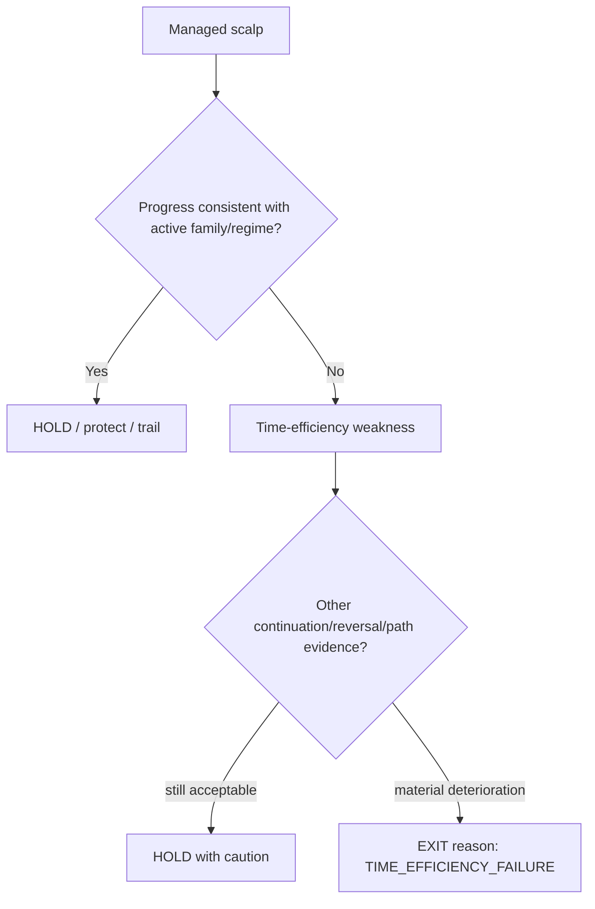
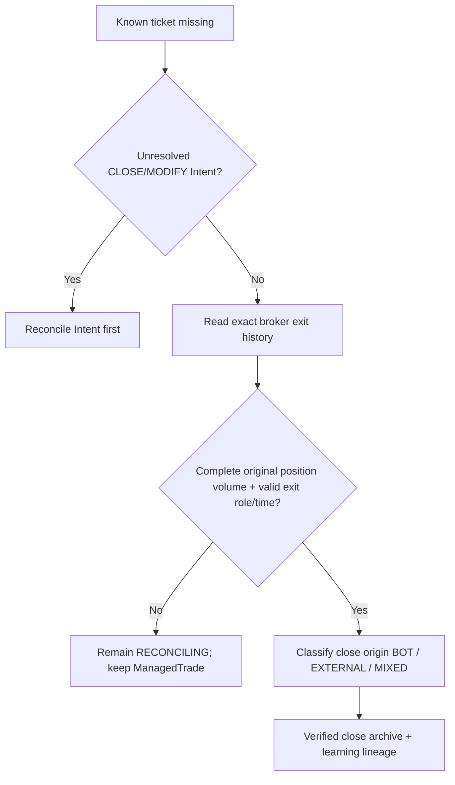

# GoldScalpTrader — Trade Manager and Exit

**Status:** APPROVED MANAGEMENT CONTRACT — DOCUMENTATION RECONSTRUCTION / CONNECTED DEMO PROOF PENDING
**Version:** 2.0-scalp-efficiency-verified-close
**Authority:** Post-entry management, structural protection, time-efficiency, target progression, runner logic, broker-verified MODIFY/CLOSE lifecycle and verified-close learning handoff.

## 1. Purpose

Trade Manager owns the post-entry decision for one verified bot-owned Gold position.

Actions remain:

```text
HOLD
PROTECT
TRAIL
RUNNER
EXIT
```

Its objective is:

> **Capture as much of the valid scalp move as possible without widening approved risk, suffocating healthy continuation or accidentally turning an inefficient scalp into an unmanaged swing.**

## 2. Boundary

Trade Manager does not:

- create a new entry thesis;
- switch active strategy family;
- change original Risk policy;
- widen initial approved risk;
- adopt manual/foreign positions;
- call raw MT5 directly;
- learn from an unverified close.

Every MODIFY/CLOSE goes through the same controller/Gate/Intent/writer/reconciliation architecture.

## 3. Management pipeline



## 4. ManagedTrade identity

Persist at least:

```text
broker position ticket
symbol/account/server scope
TradePlan / Opportunity / Episode IDs
active strategy family + production policy version
entry / actual fill
original SL / original R
current SL / TP
Primary / Expansion / Runner objectives
remaining volume
objective stage
action history
close/learning lineage
```

Original R remains immutable for analysis after stop/target modifications.

## 5. Management evidence

Relevant facts may include:

- current broker position/quote;
- M5 structural integrity;
- M15/H1 context where useful;
- continuation evidence;
- credible reversal evidence;
- candle/sequence health;
- momentum/volatility;
- liquidity/path;
- target acceptance/rejection;
- time in trade / bars in trade;
- MFE/MAE;
- current open R;
- PRE_CLOSE broker state;
- current spread/execution feasibility for requested modify/close.

M1 can be used as subordinate observation/timing support for protection/exit where the management contract explicitly allows it, but normal management structure remains M5-first to avoid micro-noise churn.

## 6. HOLD

HOLD when:

- original thesis remains healthy;
- no earned tighter structure exists;
- target path remains credible;
- no meaningful reversal/time-efficiency failure exists;
- no mandatory broker/session safety action applies.

Do **not** EXIT simply because of:

- one opposite M5 candle;
- one RSI reading;
- ordinary pullback;
- small profit;
- News event/context;
- shadow-family disagreement alone.

## 7. PROTECT

PROTECT reduces open risk only after progress and structure justify it.

Requirements may include:

- sufficient movement/progress;
- confirmed protective structure;
- valid buffered stop on correct side;
- new stop strictly safer than current/original state;
- broker-valid geometry.

Price reaching a small positive R alone does not force breakeven.

Protection/trailing timing is an approved calibration dimension.

## 8. TRAIL

Trailing follows earned structure, not a blind fixed distance.

Potential hierarchy for BUY:

```text
original structural stop
→ confirmed M5 protected low
→ stronger M5/M15 continuation structure
→ higher-timeframe structure for exceptional runner
```

SELL is symmetric.

Rules:

- stop tightens only;
- never intentionally widens beyond approved risk;
- broker constraints verified before MODIFY;
- local state changes only after broker verification.

## 9. Target progression

```text
Immediate Obstacle
→ Primary Target
→ Expansion Target
→ optional Runner Objective
```

### Primary

Primary can be a management checkpoint rather than mandatory full exit.

Ask:

- was target accepted or rejected?
- is continuation still healthy?
- is path to Expansion credible?
- has reversal/time weakness emerged?
- is current remaining session time sufficient?

### Expansion

Near/at Expansion, decide whether the move ends or earns exceptional runner treatment.

### Runner

Runner is **not the normal scalp default**.

It requires a fresh reason to stay in:

- previous objective accepted/broken rather than strongly rejected;
- active-family continuation thesis still valid;
- fresh structural/liquidity objective exists;
- path remains credible;
- reversal evidence limited;
- current risk protected appropriately;
- enough broker/session time remains.

Profit alone is not a Runner condition.

## 10. Partial close

Basic broker-valid partial management remains a capability where volume is divisible.

But correctness must not depend on it because `0.01` Gold may be indivisible.

```text
0.01 lot
→ full-position HOLD/PROTECT/TRAIL/RUNNER/EXIT must work correctly
```

Sophisticated partial-close optimization is deferred as a release dependency. Partial-close expectancy remains research/calibration.

A broker partial exit that leaves volume open is not a verified full close and cannot create final closed-trade learning.

## 11. Time-efficiency EXIT — Scalp-specific

Time is a first-class resource in scalping.

A trade that fails to make expected progress may become inefficient even if the original stop has not been hit.

Potential evidence:

- bars/time since entry;
- MFE achieved versus expected family profile;
- repeated inability to progress;
- compression after expected expansion;
- deterioration in path/continuation;
- increasing opposing structure;
- position slot preventing better opportunities.



Exact bar/time thresholds are calibrated by family/regime. There is no universal arbitrary “exit after N bars” rule.

## 12. Normal EXIT

Possible thesis/efficiency exit reasons:

- material M5 structural failure;
- failed reclaim/continuation;
- credible opposing displacement/MSS;
- objective rejection + continuation collapse;
- no credible remaining target/path;
- time-efficiency failure;
- mandatory PRE_CLOSE flatten;
- other separately owned hard safety.

News itself is not a forced EXIT reason.

## 13. PRE_CLOSE

Preserved baseline:

```text
Daily:   T-20 no new entry / T-10 flatten
Weekend: T-60 no new entry / T-30 flatten
```

Trade Manager executes required flatten through the normal governed CLOSE path while the broker is still tradeable.

If acknowledgement is ambiguous or the broker becomes unavailable:

- keep exposure unresolved;
- reconcile;
- do not mark locally closed by assumption.

## 14. Verified MODIFY state

For PROTECT/TRAIL/RUNNER:

```text
propose action
→ Gate / Intent
→ broker MODIFY
→ reconcile broker position
→ only then persist new current SL/TP/objective state
```

If broker verification fails, local ManagedTrade retains the last verified state plus unresolved lifecycle information.

## 15. Verified CLOSE archive

Crash-safe sequence:

```text
verified broker full close
→ persist closed-trade learning queue item
→ persist durable closure receipt
→ clear active ManagedTrade
→ reconstruct outcome/path metrics
→ save exactly-once actual StrategyMemory observation
→ consume queue item only after durable learning success
```

This order preserves recovery proof.

## 16. Broker-side/manual close of known trade

A manual/foreign position is never adopted.

But if an already-known bot ManagedTrade disappears from positions:



Manual close of the known trade can create valid trade outcome learning while preserving that closing action was external.

## 17. News/Fundamental behavior

News context does not:

- force EXIT;
- force PROTECT;
- start special management cooldown;
- disable a safe close.

Actual event-induced price/execution behavior may influence normal continuation/reversal/quality evidence.

## 18. Strategy isolation after entry

The trade keeps the active family/policy identity under which it was opened.

If operator later switches the active production family, the existing ManagedTrade is **not relabelled**. Management uses the original trade thesis plus current market facts.

Shadow-family research can continue but cannot take over management authority.

## 19. Dashboard

```text
MANAGED TRADE
Ticket          123456
Family          Breakout Retest v3
Entry / Now     4320.20 / 4322.10
Original R      1.10 price units
Open R          +1.73R
SL              4320.85 • PROTECTED
Stage           PRIMARY → EXPANSION
Trade Age       4 M5 bars
Time Efficiency HEALTHY
Action          HOLD
Runner          NOT EARNED
```

## 20. Research

Measure:

- MFE/MAE;
- realized R;
- Entry Efficiency;
- Capture Efficiency;
- Exit Efficiency;
- Premature Exit Cost;
- profit given back;
- time-to-MFE/time-to-target;
- slot-occupancy cost;
- protection/trailing outcomes;
- Primary→Expansion→Runner rates;
- partial-close outcomes;
- PRE_CLOSE exits;
- family/session/regime differences.

## 21. Planned implementation owners

```text
management/models.py
management/manager.py
management/execution.py
management/store.py
execution/gate.py
execution/service.py
execution/mt5_writer.py
execution/reconcile.py
app/recovery.py
research/live_learning.py
```

## 22. Planned proof

Tests cover:

- HOLD on ordinary pullback;
- structural PROTECT/TRAIL;
- no stop widening;
- time-efficiency EXIT;
- Runner requires fresh objective/evidence;
- profit alone insufficient for Runner;
- basic divisible partial close and indivisible fallback;
- PRE_CLOSE override;
- all MODIFY/CLOSE through Intent/writer;
- ambiguous ack/reconciliation;
- local state only after broker verification;
- exact manual/broker close proof;
- partial-volume not full close;
- queue/closure-receipt durability;
- exactly-once learning;
- original strategy attribution preserved after later family switches.

## 23. Calibration

Approved open items:

- protection timing;
- trailing hierarchy/thresholds;
- time-efficiency EXIT by family/regime;
- Runner conditions;
- partial-close expectancy;
- sequential runner-objective discovery;
- PRE_CLOSE exact broker timing.

## 24. Final invariant

> **Manage the trade that was actually opened, not a new thesis. Protect only when structure earns it, exit inefficient scalps before they silently become swings, extend only when a fresh structural objective exists, and never change durable lifecycle state before broker truth is verified.**
