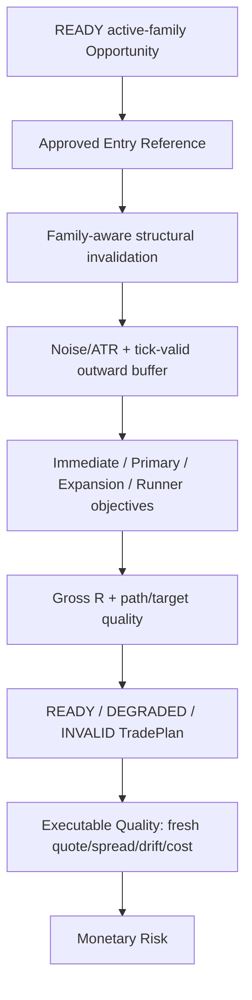
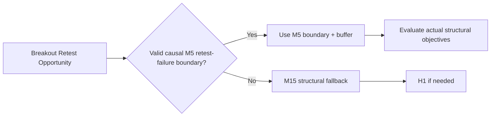

# GoldScalpTrader — Structural Trade Plan and Executable Geometry Handoff

**Status:** APPROVED TRADE-PLAN CONTRACT — DOCUMENTATION RECONSTRUCTION / CALIBRATION PENDING
**Version:** 2.0-scalp-family-geometry
**Authority:** Approved Entry Reference, family-aware structural invalidation, initial SL, objective hierarchy, immutable original R, gross structural quality and handoff to Executable Quality.

## 1. Purpose

TradePlan converts a READY active-family Opportunity into market geometry **before** monetary sizing and broker submission.

> Strategy decides whether the idea is worth pursuing. TradePlan defines what invalidates it and where credible objectives exist. Executable Quality asks whether the current market price/cost still makes the geometry worthwhile. Risk asks whether the account can afford it.

TradePlan does not:

- size lots;
- change Risk percentages;
- move SL to fit 0.01 lot;
- use current spread as structural invalidation;
- call MT5 writer;
- grant final permission.

## 2. Construction pipeline



## 3. Price identities

Never collapse these prices:

| Price | Meaning | Owner |
|---|---|---|
| Signal Price | where causal evidence formed | Strategy/Decision |
| Approved Entry Reference | price used to construct plan geometry | TradePlan |
| Executable Quote | fresh Bid/Ask used for current economic/pre-submit validation | Executable Quality/Execution |
| Actual Fill | broker-confirmed executed price | Execution/Reconciliation |

This separation is critical for drift, cost and entry-efficiency research.

## 4. Inputs

TradePlan requires:

- active family and policy version;
- Opportunity/Episode identity;
- READY timing result;
- causal IntelligenceSnapshot;
- SymbolSpec/tick geometry;
- reference price;
- versioned TradePlan policy.

Outputs include:

```text
trade_plan_id
opportunity_id / episode_id
active_family / policy_version
direction
signal/reference price
invalidation source + price
buffer + resulting initial SL
stop quality
Immediate Obstacle
Primary Target
Expansion Target
optional Runner Objective
gross R distances/multiples
path/target quality
state + reasons
```

## 5. Family-aware invalidation

The core question:

> **What price behavior proves this exact active-family thesis wrong?**

A generic “nearest swing” is not always the correct answer.

### Baseline search tendencies

| Family | Preferred invalidation logic |
|---|---|
| Trend Pullback | pullback/continuation structural failure, often M15 then M5/H1 fallback |
| Breakout Expansion | accepted breakout failure boundary, often M15/M5 |
| Breakout Retest | **actual M5 retest-failure boundary first**, then broader fallback |
| Liquidity Sweep Reversal | **causally proven M5 sweep extreme first** where available |
| Failed Breakout Reversal | **causally proven M5 failed-break extreme first** where available |
| Compression Expansion | compression/release structural boundary, often M15/M5 |

Within a timeframe, the planner may prefer:

```text
family-specific event boundary
→ protected swing
→ confirmed swing
→ meaningful technical zone
→ next allowed timeframe
```

It must never invent a tighter level merely to improve R.

## 6. Stop construction

Initial SL:

```text
family-correct structural invalidation
+ volatility/noise buffer
+ outward tick normalization
```

ATR assists structure; it does not replace it.

Possible Stop Quality:

```text
ROBUST
ACCEPTABLE
FRAGILE
INVALID
```

If broker geometry would require distorting the thesis-correct stop materially, the plan is degraded/invalid rather than secretly rewritten.

## 7. Objective hierarchy

```text
Immediate Obstacle
→ Primary Structural Target
→ Expansion Target
→ optional Runner Objective
```

### Immediate Obstacle

Nearest meaningful opposing structure/path fact. It can be a warning even if not chosen as final target.

### Primary

First credible structural objective that meaningfully expresses the active-family thesis.

### Expansion

Next credible structural/liquidity objective if continuation remains plausible.

### Runner

Exceptional extension objective. It must be structurally defined; “profit is large” is not an objective.

Multiple objectives do not imply multiple broker orders or mandatory partial closes.

## 8. Gross structural R

For BUY:

```text
risk_distance   = entry_reference - initial_SL
reward_distance = primary_target - entry_reference
gross_R         = reward_distance / risk_distance
```

SELL is symmetric.

Original R geometry is immutable for later management/research once actual fill/original approved stop establish realized 1R identity.

## 9. Minimum gross R — Scalp-specific policy

The Swing reference used a fixed 1.20R hard floor. The operator approved reopening this for Scalp.

Current rule:

> **Do not automatically impose Swing's 1.20R as the hard Scalp floor.**

Instead:

- retain and report exact gross structural R;
- calibrate the minimum gross R using chronological Scalp evidence;
- combine it later with cost-adjusted opportunity quality;
- never lower quality merely to hit a trade-count quota;
- never require a high gross R that systematically eliminates profitable short-duration opportunities without evidence.

`minimum_gross_R` is therefore an approved calibration variable, not an undocumented constant.

## 10. Gross versus executable quality

TradePlan owns **gross structural geometry**.

Executable Quality owns current economic usability:

```text
fresh spread
spread / SL
spread / target
slippage allowance
current price drift
decision→send latency
remaining target room
total cost / reward
```

This separation prevents cost double counting and prevents TradePlan from changing structural SL simply to make cost ratios look better.

## 11. Plan states

```text
READY
DEGRADED
INVALID
```

Examples:

### READY

Structural invalidation/objectives are credible and gross geometry meets the current versioned policy.

### DEGRADED

Opportunity may survive but current plan geometry is marginal/fragile and may benefit from a better entry.

Examples:

```text
STOP_FRAGILE_WAIT_FOR_BETTER_GEOMETRY
TARGET_ROOM_MARGINAL
REFERENCE_TOO_EXTENDED
```

### INVALID

No credible family-correct invalidation/objective can be constructed, or structure is contradictory/corrupt.

## 12. Breakout Retest special geometry

A valid Breakout Retest may have a clear M5 retest-failure boundary materially closer than broad M15 structure.



Purpose: use thesis-correct geometry, not artificially tighten the stop.

## 13. Reversal event geometry

For Failed Breakout Reversal and Liquidity Sweep Reversal, exact causal event extremes may be valid invalidation references.

They are allowed only if the exact event/candle exists in the same immutable causal snapshot.

If ambiguous/missing:

```text
NO fabricated event extreme
→ conservative generic M5 structural fallback
→ M15/H1 fallback
```

## 14. M1 relationship

M1 can refine entry **before** plan construction/rebuild.

A better M1 entry can legitimately improve:

- stop distance relative to reference;
- gross R;
- cost ratios;
- chase/drift.

But M1 cannot move the M5 thesis invalidation to an arbitrary micro level unless that family's approved structural contract explicitly makes that micro boundary thesis-correct.

## 15. Deterioration before submit

A TradePlan can be structurally valid yet no longer executable because current price moved.

Correct path:

```text
original TradePlan
→ fresh quote
→ Executable Quality revalidation
→ if current economics still acceptable, continue
→ otherwise WAIT/MISSED/rebuild as owning lifecycle allows
```

Do not silently modify original plan history.

## 16. Persistence / lineage

Persist enough to prove:

- exact Opportunity/Episode;
- active family/policy;
- invalidation source;
- objective sources;
- policy/config fingerprint;
- created/rebuilt timestamps;
- plan state/reason.

A TradePlan belongs to exactly one Opportunity identity.

## 17. Dashboard

```text
TRADE PLAN
Family        Breakout Retest
Entry Ref     4322.40
SL            4319.85
Invalidation  M5:RETEST_FAILURE_LOW
Primary       4325.90 • gross 1.37R
Expansion     4328.80 • gross 2.51R
Runner        4333.10 • optional
Stop Quality  ACCEPTABLE
Plan State    READY
```

No plan = dashes/WAIT reason, not fake zeros.

## 18. Research

Measure:

- family invalidation source performance;
- stop distance distribution;
- minimum gross R threshold sensitivity;
- M1 entry improvement;
- target/path quality;
- gross R vs after-cost Net R;
- false rejection due broad stops;
- missed opportunities from too-high R floors;
- bad trades admitted by too-low floors.

## 19. Planned implementation ownership

```text
decisions/trade_plan.py
    generic structural plan / targets / original R

decisions/family_trade_plan.py
    family-specific event/retest invalidation selection

decisions/executable_quality.py
    current spread/cost/drift economics — separate owner
```

## 20. Planned proof

Tests cover:

- BUY/SELL geometry;
- family-aware invalidation order;
- breakout-retest M5 boundary;
- sweep/failed-break event extremes;
- conservative fallback;
- ATR/tick buffers;
- target provenance;
- no stop rewrite for Risk/min lot;
- minimum gross-R policy version;
- immutable original R;
- stale-price handoff to Executable Quality;
- persistence identity.

## 21. Calibration

Approved open variables:

- stop/noise buffers;
- target merge/path quality;
- minimum gross R;
- family-specific invalidation refinements;
- objective ranking;
- M1 entry/reference rebuilding rules.

## 22. Final invariant

> **TradePlan must represent the true active-family thesis, not an account-size compromise or a fixed-R template. It preserves structural invalidation and objectives honestly, while current costs and executable price are judged later by a separate quality layer.**
