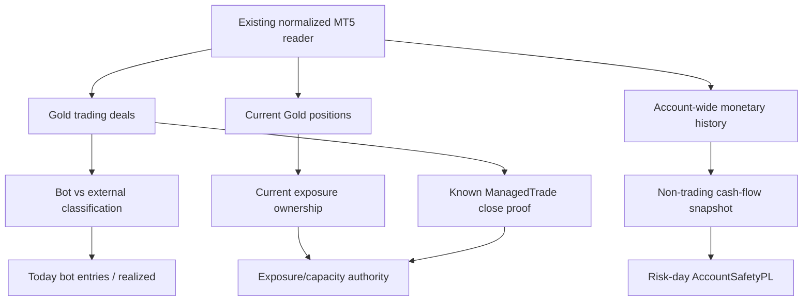
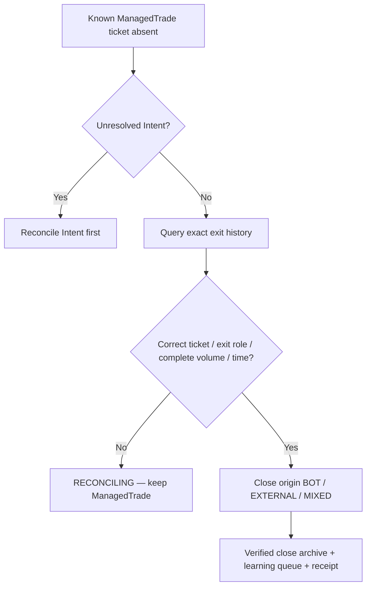

# GoldScalpTrader — Broker Activity and Manual Trade Accounting

**Status:** APPROVED ACCOUNTING / OWNERSHIP CONTRACT — IMPLEMENTATION PROOF PENDING
**Version:** 2.0-scalp-attribution
**Authority:** Bot-owned versus external/manual activity, actual trade counters, non-trading cash flow, account-level safety P/L, position ownership and manual-close attribution.

## 1. Purpose

The broker account can change without the bot doing anything:

- operator manual trade;
- another EA;
- broker SL/TP close;
- deposit/withdrawal;
- credit/debit/charge;
- partial fills/exits.

These facts must never be collapsed into one P/L/trade counter.

## 2. Separate accounting questions

| Question | Canonical answer |
|---|---|
| Is the account safe to risk more? | Account Safety P/L / Risk-day state |
| How many actual bot entries today? | unique verified bot-owned entry lineages |
| How many bot trades in durable runtime lineage? | verified OPEN Intents |
| What did the bot realize? | bot-attributed exit deals/outcomes |
| What did manual/foreign activity do? | external activity lane |
| Did funding change the account? | non-trading cash-flow lane |
| Is a disappeared known ManagedTrade closed? | exact broker exit proof |

## 3. Ownership/data flow



No second MT5 terminal/client is initialized for accounting.

## 4. Bot identity

Configured magic/comment lineage plus durable Intent/ManagedTrade identity support attribution.

Baseline trading-deal rule:

```text
deal.magic == configured bot magic
→ bot-attributed broker action/deal

other/zero/missing magic
→ external/manual action/deal unless exact durable known-trade lineage proves otherwise
```

Symbol alone never proves bot ownership.

Critical distinction:

- unknown manual position is never adopted;
- a known bot ManagedTrade remains the bot's original trade even if a human later closes it;
- that human closing action remains EXTERNAL/MIXED action attribution.

## 5. Actual trade counters

Raw deals are fills, not full trades.

Recommended semantics:

| Metric | Rule |
|---|---|
| Today Trades | unique bot-owned position lineages with actual entry in current risk/day reporting interval |
| Total Trades | durable OPEN Intents in `ACCEPTED_VERIFIED` for current runtime scope |
| Bot Realized | verified bot trade outcome / attributed bot exit deals as defined by outcome owner |
| External Realized | external/manual trading result; excluded from Bot Performance |
| External Open | current non-bot Gold exposure |

Do not count:

- signals;
- Opportunities;
- shadow hypotheticals;
- WAIT/MISSED/BLOCKED;
- failed/ambiguous OPEN Intents;
- MODIFY/CLOSE as new trades;
- multiple partial fills as multiple full trade entries.

## 6. Active strategy attribution

Every bot trade carries:

```text
active_family
active_family_policy_version
Opportunity/Episode
TradePlan ID
Intent ID
position ticket
```

Strategy Isolation Mode therefore allows exact efficiency metrics per live strategy.

Shadow strategies produce separate research records and never increase actual trade counters.

## 7. UTC-day baseline and cash flow

Current preserved risk day begins 00:00 UTC.

For a bounded interval:

```text
NetNonTradingCashFlowSinceRiskBaseline
= CurrentCumulativeIdentifiedCashFlow
  - FrozenCashFlowBaselineTotal
```

Then:

```text
AccountSafetyPL
= CurrentVerifiedEquity
  - DayStartEquity
  - NetNonTradingCashFlowSinceDayStart
```

Repeated broker-history reads must not repeatedly add the same deposit/withdrawal.

## 8. Non-trading cash-flow classification

Clearly identifiable account monetary adjustments may include:

- balance operations;
- deposits/withdrawals;
- broker credit/debit;
- bonus/interest/dividend/tax-like rows where official types support classification.

Trading profit/loss/commission/swap/fee already reflected in equity is **not** subtracted as non-trading cash flow again.

Unknown non-zero monetary row types or incomplete history make cash-flow truth UNKNOWN.

## 9. Manual open while bot is flat

```text
external/manual XAU exposure detected
→ External Open visible
→ capacity/ownership blocks new bot OPEN
→ bot does not adopt/modify/close it
→ bot trade counters unchanged
```

When external position disappears, fresh broker truth may clear the exposure blocker. No bot outcome is fabricated.

## 10. Manual close of manual trade

Remains external.

It affects actual account equity and therefore Account Safety P/L, but not Bot Performance P/L or bot trade count.

## 11. Manual/broker close of a known bot ManagedTrade



Partial volume or ambiguous lineage cannot be treated as full close.

## 12. Position ownership states

Suggested states:

```text
BOT_OWNED
EXTERNAL
KNOWN_BOT_TRADE_EXTERNALLY_CLOSED
AMBIGUOUS
NONE_VERIFIED
DATA_UNAVAILABLE
```

`DATA_UNAVAILABLE` and `AMBIGUOUS` never become `NONE_VERIFIED`.

## 13. History failure semantics

If trading deal history is unavailable/corrupt:

```text
Today Trades      —
Bot Realized      —
External Realized —
Activity          UNKNOWN
```

If durable Intent history fails integrity:

```text
Total Trades —
```

Never guess zero from missing evidence.

If cash-flow history is UNKNOWN:

- flat account cannot begin a new risk-capable cycle unless owner contract resolves it;
- existing known ManagedTrade can remain management-capable so protection/exit is not abandoned.

## 14. Midnight / risk-day rollover

At UTC rollover, if a bot trade remains open or an Intent is unresolved:

- management/reconciliation continues;
- Risk baseline transition follows the Risk/Persistence contract;
- no casual restart/new-day shortcut creates new entry authority.

## 15. Dashboard

```text
BROKER ACTIVITY
Today Bot Trades   23
Total Verified     418
Bot Realized       +$6.24
External Realized  -$1.10
External Open      NONE
Account Safety P/L +$5.02
Active Strategy    Breakout Retest
```

Unknown values display `—/UNKNOWN`.

## 16. Research

Keep bot actual, external/manual and shadow evidence separate.

Research may correlate:

- active-family outcomes;
- session/event tags;
- manual-account interference;
- broker slippage/cost;
- after-cost P/L;
- throughput.

External activity never contaminates bot strategy performance, even though it affects account safety.

## 17. Planned implementation ownership

```text
market_data/activity.py
market_data/mt5_reader.py
risk/state.py
execution/intent_store.py
execution/reconcile.py
management/store.py
research/live_learning.py
app/dashboard.py
```

## 18. Planned proof

Tests cover:

- bot/external magic attribution;
- unique actual entry counting;
- partial fill de-duplication;
- verified OPEN Intent total;
- non-trading cash-flow baseline/delta;
- manual activity affects Account Safety but not Bot Performance;
- external position blocks new bot entry without adoption;
- known ManagedTrade exact manual close proof;
- full vs partial exit volume;
- BOT/EXTERNAL/MIXED close origin;
- UNKNOWN history never displays zero;
- active-family attribution retained.

## 19. Final invariant

> **The account is the financial risk-bearing unit, but the bot's strategy performance is a separate attribution lineage. Manual/external activity affects account safety without becoming bot performance, and no missing/ambiguous broker history is allowed to masquerade as zero exposure or a verified close.**
