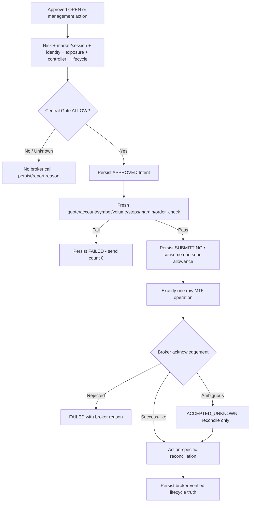
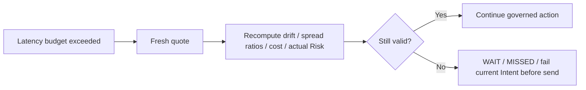
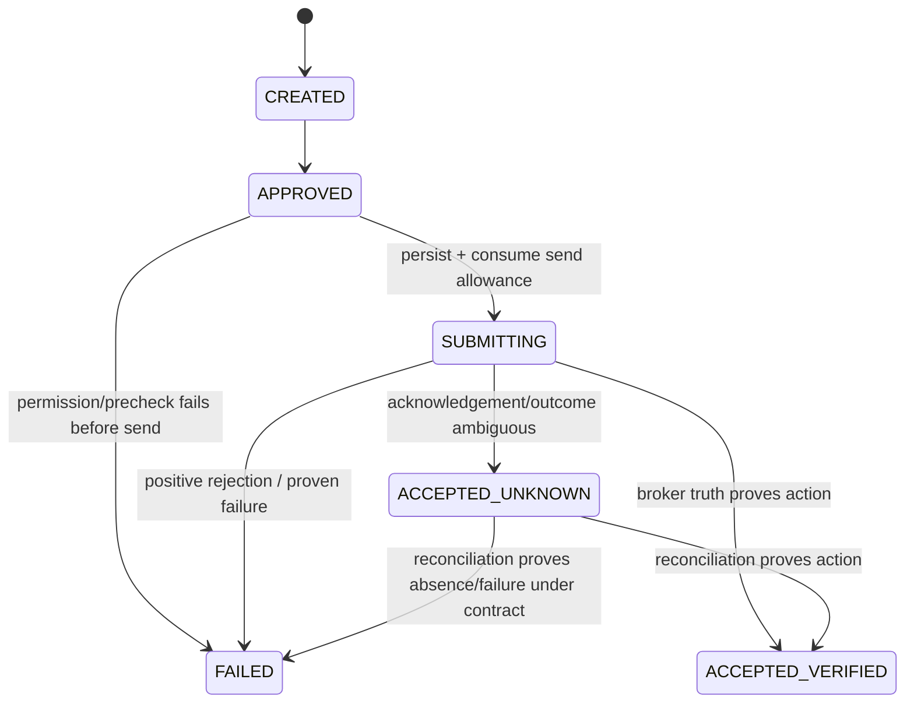

# GoldScalpTrader — Execution and Broker Safety

**Status:** APPROVED EXECUTION CONTRACT — DOCUMENTATION RECONSTRUCTION / CONNECTED DEMO PROOF PENDING
**Version:** 2.0-one-shot-fixed-aware-execution
**Authority:** Final hard permission, account/symbol verification, fixed+aware execution quality, controller fencing, one-shot Intents, raw MT5 writer confinement, action-sensitive prechecks and broker reconciliation.

## 1. Purpose

This is the final safety boundary before an irreversible MT5 OPEN/MODIFY/CLOSE.

> **Strategy can be wrong and lose. Execution must not create duplicate, wrong-account, wrong-symbol, wrong-volume, uncontrolled or falsely reconciled exposure.**

Execution does not:

- choose active strategy;
- improve a score;
- rewrite TradePlan invalidation;
- change preserved Risk bands;
- hard-block because of News context;
- adopt unknown external positions.

## 2. Sole broker-write path



Only planned `execution/mt5_writer.py` owns raw irreversible broker calls.

## 3. Boundary ownership

| Boundary | Owner | Invariant |
|---|---|---|
| thesis | active strategy / decisions | no money/write authority |
| structural geometry | TradePlan | no lot/writer authority |
| current economics | Executable Quality | no structural stop rewrite |
| affordability | Risk | no strategy/write authority |
| hard permission | Gate | required BLOCK/UNKNOWN cannot pass |
| durable one-shot action | IntentStore | one ID → at most one irreversible send |
| fresh broker precheck | execution checks/writer | uses current broker truth |
| raw broker write | MT5Writer | sole irreversible boundary |
| final outcome | Reconciler | acknowledgement is not final truth |
| controller | controller/coordination | current holder/epoch/lease required |

## 4. Environment / capability progression

Initial target progression:

```text
READINESS / DRY_RUN
→ controlled DEMO
→ future governed REAL
```

A write-capable stage requires positive identity/capability proof for the intended environment.

REAL remains a future capability requiring separate DEMO/release evidence and explicit operator approval. There is no accidental UI/env shortcut that silently converts DEMO proof into REAL authority.

## 5. Central Gate inputs

For OPEN, applicable hard inputs include:

- runtime/capability stage;
- account/server identity;
- resolved Gold symbol;
- fresh required DataQuality;
- current market/session state;
- monetary Risk PASS;
- capacity/exposure ownership;
- persistence/recovery state;
- unresolved Intent state;
- controller holder/epoch/lease;
- action-specific execution readiness.

**News/Fundamental context is not a hard Gate input.**

## 6. Upstream stop versus Gate

Possible pre-Gate stops:

```text
Timing MISSED/INVALID
TradePlan DEGRADED/INVALID
Executable Quality unacceptable
Risk BLOCK/UNKNOWN
```

Operator truth:

```text
upstream stop
→ Gate NOT EVALUATED

actual Gate hard authority BLOCK
→ Gate BLOCKED
```

`ENTRY_BLOCKED` at the broad cycle level cannot be presented as Gate BLOCKED without evidence.

## 7. Fresh account / terminal / symbol precheck

Immediately before irreversible send, revalidate broker-native facts such as:

```text
account identity
account trade allowed / expert allowed
terminal trade allowed / API enabled
symbol trade mode
resolved symbol
fresh Bid/Ask
volume min/max/step
stops/freeze geometry
filling/order mode
current margin/order_check
```

Stable reason codes should distinguish failures.

Examples:

```text
ACCOUNT_TRADING_DISABLED
ACCOUNT_EXPERT_TRADING_DISABLED
TERMINAL_AUTOTRADING_DISABLED
TERMINAL_TRADE_API_DISABLED
SYMBOL_TRADING_DISABLED
SYMBOL_CLOSE_ONLY
SYMBOL_DIRECTION_NOT_ALLOWED
SYMBOL_TRADE_MODE_UNKNOWN
BROKER_PERMISSION_METADATA_INCOMPLETE
ORDER_CHECK_FAILED
```

Failure before SUBMITTING has zero send attempts.

## 8. Fixed + aware spread quality

Execution consumes the approved hybrid model.

### Absolute emergency ceiling

Obvious pathological/broken spread can block immediately.

Exact threshold = `CALIBRATE` from Exness evidence.

### Context-aware dimensions

```text
spread / structural SL distance
spread / current target room
spread / recent healthy baseline
total expected cost / expected reward
```

The quality owner should expose actual ratios/reasons rather than one opaque “spread too high”.

## 9. Slippage allowance

Before fill, use a realistic estimated slippage allowance for after-cost quality/risk where required and not already represented.

After fill, record actual slippage separately:

```text
BUY slippage  = actual_fill - expected/reference_buy_price
SELL slippage = expected/reference_sell_price - actual_fill
```

Do not double-count slippage in monetary Risk if actual entry geometry already incorporates it.

Calibration should use real DEMO distributions by session/volatility/spread regime where useful.

## 10. Broker deviation

Deviation is what the request permits; slippage is what the fill actually experiences.

Target approach:

```text
bounded base deviation
→ possibly adjusted by current verified execution regime
→ absolute maximum cap
```

Too tight may reject good scalp entries. Too loose may allow a fill that destroys edge. Current Exness execution-mode behavior requires connected proof.

## 11. Decision→send latency and drift

Record timestamps through the final entry path:

```text
Opportunity/timing decision
TradePlan approval
Executable Quality capture
Risk/Gate
Intent persisted
precheck
order_send invocation
acknowledgement
reconciliation
```

If decision→send age exceeds the versioned budget:



Latency alone should not unnecessarily kill a still-valid opportunity after successful fresh revalidation.

## 12. Price drift

Compare Approved Entry Reference / latest approved execution reference to fresh executable side.

Drift is measured in:

- price/ticks;
- ATR-normalized distance;
- percentage of SL distance;
- percentage of target room where useful.

Excessive adverse drift can invalidate current execution economics. It does not alter historical TradePlan geometry.

## 13. Intent lifecycle



Core invariant:

> **One Intent ID causes at most one irreversible broker request.**

A fresh later attempt requires a new governed Intent only after the prior lifecycle is resolved.

## 14. Persist-before-send

Before broker call:

1. persist Intent identity/action/payload lineage;
2. persist APPROVED;
3. perform current fresh broker checks;
4. persist SUBMITTING and consume send allowance;
5. invoke sole writer once.

A process crash after step 4 is treated as potentially sent—even if local code never observed a response. Recovery reconciles; it does not resend.

## 15. Action-specific reconciliation

| Action | Required proof |
|---|---|
| OPEN | current position/order/deal lineage, symbol/direction/volume/ticket/Intent correlation |
| MODIFY | exact ticket and actual broker SL/TP/objective change |
| CLOSE | position reduction/absence plus exact exit deal/volume lineage where required |

Magic/comment help attribution but never substitute for broker truth.

## 16. Ambiguous acknowledgement

Examples:

- timeout after send;
- transport exception after broker may have received request;
- non-final/ambiguous return code;
- process crash while SUBMITTING.

Response:

```text
ACCEPTED_UNKNOWN
→ no blind retry
→ query positions/orders/deals
→ reconcile exact intended lifecycle
```

This is a core financial invariant.

## 17. Manual/foreign exposure

Same symbol is not same owner.

```text
manual/foreign/unknown Gold position while bot flat
→ external exposure visible
→ new bot entry blocked by exposure/capacity
→ bot never modifies/closes/adopts it
```

An already-known ManagedTrade closed manually is handled differently: original trade ownership remains bot lineage, while closing action origin may be EXTERNAL/MIXED after exact deal proof.

## 18. Controller / fencing

Current supported model:

```text
one active PRIMARY per account/symbol scope
local durable controller holder
lease/expiry
monotonic fencing epoch
fresh holder/epoch check before every irreversible write
```

Exact lease values are implementation policy; reference 10s renewal/30s TTL can remain a baseline until reconstructed owner/test contracts finalize them.

A stale holder/epoch cannot write.

Same-account active-active multi-machine writer is explicitly deferred. Distributed DB/fencing is explicitly deferred.

## 19. Takeover semantics for future/internal proof

Even in local deterministic tests/future architecture:

```text
old lease expires
→ contender gets higher epoch
→ reconciliation required
→ durable lifecycle + broker truth reconciled
→ same holder/epoch reverified
→ only then write-capable READY
```

Higher epoch alone is not permission.

## 20. Startup recovery

Recovery performs no broker write until authorities are reconstructed.

Sequence:

```text
StateStore integrity
→ current account/server/symbol
→ unresolved Intent reconciliation
→ ManagedTrade vs current position
→ exact broker-side close proof if needed
→ Risk/session/exposure state
→ controller acquisition
→ required authorities PASS
→ READY
```

## 21. CLOSE is action-sensitive

Exposure-reducing CLOSE should not be trapped by optional entry-quality restrictions.

It still requires:

- correct ownership/ticket;
- controller;
- valid lifecycle;
- broker capability;
- executable quote/request;
- Intent/writer/reconciliation.

But a high entry spread ratio does not automatically veto a mandatory safe flatten merely because OPEN would be unattractive.

## 22. Runtime reason states

Examples:

```text
READY
PRE_SUBMIT_BLOCK
BROKER_REJECTED
AMBIGUOUS_ACK
ACCEPTED_VERIFIED
RECONCILING
RECONCILIATION_FAILED
CONTROLLER_FENCED
STARTUP_RECOVERY_READY
```

Use stable reason codes for automation/dashboard/research.

## 23. Dashboard

```text
EXECUTION
Gate          ALLOW / BLOCKED / NOT EVALUATED
Intent        INT-... • APPROVED/SUBMITTING/VERIFIED
Send Count    0/1
Spread        0.24 • emergency PASS
Spread/SL     9.4%
Spread/Target 6.2%
Cost/Reward   PASS
Drift         0.08 ATR
Latency       84 ms
Controller    PRIMARY • epoch 42
Broker Check  PASS
Reconcile     VERIFIED
```

## 24. Planned source ownership

```text
execution/models.py
execution/checks.py
execution/gate.py
execution/intent_store.py
execution/service.py
execution/mt5_writer.py
execution/reconcile.py
execution/controller.py
execution/sqlite_coordination.py
app/recovery.py
```

## 25. Planned deterministic proof

Tests cover:

- one raw writer boundary;
- persist-before-send;
- exactly one send per Intent;
- precheck failure send count 0;
- account/terminal/symbol modes;
- fixed emergency spread;
- spread/SL + spread/target + cost/reward;
- decision→send revalidation;
- slippage/deviation semantics;
- OPEN/MODIFY/CLOSE action sensitivity;
- ambiguous ack/no retry;
- action-specific reconciliation;
- manual/foreign ownership;
- controller stale epoch denial;
- restart recovery;
- News absence from hard Gate.

## 26. External evidence

Controlled Windows/Exness DEMO must prove:

- terminal/account/symbol permission flags;
- filling mode/order_check;
- min volume/step/stops/freeze;
- actual spread distributions;
- actual fill/slippage/deviation;
- decision/send/ack/reconcile latency;
- OPEN/MODIFY/CLOSE/SL/TP;
- exact manual close attribution;
- restart/reconciliation;
- daily/weekend schedule behavior.

## 27. Final invariant

> **Every irreversible broker action is serial, durable, one-shot and reconciled. Analysis may be fast/parallel and imperfect; broker authority may never duplicate exposure, guess unknown state, rewrite structural geometry, or use News context as a hidden permission gate.**
