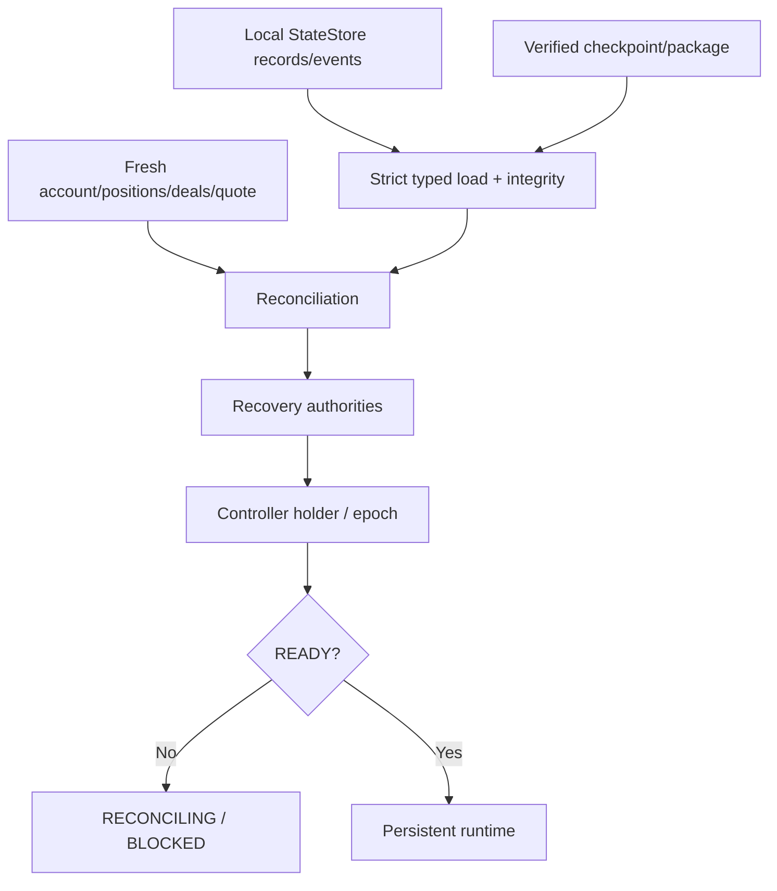
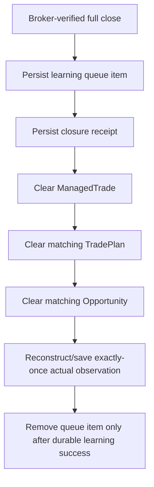
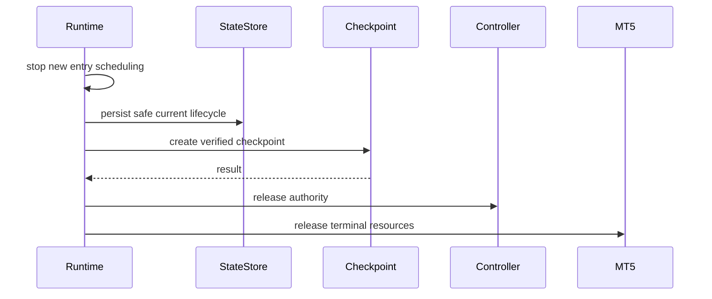
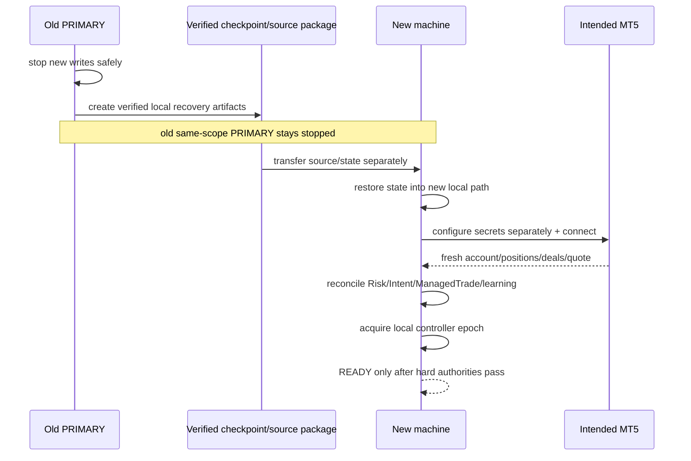

# GoldScalpTrader — Persistence, Restart and Recovery

**Status:** APPROVED RECOVERY CONTRACT — DOCUMENTATION RECONSTRUCTION / FRESH-MACHINE PROOF PENDING
**Version:** 2.0-local-first-strategy-isolation-recovery
**Authority:** Durable runtime lifecycle, strict StateStore, checkpoint/restore, startup reconciliation, close/learning durability, strategy-policy persistence, sequential machine handoff and current coordination boundaries.

Canonical backup architecture: [`../BACKUP_SYNC_AND_RECOVERY_ARCHITECTURE.md`](../BACKUP_SYNC_AND_RECOVERY_ARCHITECTURE.md).

## 1. Purpose

Restart or laptop migration must not erase:

- Risk day/profile/cash-flow/cooldown;
- Strategy Isolation policy;
- Opportunity/TradePlan lineage;
- ExecutionIntent;
- ManagedTrade;
- verified-close learning queue/receipt;
- StrategyMemory;
- research/candidate/promotion lineage.

> **Restart is not a fresh trading day. Restored state is context, never current broker truth. Unknown exposure is never zero.**

## 2. Truth layers



| Layer | Authority |
|---|---|
| durable local context | lifecycle/history/state memory |
| checkpoint | transportable verified context |
| broker truth | current exposure/outcome |
| recovery decision | continuation permission |
| source/history backup | software reconstruction only |

Restore never directly grants broker write permission.

## 3. StateStore contract

Target: standard-library SQLite or equivalently strict local transactional store.

Required properties:

- explicit schema version;
- transactional writes;
- durable current records;
- append-only lifecycle/events;
- checksums/hash/integrity where appropriate;
- type-strict serializers/parsers;
- timezone-aware UTC timestamps;
- finite numeric validation;
- idempotent duplicate semantics;
- corruption fails closed.

Malformed value never becomes:

```text
0
False
empty exposure
PASS
fresh risk day
```

## 4. Durable namespaces

When applicable, preserve:

### Financial/Risk

- risk-day identity;
- DayStartEquity;
- fixed SMALL/MEDIUM/NORMAL profile;
- aggressive-mode state/policy;
- non-trading cash-flow baseline/delta;
- daily lock/reset/cycle;
- loss streak;
- cooldown;
- same-episode re-entry use.

### Strategy/decision

- active family;
- active-family policy/version;
- strategy-evaluation window/lineage;
- active Opportunity/Episode;
- TradePlan;
- timing state/re-arm identity.

### Execution/management

- ExecutionIntents and history;
- send-attempt/ack/reconciliation state;
- ManagedTrade;
- objective/action state;
- close receipts.

### Learning/research

- closed-trade learning queue;
- StrategyMemory raw observations/summaries;
- actual/shadow/missed/blocked episode journal;
- candidate registry;
- discovery/invention/ML state;
- promotion/evidence stages;
- final approval/promotion history.

## 5. Strategy Isolation persistence

Exactly-one-active strategy identity must survive restart.

Persist:

```text
active_family
policy_version
effective_from
approval/reason lineage
evaluation episode/window ID
```

On restart:

- restore policy context;
- verify its schema/version;
- do not silently default to another family;
- do not reinterpret old trades with the new active family;
- shadow records retain their original family/mode identity.

If production-family policy state is corrupt/unknown, new live entry remains blocked until safely resolved.

## 6. Opportunity / TradePlan ordering

A TradePlan belongs to exactly one active Opportunity/Episode.

Crash-safe replacement:

```text
new genuinely fresh Opportunity replaces terminal old one
→ clear mismatched old TradePlan first
→ save new Opportunity
→ save new TradePlan only after READY timing
```

Crash-safe close cleanup:

```text
verified close
→ durable close evidence/queue/receipt
→ clear ManagedTrade
→ clear TradePlan
→ clear matching active Opportunity
```

Accepted intermediate:

```text
Opportunity without TradePlan
```

Rejected states:

```text
TradePlan without matching Opportunity
TradePlan/Opportunity ID mismatch
```

## 7. Intent durability

Before irreversible send:

```text
persist Intent
→ persist APPROVED
→ fresh broker prechecks
→ persist SUBMITTING / consume send allowance
→ one broker request
```

After crash:

```text
SUBMITTING / ACCEPTED_UNKNOWN
→ assume broker may have received it
→ reconcile
→ NEVER blind resend
```

## 8. ManagedTrade durability

A restored ManagedTrade must reconcile against current broker position by:

- ticket/lineage;
- symbol;
- direction;
- volume;
- account/server;
- actual SL/TP with broker-valid tolerance.

If known ticket is missing:

- unresolved Intent reconciles first;
- then exact exit-history proof;
- incomplete/partial/ambiguous close stays RECONCILING.

## 9. Verified close / learning durability

Three distinct durable concerns:

```text
closed_trade_learning_queue
managed_trade_closure_receipt
active entry/trade lifecycle cleanup
```

Crash-safe order:



Receipt remains as lifecycle proof after queue consumption.

## 10. Portable full checkpoint

Target shape:

```text
checkpoint_manifest.json
records.jsonl
events.jsonl
```

Requirements:

- write-new / no silent overwrite;
- schema/version identity;
- content hashes;
- secret scanning;
- complete canonical StateStore export;
- restore into a new DB/path;
- broker reconciliation after restore;
- no trading authority from checkpoint alone.

## 11. Rolling / graceful shutdown checkpoints

```text
runtime transactional state
→ rolling verified local checkpoint(s)
→ graceful-stop fresh verified checkpoint
→ optional runtime/learning recovery package
```

Shutdown performs **no Git operation**.



Abrupt power/process kill cannot guarantee final archive; transactional SQLite + rolling checkpoints remain crash boundary.

## 12. Source/history versus runtime backup

Separate evidence classes:

| Need | Mechanism |
|---|---|
| current code/docs/tests/history | local Git + GitHub remote |
| offline source recovery | optional secret-clean ZIP/package |
| runtime lifecycle | StateStore/checkpoint |
| learning/candidate state | full checkpoint / matched learning export |
| broker exposure | current MT5 truth |

Never embed authority-bearing credentials in source/runtime recovery artifacts.

## 13. Startup recovery sequence

```text
verify StateStore integrity
→ strict typed runtime bundle
→ active strategy policy
→ Risk-day/profile/cooldown
→ current Intent/ManagedTrade
→ pending close queue/receipt
→ current account/server/symbol/quote/positions/deals
→ unresolved Intent reconciliation
→ ManagedTrade/broker reconciliation
→ exact broker-side close proof if needed
→ Risk/session/exposure authorities
→ acquire controller holder/epoch
→ READY or RECONCILING/BLOCKED
```

`app/recovery.py` performs no raw broker write merely to “fix” state.

## 14. Risk-day rollover

A new UTC-day baseline is only established under the Risk contract with verified equity and safe lifecycle state.

Unresolved Intent/open position/cash-flow ambiguity cannot be bypassed by restart or database replacement.

## 15. Broker recovery truth

Use the existing normalized reader, not a second raw client.

```text
account facts
→ resolved symbol/spec
→ current positions
→ required deals
→ quote
→ recovery snapshot
```

Critical distinction:

```text
positions=[]       → verified zero
positions=None/error → unavailable, NOT zero
```

## 16. Sequential same-scope machine handoff

Current approved architecture:



## 17. Deferred active-active/distributed architecture

Explicitly deferred:

- simultaneous same-account/symbol PRIMARY writers;
- shared distributed DB;
- Redis/etcd/ZooKeeper-style fencing;
- network consensus/active-active execution.

If ever proposed, it requires separate architecture/evidence and operator approval.

## 18. Learning/candidate recovery

Recovered backend research may resume:

- candidate invention;
- parameter tuning;
- ML experiments;
- shadow evaluation;
- promotion stages.

Recovery does not convert a candidate into production. Final live promotion remains `APPROVAL_REQUIRED`.

## 19. Integrity / secret boundary

Checkpoint/source artifacts exclude:

- broker passwords/tokens;
- GitHub credentials;
- API secrets;
- private/recovery keys;
- other authority-bearing credentials.

Secret scanner fails closed on dangerous content. Redacted logs must not leak token-bearing URLs.

## 20. Dashboard/diagnostics

Show independently:

```text
StateStore       HEALTHY / CORRUPT / RECOVERING
Checkpoint       timestamp/hash/status
Recovery         READY / RECONCILING / BLOCKED
Intent           state
ManagedTrade     state
Active Strategy  family/version
Learning Queue   pending count
Backup           local latest verified
Controller       holder/epoch/expiry
```

## 21. Planned implementation owners

```text
persistence/store.py
persistence/runtime_state.py
persistence/checkpoint.py
persistence/backup.py
management/store.py
research/live_learning.py
research/episode_journal.py
research/discovery.py
research/promotion.py
app/recovery.py
app/recovery_mt5.py
execution/controller.py
execution/sqlite_coordination.py
security/financial_secrets.py
```

## 22. Planned proof

Tests must cover:

- strict serialization/types;
- corruption detection;
- idempotent identical duplicate vs conflict;
- active strategy policy persistence;
- Opportunity/TradePlan ordering;
- SUBMITTING no-resend recovery;
- ManagedTrade broker reconciliation;
- exact full close proof;
- queue/receipt crash windows;
- exactly-once learning;
- full checkpoint hash/restore to new path;
- Risk/cooldown/profile persistence;
- candidate/promotion lineage persistence;
- controller epoch persistence;
- sequential machine handoff simulation;
- secret scanner/exclusions.

Connected proof later verifies fresh-machine Windows/MT5 restore and sequential handoff.

## 23. Final invariant

> **Persistence preserves obligations and lineage, never permission. Restart cannot erase Risk, change the active strategy, duplicate an ambiguous order, adopt unknown exposure or self-promote research. Fresh MT5 truth plus reconciled durable state is always required before broker writes resume.**
