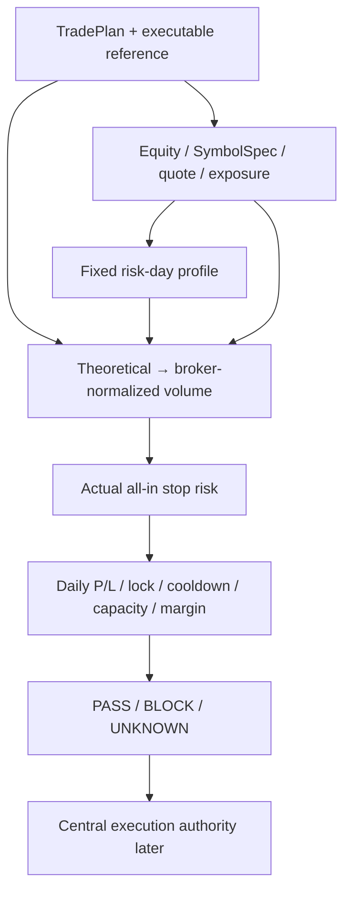

# GoldScalpTrader — Monetary Risk Contract

**Status:** APPROVED RISK POLICY — PRESERVED BANDS / IMPLEMENTATION AND BROKER PROOF PENDING
**Version:** 2.0-preserved-profile-risk
**Authority:** Account profiles, executable monetary risk, broker-aware volume, exposure/capacity, daily safety P/L, loss lock, manual reset, re-entry and cooldown.

## 1. Purpose and boundary

Risk answers one question:

> **Can this already-defined, economically acceptable structural TradePlan be executed by this account at a broker-valid size without violating preserved monetary policy?**

Risk does not:

- select strategy/direction;
- create an Opportunity;
- alter M5/M1 timing;
- edit structural SL to make volume fit;
- improve gross/net quality;
- block because of News/Fundamental context;
- call MT5 writer;
- turn unknown financial truth into zero/PASS.

```text
strong strategy ≠ affordable trade
valid TradePlan ≠ Risk PASS
Risk PASS ≠ final execution permission
```

## 2. Evaluation pipeline



## 3. Preserved account profiles — DO NOT CHANGE

Profile is resolved from positive `DayStartEquity` and stays fixed for that risk day.

```text
SMALL   positive DayStartEquity < $300
MEDIUM  $300–$999.99
NORMAL  >= $1,000
```

| Profile | Normal / target risk | Elevated tolerated band | New-entry hard ceiling | Daily loss lock |
|---|---:|---:|---:|---:|
| SMALL | 3.0%–4.5% | >4.5%–6.5% | **7%** | **12%** |
| MEDIUM | 2.0%–3.0% | >3.0%–4.5% | **5%** | **9%** |
| NORMAL | 1.0%–2.0% | >2.0%–3.5% | **4%** | **7%** |

These values are explicitly operator-preserved. Research may analyze alternatives, but production values do not change without a later explicit approval packet.

### Elevated does not mean target

Elevated risk can be tolerated when broker granularity/structural geometry makes the preferred band unavailable. It is never the sizing goal.

## 4. Aggressive small-account mode — preserved

```text
AGGRESSIVE_SMALL_ACCOUNT = DISABLED by default
eligibility baseline      = positive DayStartEquity < $1,000
8%                        = maximum single-trade monetary SL-risk ceiling — NOT TARGET
16%                       = maximum aggregate open risk
16%                       = daily loss ceiling
```

Rules:

- never auto-enable because equity is small;
- structural SL remains unchanged;
- min-lot actual risk still calculated;
- all broker/session/controller/capacity safety still applies;
- explicit mode/version visible in dashboard/evidence.

## 5. Broker-aware monetary risk

Use verified broker/account facts:

```text
entry side/price
structural stop
volume min/max/step
tick size/value
contract/currency conversion where applicable
spread already embedded in executable entry geometry
slippage reserve where not already represented
commission/fees where applicable
equity/free margin
```

Core question:

> For the actual executable volume, what realistic account-currency loss occurs if the approved stop is hit?

Do not double-count spread/slippage/fees.

## 6. Dynamic sizing

```text
resolve profile
→ select target risk within active policy band
→ calculate theoretical volume
→ normalize to broker min/step/max
→ recalculate actual risk for normalized volume
→ classify
→ verify ceiling / daily state / exposure / margin
→ PASS / BLOCK / UNKNOWN
```

Suggested classification:

```text
CONSERVATIVE
NORMAL
ELEVATED
EXCESSIVE
UNKNOWN
```

## 7. Minimum-lot rule

If theoretical volume is below broker minimum:

```text
evaluate actual broker minimum volume
→ calculate actual monetary stop risk
→ PASS if within active hard policy
→ BLOCK current TradePlan if unaffordable
```

Never:

```text
raw lot < 0.01
→ automatically reject small account
```

and never:

```text
0.01 too risky
→ tighten structural SL
```

## 8. Structural risk / original R separation

Keep distinct:

| Concept | Meaning |
|---|---|
| Original Approved Risk | monetary risk of approved initial geometry |
| Original R | immutable price-distance basis from actual entry/original stop |
| Current Open Risk | risk to current broker stop after modifications |
| Locked Profit | broker stop beyond entry where applicable |
| Account Safety P/L | whole-account risk-day state |
| Bot Performance P/L | bot-only strategy analytics |

Stop movement never rewrites historical original R.

## 9. Exposure and capacity

Initial capacity:

```text
one independently risk-bearing Gold position per account/symbol scope
```

This is not a daily trade quota.

While capacity is 1/1:

- strategy/shadow analysis continues;
- missed-opportunity research continues;
- Trade Manager continues;
- no second independent Gold exposure is opened.

Manual/foreign/unknown Gold exposure is not adopted. Unknown exposure is never zero.

## 10. Account Safety P/L

Risk-day safety uses actual account equity while removing identifiable non-trading cash flow:

```text
AccountSafetyPL
= CurrentVerifiedEquity
  - DayStartEquity
  - NetNonTradingCashFlowSinceDayStart
```

Account equity already includes realized/floating trading P/L and applicable charges. Do not add/subtract them again.

Deposits, withdrawals, credits/debits and other identifiable non-trading cash-flow items are separated through Broker Activity accounting.

## 11. Risk-day boundary

Current preserved baseline:

```text
00:00 UTC → next 00:00 UTC
```

Architecture may represent this boundary as typed/versioned policy rather than burying it as a magic constant, but the current behavior remains unchanged.

Changing configuration must never become a way to erase daily loss state mid-day.

## 12. Daily loss lock

At active profile daily-loss threshold:

```text
NORMAL
→ LOSS_LOCKED
```

Consequences:

- no new entry/re-entry;
- existing bot position remains governed by Trade Manager;
- daily lock alone does not force-close the trade;
- cumulative history remains visible;
- restart does not reset it.

## 13. Manual daily-loss reset

Feature preserved, **disabled by default**.

If explicitly enabled under a future/accepted config:

- only `LOSS_LOCKED` can be reset;
- at most one governed reset per UTC risk day;
- requires deliberate operator confirmation;
- new cycle reference uses current verified equity;
- cumulative loss/account history remains visible;
- reset count/state persists;
- reset cannot clear unrelated broker/data/execution/persistence problems.

## 14. Same-episode re-entry

Preserved baseline:

> One genuinely fresh same-episode re-entry may be allowed when all authorities pass.

Requirements include:

- previous entry lifecycle fully resolved;
- Opportunity re-arm has a genuinely fresh causal event;
- same episode not already exhausted by the allowed re-entry;
- current structure/timing/quality/Risk remains valid.

If the re-entry also loses, that episode locks.

## 15. Consecutive-loss cooldown

Preserved baseline:

```text
3 consecutive closed bot losses
→ minimum 30-minute global cooldown
```

Release requires more than elapsed time. The owner should require:

- minimum time elapsed;
- no unresolved execution/reconciliation fault;
- fresh healthy market context;
- fresh valid opportunity/episode;
- other hard authorities healthy.

A qualifying winning closed bot trade resets the consecutive-loss counter, but does not retroactively cancel an already-active minimum cooldown.

The 3-loss/30m policy is preserved now; research may later propose alternatives.

## 16. Abnormal execution/feed cooldown

Condition-based protective cooldown may be appropriate when an actual objective fault exists, for example:

- repeated execution rejection;
- severe abnormal slippage;
- stale/corrupt feed;
- unresolved broker lifecycle.

This is not a News cooldown. The cooldown belongs to the actual fault and releases only when the responsible condition normalizes.

## 17. Margin

Generic margin estimates are diagnostic only. Broker-native/MT5 margin/order-check truth is authoritative where available.

Unknown margin truth at a required stage becomes UNKNOWN/BLOCK as defined by owner; it is not guessed safe.

## 18. RiskEvaluation output

Recommended fields:

```text
profile
aggressive_mode
risk_decision / reason
target band
hard ceiling
daily lock threshold
proposed normalized volume
actual stop monetary risk
actual risk percent
friction/cost decomposition where relevant
margin result
DayStartEquity
AccountSafetyPL
cycle loss / remaining budget
loss streak
cooldown state
same-episode re-entry state
capacity
exposure ownership state
policy/config version
```

## 19. Dashboard

```text
RISK
Profile       SMALL
Target Band   3.0–4.5%
Hard Ceiling  7.0%
Actual        3.8% • 0.01 lot
Daily Lock    12.0%
Aggressive    DISABLED
Day P/L       -1.2%
Loss Streak   1
Cooldown      NONE
Re-entry      AVAILABLE / USED
Capacity      0/1
```

Unknown facts render UNKNOWN/—, never fake zero.

## 20. Persistence / recovery

Durable state includes at least:

- risk-day identity;
- DayStartEquity;
- fixed profile;
- aggressive-mode identity;
- non-trading cash-flow baseline/delta;
- daily lock/reset count/cycle reference;
- consecutive-loss streak;
- cooldown trigger/start/release context;
- same-episode re-entry usage;
- capacity/ownership references required for reconciliation.

Corrupt/incompatible state fails closed; restart never creates a fake fresh day.

## 21. Research

Research may evaluate:

- actual risk versus outcome;
- min-lot affordability;
- elevated-band usage;
- loss-streak/cooldown alternatives;
- same-episode re-entry alternatives;
- drawdown-aware sizing inside allowed policy;
- capacity/hold-time opportunity cost.

But current profile percentages/bands remain unchanged until explicit future approval.

## 22. Planned ownership

```text
risk/engine.py
    profiles / sizing / actual monetary risk / margin / capacity
risk/state.py
    risk-day / lock / reset / streak / cooldown / re-entry
risk/permissions.py
    typed Risk permission result
market_data/activity.py
    cash-flow + broker-activity inputs
persistence/runtime_state.py
    durable Risk state
```

## 23. Planned proof

Tests must cover:

- exact profile boundaries;
- fixed profile through risk day;
- all exact risk bands/ceilings;
- aggressive disabled by default and exact 8/16 semantics;
- min-lot affordability;
- no stop rewrite;
- cost double-count prevention;
- account cash-flow accounting;
- daily lock persistence;
- manual reset guard;
- one same-episode re-entry;
- 3-loss/30m cooldown/release;
- capacity/manual exposure;
- margin UNKNOWN;
- restart does not reset state.

## 24. Final invariant

> **Risk consumes a valid plan and answers affordability. It never improves the strategy, edits structural geometry or rewards confidence with larger risk. The preserved profile numbers stay exactly as approved, while unknown financial truth always remains unsafe for a new entry.**
