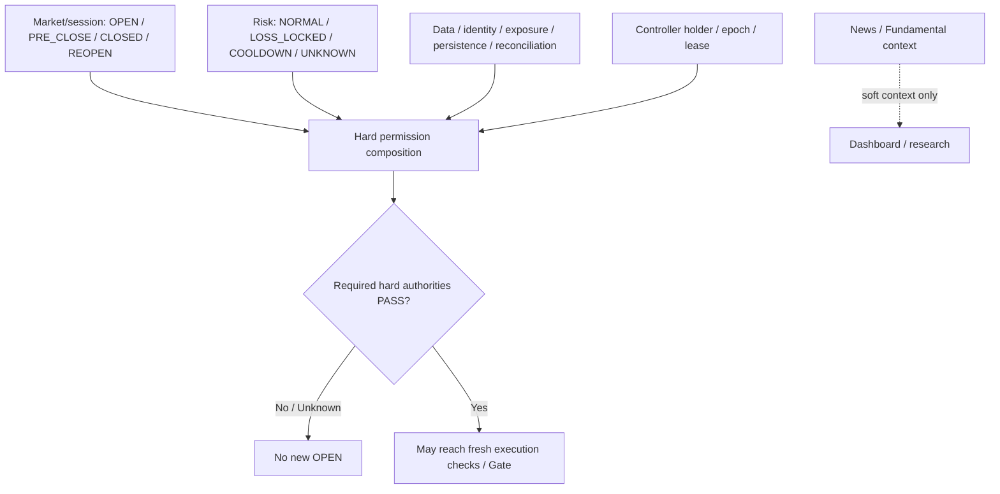
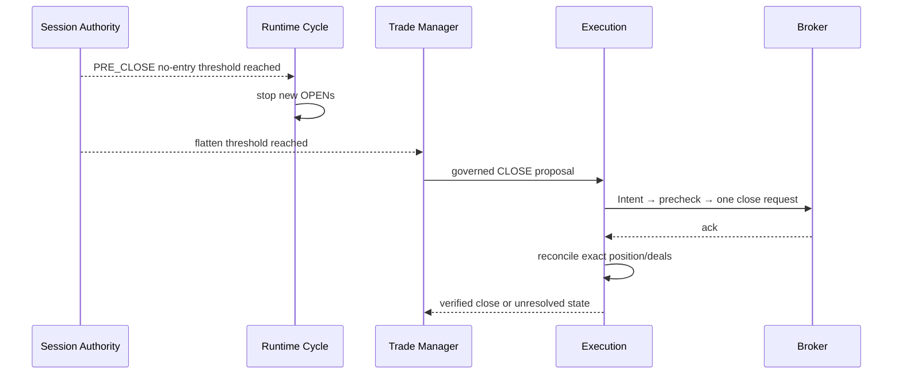

# GoldScalpTrader — Session, Risk and Hard-Permission State Machine

**Status:** APPROVED PERMISSION POLICY — NEWS REMOVED FROM HARD AUTHORITY
**Version:** 2.0-session-hard-news-soft
**Authority:** Hard market/session states, Risk/system/controller states, new-entry permission composition, PRE_CLOSE/reopen behavior and action-sensitive management during entry blocks.

## 1. Purpose

This document composes **hard authorities** for new broker exposure while keeping soft analytical context separate.

Current approved architecture:

```text
Hard Market/Session
+ Hard Risk
+ Data/Identity/Exposure/Persistence/Controller
+ Action-specific broker/execution checks
= hard permission
```

News/Fundamentals are **not** part of hard permission.

## 2. State topology



## 3. Hard market/session states

```text
OPEN
PRE_CLOSE
CLOSED
REOPEN_WARMUP
UNKNOWN
```

### OPEN

Broker schedule/symbol facts support new-entry consideration. This is not final permission; all Risk/system/execution authorities still apply.

### PRE_CLOSE

Preserved baseline:

```text
Daily:   T-20 no new entry / T-10 mandatory governed flatten
Weekend: T-60 no new entry / T-30 mandatory governed flatten
```

PRE_CLOSE blocks new entry while allowing/forcing appropriate management/close actions through the normal governed execution path.

### CLOSED

No new entry. Process/research/dashboard may remain alive. Any unresolved broker exposure/Intent remains explicit and reconciled later.

### REOPEN_WARMUP

Preserved baseline:

```text
Daily reopen   → at least 1 clean completed M5 + normalized execution conditions
Weekend reopen → at least 2 clean completed M5 + gap assessment + normalized execution conditions
```

### UNKNOWN

If required current broker schedule/session truth cannot be established, new entry fails closed. This UNKNOWN is a hard-market unknown and must not be confused with unavailable News context.

## 4. News is no longer a permission state

Historical states such as:

```text
NEWS_CLEAR
NEWS_BLACKOUT
NEWS_SAFETY_UNKNOWN
POST_NEWS_WARMUP
```

may remain as legacy/reference vocabulary but **do not participate in current GoldScalpTrader hard entry permission**.

Current behavior:

```text
known high-impact event
→ context/research tag
→ NO automatic block

News provider unavailable/stale
→ context health DEGRADED/UNKNOWN
→ NO automatic block

post-event period
→ NO mandatory News warmup/cooldown
```

If an event produces real spread/dislocation/drift/slippage/data problems, those actual conditions can block at their proper owners.

## 5. Risk states

```text
NORMAL
LOSS_LOCKED
COOLDOWN
UNKNOWN
```

### NORMAL

Risk stage may proceed if the actual proposal is affordable and all other facts pass.

### LOSS_LOCKED

No new entry/re-entry. Existing bot trade remains managed; daily lock does not itself force a close.

### COOLDOWN

Preserved baseline trigger:

```text
3 consecutive closed bot losses
→ at least 30 minutes + release conditions
```

No News event can trigger this cooldown.

### UNKNOWN

Unknown equity/profile/cash-flow/margin/capacity truth blocks new exposure.

## 6. System authority states

Relevant hard owners may publish:

```text
PASS
BLOCK
UNKNOWN
RECONCILING
```

Examples:

- required Market Data quality;
- account/server/symbol identity;
- exposure ownership/capacity;
- persistence integrity;
- unresolved Intent;
- ManagedTrade reconciliation;
- controller ownership;
- terminal/account/symbol trade permission.

## 7. Action sensitivity

New OPEN, MODIFY and CLOSE do not have identical safety meaning.

| Condition | OPEN | discretionary MODIFY | protective/required CLOSE |
|---|---|---|---|
| Market CLOSED | block | broker-dependent, normally cannot modify | attempt only if broker permits; otherwise reconcile |
| PRE_CLOSE | block | only if management/safety requires | flatten at policy threshold |
| Daily LOSS_LOCKED | block | allowed for safe management | allowed |
| Cooldown | block | allowed for management | allowed |
| Elevated spread | fixed+aware quality may block | action-sensitive | should not deliberately trap unwanted exposure merely due optional spread baseline |
| Unknown News | no effect by itself | no effect by itself | no effect by itself |
| Controller invalid | block write | block write | block write until authority/recovery resolved |
| Unresolved Intent | no conflicting write | reconcile first | reconcile first |

CLOSE remains governed—it is not an unguarded emergency bypass.

## 8. Permission composition

For a new entry:

```text
Market OPEN
AND Risk PASS/NORMAL
AND required DataQuality PASS
AND account/server/symbol identity PASS
AND exposure/capacity PASS
AND persistence/recovery PASS
AND controller PASS
AND no unresolved conflicting Intent
→ candidate may reach central Gate/fresh execution checks
```

News does not appear in this equation.

## 9. Upstream stop versus Gate

A cycle can stop before the central Gate:

```text
Timing MISSED
TradePlan INVALID/DEGRADED
Executable Quality poor
Risk BLOCK/UNKNOWN
```

Truthful presentation:

```text
upstream stop
→ Gate NOT EVALUATED
→ blocker = exact upstream owner

actual Gate BLOCK
→ Gate BLOCKED
→ blocker = Execution Gate / hard authority
```

Do not render every non-trade as “Gate blocked”.

## 10. PRE_CLOSE sequence



No local “assume flat” shortcut.

## 11. Reopen sequence

Daily:

```text
broker schedule supports reopen
→ fresh quote/data
→ spread/execution normalized
→ no unresolved gap/reconciliation
→ 1 clean completed M5
→ OPEN may be considered
```

Weekend adds:

```text
weekend gap assessment
→ 2 clean completed M5
```

Exact gap/normalization thresholds are calibration/external-proof items.

## 12. Holiday/special schedule

If current accepted broker/session evidence proves normal hours are altered, exact usable schedule truth is required.

A missing News calendar does **not** itself imply holiday/session uncertainty.

If actual broker schedule is unknown at a required time:

```text
Market = UNKNOWN
→ new entry blocked by market/session authority
```

## 13. Restart

On restart:

- refresh current broker market/session facts;
- restore Risk state from durable context;
- reconcile Intent/ManagedTrade/exposure;
- reacquire valid controller authority;
- do not reset cooldown/day state;
- do not require News provider success to become entry-capable.

## 14. Dashboard

```text
PERMISSIONS
Market          OPEN
PRE_CLOSE       no
Risk            NORMAL
Data            HEALTHY
Identity        PASS
Exposure        0/1 • PASS
Controller      PRIMARY • epoch 42
Reconciliation  CLEAR
News Context    provider unavailable • SOFT ONLY
Gate            not yet evaluated / ALLOW / BLOCKED as actual
```

## 15. Planned implementation owners

```text
risk/permissions.py
    market/Risk/system permission composition

app/session_news.py or successor
    provider observations; session facts may be separated further during implementation

execution/gate.py
    centralized final authority composition

execution/checks.py
    action-specific final broker/execution checks
```

A provider adapter may supply both schedule and News observations, but the **authority types remain separate**.

## 16. Planned tests

- Daily T-20/T-10 transitions;
- weekend T-60/T-30;
- daily/weekend reopen rules;
- schedule UNKNOWN fail closed;
- News event does not hard block;
- News unavailable does not hard block;
- no post-News warmup/cooldown;
- actual spread/dislocation can still block through proper owner;
- LOSS_LOCKED/cooldown entry behavior;
- management continues during entry blocks;
- action-sensitive CLOSE behavior;
- upstream blocker vs actual Gate presentation;
- restart persistence/controller/reconciliation.

## 17. External proof / calibration

External:

- current Exness XAU daily/weekend/DST/holiday schedule;
- actual reopen behavior;
- terminal/symbol trade modes.

Calibration:

- exact gap assessment;
- execution normalization;
- PRE_CLOSE timings if evidence later supports adjustment.

## 18. Final invariant

> **Hard permission is built only from objective market, monetary, identity, exposure, persistence, controller and broker facts. News can inform analysis and research, but it cannot become an undocumented trading kill switch or cooldown.**
