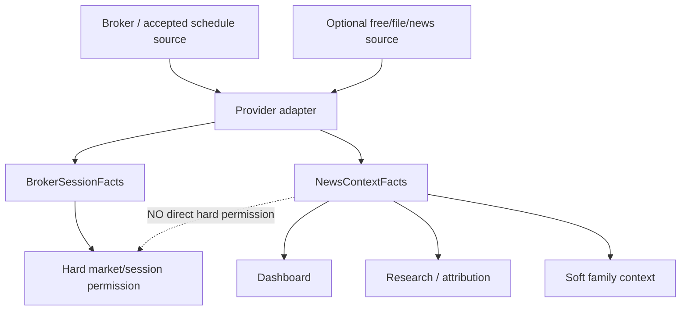

# GoldScalpTrader — Session / News Provider Contract

**Status:** APPROVED PROVIDER BOUNDARY — NEWS SOFT / SESSION HARD / IMPLEMENTATION PENDING
**Version:** 2.0-provider-separation
**Authority:** Acquisition/normalization/provenance for broker schedule facts and optional News/Fundamental context; cache freshness; provider failure semantics; explicit separation from final trading permission.

## 1. Purpose

Provider code may obtain two very different fact classes:

```text
A) broker/session schedule facts
B) News/Fundamental context
```

They may share transport/configuration infrastructure, but they **must not share authority semantics**.

Current approved rule:

```text
Session schedule UNKNOWN → may hard-block because broker tradeability is unknown
News context UNKNOWN     → soft context unavailable; does NOT hard-block
```

## 2. Ownership topology



## 3. Provider resolution

Implementation may support:

```text
explicit injected provider/test adapter
→ configured scoped file override
→ built-in Exness XAU schedule adapter
→ optional best-effort News/calendar source
```

No paid News provider is mandatory.

Exact provider order is an implementation detail as long as:

- operator override is explicit;
- scope is validated;
- failures are typed;
- session and News authority stay separate.

## 4. Session facts

`BrokerSessionFacts` may include:

```text
provider/source
scope: account/server/symbol
observed_at_utc
schedule_verified
tradeable
market_state
next_close_utc / close_kind
reopened_at_utc / reopen_kind
clean_completed_m5_since_reopen
weekend_gap_assessed
execution_normalized
unresolved_gap_or_reconciliation
special_schedule_context
```

Session state can be hard because it answers whether current broker operation is expected to be possible/safe.

## 5. News context facts

`NewsContextFacts` may include:

```text
provider/source
provider_health
fetched_at_utc
cache/source provenance
scheduled events[]
macro/event tags
coverage/freshness
```

News state is soft. Missing/stale/unavailable context must remain visible but does not hard-block new entry.

## 6. Provider health

Common typed states:

```text
VERIFIED
DEGRADED
STALE
UNAVAILABLE
UNKNOWN
```

Do not collapse provider health into “safe/unsafe to trade”.

Examples:

```text
Session VERIFIED OPEN + News UNAVAILABLE
→ hard session may PASS
→ dashboard shows News UNAVAILABLE
→ strategies may lack soft macro context
→ trade still governed by all non-News authorities

Session UNKNOWN + News VERIFIED
→ hard market/session UNKNOWN
→ no new entry
```

## 7. Context cache / LKG

A last-known-good News/context cache is useful for continuity but is not permission authority.

Preserved baseline context TTL:

```text
1800 seconds
```

Rules:

- original `fetched_at`/event timestamps never rewritten to fake freshness;
- refresh failure leaves the previous cache unchanged;
- cache provenance is visible;
- cache expiry means context `STALE`, not hard trading block;
- cache does not override actual broker schedule facts;
- no cache is required for a trade if other authorities pass.

## 8. Optional scoped file schema

A future implementation may use a schema-versioned atomic file such as:

```text
{
  schema_version,
  provider,
  scope: { account_login, server, symbol },
  session: { ... },
  news: {
      provider_health,
      fetched_at_utc,
      events: [...]
  }
}
```

Validation must cover:

- schema version;
- exact scope;
- bounded size;
- timezone-aware timestamps;
- future-clock corruption;
- data types;
- event IDs;
- provider identity without credentials.

A scope mismatch is rejected, not used opportunistically.

## 9. Atomic file publication

External/local producer protocol:

```text
acquire data
→ validate complete candidate snapshot
→ write same-directory temporary file
→ flush/close
→ atomic replace
```

On acquisition failure:

- leave prior valid file unchanged;
- do not rewrite timestamp;
- report provider health/failure;
- allow runtime to classify session vs News consequences separately.

## 10. Built-in Exness schedule adapter

If implemented, it must be narrowly scoped:

- accepted Exness server identity;
- resolved XAUUSD/XAUUSDm-like symbol scope;
- timezone/DST-safe schedule logic;
- Friday/weekend semantics;
- daily rollover semantics;
- daily/weekend reopen conditions;
- special schedule uncertainty explicit.

Reference schedule formulas are **not current broker certification**. Connected proof must verify current behavior before release.

## 11. News source contract

An optional public calendar adapter should:

- use HTTPS;
- use bounded timeout/response size;
- validate content type/schema;
- normalize UTC;
- deduplicate stable event IDs;
- expose event tier/category as context;
- mark stale/unavailable honestly;
- never hold GitHub/broker credentials;
- never create a hard News blackout in current policy.

If data fails:

```text
NewsContext = UNAVAILABLE/STALE/UNKNOWN
→ continue without macro context
```

## 12. Event normalization

Normalized event:

```text
provider_event_id
currency
title
scheduled_at_utc
impact/tier/category
provider
fetched_at_utc
mapping_version
```

Tier mapping is useful for research, not permission.

## 13. Session schedule failure

If hard session facts are genuinely unavailable/ambiguous:

```text
BrokerSessionFacts = UNKNOWN
→ new OPEN fails closed at session authority
```

Do not use News availability to fill the gap.

If normal schedule independently proves CLOSED:

```text
Market CLOSED + News UNKNOWN
→ hard block because Market CLOSED
```

## 14. News failure

```text
Market OPEN + News UNKNOWN
→ News remains visibly UNKNOWN
→ no hard News block
→ continue to strategy/quality/Risk/hard broker checks
```

This is an explicit approved design, not degraded safety.

## 15. No News blackout/warmup contract

Provider may still expose event countdown/elapsed time.

But provider output must not automatically produce:

```text
NEWS_BLACKOUT hard permission
POST_NEWS_WARMUP hard permission
News cooldown
```

If actual market shock occurs, Market Data/Executable Quality can detect:

- spread expansion;
- quote staleness;
- dislocation;
- drift/chase;
- slippage/latency deterioration.

## 16. Restart

On restart:

- refresh current hard session facts;
- load/revalidate cached News context if present;
- never treat old cached News as current;
- never require News fetch success to become READY;
- do not restore broker session OPEN from stale local cache when current session truth is required.

## 17. Dashboard

```text
SESSION / NEWS SOURCES
Market Source   Exness schedule adapter
Market State    OPEN • schedule verified
News Source     FILE / FREE / NONE
News Health     STALE
News Age        37m • SOFT CONTEXT ONLY
Next Event      CPI 08:30 UTC
```

## 18. Planned ownership

```text
app/session_news.py or split provider modules
intelligence/news.py
risk/permissions.py        # session permission only; News not hard
config/settings.py
operator/dashboard.py
```

## 19. Planned proof

Tests cover:

- provider resolution;
- scope mismatch;
- schema/type/timestamp validation;
- 1800-second context freshness labeling;
- no timestamp laundering;
- atomic previous-cache preservation;
- Session UNKNOWN hard behavior;
- News UNKNOWN soft behavior;
- News event tier no hard block;
- no News cooldown/warmup;
- known CLOSED remains CLOSED if News fails;
- public source failure does not create fake CLEAR;
- restart revalidation.

## 20. External proof

Before release:

- current Exness XAU schedule/DST/holiday behavior;
- intended account/server/symbol scope;
- any selected News source reliability if used;
- no paid News dependency required.

## 21. Final invariant

> **Provider transport may fail without deciding the trade. Session facts and News context can travel through similar infrastructure, but only actual broker/session truth is hard authority; News remains honest soft context even when unavailable.**
