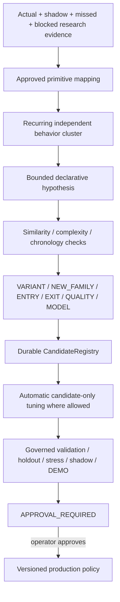

# GoldScalpTrader — Autonomous Strategy Invention

**Status:** APPROVED AUTONOMOUS RESEARCH CONTRACT — PROPOSAL/TUNING ACTIVE, PRODUCTION APPROVAL REQUIRED
**Version:** 2.0-bounded-autonomy-scalp
**Authority:** Automatic creation of declarative strategy hypotheses, parameter/timing/management/model candidates, durable invention liveness and hard boundaries against uncontrolled production mutation.

## 1. Purpose and hard boundary

Autonomous Strategy Invention converts recurring verified research evidence into bounded candidates that can be tested automatically.

> **Autonomy may invent hypotheses, tune candidates and build evidence. It may not invent broker permission or self-authorize production.**

This is an active backend capability, not a future placeholder.

Invention may automatically create:

- variants of the six preserved strategy families;
- M1 entry-timing policy candidates;
- quality/cost threshold candidates;
- management/exit candidates;
- session/regime conditioning variants;
- materially new family hypotheses;
- ML-assisted candidate policies/models.

It may not silently alter the current `ACTIVE_EXECUTION` production family, preserved Risk policy or broker-safety architecture.

## 2. Working pipeline



Healthy invention requires the whole evidence→candidate/suppression→registry path, not merely an importable class.

## 3. Evidence sources

Automatic invention may consume clearly separated episode classes:

```text
ACTUAL_ACTIVE_TRADE
SHADOW_COUNTERFACTUAL
MISSED_MEANINGFUL_MOVE
FALSE_ENTRY_CLUSTER
FALSE_BLOCK_CANDIDATE
PREMATURE_EXIT
WEAK_CAPTURE
HIGH_CAPTURE
TIME_EFFICIENCY_FAILURE
COST_REJECTED_OPPORTUNITY
CAPACITY_SUPPRESSED_OPPORTUNITY
REGIME_DETERIORATION
SYSTEM_OR_BROKER_FAULT
```

System/broker faults remain fault evidence. They cannot be relabelled as strategy failure merely to create a candidate.

## 4. Approved primitive registry

Candidates may use only audited typed primitives, expected to include categories such as:

```text
STRUCTURE_TREND
STRUCTURE_BREAK
MSS_SHIFT
CANDLE_REJECTION
DISPLACEMENT
COMPRESSION
TECHNICAL_LOCATION
TRENDLINE
FIBONACCI
VOLUME_PROFILE_POC
LIQUIDITY_SWEEP
FVG
ORDER_BLOCK
EMA_FLOW
RSI_MOMENTUM
ATR_VOLATILITY
SESSION_CONTEXT
NEWS_CONTEXT
TARGET_PATH
M5_SETUP
M1_ENTRY_TIMING
EXECUTABLE_COST
MANAGEMENT_EFFICIENCY
```

Exact enum names belong to implementation.

Unknown strings, `eval`, generated executable Python, MT5 calls, credential handling or hard-permission overrides are rejected.

## 5. Candidate format

Each candidate is typed and declarative. Minimum fields:

```text
candidate_id
version
candidate_type
parent_family if applicable
discovery trigger
falsifiable hypothesis
required primitives
optional/supportive primitives
opposing evidence rules
preferred regime/session
timing profile
invalidation model
target model
management model
parameter/model search space where applicable
evidence episode IDs
chronology/data identity
active/shadow baseline identity
fingerprint
similarity/complexity metadata
current stage
suppression/rejection reason
```

Candidate recipe is data, not arbitrary executable source.

## 6. Candidate types

```text
VARIANT
NEW_FAMILY
ENTRY_POLICY
EXIT_POLICY
QUALITY_POLICY
REGIME_POLICY
MODEL_ASSISTED_POLICY
```

### VARIANT

Small bounded change to an existing family/parameter set.

### NEW_FAMILY

Requires materially distinct causal market behavior not already represented by the six preserved families.

A trivial extra RSI/FVG/Fib/POC/Trendline condition is not enough.

### ENTRY_POLICY

M1 refinement, event-age, chase, drift or timing-profile change.

### EXIT_POLICY

Protection/trailing/time-efficiency/Runner/partial-management research change.

### QUALITY_POLICY

Gross/net quality, spread/SL, spread/target, cost/reward or latency/drift research candidate.

### REGIME_POLICY

Session/volatility/regime conditioning.

### MODEL_ASSISTED_POLICY

Versioned ML/statistical model whose role and feature schema remain bounded and auditable.

## 7. Strategy Isolation advantage

One-live-strategy-at-a-time creates a strong invention dataset:

```text
active family = actual production outcome
five shadow families = same-context counterfactual outcomes
```

Invention may detect patterns such as:

- shadow family repeatedly outperforming active family in a regime;
- active family finding too few opportunities;
- M1 timing systematically late;
- optional indicator improving one family but harming Opportunity Recall elsewhere;
- cost thresholds rejecting favorable moves unnecessarily;
- management holding too long and occupying the only position slot.

It may propose a candidate or active-family rotation, but production rotation still follows promotion governance.

## 8. Automatic candidate-only tuning

The operator approved active backend tuning.

Permitted tuning may search bounded candidate parameters such as:

- strategy qualification thresholds;
- evidence weights/correlation caps;
- M1 timing/freshness;
- M5 event age;
- chase/drift thresholds;
- gross/net quality thresholds;
- spread/SL and spread/target limits;
- cost/reward;
- protection/trailing/time-efficiency rules;
- session/regime modifiers;
- model hyperparameters/features within an approved schema.

Tuning must occur only in candidate/research state.

It may not mutate current production parameters in place.

## 9. Preserved hard exclusions

Invention/tuning cannot search away or weaken:

- account/server/symbol identity;
- completed-candle/no-lookahead chronology;
- preserved monetary Risk profile bands and ceilings;
- daily loss lock;
- one-shot Intent;
- no-blind-retry reconciliation;
- controller ownership/fencing;
- unknown exposure fail-safe behavior;
- original-R immutability;
- persistence integrity;
- financial-secret protection;
- final explicit operator production approval.

News hard blocking is not a protected safety parameter because the current approved architecture intentionally removed News from hard trading permission.

## 10. Complexity control

Prefer coherent causal behavior over filter soup.

A candidate with many conditions must earn stronger evidence.

Particularly:

```text
EMA + RSI + FVG + OB + Trendline + Fibonacci + POC + Session + News
```

is not automatically superior to a simpler strategy.

Evaluate complexity against:

- after-cost expectancy;
- Opportunity Recall;
- false blocks;
- throughput;
- drawdown;
- stability;
- ablation;
- out-of-sample evidence.

## 11. Independence and sample integrity

Candidate creation/tuning uses independent episode IDs.

Repeated copies of one episode cannot inflate evidence.

Where several labels come from one causal event, lineage/correlation control prevents fake confirmation counts.

Active and shadow episodes retain separate evidence class labels.

## 12. Liveness states

```text
IDLE
HEALTHY
DEGRADED
FAULTED
```

### IDLE

No eligible recurring evidence.

### HEALTHY

Every eligible cluster produced either:

- a durable candidate; or
- a durable explicit suppression/rejection reason.

### DEGRADED

Eligible work exists but cannot complete processing/persistence.

### FAULTED

Integrity/schema/state failure prevents trustworthy operation.

## 13. Candidate memory

Candidate fingerprints, rejected ideas and suppression reasons persist across restart/handoff.

A substantially similar rejected candidate cannot silently reappear unless:

- materially new independent evidence exists;
- semantics are genuinely different; or
- a versioned policy explicitly allows reconsideration.

This prevents endless rediscovery loops.

## 14. Advanced ML candidates

ML research may be used for:

- regime classification;
- candidate ranking;
- entry-efficiency estimation;
- cost/slippage/latency estimation;
- management-quality estimation;
- anomaly/fault detection;
- feature interaction research.

Requirements:

```text
causal feature construction
versioned feature schema
versioned model/data/code identity
train/validation/holdout separation
reproducible evaluation
uncertainty/coverage reporting where relevant
no hidden online production retraining
same promotion path as non-ML candidate
```

An ML model cannot directly acquire `MT5Writer` access.

## 15. Automatic progression

Invention may automatically hand candidates to governed stages and continue through evidence stages allowed by policy:

```text
candidate
→ replay
→ walk-forward
→ validation
→ semantic lock
→ one-shot holdout
→ stress
→ shadow
→ controlled DEMO candidate
→ APPROVAL_REQUIRED
```

At `APPROVAL_REQUIRED`, automation stops for live production promotion.

## 16. 120-trades/day benchmark

Invention should treat the benchmark as a diagnostic objective:

> Can qualified opportunity capture increase without destroying after-cost expectancy or safety?

Potential candidate triggers include:

- high false-block rate;
- strong missed moves after optional evidence rejection;
- frequent M1 timing misses;
- excessive hold-time slot occupancy;
- active-family opportunity scarcity versus shadow alternatives;
- overly conservative cost thresholds with positive counterfactual outcomes.

It must never lower standards simply to manufacture 120 trades.

## 17. Runtime boundary

Normal production runtime loads only the approved production policy.

Autonomous invention may run:

- offline;
- on copied immutable evidence;
- as a bounded background research service isolated from broker authority.

It must not perform uncontrolled heavy optimization in the critical broker cycle or mutate the live StateStore in a way that changes current production semantics.

## 18. Restart / backup

Persist:

- episode journal cursor;
- cluster identities;
- candidate registry;
- fingerprints;
- tuning runs/results;
- rejected/suppressed memory;
- promotion stage/evidence references;
- model/feature/data metadata.

Full checkpoint preserves recovery lineage. Focused research exports may be used for review but are not production authority.

## 19. Dashboard

```text
AUTONOMOUS R&D
Health             HEALTHY
Eligible Clusters  6
Candidates         4
Tuning Jobs        2
ML Research        ACTIVE
Latest             CAND-052 • QUALITY_POLICY
Stage              STRESS_PASSED
Suppressed         2 • explicit reasons
Production Change  NONE
Broker Authority   NONE
```

## 20. Planned implementation ownership

```text
research/episode_journal.py
research/discovery.py
research/invention.py
research/promotion.py
research/models.py
research/optimization.py or equivalent
research/evidence.py
persistence/store.py
```

## 21. Planned proof

Tests cover:

- automatic episode feed;
- active/shadow attribution;
- candidate type/classification;
- approved primitive validation;
- duplicate/similarity suppression;
- independent episode counting;
- candidate-only parameter tuning;
- production immutability during tuning;
- hard-safety exclusions;
- complexity limits/ablation hooks;
- ML schema/model/data identity;
- liveness states;
- restart candidate memory;
- automated progression stops at APPROVAL_REQUIRED;
- no MT5 writer or production self-promotion.

## 22. Calibration

Open research-governance variables:

- minimum independent sample counts;
- similarity thresholds;
- complexity limits;
- optimization budgets;
- compute scheduling;
- candidate retention/pruning;
- family-rotation evidence requirements;
- model classes/features worth testing.

## 23. Final invariant

> **Autonomous invention should continuously search for a better Gold scalper without becoming an uncontrolled live trader. It may create and tune hypotheses aggressively, but all candidates remain declarative, evidence-bound, safety-bounded and unable to reach production without explicit operator approval.**
