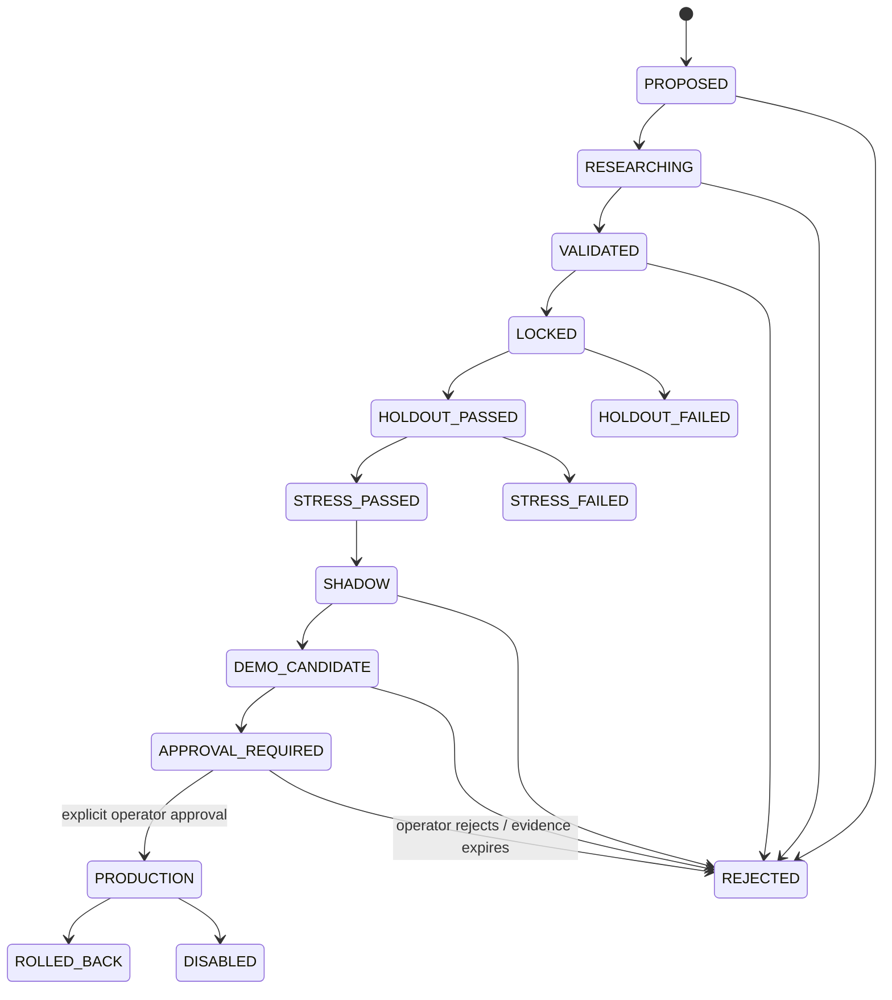

# GoldScalpTrader — Governed Experiments and Promotion

**Status:** APPROVED PROMOTION GOVERNANCE — AUTOMATED EVIDENCE STAGES / HUMAN PRODUCTION APPROVAL
**Version:** 2.0-auto-research-human-production-gate
**Authority:** Champion/challenger lifecycle, semantic locking, durable evidence-bound transitions, holdout, stress, shadow, DEMO candidate, approval, rollback and production change authority.

## 1. Purpose

GoldScalpTrader deliberately supports autonomous backend improvement.

A candidate may automatically:

- be proposed;
- be researched;
- be tuned before semantic lock;
- be validated;
- be locked;
- consume its one-shot holdout;
- undergo stress tests;
- run in shadow;
- enter controlled candidate DEMO where governance permits;
- reach `APPROVAL_REQUIRED`.

It may **not** silently become the live production policy.

> **Automation may build the evidence chain. Only the operator may authorize final production/live promotion.**

## 2. Promotion lifecycle



Automated progression is allowed only when the owning stage contract and evidence predicate pass. Knowing the next enum value is not evidence.

## 3. Champion and challenger

`CHAMPION` = currently approved production strategy/policy.

`CHALLENGER` = candidate improvement, such as:

- one of the existing six family parameter variants;
- new family hypothesis;
- M1 entry-policy variant;
- TradePlan/quality threshold variant;
- management/exit variant;
- session/context weighting variant;
- ML-assisted candidate;
- strategy-isolation rotation proposal.

Hard safety is not a challenger parameter.

Research cannot optimize away:

- preserved monetary Risk profile bands/ceilings;
- daily lock;
- account/symbol identity;
- chronology/no-lookahead;
- one-shot Intent;
- reconciliation/no-blind-retry;
- controller fencing;
- persistence integrity;
- secret protection.

Changing those requires a separate operator-approved architecture/policy process, not ordinary optimization.

## 4. Evidence-bound transitions

Every transition stores an evidence reference such as:

```text
evidence_id
evidence_sha256
candidate_id/version/fingerprint
from_stage / to_stage
code_revision
data_version
policy_version
active-family baseline identity
actor/process identity
reason
recorded_at_utc
```

Transition history is chronological, contiguous and durable across restart/checkpoint recovery.

A stage label alone is never proof.

## 5. Automatic actor vs operator actor

Transition actor is explicit:

```text
AUTO_RESEARCH
AUTO_VALIDATOR
AUTO_STRESS
AUTO_SHADOW
AUTO_DEMO_CANDIDATE
OPERATOR
REVIEWER
```

Automated actors may advance only through stages they are authorized to own.

`PRODUCTION` transition requires:

```text
actor = OPERATOR / explicitly governed operator approval path
operator_approved = true
complete evidence chain
known rollback target
current candidate fingerprint unchanged
```

AI/process-generated text cannot impersonate operator approval.

## 6. Semantic lock

Before final holdout, lock the candidate to a durable fingerprint covering relevant semantics:

- family/recipe;
- required/optional primitives;
- M5/M1 timing profile;
- thresholds/weights;
- invalidation/target model;
- management behavior;
- feature schema/model identity where ML involved;
- dataset handling/replay assumptions;
- code/policy version.

If any locked semantic field changes:

```text
old candidate remains immutable
→ new candidate/version created
→ evidence chain restarts as required
```

## 7. Final holdout

Final holdout is one-shot for a locked fingerprint.

It cannot be used repeatedly for tuning and still be called untouched.

A failed holdout:

- remains recorded;
- cannot be hidden/overwritten;
- ends that candidate's untouched-holdout claim;
- may lead to a new candidate/version using new future holdout data.

## 8. Stress and robustness

Stress should include relevant Scalp fragility tests:

- wider spread;
- slippage deterioration;
- execution latency/drift;
- parameter perturbation;
- session/regime slices;
- M1 freshness noise;
- missing optional confluence;
- lower trade-frequency/sample sensitivity;
- one-position capacity;
- management hold-time opportunity cost;
- data gaps;
- active/shadow family disagreement.

A candidate with positive Net R but extreme fragility may fail.

## 9. Shadow stage

Shadow has **zero broker authority**.

It consumes live/forward facts and records hypothetical:

- Opportunities;
- M1 entries;
- TradePlans;
- costs;
- management outcomes;
- family/session metrics;
- throughput;
- disagreement with Champion.

Shadow P/L is counterfactual, never broker P/L.

## 10. DEMO candidate stage

A candidate may automatically be scheduled for controlled DEMO testing only through a separately governed test harness/configuration that cannot alter the current production champion silently.

If it executes DEMO trades, it still uses normal:

```text
strategy isolation / candidate scope
→ M5 Opportunity + M1 timing
→ TradePlan
→ Executable Quality
→ preserved Risk
→ broker/session/system authorities
→ controller
→ Gate
→ one-shot Intent
→ MT5Writer
→ reconciliation
```

Candidate status never grants broker authority.

## 11. Strategy Isolation implications

The current production champion may specify which of the six families is `ACTIVE_EXECUTION`.

Research may compare:

- current active family actual outcomes;
- five shadow-family outcomes;
- candidate variant outcomes;
- proposed active-family rotations.

A new active-family policy is a production policy change and reaches `APPROVAL_REQUIRED` before live switch unless an already-approved future automatic rotation contract is explicitly created. Current architecture assumes operator approval for production switch.

## 12. Promotion evidence package

A complete candidate packet should include where relevant:

- falsifiable hypothesis;
- parent family/type;
- semantic fingerprint;
- data/replay identity;
- train/development/validation/holdout boundaries;
- active and shadow comparison;
- Net R / Avg R / Profit Factor / drawdown;
- Opportunity Recall / Capture Rate;
- actual trades/day/hour and 120/day benchmark gap;
- false blocks / missed opportunity cost;
- Entry/Capture/Exit Efficiency;
- spread/SL, spread/target, cost/reward;
- slippage/latency/drift;
- session/regime/event-context slices;
- complexity/ablation;
- stress results;
- shadow duration/results;
- candidate DEMO results;
- known limitations;
- rollback target.

A higher win rate that destroys opportunity recall or after-cost expectancy is not automatically an improvement.

## 13. Production promotion

`APPROVAL_REQUIRED` is deliberately not production permission.

Final approval should display at least:

```text
current Champion
proposed Challenger
exact semantic differences
risk/safety non-changes
all evidence stages
sample sizes
after-cost metrics
throughput effect
worst-case stress/drawdown
known limitations
rollback target
code/config versions
```

After operator approval, production deployment remains versioned/auditable and still uses ordinary execution safety.

## 14. Rollback / disable

A promoted policy has a known rollback target.

Rollback may occur because of:

- safety defect;
- software defect;
- evidence invalidation;
- performance degradation supported by documented review;
- operator decision.

One ordinary losing streak should not automatically trigger strategy churn unless an explicitly approved degradation monitor says the evidence is statistically/materially sufficient.

## 15. Persistence / recovery

Persist:

- candidate identity/fingerprint;
- current stage;
- every transition/evidence ref;
- holdout consumption;
- rejection/suppression reason;
- shadow/DEMO evidence identity;
- approval actor/time;
- rollback target/history;
- disable state.

A legacy/incomplete record may be inspectable but cannot be silently promoted with missing evidence.

## 16. Dashboard

```text
EXPERIMENT / PROMOTION
Champion          Breakout Retest v3
Challenger        CAND-042 • ENTRY_POLICY
Stage             APPROVAL_REQUIRED
Fingerprint       a1b2...
Holdout           PASSED • immutable
Stress            PASSED
Shadow            11,240 episodes
DEMO Candidate    412 trades
Net R             evidence-linked
Throughput Effect +18%
Broker Authority  NONE from registry
Approval          REQUIRED
Rollback          Champion v3
```

## 17. Planned implementation ownership

```text
research/promotion.py
research/discovery.py
research/invention.py
research/evidence.py
research/packages.py
persistence/store.py
```

## 18. Planned tests

- no stage skipping;
- every transition evidence-bound;
- auto actor permissions;
- transition chronology/restart persistence;
- semantic fingerprint immutability;
- one-shot holdout;
- failed holdout persistence;
- stress/shadow/DEMO order;
- zero raw broker authority in registry;
- candidate DEMO uses normal execution path;
- incomplete evidence cannot reach production;
- AI/self-approval denial;
- production transition requires explicit operator approval;
- rollback target required;
- old evidence remains attributable after rollback.

## 19. Final invariant

> **GoldScalpTrader may automate almost the entire research pipeline, but production authority remains intentionally human-gated. A candidate must earn evidence automatically and then stop at a transparent approval boundary with an exact rollback target.**
