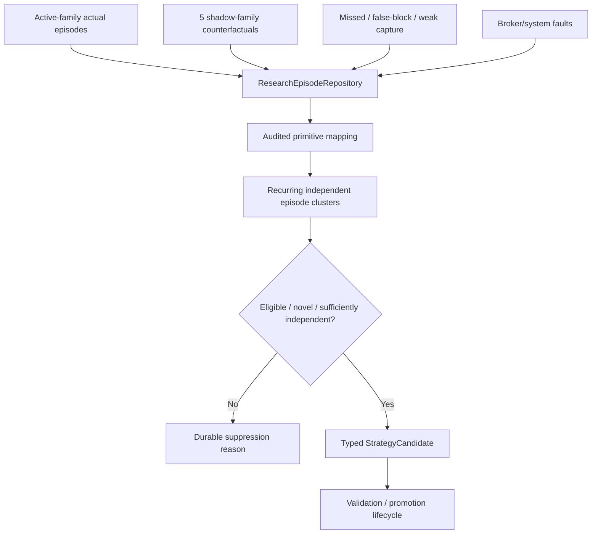

# GoldScalpTrader — Governed Strategy Discovery

**Status:** APPROVED CONTINUOUS DISCOVERY CONTRACT — DISCOVERY IS NOT PRODUCTION
**Version:** 2.0-active-backend-strategy-isolation
**Authority:** Parameter discovery, declarative strategy-recipe discovery, market-behaviour clustering, candidate comparison, active/shadow strategy evidence and durable discovery liveness.

## 1. Purpose

Discovery continuously searches for evidence-backed improvements while preserving production attribution and hard safety.

It may discover:

- better parameter combinations;
- better M1 timing policies;
- better management policies;
- variants of the six current families;
- materially new strategy-family hypotheses;
- better session/regime conditioning;
- useful ML-assisted candidate features.

It does not directly change production or write to the broker.

## 2. Discovery pipeline



Liveness rule:

```text
eligible evidence
→ durable candidate
OR
→ durable machine-readable suppression/rejection reason
```

If eligible evidence repeatedly disappears without either outcome, discovery is DEGRADED.

## 3. Episode attribution

Discovery inputs remain separated:

```text
ACTUAL_ACTIVE_TRADE
ACTIVE_OPPORTUNITY_NOT_TRADED
SHADOW_COUNTERFACTUAL
MISSED_MEANINGFUL_MOVE
FALSE_BLOCK_CANDIDATE
PREMATURE_EXIT / WEAK_CAPTURE
HARD_SAFE_BLOCK
SYSTEM_OR_BROKER_FAULT
```

A broker/system fault cannot be “learned” as a new trading strategy.

A hard-safe block may be studied for opportunity cost, but production safety is not ordinary strategy-search space.

## 4. Discovery levels

### Level A — parameter discovery

Researchable examples:

- family qualification thresholds;
- within-family evidence weights;
- M1 pattern/freshness thresholds;
- M5 event age/chase/drift;
- minimum gross/net quality;
- spread/SL and spread/target thresholds;
- cost/reward;
- time-efficiency/protection/trailing/Runner rules;
- session/regime conditioning.

Preserved monetary Risk bands/ceilings are **not ordinary automatic search parameters**.

### Level B — strategy recipe discovery

Combines approved primitives into a typed hypothesis:

```text
required behavior
optional support/opposition
preferred regime/session
timing profile
invalidation model
target model
management profile
```

### Level C — market-behaviour discovery

Looks for repeated behaviors not adequately represented by current six families.

A genuine `NEW_FAMILY` requires materially distinct causal behavior, not merely one extra RSI/FVG/Fib filter.

### Level D — model-assisted discovery

ML/statistical methods may rank clusters/features/candidates but cannot generate hidden broker authority or untraceable executable code.

## 5. Approved primitive vocabulary

Initial/expected audited primitive categories include:

```text
STRUCTURE_TREND
STRUCTURE_BREAK
MSS_SHIFT
CANDLE_REJECTION
DISPLACEMENT
COMPRESSION
TECHNICAL_LOCATION
TRENDLINE
FIBONACCI
VOLUME_PROFILE_POC
LIQUIDITY_SWEEP
FVG
ORDER_BLOCK
EMA_FLOW
RSI_MOMENTUM
ATR_VOLATILITY
SESSION_CONTEXT
NEWS_CONTEXT
TARGET_PATH
M5_SETUP
M1_ENTRY_TIMING
EXECUTABLE_COST
MANAGEMENT_EFFICIENCY
```

Exact enum names are implementation details, but arbitrary strings/code/safety overrides are rejected.

News is a research context primitive, not hard permission.

## 6. Candidate types

```text
VARIANT
NEW_FAMILY
ENTRY_POLICY
EXIT_POLICY
QUALITY_POLICY
REGIME_POLICY
MODEL_ASSISTED_POLICY
```

Every candidate retains:

- stable ID/version;
- parent family where applicable;
- trigger/hypothesis;
- required/optional primitives;
- timing/invalidation/target/management model;
- evidence episode IDs;
- active/shadow baseline identity;
- complexity/similarity;
- fingerprint;
- stage;
- suppression/rejection reason.

## 7. Strategy Isolation advantage

Because only one family produces actual live trades at a time, discovery receives clean comparative evidence:

```text
actual active-family outcome
vs
same-time shadow-family hypotheses
```

This helps answer:

- should a shadow family become active next?
- does active family miss too many valid moves?
- which family produces better after-cost expectancy?
- which family has better M1 entry efficiency?
- which family works by session/regime?
- which family causes long slot occupancy?

Family rotation proposals enter the normal candidate/promotion path.

## 8. Similarity and durable memory

Candidate fingerprints prevent duplicate reinvention.

A similar rejected candidate should not reappear every restart unless:

- materially new independent evidence exists;
- its semantics genuinely differ;
- discovery policy/version explicitly justifies reconsideration.

Persist rejected/suppressed memory.

## 9. Complexity control / anti-filter-soup

A candidate that requires every available clue is presumed fragile until evidence proves otherwise.

Especially:

- EMA;
- RSI;
- FVG;
- OB;
- Trendline;
- Fibonacci;
- POC;
- session context;
- News context

may be useful primitives, but more conditions are not automatically better.

Research must compare:

```text
Net expectancy
Opportunity Recall
false blocks
throughput
entry/capture efficiency
complexity
out-of-sample stability
```

## 10. 120/day benchmark in discovery

Discovery should investigate throughput loss without forcing trades.

Useful triggers:

```text
high-quality missed clusters
M1 timing misses
repeated cost rejects that later move favorably
long slot-occupancy suppressions
family/session opportunity scarcity
over-restrictive optional evidence
```

A candidate that increases trade count but destroys after-cost expectancy fails.

## 11. Hard exclusions

Discovery cannot optimize away:

- account/server/symbol identity;
- no-lookahead/chronology;
- preserved Risk ceilings/daily lock;
- one-shot Intent;
- reconciliation/no blind retry;
- controller ownership/fencing;
- unknown exposure fail-safe;
- original-R immutability;
- persistence/secret safety;
- explicit final operator production approval.

## 12. Automated research progression

Discovery may automatically create candidates and hand them to promotion governance.

It may also schedule/recommend:

- replay;
- walk-forward;
- ablation;
- stress;
- shadow;
- controlled candidate DEMO.

It cannot skip evidence stages or self-authorize production.

## 13. Liveness / health

```text
IDLE       no eligible recurring evidence
HEALTHY    every eligible cluster produced candidate or explicit suppression
DEGRADED   eligible work cannot be processed/persisted correctly
FAULTED    integrity/schema/evidence failure requiring intervention
```

Import success alone is not HEALTHY.

## 14. Persistence / restart

Restore:

- episode journal;
- cluster identities;
- candidate registry;
- fingerprints/similarity;
- suppression/rejection memory;
- discovery cursor/status;
- evidence lineage;
- promotion stage.

Loss of memory is a degraded/fault condition, not a reason to re-invent from scratch silently.

## 15. Operator/dashboard

```text
DISCOVERY
Health             HEALTHY
Active Family      Breakout Retest
Actual Episodes    418
Shadow Episodes    2,090
Eligible Clusters  7
Candidates         4
Latest             CAND-044 • ENTRY_POLICY • SHADOW
Suppressed         3 • explicit reasons
Broker Authority   NONE
```

## 16. Planned implementation ownership

```text
research/episode_journal.py
research/discovery.py
research/invention.py
research/promotion.py
research/metrics.py
```

## 17. Planned proof

Tests cover:

- automatic episode feed;
- active/shadow attribution;
- independent source IDs;
- primitive validation;
- candidate type/classification;
- similarity/duplicate suppression;
- rejection memory across restart;
- hard-safety exclusion;
- optional confluence not universalized;
- 120/day throughput metrics;
- liveness health;
- automated handoff to promotion;
- no MT5 writer/production mutation.

## 18. Calibration

Open research policy:

- minimum independent episode counts;
- cluster similarity;
- complexity limits;
- scheduling/CPU budgets;
- family-rotation evidence requirements;
- ML clustering/ranking methods;
- candidate retention/pruning.

## 19. Final invariant

> **Discovery should be curious, persistent and automatic, but not reckless. It may search broadly for better Scalp behavior while preserving causal evidence, clean active/shadow attribution and hard safety; every promising discovery still has to earn production through governed evidence and operator approval.**
