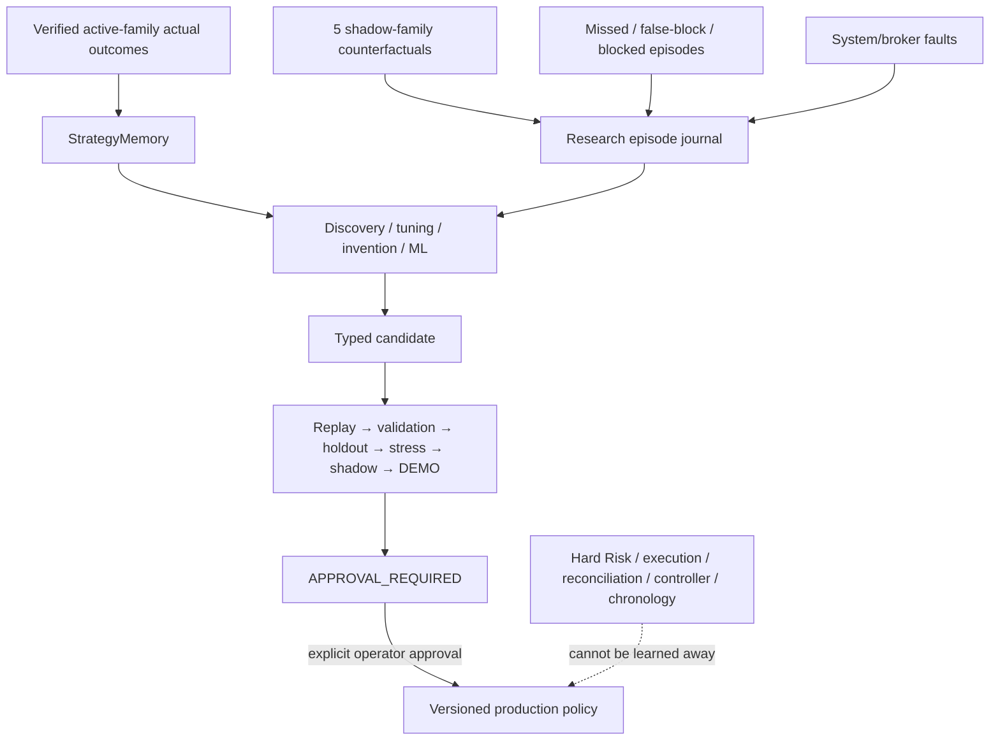
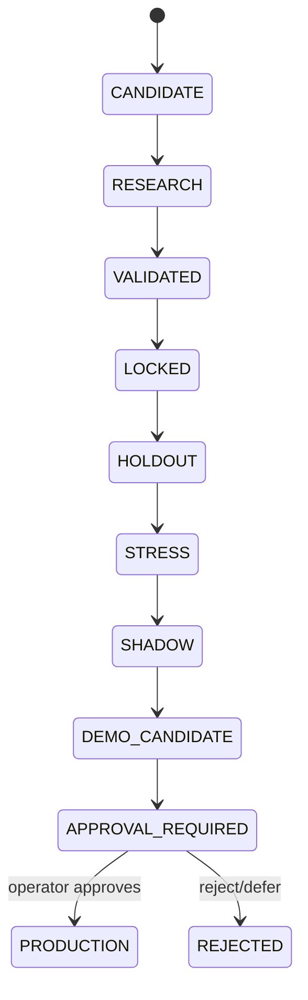

# GoldScalpTrader — Learning and AI Boundaries

**Status:** APPROVED CONTINUOUS-LEARNING CONTRACT — DOCUMENTATION RECONSTRUCTION / IMPLEMENTATION PROOF PENDING
**Version:** 2.0-active-backend-approval-gated-production
**Authority:** StrategyMemory, actual/shadow/missed/blocked evidence, bounded adaptive research, autonomous invention/ML boundaries, production-policy immutability and approval-gated promotion.

## 1. Purpose

GoldScalpTrader is designed to learn continuously without becoming an unstable self-modifying broker client.

> **Learning may observe, remember, compare, invent, tune, train and test automatically. Production/live behavior may change only through governed evidence and explicit operator approval.**

This distinction is central:

```text
backend autonomy = ACTIVE
production self-mutation = FORBIDDEN
```

## 2. One-way authority model



No learning, AI, ML or research object may call `MT5Writer`, grant controller authority, turn UNKNOWN into PASS or bypass Risk/execution safety.

## 3. Evidence classes

Evidence classes are never silently merged:

| Class | Meaning | Broker P/L? |
|---|---|---:|
| ACTUAL_ACTIVE | verified trade from current `ACTIVE_EXECUTION` family | yes |
| SHADOW_COUNTERFACTUAL | what a `SHADOW_ONLY` family would have done | no |
| MISSED_OPPORTUNITY | valid/meaningful move not traded | no |
| UPSTREAM_REJECTED | strategy/timing/quality/Risk stopped | no |
| HARD_BLOCKED | objective broker/account/session/lifecycle block | no |
| SYSTEM_FAULT | data/execution/persistence/controller failure | no |
| EXTERNAL_MANUAL | manual/foreign activity | not bot performance |

A manual close of an already-known ManagedTrade remains an actual bot trade outcome with close origin labelled EXTERNAL/MIXED; an unknown manual position is never adopted.

## 4. Strategy Isolation and learning

Strategy Isolation creates unusually clean research evidence:

```text
1 active family → real production outcome
5 shadow families → same-time counterfactual comparisons
```

Every relevant episode records:

- active family + policy version;
- shadow family reports;
- M5 setup/event IDs;
- M1 timing state;
- TradePlan geometry;
- executable-cost facts;
- Risk and blocker facts;
- actual/shadow outcomes;
- session/News soft context;
- code/data/config identity.

Old evidence is never relabelled after the active family changes.

## 5. StrategyMemory

StrategyMemory stores deterministic, durable observations and summaries.

Baseline namespace concept:

```text
strategy_learning_memory
```

Each observation has a stable `source_id` and complete evidence identity.

Rules:

- same source + identical evidence = idempotent;
- same source + different evidence = integrity conflict;
- summaries recompute/verify from raw observations;
- policy/config/code/environment identity is stored;
- changing the current policy never rewrites historical observations;
- small samples cannot become strong evidence merely due attractive win rate.

## 6. Actual entry learning

Entry learning should study:

- Approved Entry Reference vs actual fill;
- M5 Opportunity age;
- M1 refinement pattern/freshness;
- early/efficient/late/chased classification;
- Approved Entry→Executable Price drift;
- spread/SL;
- spread/target;
- cost/reward;
- expected vs actual slippage;
- decision→send latency;
- MFE/MAE after entry;
- same-episode re-entry outcomes;
- session/regime/family context.

Recurring evidence may create an Entry Policy candidate. It cannot directly rewrite live thresholds.

## 7. Exit / management learning

Study:

- realized R;
- MFE/MAE;
- Capture Efficiency;
- Exit Efficiency;
- premature exit cost;
- profit giveback;
- time-to-MFE / time-to-target;
- time-efficiency EXIT quality;
- protection/trailing timing;
- Runner outcomes;
- partial-close outcomes where applicable;
- slot-occupancy opportunity cost;
- PRE_CLOSE behavior.

A profitable trade can still reveal poor management. A normal losing trade can still be a valid setup.

## 8. Opportunity-recall learning

Because the product is not meant to become overrestrictive, research must measure what **did not trade**.

Required dimensions include:

```text
Qualified Opportunity Recall
Opportunity Capture Rate
False Block Rate
Missed Opportunity Cost
capacity_suppressed_opportunities
timing_missed_opportunities
cost_rejected_opportunities
Risk/cooldown blocks
broker/session hard blocks
system-fault episodes
```

The operator-approved ~120 trades/day figure is a throughput benchmark, not a target that can weaken standards.

## 9. News/Fundamental learning

News is soft context only.

Research may study:

- event tier/category;
- spread/slippage/latency around events;
- family-specific event performance;
- M1 timing quality around events;
- false-break/expansion behavior;
- capture efficiency.

Research may later propose evidence-backed changes, but the current live system does not have a News hard block/cooldown/warmup.

## 10. AI supervisor boundary

AI may:

- explain stored decisions/outcomes;
- identify recurring evidence clusters;
- propose declarative strategies;
- tune candidate parameters;
- train/test ML candidates;
- compare active/shadow families;
- draft research recommendations;
- automatically advance candidates through allowed evidence stages.

AI may not:

- call raw MT5/broker writer;
- change live Risk bands/ceilings;
- silently change active strategy family;
- silently change production thresholds;
- turn UNKNOWN into PASS;
- hide failed experiments/holdout results;
- execute arbitrary generated production code;
- self-approve production promotion.

## 11. Advanced ML boundary

Advanced ML is an **active backend research capability**.

Permitted roles may include:

- candidate ranking;
- regime classification;
- timing-quality estimation;
- cost/slippage/latency modelling;
- opportunity-quality research;
- management-policy research;
- anomaly/fault detection.

Requirements:

- causal features only;
- explicit train/validation/holdout boundaries;
- versioned feature schema/model/data identity;
- no hidden online production mutation;
- interpretable reason/uncertainty where used in decision support;
- deterministic/reproducible evaluation where possible;
- production activation only after the same governed promotion path.

## 12. Bounded adaptive production influence

A future approved production policy may contain a bounded adaptive adjustment derived from validated memory, but it must be:

- versioned;
- capped;
- evidence-minimum gated;
- reversible;
- observable;
- disabled safely when evidence unavailable.

It cannot create permanent universal hard filters from short-term underperformance.

## 13. Promotion handoff



Automatic backend work may progress to `APPROVAL_REQUIRED`. It stops there until explicit operator approval.

## 14. Hard-safety non-search space

Research/AI does not optimize away:

- account/server/symbol identity;
- completed-candle/no-lookahead rules;
- preserved monetary Risk bands/ceilings;
- daily loss lock;
- one-shot Intent;
- no blind retry;
- reconciliation;
- controller/fencing;
- unknown exposure fail-safe;
- original-R immutability;
- persistence integrity;
- secret protection.

News hard-block logic is absent because current approved architecture removed it—not because AI learned it away.

## 15. Environment isolation

Do not silently combine:

```text
REPLAY
DEVELOPMENT
VALIDATION
FINAL_HOLDOUT
SHADOW
DEMO_CANDIDATE
MAIN_DEMO / PRODUCTION
```

Environment is part of evidence identity. So are active-family policy, code revision, data version and chronology assumptions.

## 16. Persistence / backup

Durable research namespaces include at least:

```text
strategy_learning_memory
closed_trade_learning_queue
managed_trade_closure_receipt
research_episode_journal
strategy_candidate_registry
discovery_cycle_status
candidate_promotion_registry
model/feature metadata where implemented
```

Full runtime checkpoint preserves the canonical durable state. Focused learning/research packages may be derived for review, but they do not replace full machine-recovery authority.

## 17. Multi-machine boundary

Current architecture:

```text
one active production writer per account/symbol scope
```

Different independent accounts/scopes may run independently. Same-scope active-active/distributed production is deferred.

Research may run on separate copied datasets/databases, but it must not mutate the live production StateStore concurrently.

## 18. Dashboard

```text
LEARNING / AI
Actual Learning      ACTIVE / PENDING / DEGRADED
Active Family        Breakout Retest v3
Shadow Families      5 collecting counterfactuals
Discovery            HEALTHY • 3 candidates
ML Research          RUNNING / IDLE
Best Challenger      CAND-... • SHADOW
Promotion            APPROVAL_REQUIRED
Broker Authority     NONE for research
```

A candidate recommendation must never be displayed as already-live policy.

## 19. Planned source ownership

```text
research/learning.py
research/live_learning.py
research/episode_journal.py
research/discovery.py
research/invention.py
research/promotion.py
research/models.py or equivalent ML boundary
management/store.py
persistence/store.py
persistence/checkpoint.py
```

## 20. Planned proof

Tests cover:

- actual/shadow/missed/blocked/fault separation;
- idempotent/conflicting StrategyMemory sources;
- active-family attribution;
- M1/cost/latency learning fields;
- no counterfactual broker P/L;
- AI/research has no MT5 writer authority;
- preserved Risk cannot be tuned live;
- candidate parameter changes stay candidate-only;
- advanced ML evidence identity;
- automated progression stops at APPROVAL_REQUIRED;
- restart/backup preserves research state;
- same-scope production research writer uniqueness.

## 21. Final invariant

> **GoldScalpTrader should learn aggressively in the lab and conservatively in production. Backend intelligence may explore continuously; live money remains governed by fixed approved policy until evidence is complete and the operator explicitly approves the change.**
