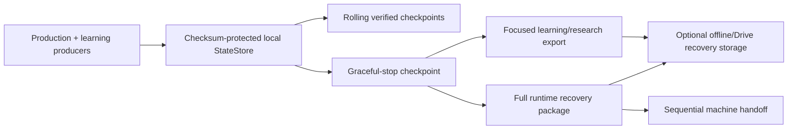
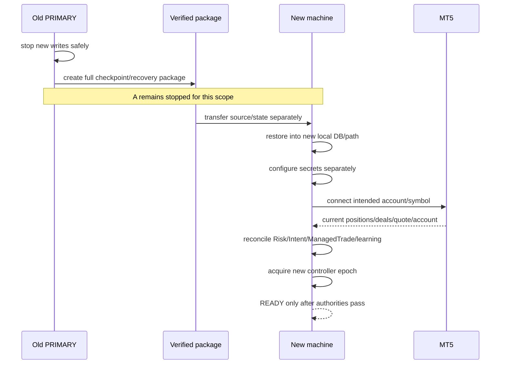
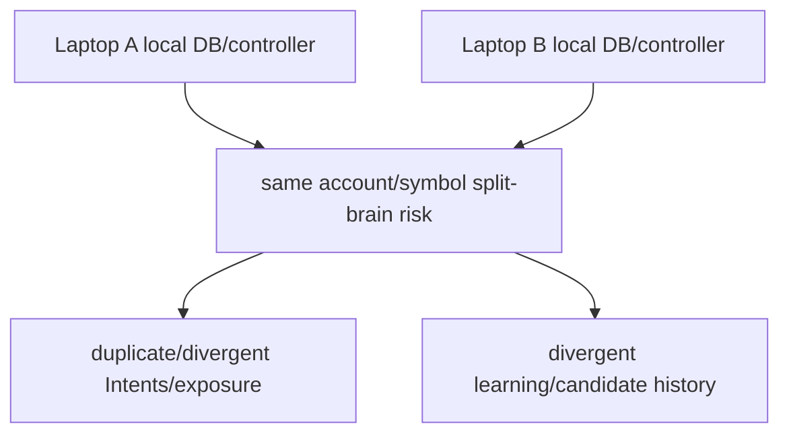

# GoldScalpTrader — Learning Backup and Multi-Machine Contract

**Status:** APPROVED LOCAL-FIRST DURABILITY CONTRACT — SAME-SCOPE SINGLE-PRIMARY
**Version:** 2.0-sequential-handoff-research-safe
**Authority:** Full-state backup, learning/research lineage, graceful shutdown checkpoints, focused learning exports, same-scope machine safety and cross-machine recovery boundaries.

Canonical recovery architecture: [`../BACKUP_SYNC_AND_RECOVERY_ARCHITECTURE.md`](../BACKUP_SYNC_AND_RECOVERY_ARCHITECTURE.md).

## 1. Purpose

GoldScalpTrader must preserve production and learning state across restart and laptop replacement without creating two independent authorities for the same broker scope.

> **One production PRIMARY writer per account/symbol scope. Different independent scopes may run independently. Same-scope laptop handoff is sequential.**

Distributed active-active coordination is explicitly deferred.

## 2. Durability layers



No backup grants broker permission by itself.

## 3. Full checkpoint content

The full checkpoint preserves all canonical StateStore records/events including, when present:

- risk-day/profile/aggressive mode;
- cash-flow/daily lock/reset/streak/cooldown/re-entry state;
- active strategy family/policy/evaluation window;
- Opportunity / TradePlan / timing lifecycle;
- ExecutionIntent lifecycle;
- ManagedTrade;
- learning queue and closure receipt;
- StrategyMemory;
- research episode journal;
- active/shadow family evidence lineage;
- candidate/discovery/invention state;
- ML feature/model metadata required for research reproducibility;
- promotion/holdout/rollback/disable state;
- controller/fencing metadata needed for recovery interpretation;
- every other authoritative local namespace.

Full recovery never rebuilds from a hand-picked subset when the canonical StateStore can be exported consistently.

## 4. Credential boundary

Never include authority-bearing credentials:

```text
broker passwords/tokens
GitHub tokens
private keys
API/client secrets
refresh/auth tokens
recovery keys
```

Secrets are provisioned separately on the recovery machine.

Non-secret account/symbol/policy identity may be required for correct scope/reconciliation and should not be removed merely for convenience, subject to the project's publication/privacy policy.

## 5. Graceful shutdown

At safe stop:

```text
stop new entry scheduling
→ preserve current lifecycle obligations
→ flush transactional state
→ create/verify local checkpoint
→ create requested full/focused recovery artifacts
→ secret-scan artifacts
→ release controller
→ release MT5 resources
```

No Git command occurs in runtime shutdown.

A prior execution/runtime failure remains authoritative; backup success does not clear it.

Abrupt power/task kill cannot guarantee a final shutdown package. SQLite durability + rolling checkpoints remain the crash boundary.

## 6. Focused learning/research export

A focused export may contain audited learning namespaces for analysis/review:

```text
StrategyMemory
pending learning queue
research episodes
active/shadow comparison records
candidate/discovery/invention state
promotion evidence
ML metadata/results where selected
```

It is **not** complete machine recovery authority unless it is explicitly the full checkpoint/package.

Do not merge focused exports back into live production state by “newest wins”.

## 7. Production learning ownership

```text
Account A / XAUUSDm → one production learning writer
Account B / XAUUSDm → may have its own independent production writer
same Account A / same scope on second laptop → NOT concurrent
```

Idempotent source IDs protect duplicate evidence; they do not make two divergent SQLite histories mergeable.

Blind union, last-write-wins and newest-file-wins are prohibited same-scope merge strategies.

## 8. Research machine separation

Offline/research work may run on another machine using copied immutable datasets/checkpoints.

It may:

- replay;
- tune candidates;
- train ML models;
- invent candidates;
- generate evidence packages.

It may not mutate the active production StateStore or controller lease.

Research outputs return as **candidate/evidence packages**, not raw merged production databases.

## 9. Sequential same-scope handoff



If the old machine cannot be positively known to be stopped, takeover remains blocked until the incident is safely resolved.

## 10. Why active-active is deferred

Two laptops with independent local state can each believe they are PRIMARY:



True active-active would require shared atomic fencing and globally ordered durable lifecycle/learning state. Distributed DB/fencing infrastructure is operator-approved **DEFERRED**.

## 11. Backend candidate/ML recovery

A restored research package must preserve:

- Candidate ID/version/fingerprint;
- evidence-source IDs;
- current stage;
- holdout consumption;
- stress/shadow/DEMO evidence references;
- rejection/suppression memory;
- model/feature/data versions;
- rollback target;
- `APPROVAL_REQUIRED` state.

Recovery cannot turn a candidate into production or reset a consumed final holdout.

## 12. Active-family production policy recovery

Full recovery preserves the exact production active-family policy/version.

Do not:

- default to Family 1 when policy state is corrupt;
- rotate active family during restore;
- relabel old actual trades;
- merge shadow results into actual StrategyMemory.

Unknown/corrupt active-family authority blocks new production entry until repaired through governed configuration/recovery.

## 13. Local source/history backup relationship

Source backup is separate from runtime state:

```text
coherent Git commit
→ GitHub source/history remote
→ operator git pull --ff-only
→ optional clean source ZIP/off-site copy
```

Runtime backup contains state. A source ZIP does not contain broker authority or current lifecycle truth.

## 14. Optional Drive/off-site storage

Off-site recovery may store immutable verified artifacts, but:

- do not run the bot from the synced recovery folder;
- do not sync the active SQLite/WAL family;
- verify hashes/manifests;
- retain previous verified package until new package is complete;
- no cloud availability is required for safe runtime shutdown.

## 15. Failure matrix

| Failure | Required behavior |
|---|---|
| StateStore corrupt | reject/restore verified copy to new path; no invented clean state |
| checkpoint unavailable | no guessed restoration |
| secret detected in export | fail artifact publication |
| pending learning exists | preserve it; never drop to simplify handoff |
| candidate registry missing/corrupt | research DEGRADED; no promotion |
| old machine still potentially active same scope | new PRIMARY blocked |
| two divergent same-scope DBs | do not auto-merge |
| independent account/scope on another laptop | allowed with isolated state/authority |
| off-site storage unavailable | runtime/local checkpoint remains independent |

## 16. Planned implementation ownership

```text
persistence/store.py
persistence/checkpoint.py
persistence/backup.py
persistence/local_recovery_package.py
research/learning.py
research/episode_journal.py
research/discovery.py
research/promotion.py
management/store.py
execution/controller.py
```

## 17. Planned proof

Tests/drills cover:

- full checkpoint completeness;
- focused learning export classification;
- pending queue/receipt preservation;
- active family policy restoration;
- candidate/holdout/promotion restoration;
- secret scanning;
- corrupt artifact rejection;
- same-scope second-primary denial;
- different-scope independence;
- restore into new path;
- fresh MT5 reconciliation;
- sequential handoff;
- no Git/cloud dependency in runtime shutdown.

## 18. Final invariant

> **Learning is valuable state, but broker safety outranks convenience. Preserve complete production/research lineage, keep research machines isolated from live authority, and move the same broker scope between laptops only through a stopped, verified, reconciled sequential handoff.**
