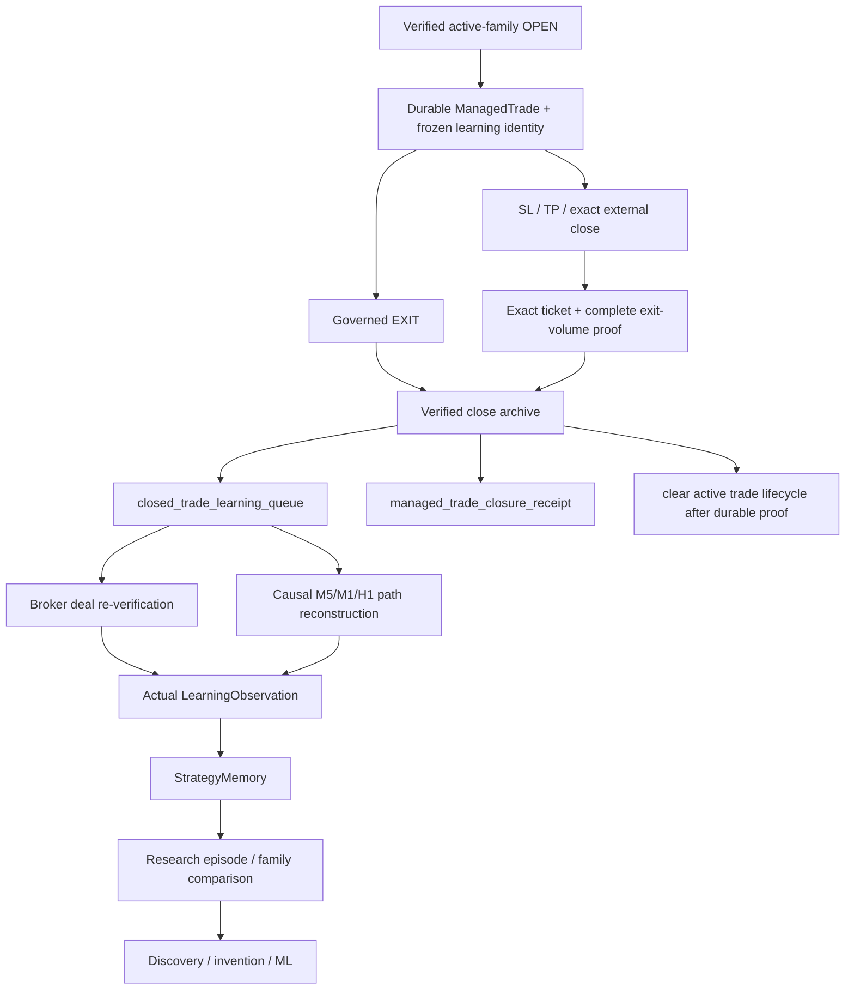
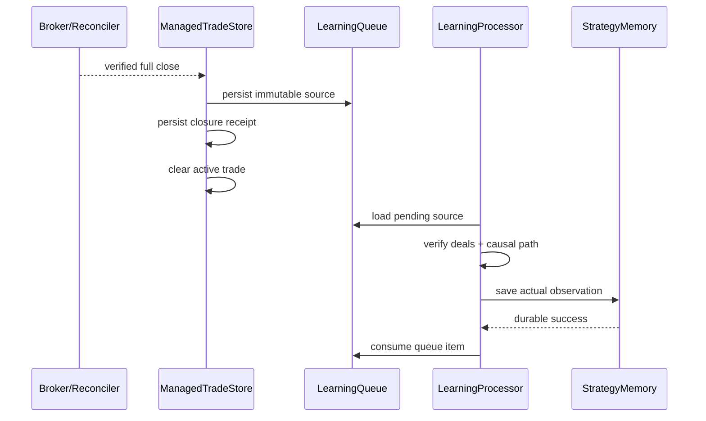

# GoldScalpTrader — Live DEMO Learning Pipeline

**Status:** APPROVED LIVE-LEARNING CONTRACT — CONNECTED DEMO PROOF PENDING
**Version:** 2.0-active-family-exactly-once-learning
**Authority:** Verified actual trade outcome capture, broker-side/manual close recovery, entry/path/exit efficiency, active-family attribution, exactly-once StrategyMemory ingestion and learning failure semantics.

## 1. Purpose

Every verified live/DEMO bot trade should become a durable learning sample instead of disappearing into a P/L number.

The system must remember:

- which active family produced it;
- which policy/version was live;
- which M5 setup and M1 refinement created the entry;
- what structural TradePlan existed;
- what actual executable costs occurred;
- what price path followed;
- how management performed;
- how the trade closed;
- how much qualified edge was captured or missed.

Learning remains downstream of broker truth.

> **Learn only from an already-known ManagedTrade whose full lifecycle can be proved. Never invent a close, family, fill, path or P/L to complete a sample.**

## 2. Supported actual close paths

For a known ManagedTrade:

- governed bot `EXIT`;
- broker stop-loss;
- broker take-profit;
- exact operator/manual close of that already-known position;
- broker-side close/multi-deal exit where matched exit volume proves full closure.

Unknown manual/foreign positions are never adopted into learning.

## 3. Authority flow



Research has no broker authority.

## 4. Frozen learning identity at entry

At verified OPEN, freeze at least:

```text
trade_id / position_ticket
active_strategy_family
active_family_policy_version
Opportunity / Episode / TradePlan IDs
direction
Approved Entry Reference
actual entry/fill
original SL / original R
M5 source event IDs + age
M1 timing profile/event/freshness
executable-quality snapshot
Risk profile / actual risk
session/context tags
code/config versions
```

Later strategy changes do not relabel the trade.

If a legacy/pre-upgrade record lacks critical identity, manage/recover it safely but do not fabricate missing learning fields.

## 5. Crash-safe close archive

Financial close truth is more important than learning success.

Required ordering:

```text
1. persist closed-trade learning queue item
2. persist durable closure receipt
3. clear verified active ManagedTrade
4. clear matching plan/opportunity lifecycle where appropriate
5. later reconstruct complete learning observation
6. persist StrategyMemory exactly once
7. remove queue item only after durable learning save
```



## 6. ExecutionIntent precedence

Passive missing-position close recovery cannot bypass unresolved execution.

```text
SUBMITTING / ACCEPTED_UNKNOWN Intent
→ reconcile that Intent first
→ if unresolved: remain RECONCILING
→ only then infer/verify broker-side close
```

This prevents an ambiguous broker request being hidden by a later missing-position inference.

## 7. Full close proof

For broker-side/manual close recovery require, as applicable:

```text
exact known position ticket
valid broker exit role(s)
positive valid deal volume
sum of matched exits == managed original/remaining position volume within strict tolerance
trusted UTC deal timestamps
ownership/origin attribution
```

Origin:

```text
all matched exits bot magic → BOT
none bot magic             → EXTERNAL
mixed                      → MIXED
```

EXTERNAL/MIXED is acceptable only because the original ManagedTrade is already known to be bot-owned.

Partial exit ≠ full close.

## 8. Exactly-once source identity

Suggested:

```text
source_id = managed-trade:<immutable_trade_id>
```

Rules:

- identical source/evidence retry = idempotent;
- same source with changed evidence = integrity conflict;
- queue corruption ≠ empty queue;
- StrategyMemory success must be durable before queue consumption.

## 9. Realized R

Where tick-money geometry is valid:

```text
structural_risk_money
= original_R_price / tick_size × tick_value × actual volume

realized_R
= verified broker net trade money / structural_risk_money
```

Broker net money includes the correctly attributed profit/commission/swap/fee components under the normalized deal contract.

Where monetary geometry is unavailable, price-R fallback may be used only if exact entry/exit/original-R price geometry is trustworthy.

No account-level P/L is substituted for missing trade evidence.

## 10. Entry Efficiency

Conceptual adverse fill metric:

```text
BUY adverse_entry_R
= max(0, actual_fill - ApprovedEntryReference) / original_R_price

SELL adverse_entry_R
= max(0, ApprovedEntryReference - actual_fill) / original_R_price

EntryEfficiency
= clamp(1 - adverse_entry_R, 0, 1)
```

Also record:

- decision→send latency;
- expected slippage allowance;
- actual slippage;
- spread/SL;
- spread/target;
- total cost/reward;
- M1 trigger age;
- M5 setup age;
- chase/drift.

## 11. MFE / MAE / path chronology

MT5 rates use candle-open timestamps. Excursion calculations must use only completed candles fully contained within the actual trade interval.

```text
bar_open >= verified entry time
AND
bar_close <= verified close time
```

Boundary candles containing pre-entry or post-exit price action are excluded rather than leaking path extremes.

Actual exit price is handled independently.

For BUY:

```text
MFE_R = max(high - entry) / original_R
MAE_R = max(entry - low) / original_R
```

SELL reverses direction.

M1 path may be used for timing-specific research only when causal/complete and available; it must not falsify the M5 management record.

## 12. Capture / Exit Efficiency

Baseline concepts:

```text
CaptureEfficiency
= realized positive R / available verified favorable excursion R
```

Exit Efficiency should additionally account for:

- objective stage reached;
- profit giveback;
- premature exit cost;
- time-efficiency decision;
- remaining structural room;
- management action path.

Exact formulas are research policy and versioned.

## 13. Entry regime / session / News context

Entry context is reconstructed only from facts knowable at entry:

- H1 bar must have closed by entry to influence entry regime;
- M15/M5/M1 contexts preserve causal timestamps;
- session label derives from entry time;
- News/event tags are soft context and research labels;
- later event information cannot retroactively improve entry context.

## 14. Active vs shadow comparison

For the same episode, the research journal may attach:

```text
actual active-family decision/outcome
shadow family hypothetical decision/timing/plan/outcome
```

Shadow outcome remains counterfactual and never becomes actual broker P/L.

This comparison is central to one-strategy-at-a-time efficiency testing.

## 15. Missed / blocked context around actual trades

Learning should preserve whether adjacent opportunities were suppressed because:

- position capacity occupied;
- cooldown;
- M1 timing missed;
- cost quality failed;
- broker/session hard authority;
- system fault.

This helps quantify the opportunity cost of long holds and management choices.

## 16. Failure semantics

| Condition | Behavior |
|---|---|
| unresolved Intent | reconcile first |
| no complete exit proof | keep ManagedTrade/learning pending |
| partial exit volume | no final observation |
| unknown external position | never adopt |
| critical learning identity missing | keep pending/degraded; never invent |
| broker history unavailable | keep pending |
| causal path history unavailable/corrupt | keep pending/degraded |
| StrategyMemory write fails | keep queue item |
| duplicate identical source | idempotent |
| conflicting source | integrity error |
| M1 history unavailable | omit/mark timing submetrics UNKNOWN; do not fabricate |

## 17. Backup / handoff

Full runtime checkpoints preserve:

```text
closed_trade_learning_queue
managed_trade_closure_receipt
StrategyMemory
research journal/candidate/promotion state
```

Same-scope machine handoff remains sequential. A second same-account/symbol production writer cannot merge an independent learning history safely.

## 18. Dashboard

```text
LIVE LEARNING
Pending Closes      1
Last Actual Trade   Breakout Retest • +1.42R
Entry Efficiency    0.91
MFE / MAE           +2.10R / -0.28R
Capture Efficiency  0.68
M1 Pattern          micro reclaim
Actual Slippage     0.04
Shadow Comparison   Sweep +0.7R hypothetical
Learning Status     SAVED / PENDING / DEGRADED
```

## 19. Planned implementation ownership

```text
management/store.py
execution/reconcile.py
research/live_learning.py
research/learning.py
research/episode_journal.py
market_data/mt5_reader.py
persistence/store.py
```

## 20. Planned proof

Tests cover:

- frozen active-family identity;
- governed EXIT archive;
- SL/TP/manual exact close recovery;
- BOT/EXTERNAL/MIXED origin;
- full-volume requirement;
- unresolved Intent precedence;
- queue/receipt crash windows;
- delayed history reconstruction;
- causal M5/H1/M1 path boundaries;
- realized R;
- entry/slippage/latency efficiency;
- MFE/MAE/capture;
- actual vs shadow separation;
- exactly-once StrategyMemory ingestion;
- backup persistence.

Connected DEMO proof later validates actual Exness deal visibility, timing and lifecycle latency.

## 21. Final invariant

> **Only a fully verified known bot trade becomes actual learning. Learning must preserve the exact active strategy, entry timing, costs, path and close lineage, survive crashes exactly once, and remain incapable of changing production or broker authority by itself.**
