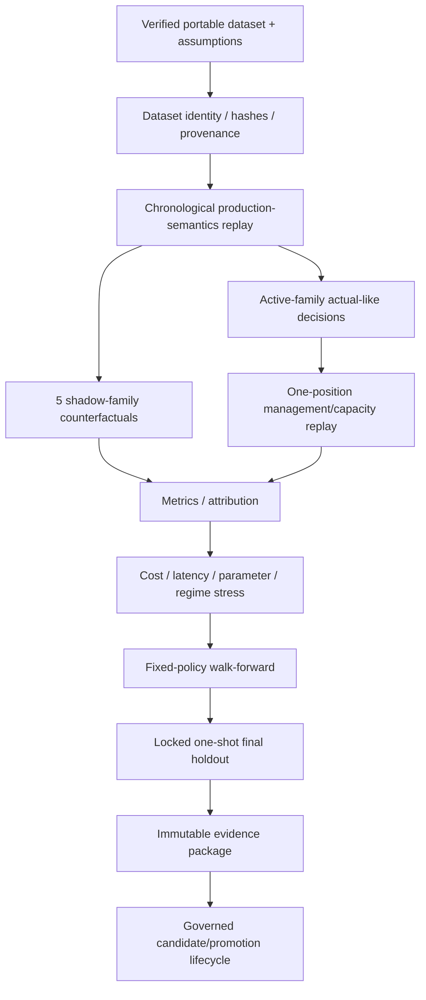
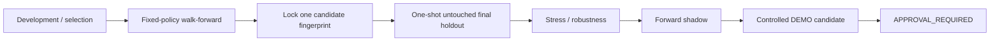

# GoldScalpTrader — Research and Validation

**Status:** APPROVED RESEARCH CONTRACT — REAL-XAU / DEMO EVIDENCE PENDING
**Version:** 2.0-strategy-isolation-scalp-validation
**Authority:** Chronological replay, no-lookahead, dataset identity, active/shadow comparison, management/capacity replay, walk-forward, holdout, stress, evidence packages and research claims.

## 1. Purpose

Research tests the documented production semantics without future leakage, cherry-picking, untraceable data or exaggerated claims.

> **A positive replay is evidence about a declared historical simulation. It is not permission to trade live and not proof of future profitability.**

Research must test GoldScalpTrader as the bot is actually designed:

- one `ACTIVE_EXECUTION` family at a time;
- five `SHADOW_ONLY` families;
- M5 setup authority;
- subordinate M1 timing;
- fixed + aware execution quality;
- preserved monetary Risk;
- one-position production capacity;
- management lifecycle;
- no News hard block;
- hard broker/session semantics where historical facts are actually known.

## 2. Evidence pipeline



## 3. No-lookahead contract

At simulated decision time `T`:

```text
facts causally knowable at T
→ production intelligence at T
→ active/shadow family reports at T
→ Opportunity/M1 timing/TradePlan/quality/Risk at T
→ freeze decision state
→ future bars only label later path/outcome
```

Prohibited leakage includes:

- future-confirmed swings;
- forming-bar final OHLC;
- future session range high/low;
- later event/News revisions presented as known earlier;
- future M1 pattern used for earlier entry;
- final target/stop result changing the earlier decision;
- final-series feature normalization leaking backward.

## 4. Runtime timeframe parity

Replay uses the approved production hierarchy:

```text
H4 optional major context
H1 broad regime/context
M15 opportunity location/path/target context
M5 setup/thesis and normal management structure
M1 subordinate entry refinement after valid M5 Opportunity
quote/execution assumptions current-side economics
```

M1 replay cannot independently generate a production trade when M5 has no valid Opportunity.

## 5. Strategy Isolation replay

Every replay run has an explicit active-family policy/version.

```text
ACTIVE family → production-like decision path
5 SHADOW families → same-prefix hypothetical decisions
```

Required outputs:

- actual-like active family opportunities/trades;
- shadow opportunities/trades;
- active/shadow disagreement;
- family-specific timing/cost/management outcomes;
- active-family policy period;
- no blended live vote.

This lets research compare families without contaminating attribution.

## 6. Production capacity parity

Decision-level `READY/ENTER` frequency is not equivalent to executable trade count.

Management replay must model:

```text
one independently risk-bearing Gold position at a time
```

If a later valid active-family entry occurs while a replay trade is still active:

```text
POSITION_CAPACITY_BLOCKED
→ no overlapping production P/L
→ preserve missed/counterfactual evidence
```

Shadow-family hypothetical trades never consume production capacity but may use their own counterfactual portfolio rules in explicitly separate research runs.

## 7. Opportunity / timing replay

Replay preserves the production lifecycle:

```text
M5 setup
→ persistent Opportunity
→ M1 WAIT/READY/MISSED/INVALID
→ fresh-event-only rearm
```

An unchanged terminal thesis does not become a new opportunity merely because the next bar arrives.

Research must report:

- M5 event age;
- M1 pattern/freshness;
- chase distance;
- Approved Entry→Executable Price drift;
- opportunities lost to over-strict timing;
- bad late entries prevented.

## 8. Executable-quality replay

Historical execution realism must be declared.

At minimum evaluate where data/assumptions permit:

- absolute spread/emergency condition;
- spread/SL;
- spread/target;
- cost/reward;
- slippage assumption;
- decision/send latency stress;
- current target room after adverse entry movement.

Stress cannot rewrite structural stop/target to improve a result.

## 9. Historical News/Fundamental treatment

News is not a hard permission in current production, so replay must not impose historical News blackouts merely because event data exists.

News/event datasets may tag:

- event tier/category;
- pre/post-event interval;
- macro regime;
- provider/source quality.

Research then measures actual impact on:

- family expectancy;
- spread/slippage/latency;
- opportunity recall;
- M1 entry efficiency;
- false break/expansion outcomes.

## 10. Historical broker/session policy

Hard broker market-state replay requires trustworthy interval data.

When a verified schedule is supplied, apply preserved production semantics such as PRE_CLOSE/reopen rules.

When schedule coverage is unknown, research must say so. It cannot infer broker OPEN merely from the existence of candles or from a News calendar.

## 11. Portable dataset contract

Target bundle:

```text
dataset_manifest.json
H4.csv       # optional if declared
H1.csv
M15.csv
M5.csv
M1.csv       # required when testing M1 refinement
optional cost/spread/execution series
optional session/event context files
```

Manifest records:

- source label/version;
- symbol identity/geometry;
- timeframe bar counts;
- OHLC/volume/spread fields;
- timezone/chronology;
- acquisition assumptions;
- hashes;
- execution-cost assumptions;
- code/research schema version.

Import rejects tampering, path tricks, count mismatch, non-chronological data and identity mismatch.

## 12. Read-only MT5 acquisition

Historical acquisition reuses the existing normalized MT5 reader. It does not create a second MetaTrader boundary and has no write/promotion authority.

Rules:

- completed bars only;
- exact requested counts or explicit failure;
- M1 included when entry-refinement research needs it;
- historical spread uses declared historical data/override—not hidden current live spread;
- acquisition source/version explicit;
- sensitive broker credentials excluded from portable public dataset identity.

## 13. Dataset and evidence identity

Evidence identity binds:

```text
source/version
symbol calculation geometry
all relevant candle/cost/context inputs
active-family policy/version
strategy/candidate fingerprint
code revision
configuration
replay realism assumptions
capacity/management model
```

Each evidence manifest has content hashes/fingerprints and explicit limitations.

## 14. Immutable evidence package

Example:

```text
package_manifest.json
evidence_manifest.json
metrics.json
optional chart data / reproducible report artifacts
```

Packages are write-new and integrity checked. A dataset may be referenced by verified identity rather than duplicated into every package.

Research package has **zero broker authority**.

## 15. Walk-forward and holdout



Rules:

- validation windows non-overlapping as defined by methodology;
- no optimizer inside fixed-policy validation;
- final holdout one-shot;
- fingerprint change after lock = new candidate/version;
- failed holdout cannot be repeatedly tuned against the same holdout and still called untouched.

## 16. Core metrics

Serious Scalp research reports include:

### Return/risk

- Net R;
- Average R;
- Profit Factor;
- max drawdown;
- recovery;
- loss streaks;
- tail outcomes.

### Trade-path quality

- MFE/MAE;
- Entry Efficiency;
- Capture Efficiency;
- Exit Efficiency;
- premature-exit cost;
- giveback;
- time-to-MFE/target.

### Opportunity efficiency

- Qualified Opportunity Recall;
- Opportunity Capture Rate;
- false blocks;
- missed opportunity cost;
- analytical setups/day;
- capacity-suppressed entries;
- M1 timing misses;
- actual trades/day/hour;
- gap to the approved 120/day research benchmark.

### Execution economics

- spread/SL;
- spread/target;
- cost/reward;
- slippage;
- latency;
- drift/chase;
- session/regime cost distributions.

Win rate alone is never enough.

## 17. Family/session/event segmentation

Report separately by:

- active strategy family;
- shadow strategy family;
- H1/M15 regime;
- Asia/London/NY/overlap;
- volatility state;
- M1 pattern;
- News/event context tag;
- spread/cost regime.

Do not create blanket session/event restrictions solely because one slice is temporarily weak.

## 18. Stress testing

Stress may include:

- worse spread/slippage;
- higher execution delay;
- price drift;
- order/modification failure assumptions;
- parameter perturbation;
- regime slices;
- missing optional evidence;
- lower sample/trade-frequency sensitivity;
- data gaps;
- capacity/hold-time effects.

Stress never changes hard safety to make candidate look better.

## 19. Realism levels

Every replay declares execution realism, e.g.:

```text
BAR_CLOSE_ANALYTICAL
BAR_HIGH_LOW_BRACKET
M1_REFINEMENT_REPLAY
BAR_CLOSE_EXECUTION_STRESS
DEMO_FORWARD_EVIDENCE
```

A bar-based replay is not tick-perfect broker execution.

## 20. Charts / reports

Once real replay/DEMO data exists, reproducible charts should include where useful:

- cumulative Net R/equity curve;
- drawdown;
- active-family vs shadow comparisons;
- session/regime performance;
- opportunity funnel;
- spread/slippage/latency distributions;
- entry/capture/exit efficiency;
- throughput vs expectancy;
- stress sensitivity.

No fabricated empirical charts before evidence exists.

## 21. Planned implementation ownership

```text
research/replay.py
research/management_replay.py
research/session_history.py
research/stress.py
research/validation.py
research/datasets.py
research/acquisition.py
research/evidence.py
research/packages.py
research/metrics.py
research/outcomes.py
research/ablation.py
scripts/acquire_mt5_dataset.py
scripts/run_walk_forward.py
```

## 22. Planned proof

Tests cover:

- chronology/no-lookahead including M1;
- active/shadow isolation;
- Opportunity terminal/rearm parity;
- one-position capacity;
- management replay;
- execution-quality assumptions;
- session schedule coverage;
- News context non-blocking;
- portable dataset hashes/counts;
- evidence/package integrity;
- walk-forward boundaries;
- one-shot holdout;
- stress stability;
- metrics/counterfactual separation.

## 23. Evidence boundary

Deterministic tests prove research software. Full validation still requires:

- regime-diverse real XAU history;
- current execution-cost evidence;
- trustworthy session/broker history;
- untouched holdout;
- live Shadow;
- controlled DEMO candidate evidence;
- replay-versus-DEMO comparison.

## 24. Final invariant

> **Research must reproduce the causal production system closely enough that positive evidence means something, while keeping every assumption, limitation, cost, capacity block and shadow counterfactual visible. It may search aggressively, but it may never turn hindsight into edge or research artifacts into broker authority.**
