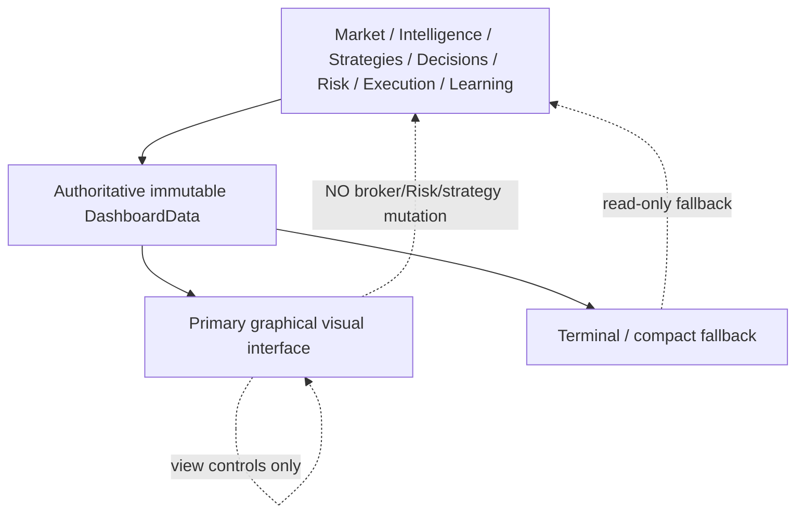

# GoldScalpTrader — Dashboard and UX Contract

**Status:** APPROVED OPERATOR UX ARCHITECTURE — GRAPHICAL PRIMARY VISUAL BASELINE / TERMINAL FALLBACK
**Version:** 2.0-detected-setup-one-screen
**Authority:** Operator visibility, graphical/terminal presentation hierarchy, detected-setup semantics, active/shadow strategy display, read-only interaction, no-scroll layout and exact blocker/Gate/Risk truth.

## 1. Purpose

Within seconds the operator should understand:

1. XAUUSDm feed/market health and live Bid/Ask/spread;
2. soft Session and hard broker Market State;
3. M5 primary setup plus subordinate M1 refinement;
4. **which setup is actually detected now**;
5. which family is `ACTIVE_EXECUTION` and whether that setup is live-eligible;
6. which other families are `SHADOW_ONLY` without implying they are being mixed into the trade;
7. current Opportunity/Timing state and why;
8. TradePlan geometry and executable-quality ratios;
9. preserved SMALL/MEDIUM/NORMAL Risk truth;
10. upstream blocker versus actual central Gate;
11. open ManagedTrade / Trade Manager state;
12. execution/controller/reconciliation state;
13. verified activity and closes;
14. learning/discovery/candidate state;
15. backup/data/system health.

Dashboard is presentation, not a second trading engine.

## 2. Approved operator-surface hierarchy



The graphical dashboard is the approved primary visual UX baseline when available.

The terminal renderer remains valuable as:

- startup/fallback visibility;
- diagnostics;
- low-dependency recovery interface;
- presentation-failure fallback.

Trading liveness does not depend on either renderer.

## 3. One-screen UX rule

The approved graphical floor has **no page or panel scroll bars**.

Target behavior:

```text
1920×1080 → full institutional layout
1600×900  → compact institutional layout
smaller    → density-reduced fallback, never hidden critical safety state
```

Critical operational facts remain visible without scrolling:

```text
market state
live price/spread
bot state
detected setup
timing
TradePlan/blocker
Risk
open trade
execution/controller/system health
```

Optional deep details may use tabs/tooltips/popovers, not scroll-dependent main layout.

## 4. Setup detection versus strategy forcing

The market/chart evidence decides whether a real setup exists.

```text
chart/structure/liquidity/quant/location
→ family-specific setup detection
→ zero, one or several analytical candidates may exist
→ Strategy Isolation determines live eligibility
```

Critical semantics:

> **An `ACTIVE_EXECUTION` family is eligible to trade only when its own genuine setup is detected. The system must never force that family narrative onto every market episode.**

Example:

```text
Active family: Trend Pullback
Current chart: no valid Trend Pullback
Shadow family: Liquidity Sweep detected

Dashboard:
Detected Market Setup   Liquidity Sweep Reversal
Live Eligibility        SHADOW ONLY
Active Family Setup     NONE
Current Signal          WAIT
```

This is correct. The bot does not turn the shadow setup into a live trade and does not fabricate a Trend Pullback.

## 5. Graphical panel hierarchy

Approved visual organization follows the operator-approved Swing-style institutional dashboard:

### Masthead

```text
GoldScalpTraderAI
institutional/scalping tagline
bilingual decorative identity
PKT date/time
account mode/environment
MT5/controller identity
```

### Top market strip

```text
XAUUSDm / Gold
Market OPEN/PRE_CLOSE/CLOSED
Soft Session
Live price
Bid / Ask / spread
M5 countdown
Bot Status
```

### Left analysis rail

```text
EMA20 / EMA50 / RSI14 / ATR14
Trend Direction H4/H1/M15/M5
Session / News Context
```

M1 appears as subordinate timing when relevant rather than an independent higher-level trend row.

### Center chart

Real interactive XAU chart with:

```text
M1 | M5 | M15 | H1 | H4
Indicators
Drawings
Settings
```

Buttons must be functional at implementation time.

### Right decision rail

```text
Detected Setup / Current Signal
Trade Plan
Current Blocker / Executable Quality
Multi-Timeframe Candle/Structure Analysis
```

### Lower floor

```text
Account & Risk
Strategy / Setup Board
Open Trade
Execution & Controller
Trading Activity
Learning & Discovery
System & Data
Recent Verified Closes
```

## 6. Functional chart controls

### Timeframe tabs

`M1/M5/M15/H1/H4` change only displayed chart timeframe.

They do not modify production timeframe authority:

```text
M5   primary setup/thesis
M1   subordinate entry refinement
M15  location/path/target context
H1   broad regime context
H4   optional major context
```

### Indicators

Toggles approved visual overlays. It does not enable/disable strategy calculations.

### Drawings

Local operator annotations only; no automated-trading authority.

### Settings

Presentation preferences only. Live Risk, active strategy, hard execution thresholds and REAL activation are not casual graphical settings.

### Zoom / pan / reset

Functional chart-only interaction with no decision side effect.

## 7. Session / News presentation

Show separately:

```text
Soft Session      ASIA / LONDON / NEW YORK / OVERLAP / OFF HOURS
Hard Market       OPEN / PRE_CLOSE / CLOSED / REOPEN_WARMUP / UNKNOWN
News Context      event/context/none/unknown
Provider Health   VERIFIED / DEGRADED / STALE / UNAVAILABLE / UNKNOWN
```

Current approved semantics:

```text
News event         → soft context only
News UNKNOWN       → soft context unavailable
provider failure   → does NOT directly block trading
```

Actual event-induced spread/drift/dislocation/slippage/data problems are shown through their real owners.

No old `NEWS_BLACKOUT → BLOCK` or `POST_NEWS_WARMUP` UI semantics remain.

## 8. Detected Setup / Current Signal panel

Preferred fields:

```text
Detected Setup
Active Family
Family Mode          ACTIVE_EXECUTION / SHADOW_ONLY
Direction            BUY / SELL / WAIT
BUY Thesis
SELL Thesis
Opportunity
Entry Timing
M5 Setup Event
M1 Refinement
Coverage
Red-Team Conflict
Reason
```

### No valid setup

```text
WAIT / NO VALID SETUP
انتظار
Reason: no active-family setup currently detected
```

### Shadow setup only

```text
Detected Setup: Liquidity Sweep Reversal
Status: SHADOW ONLY
Live Signal: WAIT
Reason: current isolation policy does not allow this family to originate live trade
```

### Active setup

```text
Detected Setup: Breakout Retest
Mode: ACTIVE_EXECUTION
Opportunity: ARMED
M1: WAIT / READY
```

## 9. Strategy / Setup Board

Do not show all six families as if all six are contributing to the same live trade.

The board must communicate:

```text
which family is active
which setup is actually detected
which shadow families see a candidate
which families see no setup
which evidence is verified actual performance vs no sample
```

Example:

| Family | Mode | Setup State | Direction | Quality | Verified Samples |
|---|---|---|---|---:|---:|
| Breakout Retest | ACTIVE | DETECTED | BUY | 78 | 41 |
| Trend Pullback | SHADOW | NONE | — | — | shadow only |
| Breakout Expansion | SHADOW | CANDIDATE | BUY | 61 | shadow only |
| Liquidity Sweep | SHADOW | NONE | — | — | shadow only |
| Failed Breakout | SHADOW | NONE | — | — | shadow only |
| Compression | SHADOW | WAIT | — | 44 | shadow only |

Shadow metrics never become actual production P/L.

## 10. M1 display

The previous “M1 diagnostic only” operator wording is superseded.

Current UI meaning:

```text
M5 setup exists
→ M1 may show subordinate refinement pattern/freshness/timing

no M5 setup
→ M1 cannot display itself as a production setup
```

Examples:

```text
M1 RECLAIM • fresh • READY
M1 pullback incomplete • WAIT
M1 trigger stale • MISSED
```

## 11. Trade Plan

Display only actual governed geometry:

```text
Bias / Direction
Approved Entry Reference
Current executable Bid/Ask
Structural SL
Primary Target
Expansion Target
optional Runner
Gross R
Spread/SL
Spread/Target
Cost/Reward
Plan Quality
```

No plan = `—`, never fake zero.

Do not hard-code Swing's historical `1.20R` floor into the Scalp UI.

## 12. Current Blocker versus Gate

```text
no active-family setup
→ Current Blocker: Setup Detector / Strategy Floor
→ Gate: NOT EVALUATED

M1 timing WAIT/MISSED
→ Current Blocker: Entry Timing
→ Gate: NOT EVALUATED

TradePlan invalid
→ Current Blocker: TradePlan
→ Gate: NOT EVALUATED

Executable cost poor
→ Current Blocker: Executable Quality
→ Gate: NOT EVALUATED

Risk BLOCK/UNKNOWN
→ Current Blocker: Risk
→ Gate: NOT EVALUATED

actual central Gate BLOCK
→ Current Blocker: Execution Gate
→ Gate: BLOCKED
```

News context never appears as a hard blocker under current architecture.

## 13. Risk/account presentation

Show current Risk truth, not a generic `STANDARD` label.

Reference profile values remain:

| Profile | Normal | Elevated | Hard | Daily |
|---|---:|---:|---:|---:|
| SMALL | 3.0–4.5% | >4.5–6.5% | 7% | 12% |
| MEDIUM | 2.0–3.0% | >3.0–4.5% | 5% | 9% |
| NORMAL | 1.0–2.0% | >2.0–3.5% | 4% | 7% |

Also show:

```text
Balance / Equity / Free Margin
proposed lot / actual risk
capacity 0/1 or 1/1
Day P/L / loss budget
loss streak / cooldown
same-episode re-entry state
manual daily-loss reset status
Aggressive mode ENABLED/DISABLED
```

If aggressive mode enabled:

```text
8%  MAX SL-risk ceiling — NOT TARGET
16% aggregate
16% daily
```

## 14. Open ManagedTrade

When flat, show a clean empty state.

When open, show:

```text
family/version
ticket/direction
actual Entry/current price
original/current SL
Primary/Expansion/Runner stage
original/open R
remaining volume
trade age/M5 bars
Trade Manager action/reason
Intent/reconciliation/close state
```

## 15. Verified performance

Only verified actual closed ManagedTrades count as live production performance.

```text
signal != trade
shadow != actual
replay != actual
blocked opportunity != trade
open position != closed sample
zero samples → NO SAMPLE
```

This applies to strategy board, trading activity and recent closes.

## 16. Learning / discovery

Show clearly separate:

```text
actual active-family learning
shadow-family evidence
candidate count/stage
best challenger
ML/discovery health
APPROVAL_REQUIRED state
```

A research candidate never appears as already-live production policy.

## 17. Presentation pulse

Fast display refresh may update:

- PKT clock;
- current Bid/Ask/spread;
- quote age;
- M5 countdown;
- chart current candle display where allowed by presentation contract;
- already-owned account/system state.

The pulse may not rerun strategies or mutate Opportunity/TradePlan/Risk/Gate merely because the UI refreshed.

## 18. Failure / fallback

```text
graphical renderer fails
→ trading continues
→ terminal/compact fallback remains available
→ no authority changes
```

Unknown values render `UNKNOWN`, `—`, `WAITING`, or `NO SAMPLE`.

No fabricated candles, plan geometry, Risk or performance.

## 19. Security / interaction

Initial GUI is local-only/read-only with respect to trading authority.

No dashboard control may:

- place BUY/SELL manually;
- close/modify positions directly;
- change active production family casually;
- edit Risk percentages live;
- enable REAL.

Presentation settings and chart controls remain functional.

## 20. Planned proof

Tests and visual acceptance must cover:

- approved one-screen layout;
- no scroll bars;
- functional chart timeframe buttons;
- Indicators / Drawings / Settings behavior;
- setup detection truth;
- active strategy not forced onto every episode;
- shadow-only candidate display;
- M1 subordinate role;
- News soft-only display;
- blocker vs Gate;
- exact preserved Risk rendering;
- no-plan/no-sample truth;
- graphical failure isolation;
- local/read-only security;
- 1920×1080 and compact 1600×900 screenshots/visual checks.

## 21. Final invariant

> **The operator sees the market as a coherent institutional floor: one real detected setup, one live-eligible strategy family under isolation, subordinate M1 timing, transparent shadow observations, functional chart controls and exact Risk/execution truth—all on one screen without scroll bars and without giving presentation any broker authority.**
