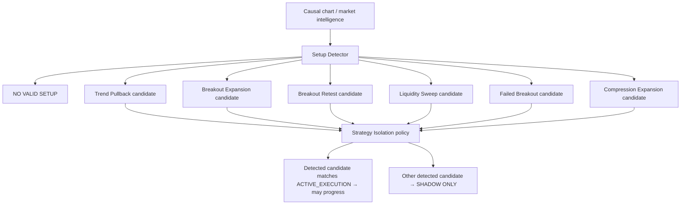
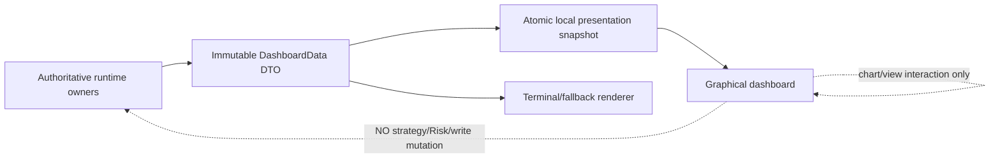

# GoldScalpTrader — Graphical Dashboard

**Status:** APPROVED PRIMARY VISUAL UX BASELINE — DOCUMENTATION RECONSTRUCTION / IMPLEMENTATION PROOF PENDING
**Version:** 2.0-swing-approved-scalp-visual-floor
**Authority:** Approved graphical layout, one-screen information architecture, functional chart controls, detected-setup presentation, active/shadow strategy visibility and read-only operator interaction.

## 1. Approved visual baseline

The approved GoldScalpTrader graphical dashboard shall follow the same **institutional visual family and one-screen information density** as the operator-approved GoldSwingTraderAI dashboard reference, adapted for Scalp architecture.

Core visual characteristics:

- dark navy/black institutional background;
- luminous cyan/teal borders and status accents;
- gold/yellow emphasis for Gold-specific labels, plan highlights and key warnings;
- compact dense panels with clear visual hierarchy;
- bilingual English/Urdu presentation where useful;
- central interactive candlestick chart as the visual focus;
- complete market, setup, plan, Risk, execution, trade, learning and system state visible on one screen;
- **no page-level or panel scroll bars**;
- no decorative animation that obscures price/action truth.

The dashboard is a presentation surface only. It cannot grant broker permission, change Risk, create an Opportunity or call `MT5Writer`.

## 2. One-screen requirement — no scroll bars

The approved desktop dashboard must fit within one viewport.

Primary design target:

```text
16:9 desktop
1920×1080 preferred design reference
1600×900 supported compact layout target
```

Rules:

- no vertical page scroll;
- no horizontal page scroll;
- no scrolling inside normal operational panels;
- no hidden critical blocker, Risk or execution state below a fold;
- if screen size is smaller, switch to compact density/layout rather than add a scrollbar;
- optional detail can use tooltip/popover/modal/tab overlays, but the operational state remains visible without scrolling;
- chart zoom/pan is allowed because it is chart interaction, not a dashboard scrollbar.

## 3. Approved screen map

```text
┌──────────────────────────────────────────────────────────────────────────────┐
│ GoldScalpTraderAI / identity / bilingual masthead / PKT / account / mode    │
├────────────┬────────────┬───────────────────────────┬───────────┬─────────────┤
│ XAUUSDm    │ Market     │ Live Price / Bid / Ask   │ M5 Close  │ Bot Status  │
├────────────┼────────────┴───────────────────────────┼───────────┴─────────────┤
│ Market     │                                        │ Detected Setup / Signal │
│ Analysis   │                                        ├─────────────────────────┤
├────────────┤        INTERACTIVE XAU CHART           │ Trade Plan              │
│ Trend      │                                        ├─────────────────────────┤
│ Direction  │ M1 M5 M15 H1 H4                       │ Current Blocker / Quality│
├────────────┤ Indicators | Drawings | Settings       ├─────────────────────────┤
│ Session /  │                                        │ Multi-Timeframe Reading │
│ Context    │                                        │                         │
├────────────┴──────────────────────┬─────────────────┴─────────────────────────┤
│ Account & Risk                   │ Strategy / Setup Board │ Open Trade         │
├──────────────────────────────────┼────────────────────────┼────────────────────┤
│ Execution & Controller           │ Trading Activity       │ Learning/Discovery │
│                                  ├────────────────────────┼────────────────────┤
│                                  │ System & Data          │ Verified Closes    │
└──────────────────────────────────┴────────────────────────┴────────────────────┘
```

Exact pixel dimensions may be tuned during implementation, but **panel roles, no-scroll behavior and information hierarchy are approved requirements**.

## 4. Masthead

Approved visual concept includes:

- `GoldScalpTraderAI` product identity;
- institutional/scalping tagline;
- tasteful bilingual/Urdu/Arabic decorative identity consistent with the approved Swing reference;
- PKT date/time;
- account environment badge such as `DRY_RUN`, `DEMO ACCOUNT`, future gated `REAL`;
- MT5 broker/terminal identity;
- current PRIMARY/controller role where useful.

Decorative text never alters runtime behavior.

## 5. Market status strip

The top operational strip shows at minimum:

```text
Symbol             XAUUSDm / resolved Gold symbol
Market State       OPEN / PRE_CLOSE / CLOSED / UNKNOWN
Soft Session       ASIA / LONDON / NEW YORK / OVERLAP
Live Price         current display price
Bid / Ask
Spread
Quote age
M5 close countdown
Bot Status         SCANNING / WAITING / MANAGING / RECONCILING / BLOCKED
System summary     all-systems / degraded / fault
```

News/Fundamental context may be shown, but never as a hard trading permission badge.

## 6. Central chart — mandatory and interactive

The central chart is a real chart, not a decorative image.

It must render actual authoritative/cached market data carried by the presentation snapshot.

### 6.1 Functional timeframe buttons

Required buttons:

```text
M1
M5
M15
H1
H4
```

Behavior:

- button switches the **displayed chart timeframe**;
- selected timeframe is visually obvious;
- changing chart timeframe does **not** change production authority;
- canonical production roles remain:
  - M5 primary setup/thesis;
  - M1 subordinate entry refinement;
  - M15 opportunity/location/path;
  - H1 broad context;
  - H4 optional major context;
- user selecting H1/H4 on chart cannot force strategy engine to trade from H1/H4;
- chart switch is local visual interaction only.

### 6.2 Indicators button

`Indicators` opens/toggles approved visual overlays such as:

- EMA20 / EMA50;
- RSI panel/summary;
- ATR summary;
- support/resistance zones;
- liquidity pools;
- FVG/qualified OB;
- POC/volume profile where available;
- trendline/Fibonacci overlays;
- structural events/BOS/MSS;
- entry/SL/target levels for a current plan.

Visual toggles do not change strategy inputs or qualification logic.

### 6.3 Drawings button

`Drawings` provides operator-local visual tools such as:

- horizontal line;
- trendline/ray;
- rectangle/zone;
- Fibonacci tool;
- text/marker;
- erase/clear local drawing.

Operator drawings are **visual annotations only** in V1. They are not silently imported into automated strategy logic.

### 6.4 Settings button

`Settings` controls presentation-safe options such as:

- chart density;
- candle count;
- visible overlays;
- label density;
- language/display preferences;
- panel emphasis;
- chart zoom/reset.

It does **not** directly change live monetary Risk, active strategy policy, hard execution settings or REAL capability. Trading-policy changes remain governed configuration changes outside presentation authority.

## 7. Setup detection — chart decides what is actually forming

The bot must not force every strategy narrative into every market episode.

Approved behavior:



Critical rule:

> **One active strategy does not mean forcing that strategy onto every chart. It means only that strategy is eligible to produce a live trade when its own setup is genuinely detected.**

Therefore:

```text
active family = Breakout Retest
chart has no valid Breakout Retest
→ WAIT / NO VALID ACTIVE SETUP
→ do not manufacture a retest narrative
```

If the chart clearly forms a different family while it is shadow-only:

```text
Detected Setup: Liquidity Sweep Reversal
Mode: SHADOW ONLY
Live Trade: NOT ELIGIBLE under current isolation period
```

This preserves clean family-efficiency testing without hiding what the market is actually doing.

## 8. Current Signal / Detected Setup panel

The right-side primary signal card should show **one current detected live-eligible setup**, or a truthful WAIT/NO SETUP state.

Preferred fields:

```text
Detected Setup      Breakout Retest / Trend Pullback / ... / NONE
Active Family       current ACTIVE_EXECUTION family
Direction           BUY / SELL / WAIT
Opportunity         score/state
Entry Timing        READY / WAIT / MISSED / INVALID
M5 Setup            exact event/reason
M1 Refinement       exact subordinate trigger/reason
BUY thesis strength
SELL thesis strength
Coverage
Red-Team conflict
Primary reason
```

Do not display six simultaneous `SELL/BUY` rows in a way that implies every family is being injected into the trade.

## 9. Strategy / Setup Board

The board is redesigned around **detection + isolation**, not blended voting.

Example:

```text
ACTIVE EXECUTION
Breakout Retest     DETECTED • BUY • 78 • ELIGIBLE

SHADOW OBSERVATION
Trend Pullback      NO SETUP
Breakout Expansion  SHADOW BUY 63
Liquidity Sweep     NO SETUP
Failed Breakout     NO SETUP
Compression         SHADOW WAIT
```

Optional columns:

```text
Family
Mode: ACTIVE / SHADOW
Detected Setup State
Direction
Quality/Score
Sample Count
Verified Win Rate
Net R / expectancy
```

Performance columns show `NO SAMPLE` until verified evidence exists.

## 10. Market analysis / trend / multi-timeframe panels

Left and right context panels may show:

### Market Analysis

```text
EMA20
EMA50
RSI14
ATR14
volatility
spread/cost context
```

### Trend Direction

```text
H4 optional context
H1 broad context
M15 opportunity context
M5 primary setup state
M1 subordinate timing state when Opportunity exists
```

### Multi-Timeframe Candle Analysis

Compact human-readable interpretation per timeframe, e.g.:

```text
M5 Primary   Bullish rejection / breakout retest / compression release
M15 Support  location/path/zone context
H1 Context   trend/transition/range
M1 Entry     micro reclaim / continuation / WAIT
```

No timeframe row invents authority it does not own.

## 11. Trade Plan / Current Blocker

Trade Plan shows only a real governed plan:

```text
Bias / direction
Approved Entry Reference
Current executable quote
Structural Stop Loss
Primary Target
Expansion Target
optional Runner objective
Gross R
Spread/SL
Spread/Target
Cost/Reward
Plan Quality
```

If no valid plan exists, show `—` rather than fabricated values.

Current Blocker panel must show exact owner:

```text
Setup Detector
Entry Timing
TradePlan
Executable Quality
Risk
Market/Session
Exposure/Capacity
Controller
Execution Gate
Reconciliation
```

Do not hard-code Swing's historical `1.20R` wording into Scalp UI unless the current versioned Scalp policy genuinely owns that threshold.

## 12. Account & Risk

Show preserved Risk architecture exactly:

```text
Balance
Equity
Free Margin
Profile SMALL / MEDIUM / NORMAL
Normal / Elevated / Hard / Daily bands
Actual proposed lot/risk when available
Aggressive mode ENABLED/DISABLED
Daily P/L / loss budget
loss streak
cooldown
same-episode re-entry state
capacity 0/1 or 1/1
```

If aggressive mode is enabled:

```text
8%  MAX single-trade SL-risk ceiling — NOT TARGET
16% aggregate open-risk cap
16% daily-loss ceiling
```

## 13. Open Trade

When flat:

```text
No Open Trade
کوئی کھلی پوزیشن نہیں
```

When open, show:

- family/policy version;
- direction/ticket;
- actual entry/current price;
- original/current SL;
- target stage;
- original/current R;
- remaining volume;
- management action/reason;
- trade age/M5 bars;
- Intent/reconciliation state.

## 14. Bottom operational floor

### Execution & Controller

```text
Controller role / epoch
runtime capability
Gate state
Intent state / send count
broker precheck
latency/drift
reconciliation
```

### Trading Activity

```text
Today verified bot trades
closed/open/total
Net P/L / Net R
cooldown
active strategy evaluation window
```

### Learning & Discovery

```text
StrategyMemory health
active-family samples
shadow samples
discovery health
best challenger
candidate stage
APPROVAL_REQUIRED when applicable
```

### System & Data

```text
MT5 connected
Data feed
last tick
backup/checkpoint
data quality
all-systems summary
```

### Recent Verified Closes

Only verified actual ManagedTrade closes appear here. Shadow/replay/counterfactual results never appear as live closed trades.

## 15. Interaction authority matrix

| Control | Functional? | May change broker/trading authority? |
|---|---:|---:|
| M1/M5/M15/H1/H4 chart tabs | Yes | No |
| Indicators | Yes | No |
| Drawings | Yes | No |
| Settings — presentation | Yes | No |
| chart zoom/pan | Yes | No |
| panel tooltip/popover | Yes | No |
| BUY/SELL manual order button | **Not provided** | — |
| active strategy switch | not casual UI control | governed elsewhere |
| Risk percentage edit | not direct dashboard control | governed elsewhere |
| REAL activation | impossible through dashboard | No |

## 16. Data / presentation architecture



The graphical dashboard may be the primary visual interface when running, while the terminal/compact renderer remains a resilient fallback. Trading liveness never depends on the GUI process.

## 17. Performance

UI must not steal the scalp critical path.

- presentation refresh may be faster than strategy decisions;
- chart rendering occurs from already-published snapshots/buffers;
- expensive redraws/indicators are cached where appropriate;
- no family strategy is rerun merely because the user changes chart timeframe;
- no browser/GUI failure stops trading;
- update only changed UI regions where practical;
- performance profiling validates render cadence.

## 18. Security / locality

Initial graphical deployment is local-only.

- localhost / local desktop boundary;
- no credentials in UI snapshot;
- no public bind/cloud dependency;
- no state-changing web endpoint;
- no paid dashboard service requirement.

## 19. Planned implementation ownership

Final module names may be refined during implementation, but responsibilities should remain separated:

```text
operator/presentation.py
operator/graphical_snapshot.py
operator/chart_model.py
operator/chart_controls.py
graphical_dashboard/app.py
graphical_dashboard/chart.py
graphical_dashboard/layout.py
graphical_dashboard/widgets.py
app/live_presentation.py
```

## 20. Planned proof

Tests/visual proof must cover:

- one-screen no-scroll 1920×1080;
- compact no-scroll 1600×900 target;
- timeframe buttons functional;
- Indicators functional;
- Drawings functional and non-authoritative;
- Settings limited to presentation authority;
- chart timeframe switch does not change production timeframe roles;
- detected setup comes from current authoritative strategy evidence;
- active strategy not forced onto every episode;
- shadow setup cannot originate live trade;
- no fabricated plan/Risk/performance;
- blocker vs Gate truth;
- M1 subordinate role rendered correctly;
- News soft-only rendering;
- graphical failure isolation;
- secret exclusion;
- verified close provenance.

## 21. Final invariant

> **The approved graphical dashboard must look and behave like a complete institutional trading floor on one screen: real interactive chart controls, no scroll bars, one truthful detected setup at a time, one live-eligible strategy family under isolation, compact shadow observation, exact Risk/execution truth and zero broker authority inside presentation.**
