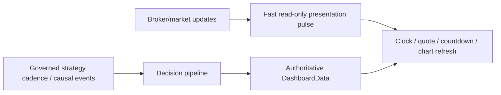
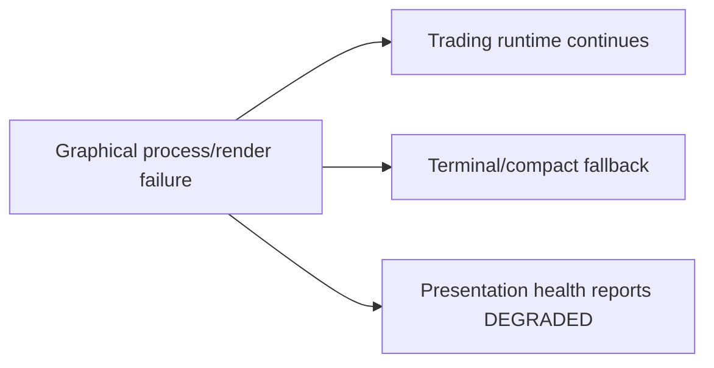

# GoldScalpTrader — Live Dashboard Contract

**Status:** APPROVED LIVE PRESENTATION CONTRACT — GRAPHICAL PRIMARY VISUAL / TERMINAL FALLBACK
**Version:** 2.0-detected-setup-live-ux
**Authority:** Live presentation cadence, graphical/terminal liveness, detected-setup state, functional chart controls, exact active/shadow strategy visibility, Risk/execution truth and presentation crash isolation.

## 1. Relationship to Dashboard and UX

This document extends `DASHBOARD_AND_UX.md` and `GRAPHICAL_DASHBOARD.md`.

It creates no strategy, Risk, lifecycle, controller or broker-write authority.

The live dashboard consumes already-owned facts from:

```text
market data
intelligence
strategy families
Strategy Isolation
active-family decision / Red Team
Opportunity / M1 timing
TradePlan / Executable Quality
Risk
execution / reconciliation
ManagedTrade
learning / discovery
persistence / backup
```

## 2. Presentation owners

Planned responsibilities:

```text
operator/presentation.py       normalize exact labels/reasons
operator/graphical_snapshot.py immutable graphical DTO snapshot
operator/chart_model.py        chart-ready causal/display data
operator/chart_controls.py     timeframe/overlay/drawing state
operator/live_dashboard.py     shared live presentation helpers
operator/terminal_dashboard.py terminal fallback
app/live_presentation.py       quote/account/system enrichment
app/loop.py                    presentation pulse separate from decision cadence
```

The graphical UI is the approved primary visual experience when available.

Terminal/compact output remains a resilient fallback and diagnostics surface.

## 3. Timing model



Presentation pulse may update:

- PKT clock/date;
- current Bid/Ask/spread;
- quote age;
- M5 countdown;
- current chart display data already available to the presentation layer;
- connection/system indicators;
- already-owned account values.

It may not:

- rerun strategy families merely because UI refreshed;
- create/replace Opportunity;
- create M1 trigger;
- rebuild TradePlan;
- change Risk;
- change Strategy Isolation policy;
- change Gate;
- create Intent;
- call broker writer.

## 4. Approved visual liveness

The dashboard should make bot state obvious:

```text
SCANNING       looking for real eligible setup
WAITING        opportunity/timing not ready
SETUP DETECTED real family setup exists
READY          active-family setup + timing ready upstream
MANAGING       verified open bot trade
RECONCILING    broker/lifecycle truth unresolved
BLOCKED        hard authority blocked
DEGRADED       non-fatal subsystem/provider/presentation issue
```

`SCANNING` does not mean the bot is forcing all six strategies onto the current chart.

## 5. Setup detection live semantics

The live dashboard must distinguish three different facts:

```text
A. what setup the chart actually forms
B. which family is currently ACTIVE_EXECUTION
C. whether the detected setup is live-eligible under Strategy Isolation
```

Examples:

### No setup

```text
Detected Setup    NONE
Active Family     Breakout Retest
Current Signal    WAIT
Reason            no valid active-family setup
```

### Shadow setup only

```text
Detected Setup    Liquidity Sweep Reversal
Family Mode       SHADOW_ONLY
Active Family     Breakout Retest
Current Signal    WAIT
Reason            valid shadow candidate; not live-eligible in current evaluation window
```

### Active eligible setup

```text
Detected Setup    Breakout Retest
Family Mode       ACTIVE_EXECUTION
Direction         BUY
Opportunity       ARMED
M1 Timing         WAIT / READY
```

The dashboard must never imply that six simultaneous strategy signals are being fused into every trade.

## 6. Strategy board live contract

The Strategy/Setup Board may show all six families, but the meaning is:

```text
ACTIVE_EXECUTION → can originate live trade only if own setup detected
SHADOW_ONLY      → observation/counterfactual/research only
NONE             → no current valid setup for that family
```

Recommended columns:

```text
Family
Mode
Setup State
Direction
Quality
Verified actual samples / Net R where available
```

Shadow performance must be labelled shadow/counterfactual, never mixed with verified actual results.

## 7. Functional chart controls

### Timeframe

Required live controls:

```text
M1 | M5 | M15 | H1 | H4
```

They change the displayed chart only.

Production authority remains fixed by contract:

```text
M5 primary setup/thesis
M1 subordinate entry refinement
M15 opportunity/location/path
H1 broad context
H4 optional major context
```

### Indicators

Functional visual toggle/menu for approved overlays.

### Drawings

Functional local chart annotations. They remain non-authoritative input in current architecture.

### Settings

Functional presentation settings only.

### No scrollbars

The live graphical floor must remain one-screen. Chart itself may zoom/pan; dashboard shell/panels do not use operational scrollbars.

## 8. M1 live presentation

The prior “M1 diagnostic only” wording is superseded.

Current contract:

```text
valid M5 Opportunity
→ M1 may refine entry timing
```

Show where applicable:

```text
M1 pattern
trigger age
fresh/stale state
entry refinement reason
READY / WAIT / MISSED
```

If no M5 Opportunity exists, M1 cannot be presented as a production setup.

## 9. News live presentation

News/Fundamental is soft context only.

Show independently:

```text
News Context
Next Event / countdown if known
Provider Health
Provider Source / cache age if relevant
```

Current live semantics:

```text
known News event    → does not directly block
News UNKNOWN        → does not directly block
provider/API failure→ does not directly block
```

Actual market degradation appears through:

```text
spread
spread/SL
spread/target
cost/reward
drift/chase
quote freshness
dislocation
slippage/latency
broker permission
```

No `NEWS_BLACKOUT` or `POST_NEWS_WARMUP` hard-permission rendering remains in this contract.

## 10. Trade Plan and executable quality

Live plan panel displays only existing governed facts:

```text
Approved Entry Reference
current executable quote
structural SL
Primary Target
Expansion Target
optional Runner
Gross R
Spread/SL
Spread/Target
Cost/Reward
Plan Quality
```

No plan:

```text
Entry —
SL    —
TP    —
```

Do not display a generic Swing `1.20R required` blocker unless the current versioned Scalp policy actually defines it.

## 11. Current Blocker / Gate

Required truth table:

```text
no active-family setup       → blocker Strategy/Setup Detector; Gate NOT EVALUATED
M1 timing WAIT/MISSED        → blocker Entry Timing; Gate NOT EVALUATED
TradePlan invalid/degraded   → blocker TradePlan; Gate NOT EVALUATED
cost/quality unacceptable    → blocker Executable Quality; Gate NOT EVALUATED
Risk BLOCK/UNKNOWN           → blocker Risk; Gate NOT EVALUATED
market/session hard block    → blocker Market/Session; Gate NOT EVALUATED or actual gate stage as implemented
exposure/capacity unresolved → exact owning blocker
central Gate actually BLOCKS → blocker Execution Gate; Gate BLOCKED
```

Never use News as current hard blocker.

## 12. Risk live presentation

Do not collapse Risk into a `STANDARD` label.

Show exact active profile:

| Profile | Normal | Elevated | Hard | Daily |
|---|---:|---:|---:|---:|
| SMALL | 3.0–4.5% | >4.5–6.5% | 7% | 12% |
| MEDIUM | 2.0–3.0% | >3.0–4.5% | 5% | 9% |
| NORMAL | 1.0–2.0% | >2.0–3.5% | 4% | 7% |

Also display:

```text
Balance / Equity / Free Margin
actual proposed lot / risk if available
capacity
Day P/L / loss budget
loss streak / cooldown
same-episode re-entry
manual reset state
aggressive mode
```

If aggressive mode enabled:

```text
8% MAX SL-risk ceiling — NOT TARGET
16% aggregate open-risk cap
16% daily-loss ceiling
```

No RiskEvaluation = `Risk Standby`, not failure.

## 13. Open Trade live view

When no trade:

```text
No Open Trade
کوئی کھلی پوزیشن نہیں
```

When open:

```text
family/version
ticket / direction
actual Entry / live price
original/current SL
objectives / current stage
original/open R
remaining volume
trade age / M5 bars
Trade Manager action/reason
Intent / reconciliation / close state
```

## 14. Execution / Controller live view

Show:

```text
controller holder / epoch / role
runtime capability
Gate state
Intent state
send count
broker precheck
spread/cost/drift/latency summary
reconciliation state
```

A stale/ambiguous lifecycle must be visible as such.

## 15. Verified activity

Only verified actual bot trades/closed ManagedTrades count.

```text
Signal        ≠ trade
Opportunity   ≠ trade
Shadow        ≠ trade
Replay        ≠ trade
Blocked setup ≠ trade
Open position ≠ closed sample
```

Zero verified closes shows `NO SAMPLE`.

## 16. Learning / Discovery live view

Show:

```text
StrategyMemory status
active-family actual samples
shadow sample count
Discovery health
candidate count
best challenger
candidate stage
APPROVAL_REQUIRED if reached
```

Research has no broker-authority indicator other than `NONE`.

## 17. One-screen live layout proof

Implementation is not accepted until visual tests/screenshots demonstrate:

```text
1920×1080  → no page/panel scrollbars
1600×900   → compact no-scroll layout
```

Required panels remain operationally visible.

Text overflow policy should use:

- concise primary value;
- tooltip/popover for deeper reason;
- compact reason codes;
- responsive font/panel density;
- never a scrollbar for ordinary live use.

## 18. Graphical failure isolation



UI failure cannot change trading authority, controller state or Risk.

## 19. Local security

Initial implementation:

- local desktop/localhost only;
- no public network bind;
- no cloud dashboard dependency;
- no authority-bearing credentials in snapshot;
- no state-changing broker endpoints;
- no BUY/SELL/MODIFY/CLOSE buttons;
- no REAL activation through UI.

## 20. Planned proof

Tests/acceptance cover:

- detected setup vs active-family eligibility;
- active strategy not forced into every market episode;
- shadow setup displayed but non-authoritative;
- functional M1/M5/M15/H1/H4 chart buttons;
- Indicators / Drawings / Settings functionality;
- selected chart timeframe does not change production roles;
- M1 subordinate live rendering;
- News soft-only rendering;
- exact blocker vs Gate semantics;
- exact preserved Risk table/overlay wording;
- no fabricated plan/performance;
- one-screen no-scroll visual proof;
- graphical failure isolation;
- secret/security boundary;
- verified close provenance.

## 21. Final invariant

> **The live dashboard must show exactly what the market and bot are doing—not six strategies pretending to trade at once. The chart drives truthful setup detection, Strategy Isolation controls live eligibility, M1 refines a real M5 opportunity, chart controls work, no scrollbars exist, and every financial/broker authority stays outside presentation.**
