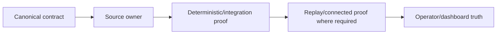

# GoldScalpTrader — Audit 2: Document → Code → Test Compliance

**Status:** FINAL COMPLIANCE AUDIT PROTOCOL — NOT RUN AGAINST IMPLEMENTATION
**Version:** 2.0-institutional-scalp
**Authority:** Post-build traceability audit from canonical contract to source owner to deterministic/integration/connected evidence.

## 1. Purpose

Audit 2 is run after implementation exists. It asks:

> **Can every material documented behavior be traced to one implementation owner and sufficient proof, with no undocumented production behavior?**

## 2. Traceability model



A missing link is a finding.

## 3. Required trace fields

For each material requirement record:

```text
requirement ID / wording
canonical document + section
source module/function/class
unit test(s)
integration test(s)
external/replay/DEMO evidence if applicable
operator/dashboard representation
status
exception/limitation
```

## 4. High-risk trace requirements

Audit explicitly traces:

- one normalized MT5 read boundary;
- completed-candle/knowledge-time semantics;
- market-first Setup Detector;
- active family cannot force chart setup;
- exactly one active + five shadow;
- shadow cannot create production Opportunity/Intent;
- M5 Opportunity before M1 timing;
- M1 cannot create production trade alone;
- family-aware TradePlan;
- Executable Quality owner;
- preserved Risk profiles and exact values;
- aggressive mode default false;
- News soft-context-only;
- PRE_CLOSE/reopen hard session authority;
- upstream blocker vs Gate state;
- one-shot Intent / sole writer / no blind retry;
- manual/foreign exposure separation;
- ManagedTrade/verified close;
- exactly-once learning;
- autonomous invention/ML promotion approval boundary;
- no runtime Git publication;
- graphical dashboard read-only authority.

## 5. Setup Detector compliance examples

### Required implementation trace

```text
Contract: chart/market determines setup; active family cannot be forced
→ strategies/setup_detector.py
→ test_active_family_not_forced.py
→ integration: detector + isolation + Opportunity
→ dashboard: Detected Setup / Active Test Family / Shadow status
```

### Failure finding

If code does:

```text
if active_family == BREAKOUT_RETEST:
    score_breakout_retest(...)
    ignore whether any other setup is actually detected
```

and presents every market as that family, Audit 2 is BLOCKED.

## 6. M1 compliance

Required trace:

```text
M5 active-family setup
→ Opportunity
→ M1 refinement
```

Audit searches for any path:

```text
M1 fact
→ production Opportunity / Intent without M5 thesis
```

Any such hidden path is HIGH/CRITICAL depending on broker reachability.

## 7. News compliance

Audit must find no current production path where:

```text
News event/provider unavailable
→ hard new-entry block solely because of News
```

News context may enter strategy/research/dashboard only.

Hard session/broker state must have its own typed owner.

## 8. Risk compliance

Compare exact code/config/test values against canonical profile table.

Audit fails if implementation:

- replaces profiles with one `STANDARD` policy;
- changes bands without governed documentation;
- auto-enables aggressive mode;
- treats 8% as target;
- modifies structural stop to make minimum volume fit;
- resets cooldown/daily state on restart.

## 9. Execution compliance

Search source imports/calls so raw irreversible MT5 calls exist only in sole writer.

Trace:

```text
Gate
→ Intent persisted
→ fresh precheck/order_check
→ SUBMITTING persisted
→ one send
→ ack classification
→ reconciliation
```

Any blind retry or second raw writer is CRITICAL.

## 10. Dashboard compliance

Trace displayed fields to backend-owned DTOs.

Audit fails if dashboard:

- recomputes Risk/Gate;
- changes active strategy directly without governed policy path;
- hides shadow-only status;
- displays upstream stop as Gate BLOCKED;
- shows unknown facts as zero;
- chart controls are decorative/non-functional while docs claim functionality.

## 11. Research/AI compliance

Audit import/dependency graph for any route from research/ML to raw writer or production config mutation.

Candidate stage must stop at `APPROVAL_REQUIRED` unless explicit operator approval artifact exists.

## 12. File/Test Catalog compliance

Compare actual tree with:

- `MODULE_STRUCTURE.md`;
- `FILE_AND_TEST_CATALOG.md`.

Unexpected file is not automatically wrong, but ownership must be documented. Planned-but-unimplemented files stay clearly classified.

## 13. Audit result categories

```text
COMPLIANT
PARTIAL
MISSING
CONTRADICTORY
UNTESTED
EXTERNAL_PROOF_PENDING
CRITICAL_VIOLATION
```

## 14. Current status

This protocol is complete. It is **NOT RUN** because the canonical implementation does not yet exist. No source/test compliance PASS is claimed.
