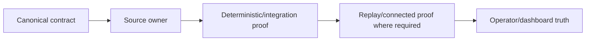

# GoldScalpTrader — Audit 2: Document → Code → Test Compliance

**Status:** OFFLINE COMPLIANCE PASS WITH CONNECTED-PROOF EXCEPTIONS
**Version:** 2.1-implementation-trace
**Authority:** Traceability audit from canonical contract to source owner to deterministic/integration evidence, with connected DEMO evidence explicitly separated.

## 1. Purpose

Audit 2 asks:

> **Can every material documented behavior be traced to an implementation owner and appropriate proof, with no known undocumented production behavior?**

Current answer:

```text
OFFLINE DOCUMENT → CODE → TEST TRACEABILITY     PASS / PARTIAL BY AREA
CONNECTED EXNESS BROKER FACTS                   EXTERNAL_PROOF_PENDING
FUTURE REAL RELEASE                             NOT APPROVED / HARD DISABLED
```

## 2. Traceability model



A missing offline link is a compliance finding. A broker fact that inherently needs real Exness/Windows evidence is not converted into an offline PASS.

## 3. Machine-enforced sync guard

The repository now includes:

```text
scripts/verify_contract_sync.py
```

It is executed by:

```text
scripts/verify_offline_release.py
```

and checks selected high-value frozen-document invariants:

- final 66-document `01–08` topology;
- canonical source-owner paths;
- preserved SMALL/MEDIUM/NORMAL Risk constants;
- disabled-by-default aggressive mode/manual reset;
- 3-loss / 30-minute cooldown baseline;
- one-position baseline;
- `REAL_RELEASE_ENABLED = False`;
- setup-detector + active/shadow separation presence;
- analytical/research/operator layers cannot import raw MT5 writer;
- raw `order_send` remains confined to the sole writer;
- legacy News blackout/post-News warmup terms are absent from current code.

This is a regression guard, not a substitute for design review or connected certification.

## 4. Current high-risk trace matrix

| Requirement | Canonical owner | Implementation owner | Current proof | Status |
|---|---|---|---|---|
| one normalized MT5 read boundary | Market Data/System Contract | `market_data/mt5_reader.py` | `test_mt5_reader.py`, deal/activity tests | COMPLIANT offline; connected facts pending |
| market-first Setup Detector | Strategy Floor | `strategies/setup_detector.py` | `test_cycle_no_forcing.py`, `test_strategy_isolation.py` | COMPLIANT |
| active family cannot force setup | Strategy Floor | detector + isolation + cycle | no-forcing/isolation tests | COMPLIANT |
| exactly one active / shadow separation | Strategy Floor | `strategies/isolation.py` | `test_strategy_isolation.py` | COMPLIANT |
| M5 Opportunity before M1 timing | Entry Timing | opportunity/timing/cycle | `test_decision_pipeline.py` | COMPLIANT |
| M1 cannot create standalone production trade | Entry Timing | timing/cycle | decision/no-forcing tests | COMPLIANT |
| family-aware TradePlan | TradePlan + family extensions | `decisions/trade_plan.py`, `family_trade_plan.py` | decision/quality tests | PARTIAL — more family-specific edge tests desirable |
| fixed+aware executable quality | TradePlan/Execution | `decisions/executable_quality.py` | `test_executable_quality.py` | COMPLIANT offline; real costs pending |
| preserved Risk profiles | Risk Contract | `config/settings.py`, `risk/engine.py` | risk tests + contract-sync verifier | COMPLIANT |
| aggressive mode default false / 8–16 ceilings | Risk Contract | config/risk engine | risk tests + static guard | COMPLIANT |
| News soft-context-only | News/Session contracts | `intelligence/news.py`, permissions/runtime | `test_news_context.py` + static guard | COMPLIANT |
| broker OPEN/CLOSED/PRE_CLOSE authority | Session/Risk | session/permissions/runtime | offline logic | EXTERNAL_PROOF_PENDING for current Exness schedule |
| upstream blocker vs Gate distinction | Execution/Dashboard | cycle/runtime/presentation | Gate/runtime/dashboard tests | COMPLIANT offline |
| one-shot Intent / no blind retry | Execution | intent store/service/reconcile/writer | intent/action-reconcile tests | COMPLIANT offline; ambiguous real ack drill pending |
| sole raw writer | Execution | `execution/mt5_writer.py` | static guard + writer tests | COMPLIANT |
| manual/foreign exposure not adopted | Broker Activity | reader/runtime/closure | deal/action reconciliation tests | COMPLIANT offline; real manual-close drill pending |
| ManagedTrade lifecycle | Trade Manager | `management/*`, runtime | management lifecycle/store tests | COMPLIANT offline; live MODIFY/CLOSE proof pending |
| exactly-once learning | Learning | research learning + close archive | research integrity/governance tests | PARTIAL — connected closed-trade evidence pending |
| autonomous invention/ML cannot self-promote | Research governance | invention/promotion/models | research governance tests | COMPLIANT offline |
| no runtime Git publication | GitHub/Recovery policy | runtime/app tree | architecture/static review | COMPLIANT |
| graphical dashboard read-only | Operator docs | operator + graphical dashboard + runner | graphical runtime/controls tests | COMPLIANT offline |
| REAL disabled | System/Release | `config/settings.py` | contract-sync verifier | COMPLIANT |

## 5. Setup Detector compliance

Required behavior:

```text
chart/market facts
→ Setup Detector
→ actual qualifying family candidate(s)
→ Strategy Isolation policy
```

Not:

```text
active family selected
→ force that family onto every chart
```

Current source/test trace includes:

```text
strategies/setup_detector.py
strategies/isolation.py
app/cycle.py
app/runtime.py
tests/test_cycle_no_forcing.py
tests/test_strategy_isolation.py
```

Current offline verdict: **COMPLIANT**.

## 6. M1 compliance

Required flow:

```text
active-family M5 setup
→ Opportunity
→ subordinate M1 refinement
```

Current implementation is traced through `decisions/opportunity.py`, `decisions/timing.py` and the integrated cycle/runtime path.

No approved path exists from M1 alone to a production Intent.

Current offline verdict: **COMPLIANT**.

## 7. News compliance

The current code must not implement:

```text
News event/provider unavailable
→ hard block solely because of News
```

`verify_contract_sync.py` rejects legacy current-code terms `NEWS_BLACKOUT` and `POST_NEWS_WARMUP` and prevents analytical News modules from gaining broker-writer authority.

Current offline verdict: **COMPLIANT**.

Current provider reliability/event-performance calibration remains research evidence, not permission authority.

## 8. Risk compliance

Machine/static and deterministic tests compare current code against the preserved canonical table:

```text
SMALL   3.0–4.5 / >4.5–6.5 / hard 7 / daily 12
MEDIUM  2.0–3.0 / >3.0–4.5 / hard 5 / daily 9
NORMAL  1.0–2.0 / >2.0–3.5 / hard 4 / daily 7
```

Also guarded:

```text
Aggressive disabled by default
8% single-trade ceiling — not target
16% aggregate/day
one independent position
3 consecutive closed losses / >=30m cooldown
manual reset disabled by default
```

Current offline verdict: **COMPLIANT**.

## 9. Execution compliance

Required irreversible path:

```text
Gate
→ Intent persisted
→ fresh precheck/order_check
→ SUBMITTING persisted
→ one writer send
→ ack classification
→ reconciliation
```

Current ownership:

```text
execution/gate.py
execution/intent_store.py
execution/checks.py
execution/service.py
execution/mt5_writer.py
execution/reconcile.py
execution/controller.py
```

The static contract verifier also scans analytical/research/presentation directories for forbidden writer imports/raw sends.

Current offline verdict: **COMPLIANT**.

Real broker return modes, slippage/deviation and ambiguous acknowledgement drill remain **EXTERNAL_PROOF_PENDING**.

## 10. Management / close compliance

Current managed lifecycle:

```text
verified OPEN
→ ManagedTrade
→ HOLD / PROTECT / TRAIL / RUNNER / EXIT
→ governed MODIFY/CLOSE Intent
→ reconciliation
→ exact close proof
```

Implementation includes `management/closure.py` as the exact close-proof boundary in addition to manager/execution/store.

Current offline verdict: **COMPLIANT** for modeled/tested behavior.

Real broker/manual close visibility remains **EXTERNAL_PROOF_PENDING**.

## 11. Dashboard compliance

Approved graphical UI is implemented through:

```text
operator/graphical_snapshot.py
graphical_dashboard/ui.py
chart.py
controls.py
app/graphical_demo_runner.py
```

Current controls are functional presentation controls; broker cycles remain timer-driven.

Current offline verdict: **COMPLIANT**.

Exact visual polish remains operator-review evidence rather than a safety claim.

## 12. Research / AI compliance

Current research modules have no raw broker authority. Candidate promotion remains evidence-bound and ends at `APPROVAL_REQUIRED` before production.

Current offline verdict: **COMPLIANT for authority boundary; PARTIAL for research depth/connected evidence**.

Research depth can continue improving without changing production authority.

## 13. File/Test Catalog compliance

`MODULE_STRUCTURE.md` and `FILE_AND_TEST_CATALOG.md` are synchronized to current implementation additions including:

```text
market_data/account_mode.py
app/demo_runner.py
app/graphical_demo_runner.py
management/closure.py
scripts/verify_contract_sync.py
scripts/verify_offline_release.py
```

Unexpected future material source/test ownership must update both engineering maps in the same coherent packet.

## 14. Connected evidence exceptions

The following cannot receive a PASS from source/static tests alone:

- actual Exness SymbolSpec/filling/stops/margin behavior;
- actual daily/weekend/DST/holiday schedule;
- real spread/slippage/deviation distributions;
- decision→send→ack→reconcile latency;
- live OPEN/MODIFY/CLOSE/SL/TP lifecycle;
- manual close of a known bot trade;
- ambiguous acknowledgement/no duplicate drill where safely exercisable;
- restart during real active lifecycle;
- fresh-machine restore/handoff;
- statistically meaningful active/shadow DEMO learning evidence.

These remain **Phase 15 EXTERNAL_PROOF_PENDING**.

## 15. Current Audit 2 verdict

```text
DOCUMENT TREE / CANONICAL POLICY        PASS
SOURCE OWNERSHIP MAP                    PASS
HIGH-RISK STATIC CONTRACT SYNC          PASS when verify_contract_sync.py passes locally
DETERMINISTIC/INTEGRATION TEST MAP      PASS/PARTIAL by row above
CONNECTED EXNESS EVIDENCE               PENDING
FUTURE REAL RELEASE                     HARD DISABLED
```

No profitability claim is made.
