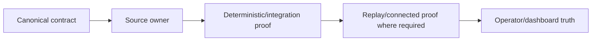

# GoldScalpTrader — Audit 2: Document → Code → Test Compliance

**Status:** OFFLINE COMPLIANCE PASS WITH CONNECTED-PROOF EXCEPTIONS  
**Version:** 2.2-implementation-trace  
**Authority:** Traceability from canonical contract to actual source owner to deterministic/integration evidence, with connected DEMO facts explicitly separated.

## 1. Current verdict

Latest operator-run offline release after commit `7fdf57c` reported:

```text
compileall     PASS
documents      PASS
contract-sync  PASS
secrets        PASS
pytest         PASS
OFFLINE STATUS: PASS
```

Therefore the current audited offline baseline is:

```text
DOCUMENT TREE / CANONICAL POLICY        PASS
SOURCE OWNERSHIP MAP                    PASS
STATIC CONTRACT SYNC                    PASS
DETERMINISTIC / INTEGRATION TEST SUITE  PASS
CONNECTED EXNESS EVIDENCE               PENDING
FUTURE REAL RELEASE                     HARD DISABLED
```

Offline PASS does not certify broker reality or profitability.

## 2. Traceability model



A missing offline link is a compliance finding. A broker fact that inherently needs real Windows/Exness evidence remains external proof rather than being inferred from mocks.

## 3. Machine-enforced sync guard

`scripts/verify_contract_sync.py` is executed by `scripts/verify_offline_release.py` and now pins high-value ownership/proof for:

- frozen 66-document topology;
- canonical source/test paths;
- SMALL/MEDIUM/NORMAL Risk constants;
- aggressive-mode/manual-reset defaults;
- 3-loss / 30-minute cooldown baseline;
- one-position baseline;
- `REAL_RELEASE_ENABLED = False`;
- market-first setup/isolation boundaries;
- hard Session / soft News separation;
- durable Opportunity lifecycle ownership;
- timing-learning lineage ownership;
- management/shadow runtime evidence ownership;
- governed autonomous candidate registry ownership;
- candidate registry cannot directly activate runtime;
- analytical/research/operator layers cannot own raw MT5 writer;
- connected-certification tooling remains read-only.

The verifier is a regression guard, not a substitute for connected certification or adversarial design review.

## 4. High-risk trace matrix

| Requirement | Implementation owner | Current proof | Offline status |
|---|---|---|---|
| normalized MT5 read boundary | `market_data/mt5_reader.py` | reader/deal/activity/domain tests | COMPLIANT; real broker facts external |
| market-first setup detection | `strategies/setup_detector.py` | no-forcing/isolation tests | COMPLIANT |
| exactly one active / shadows non-authoritative | `strategies/isolation.py` | isolation + runtime research tests | COMPLIANT |
| independent BUY/SELL + Red Team | decision fusion/cycle | decision pipeline | COMPLIANT |
| M5 before M1 | decisions + cycle | decision pipeline/no-forcing | COMPLIANT |
| persistent causal Opportunity | `app/opportunity_lifecycle.py` | `test_opportunity_lifecycle.py` | COMPLIANT offline |
| timing lineage into actual learning | runtime/runtime-core + ManagedTrade + learning | timing/managed/live-learning tests | COMPLIANT offline |
| family-aware TradePlan | trade-plan modules | decision/quality tests | COMPLIANT baseline; further family edge depth remains useful |
| executable spread/cost quality | `decisions/executable_quality.py` | executable-quality tests | COMPLIANT offline; real distributions external |
| preserved Risk profiles/ceilings | config/risk | risk tests + static guard | COMPLIANT |
| daily-loss/cooldown restart state | risk state/runtime | risk runtime/state tests | COMPLIANT offline |
| Session OPEN/PRE_CLOSE/CLOSED/UNKNOWN runtime authority | `app/session_news.py`, `app/session_authority.py`, runtime | session provider/runtime authority tests | COMPLIANT offline; actual Exness schedule external |
| News soft only | News/session boundary | News + session tests/static guard | COMPLIANT |
| Gate / persist-before-send / one-shot | execution + `app/runtime_core.py` | intent/gate/controller/runtime tests | COMPLIANT offline |
| sole raw writer | `execution/mt5_writer.py` | writer tests + static scan | COMPLIANT |
| ambiguous ack requires reconciliation | execution/reconcile | action reconciliation tests | COMPLIANT offline; real ambiguous ack external |
| ManagedTrade/close lineage | management + runtime core | management/store/deal tests | COMPLIANT offline |
| verified-close exactly-once learning | closure + live learning | live-learning tests | COMPLIANT offline; real close evidence external |
| management-path research evidence | `research/runtime_evidence.py` | runtime research tests | COMPLIANT offline |
| shadow-family same-market evidence | `research/runtime_evidence.py` | runtime research tests | COMPLIANT offline; statistical DEMO depth pending |
| autonomous invention evidence-bound | invention + `candidate_registry.py` | candidate/research governance tests | COMPLIANT offline |
| candidate cannot self-activate runtime | candidate registry/promotion | candidate tests + static guard | COMPLIANT |
| graphical dashboard read-only | operator/graphical runner/UI | graphical/controls tests | COMPLIANT offline |
| recovery/checkpoint local integrity | persistence/recovery | checkpoint/recovery tests | COMPLIANT offline; fresh-machine connected handoff external |
| REAL disabled | config/startup/runtime layers | settings + contract sync | COMPLIANT / HARD DISABLED |

## 5. Opportunity / Timing compliance

Required hierarchy:

```text
market setup
→ active-family independent thesis
→ M5 Opportunity
→ durable causal Opportunity/Episode
→ subordinate M1 TimingDecision
→ structural TradePlan
→ executable quality
→ Risk / Session / Gate
```

Current implementation preserves stable Opportunity/Episode identity across repeated refresh/restart and terminal `TRIGGERED` handling after irreversible OPEN send. Timing profile/version, event age, M1 trigger age, chase and source-event lineage are frozen into durable pre-send context and then ManagedTrade/verified-close learning where available.

No approved path exists from M1 alone to a production Intent.

Current offline verdict: **COMPLIANT**.

## 6. Session / News compliance

`app/session_authority.py` is now part of the guarded DEMO runtime composition rather than a standalone-only provider.

Offline-tested semantics include:

```text
verified scoped OPEN → eligible hard Session permission
PRE_CLOSE           → no new exposure; governed management/flatten semantics
expired/unverified  → UNKNOWN / fail closed
scope mismatch      → reject
obvious weekend     → CLOSED without fabricating weekday OPEN
News stale/missing  → soft context only
```

Current offline verdict: **COMPLIANT**.

Actual Exness session calendar, PRE_CLOSE timing, DST, holiday and maintenance correctness remain **EXTERNAL_PROOF_PENDING**.

## 7. Execution compliance

Financial path remains:

```text
Gate
→ durable Intent
→ local + broker precheck/order_check
→ SUBMITTING persisted
→ exactly one MT5Writer send
→ acknowledgement classification
→ reconciliation
```

`app/runtime.py` owns runtime policy/orchestration. `app/runtime_core.py` owns the exactly-once financial lifecycle implementation. This split is descriptive ownership, not a second writer path.

Current offline verdict: **COMPLIANT**.

## 8. Learning / autonomous-governance compliance

Actual closed-trade learning remains exactly-once:

```text
verified full close
→ durable learning queue
→ immutable source validation
→ StrategyMemory save
→ queue consume only after durable save
```

`research/timing_learning.py` records timing evidence. `research/runtime_evidence.py` records management-path and shadow-family observations. Missing causal metrics remain `None` rather than fabricated.

`research/candidate_registry.py` requires durable source evidence and preserves evidence-chain/fingerprint lineage. Promotion-stage progression remains governed; stage alone cannot edit runtime settings or activate a strategy. Explicit approval/rollback requirements remain separate from actual deployment authority.

Current offline verdict: **COMPLIANT for authority/integrity boundaries**. Statistical value, overfitting resistance and useful policy improvements still require real accumulated research/DEMO evidence.

## 9. Dashboard compliance

The graphical path is wired through the governed DEMO runtime. Presentation remains read-only and timer-driven. Dashboard DTOs expose hard Session state and Opportunity/Timing information in addition to strategy, TradePlan, Risk, execution and ManagedTrade state.

Current offline verdict: **COMPLIANT** for code/test wiring. Exact intended Windows visual geometry remains operator/connected evidence.

## 10. File/test map synchronization

Current engineering maps must include at least these newer material owners:

```text
app/runtime_core.py
app/session_authority.py
app/opportunity_lifecycle.py
research/timing_learning.py
research/runtime_evidence.py
research/candidate_registry.py

tests/test_session_runtime_authority.py
tests/test_opportunity_lifecycle.py
tests/test_timing_learning_lineage.py
tests/test_runtime_research_evidence.py
tests/test_candidate_registry.py
```

`MODULE_STRUCTURE.md`, `FILE_AND_TEST_CATALOG.md` and `verify_contract_sync.py` are updated together when these ownership/proof mappings change.

## 11. Remaining connected evidence exceptions

The following cannot receive PASS from source/tests alone:

- actual Exness SymbolSpec/filling/stops/freeze/margin/order-check behavior;
- actual daily/weekend/DST/holiday/maintenance schedule;
- real spread/slippage/deviation/fill distributions;
- decision→send→ack→reconcile latency;
- controlled OPEN/MODIFY/PROTECT/TRAIL/CLOSE;
- broker-side TP/SL close visibility;
- manual close attribution of a known bot trade;
- ambiguous acknowledgement/no duplicate under real broker behavior;
- restart during real active lifecycle;
- fresh-machine restore and sequential handoff;
- strategy-isolation attribution under real DEMO activity;
- M1 timing latency/quality under real DEMO activity;
- 3-loss/cooldown persistence under actual closed broker deals;
- statistically meaningful actual/shadow/timing/management learning reports;
- intended Windows graphical layout review.

These remain **Phase 15 EXTERNAL_PROOF_PENDING**.

## 12. Final Audit-2 verdict

```text
OFFLINE DOCUMENT → CODE → TEST TRACEABILITY     PASS
HIGH-RISK AUTHORITY BOUNDARIES                  PASS OFFLINE
CONNECTED EXNESS FACTS                          PENDING
CONNECTED DEMO LIFECYCLE CERTIFICATION          PENDING
FUTURE REAL RELEASE                             HARD DISABLED
```

No profitability claim is made. This audit does not replace the future full forensic repository audit or connected certification.
