# GoldScalpTrader — Audit 4: Zero-Trade Geometry Review

**Status:** FINAL CORRECTIVE AUDIT PROTOCOL — NOT RUN AGAINST IMPLEMENTATION
**Version:** 2.0-zero-trade-with-setup-isolation
**Authority:** Diagnose zero/low trade throughput caused by setup detection, geometry, target room, cost or policy without weakening safety blindly.

## 1. Purpose

A zero-trade result is not automatically a bug and not automatically proof that filters are too strict.

Possible owners:

```text
no real setup
active-family mismatch
M1 timing not ready / missed
TradePlan geometry
executable cost
monetary Risk
position capacity
hard broker/session state
system fault
```

Audit 4 identifies the actual funnel stage before changing policy.

## 2. Opportunity funnel

```mermaid
flowchart LR
    MARKET["Market episodes"] --> SETUPS["Detected Setup Candidates"]
    SETUPS --> ACTIVE["Active-family matching candidates"]
    ACTIVE --> OPP["M5 Opportunities"]
    OPP --> M1["M1 READY"]
    M1 --> PLAN["Valid TradePlans"]
    PLAN --> QUAL["Executable Quality PASS"]
    QUAL --> RISK["Risk PASS"]
    RISK --> HARD["Hard authorities PASS"]
    HARD --> TRADE["Actual trades"]
```



Count and reason every drop.

## 3. Geometry questions

For each valid active-family Opportunity:

- was structural invalidation correctly family-specific?
- was a broader fallback used unnecessarily?
- was an event-specific boundary actually causal/proven?
- was Immediate Obstacle too close?
- was Primary Target credible?
- was gross R below current versioned minimum?
- did old Swing 1.20R leak in accidentally?
- did current entry drift degrade geometry?

## 4. Setup-isolation questions

Low trade count may be intentional while testing one strategy.

Example:

```text
100 meaningful market episodes
30 valid setups across all families
6 belong to current active family
→ low live count may be correct isolation behavior
```

Audit must therefore report both:

```text
all-family Setup Recall
active-family eligible Setup Recall
```

Do not “fix” isolation by letting shadow families trade without governance.

## 5. M1 questions

Check whether M1:

- improves entries;
- waits too long;
- has overly short freshness;
- misses valid M5 Opportunities;
- creates chase protection appropriately;
- has enough bounded history/data quality.

If M1 timing causes most losses of valid opportunities, investigate/calibrate M1 policy rather than loosening TradePlan/Risk.

## 6. Cost questions

A structurally good setup may legitimately fail because:

```text
spread/SL too large
spread/target too large
cost/reward poor
current drift removed room
```

Report raw values. Do not replace them with one generic “spread too high”.

## 7. Risk questions

If valid geometry reaches Risk but minimum lot is unaffordable, that is a real account/broker constraint.

Do not:

- tighten structural SL;
- increase monetary policy;
- auto-enable aggressive mode;
- reduce daily safety merely because trade count is low.

## 8. 120/day benchmark

Use the approved benchmark diagnostically:

```text
potential setup candidates/day
active-family candidates/day
ready entries/day
cost-qualified/day
risk-qualified/day
actual trades/day
```

Ask where the gap arises and whether the lost trades would have had positive after-cost expectancy.

## 9. Corrective decision framework

```text
zero trades because no valid setup
→ no change

zero trades because active family rarely appears
→ gather shadow evidence / consider future governed family switch

zero trades because M1 threshold too strict
→ research calibration candidate

zero trades because geometry owner wrong
→ fix defect

zero trades because costs truly dominate
→ no unsafe loosening; quantify

zero trades because min-lot unaffordable
→ preserve Risk; document account limitation
```

## 10. Required evidence

Audit report includes:

- funnel counts;
- per-family detected candidates;
- active/shadow split;
- exact timing/plan/quality/Risk blocker frequencies;
- counterfactual after-path outcomes for missed/rejected setups, clearly labelled;
- session/regime splits;
- cost distributions;
- false-block estimate;
- 120/day benchmark gap.

## 11. Current status

Protocol is synchronized to the final architecture and remains **NOT RUN** until implementation/replay/connected evidence exists.
