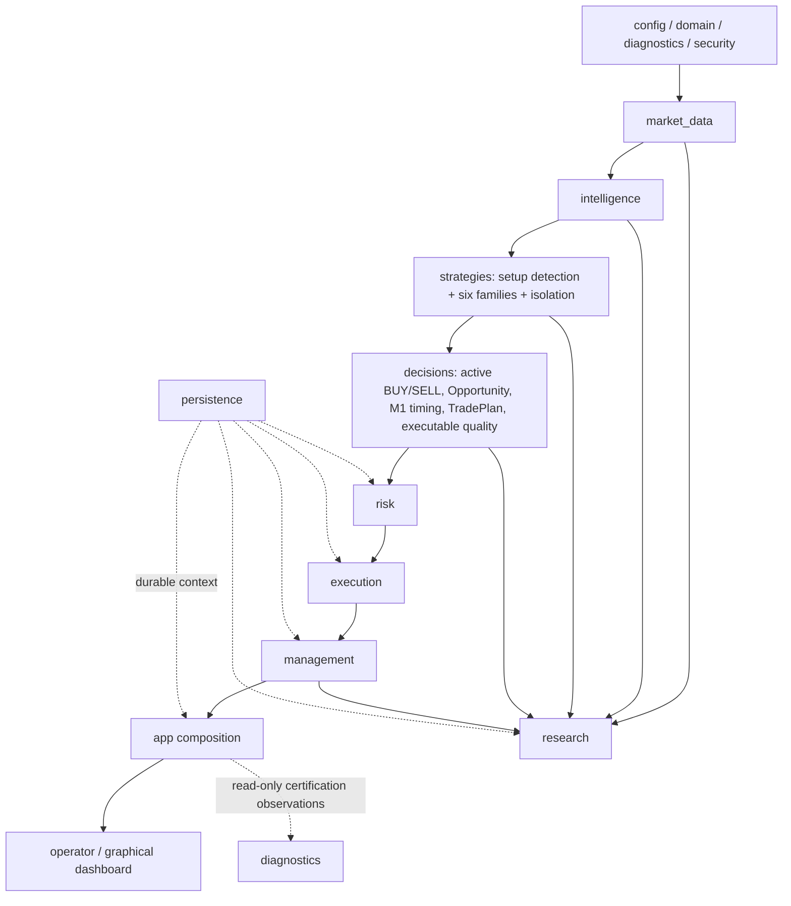

# GoldScalpTrader — Module Structure and File Map

**Status:** IMPLEMENTED ARCHITECTURE MAP — CONNECTED DEMO CERTIFICATION IN PROGRESS
**Version:** 2.4-institutional-scalp-implementation
**Authority:** Actual package/file ownership, dependency direction, setup-detection/isolation boundaries, durable Risk-day authority, serial financial authority, connected evidence observation and research/presentation separation.

## 1. Dependency direction



Broker/financial authority remains serial even if analytical work is physically parallelized after profiling.

## 2. Package authority table

| Package | Owns | Must never own |
|---|---|---|
| `config` | validated settings/policy identities | hidden live policy mutation |
| `domain` | enums, typed IDs/DTOs, units/states | MT5 calls |
| `diagnostics` | structured logs, reason/health models, metrics, read-only accumulated connected-DEMO evidence summaries | trading authority |
| `security` | secret detection/redaction | secret storage |
| `market_data` | sole normalized analytical/recovery MT5 read boundary, account-mode verification and activity normalization | raw irreversible writes |
| `intelligence` | causal descriptive structure/technical/liquidity/quant/session/News context | money/Gate |
| `strategies` | six family definitions, market-first setup detection, Strategy Isolation, analytical scheduler | Risk/broker writes |
| `decisions` | active-family BUY/SELL/Red Team, Opportunity, M1 timing, TradePlan, executable quality | raw MT5 write |
| `risk` | preserved profiles, monetary sizing, durable UTC risk-day/account-safety state, cooldown/re-entry/capacity | strategy rewrite or broker write |
| `execution` | Gate, controller, Intent, checks, sole writer, reconciliation | strategy invention |
| `management` | ManagedTrade, close-proof lineage and HOLD/PROTECT/TRAIL/RUNNER/EXIT decisions | raw writer |
| `persistence` | strict local state/checkpoints/recovery packages | current broker truth |
| `app` | startup/recovery/runtime composition/cadence/DTO assembly, guarded DEMO runners | duplicate policy ownership |
| `operator` | read-only terminal/graphical view models/renderers | authority recomputation |
| `graphical_dashboard` | approved one-screen interactive local UI | trading mutation |
| `research` | replay, learning, discovery, invention, ML, promotion evidence | production broker authority |

## 3. Implemented package tree

```text
src/gold_scalp_trader/
├── config/
│   └── settings.py
├── domain/
│   ├── enums.py
│   ├── ids.py
│   ├── market.py
│   └── models.py
├── diagnostics/
│   ├── logging.py
│   ├── reasons.py
│   ├── health.py
│   ├── metrics.py
│   └── connected_demo.py
├── security/
│   └── financial_secrets.py
├── market_data/
│   ├── account_mode.py
│   ├── mt5_reader.py
│   ├── activity.py
│   └── snapshot.py
├── intelligence/
│   ├── candle_structure.py
│   ├── indicators.py
│   ├── technical.py
│   ├── liquidity.py
│   ├── confluence.py
│   ├── session.py
│   ├── news.py
│   └── snapshot.py
├── strategies/
│   ├── floor.py
│   ├── setup_detector.py
│   ├── isolation.py
│   ├── scheduler.py
│   └── confluence.py
├── decisions/
│   ├── fusion.py
│   ├── snapshot.py
│   ├── opportunity.py
│   ├── timing.py
│   ├── family_trade_plan.py
│   ├── trade_plan.py
│   └── executable_quality.py
├── risk/
│   ├── engine.py
│   ├── state.py
│   ├── runtime.py
│   └── permissions.py
├── execution/
│   ├── models.py
│   ├── checks.py
│   ├── gate.py
│   ├── intent_store.py
│   ├── service.py
│   ├── mt5_writer.py
│   ├── reconcile.py
│   ├── controller.py
│   └── sqlite_coordination.py
├── management/
│   ├── models.py
│   ├── manager.py
│   ├── execution.py
│   ├── closure.py
│   └── store.py
├── persistence/
│   ├── store.py
│   ├── runtime_state.py
│   ├── checkpoint.py
│   ├── backup.py
│   └── local_recovery_package.py
├── research/
│   ├── learning.py
│   ├── live_learning.py
│   ├── replay.py
│   ├── management_replay.py
│   ├── session_history.py
│   ├── stress.py
│   ├── validation.py
│   ├── datasets.py
│   ├── acquisition.py
│   ├── evidence.py
│   ├── packages.py
│   ├── metrics.py
│   ├── outcomes.py
│   ├── ablation.py
│   ├── episode_journal.py
│   ├── discovery.py
│   ├── invention.py
│   ├── models.py
│   └── promotion.py
├── operator/
│   ├── presentation.py
│   ├── terminal_dashboard.py
│   ├── graphical_snapshot.py
│   └── __init__.py
└── app/
    ├── main.py
    ├── runtime.py
    ├── startup.py
    ├── recovery.py
    ├── recovery_mt5.py
    ├── cycle.py
    ├── loop.py
    ├── dashboard.py
    ├── live_presentation.py
    ├── session_news.py
    ├── demo_runner.py
    └── graphical_demo_runner.py

graphical_dashboard/
├── ui.py
├── chart.py
├── controls.py
├── server.py
└── __main__.py
```

Physical files may be refactored only when ownership remains identical and this map plus the file/test catalog are synchronized in the same change packet.

## 4. Setup Detector ownership

`strategies/setup_detector.py` answers:

```text
Given one causal IntelligenceSnapshot,
which strategy-family setup(s) genuinely qualify now?
```

It may return:

```text
NONE
one qualified setup
multiple independently qualified setup candidates
```

It cannot:

- force active family onto the chart;
- create monetary Risk;
- create broker permission;
- silently choose a different live production family.

`strategies/isolation.py` then applies the current policy:

```text
qualified candidate belongs to ACTIVE_EXECUTION family
→ eligible for live decision path

qualified candidate belongs only to SHADOW_ONLY family
→ research/shadow record; live WAIT
```

## 5. Analytical scheduler

`strategies/scheduler.py` owns physical scheduling only.

Correct optimization order:

```text
shared precomputation
→ vectorization/cache
→ serial deterministic baseline
→ profiling
→ bounded parallel execution only where critical path improves
```

Required parity:

- immutable inputs;
- bounded resources;
- deterministic canonical output order;
- worker errors visible;
- no broker/lifecycle side effects;
- one-worker and parallel modes semantically identical.

Physical parallelism is not mandatory if profiling shows no benefit.

## 6. Data/timeframe ownership

`market_data` reads all analytical timeframes through one normalized boundary:

```text
H4 optional
H1
M15
M5
bounded M1 for subordinate entry refinement
quote/tick
```

`market_data/account_mode.py` is the narrow environment guard used by the DEMO runtime to prove the connected MT5 account reports DEMO before any write-capable path proceeds.

`market_data/mt5_reader.py` also owns normalized account-wide/position-scoped deal-history and whole-account position reads used by recovery/Risk accounting. Unavailable history/positions remain UNKNOWN rather than zero.

M1 is production-relevant only as subordinate timing after a valid M5 Opportunity; it cannot independently create a setup.

## 7. Decision ownership

```text
strategies/setup_detector.py
→ family setup classification

strategies/isolation.py
→ live-active vs shadow eligibility

decisions/fusion.py
→ active-family BUY/SELL + Red Team only

decisions/opportunity.py
→ persistent M5 Opportunity/Episode

decisions/timing.py
→ subordinate M1 READY/WAIT/MISSED/INVALID

decisions/trade_plan.py + family_trade_plan.py
→ structural geometry

decisions/executable_quality.py
→ fresh spread/cost/drift/latency economics
```

These owners must remain distinct in behavior even if implementation refactors file placement.

## 8. Risk ownership

`risk/engine.py` owns:

- preserved SMALL/MEDIUM/NORMAL profile resolution/bands;
- dynamic broker-aware volume;
- min-lot actual risk;
- margin;
- aggregate/capacity risk;
- disabled-by-default aggressive 8%/16% overlay.

`risk/state.py` owns the strict durable state model and persistence serialization for:

- fixed UTC risk-day identity and DayStartEquity;
- fixed SMALL/MEDIUM/NORMAL profile for that day;
- Account Safety P/L state;
- daily lock/reset;
- consecutive-loss streak;
- cooldown;
- same-episode re-entry state.

`risk/runtime.py` is a **read/accounting authority component with no broker-write capability**. It:

- reconstructs/bootstraps a UTC day only from verified account-wide history while the whole account is flat and lifecycle-reconciled;
- loads the persisted day/profile on restart instead of resolving from current equity;
- separates identifiable non-trading cash flow from Account Safety P/L;
- consumes exact verified close receipts idempotently for the global loss streak/cooldown;
- returns typed PASS/BLOCK/UNKNOWN Risk authority for new exposure.

`risk/permissions.py` composes Risk-related hard facts. News context is not a hard permission input.

## 9. Session / News acquisition

`app/session_news.py` may provide separate typed outputs:

```text
BrokerSessionFacts  → hard market/session authority
NewsContextFacts    → soft context/research/dashboard
```

Shared transport must never collapse these authority types.

## 10. Execution ownership

Only:

```text
execution/mt5_writer.py
```

may perform raw irreversible broker operations.

All OPEN/MODIFY/CLOSE paths use:

```text
Gate
→ durable Intent
→ fresh checks/order_check
→ SUBMITTING
→ one writer call
→ acknowledgement classification
→ reconciliation
```

No blind retry after ambiguous broker acknowledgement.

## 11. Management ownership

`management/manager.py` decides:

```text
HOLD / PROTECT / TRAIL / RUNNER / EXIT
```

`management/execution.py` turns approved management actions into the same governed execution service/Intent path.

`management/closure.py` owns exact known-trade close proof/archival handoff. Its durable receipt includes the verified close monetary result needed for restart-safe Risk streak/cooldown accounting; it cannot adopt an unknown external Gold position.

Management never imports raw MT5 writer directly.

## 12. Persistence / recovery

`persistence/store.py` is strict durable context, not broker truth.

`persistence/checkpoint.py` exports consistent verified state.

`app/recovery.py` reconciles restored local state with fresh current MT5 truth before trading resumes.

No runtime Git publication module exists.

## 13. Research / learning ownership

Research may run computationally heavier/offline workloads, but cannot mutate live production policy directly.

`research/replay.py` owns causal multi-timeframe completed-bar replay points.

`research/management_replay.py` owns one-position production-capacity replay while keeping shadow hypotheses counterfactual.

`research/evidence.py` + `research/packages.py` own immutable evidence identity/write-new research packages.

`research/promotion.py` stops at `APPROVAL_REQUIRED` before production promotion.

`research/models.py` isolates advanced ML feature/model identity and reproducible evidence.

## 14. Application / DEMO runner ownership

`app/demo_runner.py` and `app/graphical_demo_runner.py` compose the governed DEMO runtime only. They do not create alternative trading policy.

They must preserve:

```text
explicit DEMO account proof
→ persistent StateStore
→ one fixed runtime cadence
→ governed cycle / management lifecycle
→ local checkpoint on safe shutdown
```

The graphical runner supplies immutable/read-only presentation snapshots to the GUI. Chart buttons cannot trigger broker cycles or writes.

## 15. Graphical dashboard ownership

Approved Swing-style Scalp graphical dashboard is local and presentation-only.

`graphical_dashboard/chart.py` owns chart rendering/interactions.

`controls.py` owns functional M1/M5/M15/H1/H4, Indicators, Drawings and Settings interactions.

`operator/graphical_snapshot.py` provides atomic read-only dashboard DTOs.

No dashboard module imports Risk engine or MT5 writer to recalculate/mutate authority.

## 16. Connected DEMO evidence ownership

Phase-15 evidence observation is deliberately separated from trading authority.

`diagnostics/connected_demo.py` owns pure aggregation of already-captured read-only connected-DEMO reports. It verifies one account/symbol scope, accumulates lifecycle facts across time and refuses evidence that claims a certification-tool broker write or REAL release.

`scripts/certify_connected_demo.py` captures one read-only connected snapshot.

`scripts/monitor_connected_demo.py` repeatedly invokes that collector from a separate operator process while the governed DEMO bot may continue trading. It writes only local `runtime/evidence` artifacts, never broker state, source control or production policy.

Cumulative facts such as verified OPEN/MODIFY/CLOSE/learning remain observed once proven. Current-health facts such as unresolved Intent use the latest sample. Manual/restart/handoff/schedule/distribution drills remain explicitly PENDING until actual evidence exists.

## 17. Implemented scripts

```text
scripts/run_walk_forward.py
scripts/acquire_mt5_dataset.py
scripts/report_demo_learning_evidence.py
scripts/certify_connected_demo.py
scripts/monitor_connected_demo.py
scripts/restore_runtime_checkpoint.py
scripts/create_local_recovery_package.py
scripts/create_source_zip.py
scripts/scan_financial_secrets.py
scripts/verify_documents_manual.py
scripts/verify_contract_sync.py
scripts/verify_offline_release.py
```

`certify_connected_demo.py` is a read-only Phase 15 evidence collector. It connects to the intended MT5 DEMO account, reads normalized market/account facts plus local durable evidence, writes an evidence JSON, and performs no broker write. Missing drills remain explicitly PENDING.

`monitor_connected_demo.py` is a read-only accumulation wrapper for long-running DEMO certification. It enforces a minimum sampling interval, rejects scope/REAL/write inconsistencies, writes local runtime evidence atomically and may stop once the core normal DEMO lifecycle has been observed. It never marks external/manual drills PASS by inference.

`verify_contract_sync.py` statically enforces high-value frozen-document invariants against the source tree. It is part of the offline release audit and does not replace connected broker proof.

## 18. Forbidden dependency directions

```text
intelligence/strategy worker → MT5Writer                    NO
setup detector → Risk/Gate                                 NO
shadow family → live Intent                                NO
M1 alone → production Opportunity                          NO
dashboard → authority mutation/recalculation               NO
research/ML → live production mutation                     NO
unknown position/history → zero                            NO
ambiguous broker acknowledgement → blind retry             NO
Risk → tighten structural SL to fit volume                 NO
Risk runtime/accounting authority → broker write            NO
News provider failure → hard trading kill switch           NO
trading runtime → Git commit/push/pull                     NO
backup package → credentials                               NO
connected certification/monitor tool → broker write        NO
connected certification/monitor tool → REAL enablement     NO
```

## 19. Source-map synchronization

Any source/test rename, ownership change or new material script/package updates:

- this file;
- `FILE_AND_TEST_CATALOG.md`;
- owning topic contract when behavior changes;
- affected tests/audits/operator docs;
- final release traceability.

The local offline release verifier must fail when a high-value frozen contract and source tree drift in a way covered by `verify_contract_sync.py`.
