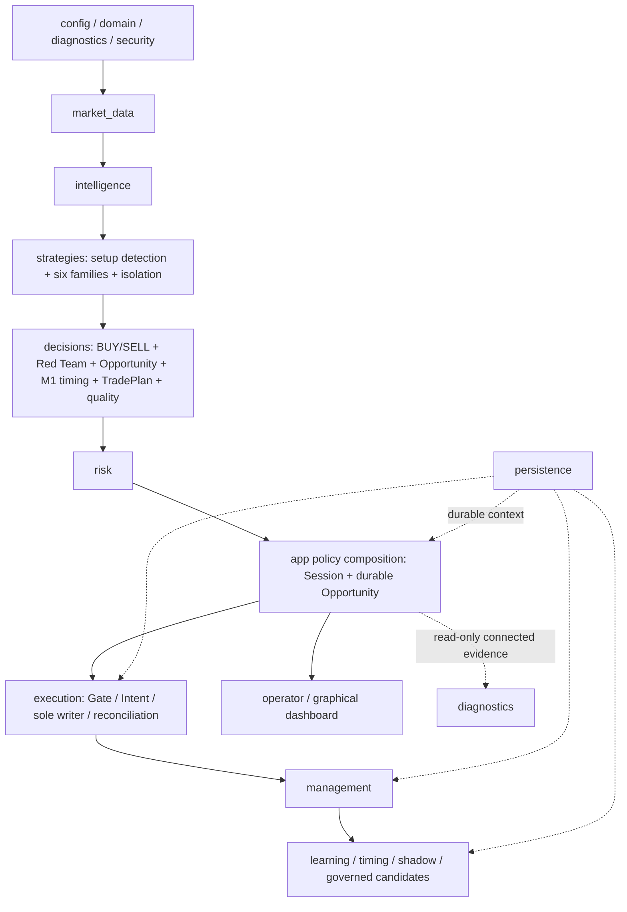

# GoldScalpTrader — Module Structure and File Map

**Status:** IMPLEMENTED ARCHITECTURE MAP — OFFLINE RELEASE BASELINE PASS / CONNECTED DEMO CERTIFICATION IN PROGRESS  
**Version:** 2.5-institutional-scalp-implementation  
**Authority:** Actual package/file ownership, dependency direction, serial financial authority, hard Session/soft News separation, durable timing/learning evidence and read-only connected certification.

## 1. Dependency direction



Broker/financial authority remains serial even if analytical work is physically parallelized after profiling.

## 2. Package authority table

| Package | Owns | Must never own |
|---|---|---|
| `config` | validated settings/policy identities | hidden live policy mutation |
| `domain` | enums, typed IDs/DTOs, units/states | MT5 calls |
| `diagnostics` | logs/health/metrics + read-only connected evidence summaries | trading authority |
| `security` | secret detection/redaction | secret storage |
| `market_data` | normalized MT5 read boundary/account-mode/activity facts | raw irreversible writes |
| `intelligence` | causal market structure/technical/liquidity/session/News context | money/Gate |
| `strategies` | setup detection, six families, isolation, scheduler | Risk/broker writes |
| `decisions` | BUY/SELL/Red Team, Opportunity, M1 timing, TradePlan, executable quality | raw MT5 write |
| `risk` | sizing, UTC risk-day, cooldown/re-entry/capacity | strategy rewrite or broker write |
| `execution` | Gate, controller, Intent, checks, sole writer, reconciliation | strategy invention |
| `management` | ManagedTrade, close proof, HOLD/PROTECT/TRAIL/RUNNER/EXIT | raw writer |
| `persistence` | strict local state/checkpoints/recovery packages | current broker truth |
| `app` | startup/recovery/runtime policy composition/cadence, guarded DEMO runners | duplicate policy ownership |
| `operator` | read-only terminal/graphical view models | authority recomputation |
| `graphical_dashboard` | local presentation/interactions | trading mutation |
| `research` | replay, actual/shadow/timing learning, discovery, candidates/promotion evidence | production broker authority |

## 3. Material current source map

```text
src/gold_scalp_trader/
├── config/settings.py
├── domain/{enums,ids,market,models}.py
├── diagnostics/
│   ├── logging.py
│   ├── reasons.py
│   ├── health.py
│   ├── metrics.py
│   ├── connected_demo.py
│   └── connected_runtime_evidence.py
├── security/financial_secrets.py
├── market_data/{account_mode,mt5_reader,activity,snapshot}.py
├── intelligence/{candle_structure,indicators,technical,liquidity,confluence,session,news,snapshot}.py
├── strategies/{floor,setup_detector,isolation,scheduler,confluence}.py
├── decisions/{fusion,snapshot,opportunity,timing,family_trade_plan,trade_plan,executable_quality}.py
├── risk/{engine,state,runtime,permissions}.py
├── execution/{models,checks,gate,intent_store,service,mt5_writer,reconcile,controller,sqlite_coordination}.py
├── management/{models,manager,execution,closure,store}.py
├── persistence/{store,runtime_state,checkpoint,backup,local_recovery_package}.py
├── research/
│   ├── learning.py
│   ├── live_learning.py
│   ├── timing_learning.py
│   ├── runtime_evidence.py
│   ├── candidate_registry.py
│   ├── replay.py
│   ├── management_replay.py
│   ├── session_history.py
│   ├── stress.py
│   ├── validation.py
│   ├── datasets.py
│   ├── acquisition.py
│   ├── evidence.py
│   ├── packages.py
│   ├── metrics.py
│   ├── outcomes.py
│   ├── ablation.py
│   ├── episode_journal.py
│   ├── discovery.py
│   ├── invention.py
│   ├── models.py
│   └── promotion.py
├── operator/{presentation,terminal_dashboard,graphical_snapshot}.py
└── app/
    ├── main.py
    ├── runtime.py
    ├── runtime_core.py
    ├── session_news.py
    ├── session_authority.py
    ├── opportunity_lifecycle.py
    ├── startup.py
    ├── recovery.py
    ├── recovery_mt5.py
    ├── cycle.py
    ├── loop.py
    ├── dashboard.py
    ├── live_presentation.py
    ├── demo_runner.py
    └── graphical_demo_runner.py
```

Presentation root:

```text
graphical_dashboard/{ui,chart,controls,server,__main__}.py
```

## 4. Decision ownership

```text
setup_detector
→ actual qualifying market setup(s)

isolation
→ exactly one ACTIVE_EXECUTION family; others SHADOW_ONLY

fusion
→ independent BUY / SELL / Red Team for active family

opportunity + app/opportunity_lifecycle
→ persistent causal M5 Opportunity/Episode

timing
→ subordinate M1 READY/WAIT/MISSED/INVALID

trade_plan + family_trade_plan
→ structural geometry

executable_quality
→ spread/cost/drift/latency economics
```

M1 never creates an independent production thesis.

## 5. Session / News ownership

```text
app/session_news.py      → typed provider boundary
app/session_authority.py → hard runtime OPEN/PRE_CLOSE/CLOSED/UNKNOWN authority
intelligence/news.py     → soft context/research only
```

News cannot become hard trading permission. Missing/expired/unverified Session facts fail closed; obvious Saturday fallback may report CLOSED but weekday OPEN is never fabricated.

## 6. Execution ownership

Only `execution/mt5_writer.py` may perform raw irreversible broker operations.

```text
Gate
→ durable Intent
→ fresh checks/order_check
→ SUBMITTING
→ one writer call
→ acknowledgement classification
→ reconciliation
```

`app/runtime.py` owns policy/orchestration. `app/runtime_core.py` preserves the exactly-once financial lifecycle. This split does not create a second writer.

## 7. Learning / autonomous governance ownership

```text
verified close
→ live_learning exactly-once StrategyMemory

timing_learning
→ content-addressed TimingDecision evidence

runtime_evidence
→ management path + same-market shadow evidence

candidate_registry
→ durable evidence-bound candidate identity/stage record
```

Candidate/research stage never directly activates runtime policy, modifies Risk/Gate or gains broker authority.

## 8. Connected DEMO evidence ownership

```text
diagnostics/connected_demo.py
→ pure aggregation + explicit operator-drill validation

diagnostics/connected_runtime_evidence.py
→ read-only Session normalization + timing/management/shadow local counts

scripts/certify_connected_demo.py
→ one connected read-only observation

scripts/monitor_connected_demo.py
→ repeated bounded sampling + Session/research visibility

scripts/report_demo_learning_evidence.py
→ local StateStore learning/evidence report only
```

Connected evidence tooling performs no broker write and cannot enable REAL.

The certifier reports Session independently from quote freshness and exposes durable Timing Intelligence, management and shadow counts. Those counts do not automatically convert canonical external drills into PASS.

## 9. Operator / dashboard ownership

The graphical dashboard remains local and presentation-only. It consumes immutable/read-only runtime snapshots; controls cannot trigger financial authority or alter policy.

## 10. Persistence / recovery ownership

`persistence/store.py` is durable context, not current broker truth. Checkpoint/restore must be reconciled with fresh MT5 facts before financial authority resumes. No runtime Git publication module exists.

## 11. Forbidden directions

```text
intelligence/strategy/research/dashboard → MT5Writer       NO
setup detector → Risk/Gate                                  NO
shadow family → live Intent                                 NO
M1 alone → production Opportunity                           NO
research/candidate registry → runtime activation            NO
News provider failure → hard News trading kill switch       NO
ambiguous broker acknowledgement → blind retry              NO
trading runtime → Git commit/push/pull                      NO
connected certification/monitor → broker write/REAL enable NO
```

## 12. Synchronization

Any material source/test rename, ownership change or new material script/package updates this map, `FILE_AND_TEST_CATALOG.md`, affected status/audit documentation and high-value verification tests. Offline PASS never substitutes for connected DEMO proof.
