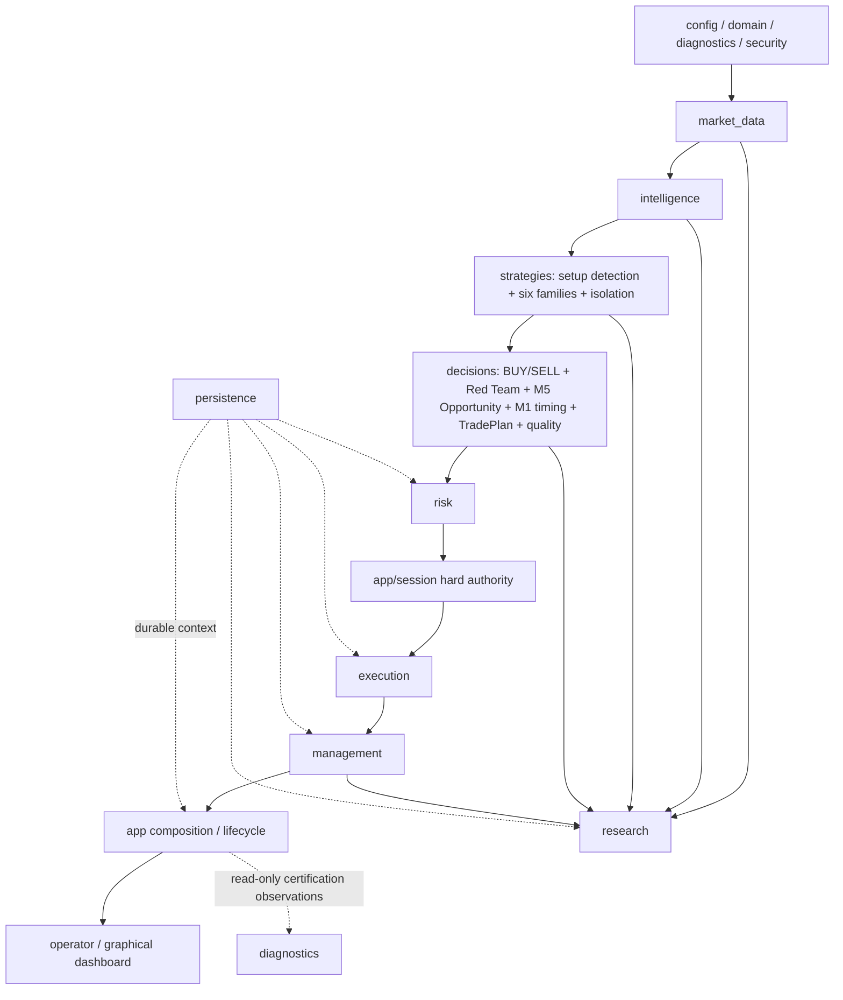

# GoldScalpTrader — Module Structure and File Map

**Status:** IMPLEMENTED ARCHITECTURE MAP — OFFLINE RELEASE PASS / CONNECTED DEMO CERTIFICATION PENDING  
**Version:** 2.5-institutional-scalp-implementation  
**Authority:** Actual package/file ownership, dependency direction, durable Session/Opportunity/timing/research boundaries, serial financial authority and connected-evidence separation.

## 1. Dependency direction



Broker/financial authority remains serial. Research, dashboard and connected-certification tooling have no raw broker authority.

## 2. Package authority table

| Package | Owns | Must never own |
|---|---|---|
| `config` | validated settings/policy identities | hidden live policy mutation |
| `domain` | enums, typed IDs/DTOs, units/states | MT5 calls |
| `diagnostics` | logs/health/metrics/read-only connected evidence | trading authority |
| `security` | secret detection/redaction | secret storage |
| `market_data` | normalized MT5 reads/account-mode/activity facts | raw irreversible writes |
| `intelligence` | causal structure/technical/liquidity/session/News context | money/Gate |
| `strategies` | six families, market-first setup detection, isolation/scheduling | Risk/broker writes |
| `decisions` | independent BUY/SELL/Red Team, analytical Opportunity, M1 timing, TradePlan, quality | raw MT5 write |
| `risk` | preserved risk profiles/sizing/durable UTC risk-day/cooldown/capacity | strategy rewrite/broker write |
| `execution` | Gate/controller/Intent/checks/sole writer/reconciliation | research invention |
| `management` | ManagedTrade, management decisions, exact close proof | raw writer |
| `persistence` | strict local state/checkpoints/recovery packages | current broker truth |
| `app` | startup/runtime policy composition, hard Session, durable Opportunity lifecycle, exactly-once runtime core, DEMO runners | duplicate strategy/Risk authority |
| `operator` | read-only view models/renderers | authority recomputation |
| `graphical_dashboard` | one-screen local UI | trading mutation |
| `research` | actual/shadow/timing/management evidence, replay, invention, candidate governance | runtime activation/broker authority |

## 3. Implemented package tree

```text
src/gold_scalp_trader/
├── config/settings.py
├── domain/{enums.py,ids.py,market.py,models.py}
├── diagnostics/{logging.py,reasons.py,health.py,metrics.py,connected_demo.py}
├── security/financial_secrets.py
├── market_data/{account_mode.py,mt5_reader.py,activity.py,snapshot.py}
├── intelligence/{candle_structure.py,indicators.py,technical.py,liquidity.py,confluence.py,session.py,news.py,snapshot.py}
├── strategies/{floor.py,setup_detector.py,isolation.py,scheduler.py,confluence.py}
├── decisions/{fusion.py,snapshot.py,opportunity.py,timing.py,family_trade_plan.py,trade_plan.py,executable_quality.py}
├── risk/{engine.py,state.py,runtime.py,permissions.py}
├── execution/{models.py,checks.py,gate.py,intent_store.py,service.py,mt5_writer.py,reconcile.py,controller.py,sqlite_coordination.py}
├── management/{models.py,manager.py,execution.py,closure.py,store.py}
├── persistence/{store.py,runtime_state.py,checkpoint.py,backup.py,local_recovery_package.py}
├── research/
│   ├── learning.py
│   ├── live_learning.py
│   ├── timing_learning.py
│   ├── runtime_evidence.py
│   ├── candidate_registry.py
│   ├── replay.py
│   ├── management_replay.py
│   ├── session_history.py
│   ├── stress.py
│   ├── validation.py
│   ├── datasets.py
│   ├── acquisition.py
│   ├── evidence.py
│   ├── packages.py
│   ├── metrics.py
│   ├── outcomes.py
│   ├── ablation.py
│   ├── episode_journal.py
│   ├── discovery.py
│   ├── invention.py
│   ├── models.py
│   └── promotion.py
├── operator/{presentation.py,terminal_dashboard.py,graphical_snapshot.py}
└── app/
    ├── main.py
    ├── runtime.py
    ├── runtime_core.py
    ├── session_authority.py
    ├── opportunity_lifecycle.py
    ├── startup.py
    ├── recovery.py
    ├── recovery_mt5.py
    ├── cycle.py
    ├── loop.py
    ├── dashboard.py
    ├── live_presentation.py
    ├── session_news.py
    ├── demo_runner.py
    └── graphical_demo_runner.py

graphical_dashboard/{ui.py,chart.py,controls.py,server.py,__main__.py}
```

Material file additions/removals must update this map and `FILE_AND_TEST_CATALOG.md` in the same coherent packet.

## 4. Strategy and decision ownership

```text
setup_detector.py → which family setup(s) genuinely qualify from market facts
isolation.py      → exactly one ACTIVE_EXECUTION family; other families SHADOW_ONLY
fusion.py         → active-family independent BUY/SELL + Red Team
opportunity.py    → analytical M5 Opportunity construction
opportunity_lifecycle.py → durable causal Opportunity/Episode state across refresh/restart
timing.py         → subordinate M1 READY/WAIT/MISSED/INVALID refinement
trade_plan.py + family_trade_plan.py → structural geometry
executable_quality.py → spread/cost/drift/latency economics
```

M1 cannot create a production setup. Active strategy selection cannot force its family onto the chart.

## 5. Durable Opportunity lifecycle

`app/opportunity_lifecycle.py` owns persistent causal identity and terminal re-arm behavior around analytical Opportunities.

Required properties:

- same causal M5 setup retains Opportunity/Episode identity across refreshes;
- restart reloads the same lifecycle record;
- WAIT/READY state changes do not manufacture a new causal episode;
- irreversible OPEN send marks the episode `TRIGGERED`;
- terminal state prevents silent same-causal-episode re-entry except governed re-entry rules;
- lifecycle state is local durable context, not broker truth.

## 6. Timing Intelligence / lineage

`decisions/timing.py` owns live analytical timing refinement. `research/timing_learning.py` owns research-only timing evidence.

Timing lineage carried toward verified learning includes, when available:

```text
Opportunity / Episode
M5 source event IDs/time
strategy policy version
Timing profile/policy version
M1 trigger time
M5 event age
trigger age
chase ATR
micro-extension ATR
TradePlan identity/reference
```

The runtime freezes this context before irreversible OPEN send; verified reconciliation then transfers it into ManagedTrade and exact-close learning lineage. Missing efficiency evidence remains unknown rather than fabricated.

## 7. Risk ownership

`risk/engine.py` owns sizing/profile economics. `risk/state.py` owns durable UTC-day/account-safety/cooldown/re-entry state. `risk/runtime.py` is read/accounting authority only. `risk/permissions.py` composes hard financial facts.

News is never a hard Risk/session permission input.

## 8. Session / News ownership

`app/session_news.py` loads typed scoped provider facts:

```text
BrokerSessionFacts → hard market/session source facts
NewsContextFacts   → soft context/research/dashboard
```

`app/session_authority.py` composes the runtime hard Session state and preserves:

- verified scoped OPEN as new-entry permission;
- PRE_CLOSE as no-new-entry state with governed management/flatten semantics;
- expired/unverified/scope-mismatched facts as UNKNOWN/fail-closed;
- obvious weekend CLOSED classification without fabricating weekday OPEN.

Current Exness schedule/DST/holiday correctness remains connected evidence.

## 9. Execution/runtime ownership

`app/runtime.py` is the policy/orchestration layer: Session authority, durable Opportunity composition and operator-facing runtime result.

`app/runtime_core.py` preserves the financial lifecycle mechanics:

```text
Gate
→ durable Intent
→ fresh local/broker prechecks
→ persist SUBMITTING
→ one MT5Writer send
→ acknowledgement classification
→ reconciliation
→ ManagedTrade / governed management / exact close
```

Only `execution/mt5_writer.py` may contain raw irreversible broker operations. No blind retry follows ambiguous acknowledgement.

## 10. Management and close ownership

`management/manager.py` decides HOLD/PROTECT/TRAIL/RUNNER/EXIT. `management/execution.py` turns approved actions into governed Intent/service flow. `management/closure.py` owns exact known-trade close proof, immutable closure receipt and learning-queue handoff.

Unknown/manual Gold exposure is never silently adopted as bot-owned.

## 11. Research / continuous learning ownership

Research is non-authoritative for live financial actions.

```text
research/live_learning.py     → exactly-once verified-close StrategyMemory ingestion
research/timing_learning.py   → durable timing-decision evidence
research/runtime_evidence.py  → management-path + same-market shadow evidence
research/replay.py            → causal completed-bar replay
research/management_replay.py → one-position management/counterfactual replay
research/evidence.py/packages.py → immutable evidence identities/packages
research/invention.py         → declarative candidate invention only
research/promotion.py         → governed stage machine
research/candidate_registry.py→ durable evidence-bound candidate/evidence chain
```

Candidate registry stage alone never activates runtime strategy. Research cannot mutate Risk, Gate, REAL enablement or sole-writer rules.

## 12. Persistence / recovery

`persistence/store.py` is strict checksummed local context. Checkpoints/recovery packages preserve state; current broker truth must be freshly reconciled before financial authority resumes after restore.

No runtime Git publication module exists.

## 13. DEMO runners / operator presentation

`app/demo_runner.py` and `app/graphical_demo_runner.py` compose the governed DEMO runtime only. Both record optional research evidence after the governed cycle returns. Research recording is observational and must not crash or authorize the trading cycle when optional analytical fields are absent.

`operator/graphical_snapshot.py` exposes hard Session plus Opportunity/Timing/TradePlan/Risk/Execution/ManagedTrade state to the read-only GUI. Chart controls cannot cause broker cycles.

## 14. Connected DEMO evidence ownership

`diagnostics/connected_demo.py`, `scripts/certify_connected_demo.py` and `scripts/monitor_connected_demo.py` are read-only certification tooling. They may collect local durable evidence and MT5 read facts but cannot call the writer or enable REAL.

Missing real broker schedule/lifecycle/manual-close/restart/handoff/distribution drills remain PENDING until actually observed.

## 15. Forbidden dependency directions

```text
intelligence/strategy/research → MT5Writer                  NO
setup detector → Risk/Gate                                   NO
shadow family → live Intent                                  NO
M1 alone → production Opportunity                            NO
dashboard → authority mutation                               NO
candidate registry → runtime activation                      NO
research learning → hard safety self-modification            NO
unknown position/history → zero                              NO
ambiguous broker acknowledgement → blind retry               NO
Risk → tighten structural SL to fit volume                   NO
News provider failure → hard trading permission              NO
trading runtime → Git commit/push/pull                       NO
connected certification → broker write / REAL enablement     NO
```

## 16. Source-map synchronization

Any material source/test rename, ownership change or new package updates:

- this file;
- `FILE_AND_TEST_CATALOG.md`;
- `scripts/verify_contract_sync.py` where the ownership/proof is high value;
- owning behavioral contract only when behavior changes;
- affected audit/status/operator guides.

A green offline release proves only the checked offline implementation. Connected Exness evidence remains a separate Phase-15 gate, and REAL remains hard-disabled.
