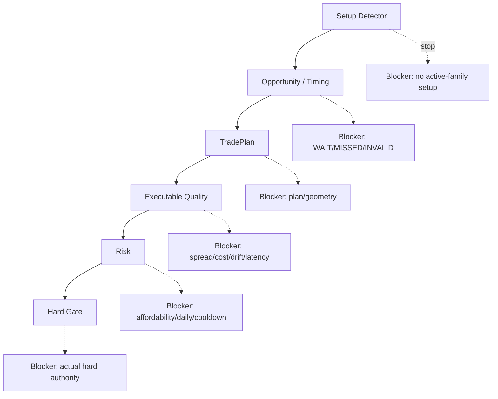

# GoldScalpTrader — System Health and Diagnostics

**Status:** FINAL HEALTH/DIAGNOSTICS CONTRACT — IMPLEMENTATION PENDING
**Version:** 2.0-institutional-scalp
**Authority:** Runtime health taxonomy, exact reason attribution, degraded/fault states, performance telemetry, blocker/Gate truth and operator diagnostics.

## 1. Purpose

Diagnostics must answer:

> **What is healthy, what is degraded, what exactly stopped the current action, and which owner can resolve it?**

A single generic `WAIT` or `BLOCKED` is insufficient.

## 2. Health domains

Track independently:

```text
MT5 connectivity
account/server identity
symbol/spec
quote freshness
H1/M15/M5/M1 data quality
intelligence coverage
setup detection
Strategy Isolation policy
Opportunity/timing
TradePlan
Executable Quality
Risk-day / monetary Risk
broker session
News/context provider
exposure/ownership
controller
Intent/reconciliation
ManagedTrade
persistence/checkpoint
learning/research/candidate system
dashboard
performance/latency
```

## 3. Standard health states

```text
HEALTHY
DEGRADED
WAITING
RECONCILING
BLOCKED
FAULTED
UNKNOWN
NOT_APPLICABLE
NOT_EVALUATED
```

Use domain-specific typed reason codes in addition to state.

## 4. Exact blocker attribution



If upstream stops the path:

```text
Gate = NOT_EVALUATED
```

Do not display `Gate BLOCKED` unless Gate was actually evaluated and blocked.

## 5. Setup / active-family diagnostics

Required display/reason distinctions:

```text
NO_SETUP_DETECTED
ACTIVE_FAMILY_SETUP_NOT_PRESENT
SHADOW_SETUP_DETECTED
MULTIPLE_SETUP_CANDIDATES
ACTIVE_SETUP_QUALIFIED
ACTIVE_SETUP_CONFLICTED
```

Example:

```text
Detected Setup: LIQUIDITY_SWEEP_REVERSAL
Active Test Family: BREAKOUT_RETEST
Live Signal: WAIT
Reason: ACTIVE_FAMILY_SETUP_NOT_PRESENT
Shadow: Liquidity Sweep valid
```

This prevents strategy forcing from being hidden behind a generic signal.

## 6. Market-data diagnostics

Expose:

- last successful MT5 read;
- quote source/capture timestamps and age;
- bid/ask/spread;
- resolved symbol/spec identity;
- H1/M15/M5/M1 latest completed bar timestamps;
- expected vs unexplained gaps;
- positions/deals availability;
- reader latency.

`positions=None/error` must display unavailable, not zero.

## 7. Analytical coverage diagnostics

Per desk/family where useful:

```text
coverage % / completeness
required evidence missing
optional context unavailable
causal event age
source IDs
worker/scheduler latency
```

Important optional evidence missing should show reduced coverage, not automatic bearish/zero.

## 8. M1 timing diagnostics

Expose:

```text
M5 Opportunity state/age
M1 trigger/pattern
M1 trigger age
chase distance
Approved Entry→current drift
READY / WAIT / MISSED / INVALID reason
```

M1 should never appear as an independent live setup source.

## 9. Executable-quality diagnostics

Show current values/reasons for:

```text
absolute spread
emergency ceiling state
spread/SL
spread/target
recent spread baseline
estimated cost/reward
slippage allowance
quote age
price drift
analysis→send age / revalidation state
```

Avoid one opaque `SPREAD_TOO_HIGH` when the actual problem is cost relative to target room.

## 10. Risk diagnostics

Display:

- fixed UTC-day profile;
- normal/elevated/hard bands;
- actual proposed monetary risk;
- normalized volume;
- min-lot actual risk;
- margin state;
- Account Safety P/L;
- daily lock/reset state;
- loss streak;
- cooldown start/release state;
- same-episode re-entry availability/use;
- capacity/exposure.

Aggressive mode must explicitly show ENABLED/DISABLED and the active policy version.

## 11. Session / News diagnostics

Keep separate:

```text
Broker Market State: OPEN/PRE_CLOSE/CLOSED/REOPEN/UNKNOWN
News Context Health: VERIFIED/DEGRADED/STALE/UNAVAILABLE/UNKNOWN
```

A News provider fault is visible but not presented as a hard trading block under current design.

## 12. Execution diagnostics

Expose:

- Gate state/reason;
- controller holder/epoch/expiry;
- Intent ID/state/action;
- send allowance/count;
- fresh broker precheck result;
- order_check result;
- acknowledgement class;
- reconciliation state;
- broker ticket/deal lineage where safe;
- decision→send/ack/reconcile timings.

Ambiguous lifecycle is shown as unresolved/reconciling, never success/failure guessed from UI convenience.

## 13. Persistence / recovery diagnostics

Expose independently:

```text
StateStore integrity
schema/version
last transaction/heartbeat
latest verified checkpoint
checkpoint hash/status
recovery state
pending unresolved Intents
ManagedTrade reconciliation
learning queue count
closure receipt status
active strategy policy state
```

## 14. Learning / research diagnostics

Show:

- actual learning status;
- active family/version;
- shadow episode count;
- discovery health;
- candidate count/stages;
- ML research status;
- best challenger evidence state;
- `APPROVAL_REQUIRED` where applicable;
- no broker authority.

## 15. Performance telemetry

Measure stage timing:

| Stage | Example |
|---|---|
| MT5 snapshot | acquisition ms |
| intelligence | total + per desk |
| setup detector | all-family classification ms |
| isolation/active decision | ms |
| M1 timing | ms / trigger age |
| TradePlan | ms |
| Executable Quality | ms |
| Risk/Gate | ms |
| decision→send | ms |
| writer ack | ms |
| reconcile | ms |
| dashboard render | ms |

Use percentiles/distributions in research rather than only averages.

## 16. Stable reason-code principles

Reason codes must be:

- machine-readable;
- stable across presentation layers;
- owner-specific;
- one primary reason plus optional details;
- not secret-bearing.

Examples:

```text
NO_SETUP_DETECTED
ACTIVE_FAMILY_SETUP_NOT_PRESENT
M1_TRIGGER_NOT_READY
ENTRY_CHASED
TARGET_ROOM_POOR
SPREAD_EMERGENCY
COST_REWARD_POOR
MIN_LOT_RISK_EXCESSIVE
DAILY_LOSS_LOCK
LOSS_COOLDOWN
MARKET_PRE_CLOSE
POSITION_DATA_UNAVAILABLE
CONTROLLER_FENCED
ORDER_CHECK_FAILED
AMBIGUOUS_ACK
RECONCILING
```

## 17. Logging

Structured logs should include safe IDs/timestamps/reasons and exclude secrets.

Correlate one cycle/action through:

```text
snapshot_id
setup_candidate_id
Opportunity/Episode ID
TradePlan ID
Intent ID
position ticket where safe
candidate/research IDs
```

## 18. Dashboard truth rule

The dashboard may enrich/format facts but cannot reinterpret UNKNOWN into healthy, recalculate Risk/Gate or hide a shadow-only setup as live signal.

## 19. Planned proof

Tests cover:

- state/reason mapping;
- blocker vs Gate truth;
- active/shadow setup diagnostics;
- unavailable vs zero;
- Risk/profile display;
- News soft health vs hard session state;
- Intent/reconciliation visibility;
- performance metric units;
- secret redaction;
- dashboard DTO parity.

## 20. Final invariant

> **Every non-trade, degradation and failure must be attributable to the correct owner with enough evidence to distinguish strategy quality, timing, cost, monetary policy, broker safety and system faults. Diagnostics explain authority; they never create it.**
