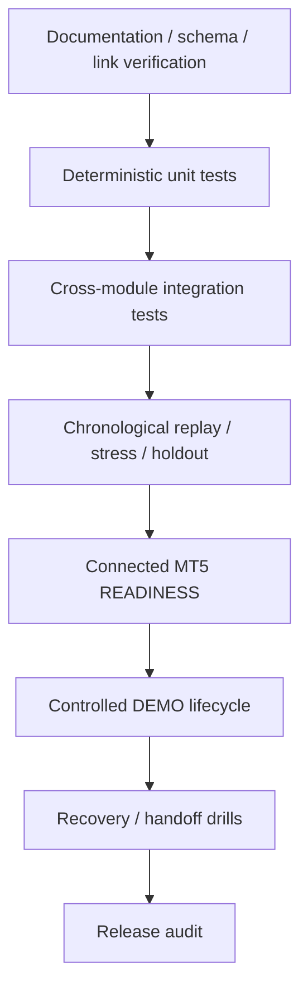

# GoldScalpTrader — Testing and Verification

**Status:** FINAL VERIFICATION STANDARD — IMPLEMENTATION EVIDENCE PENDING
**Version:** 2.0-institutional-scalp
**Authority:** Test layers, causal replay, deterministic parity, failure/restart proof, connected DEMO evidence and claim discipline.

## 1. Verification principle

Every test proves only what it actually exercises.

```text
documentation consistency
≠ unit test pass
≠ integration pass
≠ chronological replay evidence
≠ connected MT5 read proof
≠ controlled DEMO execution proof
≠ recovery proof
≠ profitability
```

No result is promoted to a stronger evidence class by wording.

## 2. Test pyramid



## 3. Documentation verification

Planned `verify_documents_manual.py` should verify at least:

- 66 canonical Markdown files;
- final `01`–`08` folder topology;
- no obsolete numbered folders;
- relative links resolve;
- required metadata/status headers;
- no stale `64-file` completion claims;
- no stale M1 diagnostic-only production wording;
- no News hard-block/cooldown/warmup wording in current owners;
- no blended six-family live-voting wording;
- setup detector / active-vs-shadow rule represented;
- preserved Risk table consistency;
- graphical dashboard no-scroll/functionality contract represented;
- top-level GitHub/backup policies present.

## 4. Deterministic market-data tests

Cover:

- symbol/alias resolution;
- SymbolSpec normalization;
- completed-bar exclusion of forming H1/M15/M5;
- bounded causal M1 history;
- candle ordering/duplicates/impossible OHLC;
- quote source/capture time and staleness;
- future-clock corruption;
- expected closure gap vs unexplained sparse gap;
- positions `[]` vs unavailable `None/error`;
- deal/history typed failure.

## 5. Chronology / no-lookahead tests

For every structural/technical/liquidity/strategy event:

```text
prefix before knowledge time
→ event absent

prefix at/after knowledge time
→ event may appear
```

Prove:

- pivot vs confirmation time;
- pool exists before sweep;
- FVG after third-candle close;
- OB after qualifying structural consequence;
- session range uses only then-known bars;
- M1 trigger uses then-known micro data;
- replay and live-style prefix semantics match.

## 6. Setup detector tests

Must prove market-first behavior.

Cases:

```text
no qualifying family setup
→ NONE

only Liquidity Sweep qualifies
→ Detected Setup = Liquidity Sweep

active family = Breakout Retest
only Liquidity Sweep qualifies
→ no live Breakout Retest Opportunity
→ live WAIT
→ shadow Liquidity Sweep record

multiple families independently qualify
→ preserve each candidate + causal lineage
→ active-family eligibility applied afterward
```

The test must fail if active-family identity changes the underlying setup classification.

## 7. Strategy Isolation tests

Prove:

- exactly one `ACTIVE_EXECUTION` policy identity;
- remaining five `SHADOW_ONLY`;
- all six may analyze;
- only active family can create production Opportunity;
- shadow family cannot create Intent/write;
- active-family switch is versioned;
- historical trade attribution does not change after switch;
- restart restores exact active policy or fails safely if corrupt.

## 8. Active BUY/SELL / Red Team tests

Prove:

- independent BUY/SELL cases;
- no single scalar inverse shortcut;
- required vs optional evidence;
- UNKNOWN optional evidence not silently zero;
- event/correlation de-duplication;
- shadow conflict remains context/research rather than live vote;
- score never changes monetary Risk.

## 9. Opportunity / M1 timing tests

Prove:

- M5 setup required before production Opportunity;
- M1 alone cannot create Opportunity;
- WAIT preserves surviving Opportunity identity;
- M1 fresh trigger can move WAIT→READY;
- M5 invalidation produces INVALID;
- chase/event age/drift can produce MISSED;
- terminal identity does not reset next poll;
- re-arm requires explicit fresh causal event;
- restart revalidates rather than trusting persisted READY.

## 10. TradePlan tests

Prove:

- family-correct invalidation hierarchy;
- Breakout Retest M5 retest-failure boundary when valid;
- Sweep/Failed Break causal event extreme when proven;
- conservative fallback when event-specific proof absent;
- outward buffer/tick normalization;
- target provenance;
- immutable original R;
- no structural stop rewrite to fit minimum lot;
- no automatic fixed Swing 1.20R hard dependency.

## 11. Executable Quality tests

Prove calculations and reason codes for:

- absolute emergency spread ceiling;
- spread/SL;
- spread/target;
- recent spread baseline comparison;
- expected total cost/reward;
- slippage allowance;
- price drift/chase;
- decision→send latency;
- fresh quote revalidation;
- no cost double counting;
- no historical plan rewrite.

Latency-expiry case should prove:

```text
budget exceeded
→ fresh quote/re-evaluation
→ continue only if still valid
```

not unconditional rejection.

## 12. Preserved monetary Risk tests

Exact regression table:

| Profile | DayStartEquity | Normal | Elevated | Hard | Daily |
|---|---:|---:|---:|---:|---:|
| SMALL | positive < $300 | 3.0–4.5% | >4.5–6.5% | 7% | 12% |
| MEDIUM | $300–$999.99 | 2.0–3.0% | >3.0–4.5% | 5% | 9% |
| NORMAL | >= $1,000 | 1.0–2.0% | >2.0–3.5% | 4% | 7% |

Also prove:

- profile fixed through UTC risk day;
- min-lot actual-risk evaluation;
- margin UNKNOWN;
- aggressive mode default disabled;
- 8% is ceiling, not target;
- 16% aggregate/daily ceilings;
- manual reset default disabled;
- one fresh same-episode re-entry;
- 3 losses → at least 30m cooldown + release conditions;
- restart does not clear daily/cooldown/re-entry state;
- score cannot choose higher risk.

## 13. Session / News tests

Hard session:

- OPEN/PRE_CLOSE/CLOSED/UNKNOWN;
- daily T-20/T-10;
- weekend T-60/T-30;
- daily one-clean-M5 reopen;
- weekend two-clean-M5 + gap assessment;
- schedule UNKNOWN fails hard where required.

News/context:

- provider VERIFIED/DEGRADED/STALE/UNAVAILABLE/UNKNOWN;
- 1800s context-cache freshness baseline;
- no timestamp laundering;
- high-impact event does not directly hard-block;
- provider failure does not directly hard-block;
- no News cooldown;
- no mandatory post-News warmup;
- actual spread/data/quote deterioration can still block through its real owner.

## 14. Execution tests

Must prove:

```text
upstream TradePlan/Quality/Risk stop
→ Gate NOT EVALUATED
```

and actual hard authority failure at Gate → Gate BLOCKED.

Execution lifecycle tests:

- persist Intent before send;
- precheck/order_check failure → send count 0;
- persist SUBMITTING before writer;
- one Intent ID sends at most once;
- sole raw writer confinement;
- explicit broker reject;
- ambiguous ack → ACCEPTED_UNKNOWN;
- no blind retry;
- OPEN/MODIFY/CLOSE reconciliation;
- current controller epoch required;
- stale controller denied;
- manual/foreign exposure never adopted.

## 15. Persistence / recovery tests

Cover:

- strict schema/type parsing;
- finite numeric validation;
- idempotent identical duplicate vs conflict;
- Opportunity/TradePlan ordering;
- unresolved Intent restart;
- ManagedTrade reconciliation;
- exact full close proof;
- close learning queue/receipt crash windows;
- active strategy policy persistence;
- candidate/promotion state persistence;
- full checkpoint hash/integrity;
- restore into new path;
- sequential machine handoff simulation;
- no runtime Git operation.

## 16. Management tests

Cover:

- HOLD through ordinary pullback;
- PROTECT only after earned structure;
- TRAIL without widening;
- time-efficiency EXIT;
- Runner requires fresh objective/evidence;
- profit alone insufficient for Runner;
- partial management only where broker-valid/divisible;
- 0.01-lot no-partial correctness;
- PRE_CLOSE flatten through normal Intent path;
- manual/broker close exact lineage;
- actual close required before final learning.

## 17. Dashboard tests

Read-only semantics:

- presentation cannot import/use raw writer;
- cannot recalculate Risk/Gate authority;
- exact upstream blocker vs Gate state;
- Detected Setup separate from Active Test Family;
- shadow setup labelled research only;
- unknown values render UNKNOWN/—, never fake zero.

Graphical UI contract:

- primary desktop composition has no scrollbar;
- M1/M5/M15/H1/H4 controls change chart timeframe state;
- Indicators/Drawings/Settings controls are functional;
- chart interactions do not mutate trading policy;
- snapshot update is atomic/consistent.

## 18. Research / learning tests

Prove:

- actual vs shadow vs missed vs blocked vs fault evidence separation;
- exact active-family trade lineage;
- one-shot final holdout;
- no-lookahead replay including M1;
- capacity replay;
- costs/slippage/latency assumptions explicit;
- exactly-once StrategyMemory;
- candidate fingerprints/rejection memory;
- autonomous invention declarative boundary;
- advanced ML feature/data/model identity;
- automated stage progression evidence-bound;
- final progression stops at `APPROVAL_REQUIRED`;
- research has zero raw broker authority.

## 19. Performance tests

Measure, do not assume:

- MarketSnapshot acquisition;
- intelligence critical path;
- each family/setup detector;
- active decision;
- M1 refinement;
- plan/quality/Risk;
- decision→send;
- writer ack/reconcile;
- dashboard rendering.

If bounded parallelism is enabled:

```text
serial one-worker semantics
==
parallel semantics
```

and critical-path latency must demonstrably improve enough to justify complexity.

## 20. Replay / calibration evidence

Replay must report:

- Net R / Avg R / Profit Factor / drawdown;
- Opportunity Recall / Capture Rate;
- false blocks / missed opportunity cost;
- trades/hour/day and 120/day benchmark gap;
- Entry/Capture/Exit Efficiency;
- MFE/MAE;
- spread/SL / spread/target / cost/reward;
- slippage/latency/drift assumptions;
- family/session/regime/event-context slices;
- active vs shadow comparisons.

No result may use future-confirmed facts.

## 21. Connected READINESS / DEMO evidence

Connected evidence must verify current intended environment:

- account/server/symbol identity;
- actual SymbolSpec;
- current broker schedule;
- terminal/account/symbol permissions;
- read latency/data behavior;
- order_check/filling modes;
- actual spreads/slippage/deviation;
- controlled OPEN/MODIFY/SL/TP/CLOSE;
- manual known-trade close;
- ambiguous/recovery behavior where safely testable;
- restart during active lifecycle;
- checkpoint/restore/handoff.

## 22. Verification commands

After implementation/tooling exists:

```powershell
python -m pytest -q
python -m ruff check src tests scripts
python -m compileall -q src tests scripts
git diff --check
python scripts/scan_financial_secrets.py .
python scripts/verify_documents_manual.py .
```

Exact release may add further commands. Record the exact revision/environment/results.

## 23. Failure rule

A failing test is evidence of a mismatch, not permission to weaken the contract.

```text
reproduce
→ identify owner/invariant
→ root-cause fix
→ regression
→ focused proof
→ integration/full proof
→ documentation/map synchronization
```
