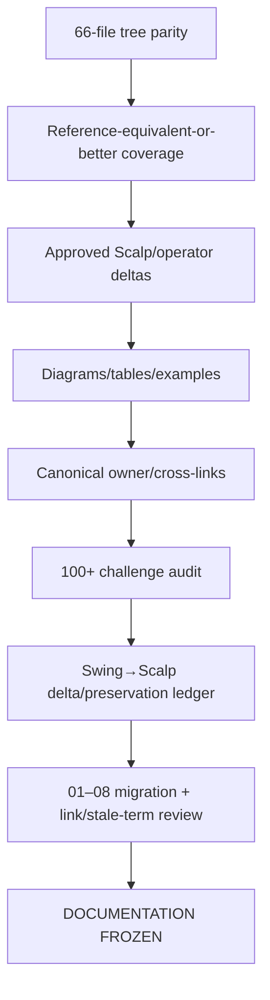

# GoldScalpTrader — Documentation Standard

**Status:** FINAL FROZEN DOCUMENTATION GOVERNANCE STANDARD
**Version:** 2.1-institutional-final
**Authority:** Canonical documentation depth, visuals, ownership, naming, synchronization, evidence wording and no-chat-history reconstructability.

## 1. Documents are the project baseline

`Documents/` is the durable contract/build/proof manual for the operator, developer, future AI and auditor.

```text
DOCUMENTED CONTRACT
→ IMPLEMENTATION
→ TEST / EVIDENCE
→ SYNCHRONIZED DOCUMENTATION
```

Code may not silently become newer design authority than the manual.

## 2. Final canonical topology

```text
Documents/
├── README.md
├── GLOSSARY.md
├── GITHUB_STRICT_USE_POLICY.md
├── BACKUP_SYNC_AND_RECOVERY_ARCHITECTURE.md
├── CODER_GUIDE.md
├── PROJECT_BUILD_AND_RECOVERY_GUIDE.md
├── FINAL_BUILD_PROMPT.md
├── USER_MANUAL.md
├── SETUP_AND_RUN_GUIDE.md
├── 01-foundation/
├── 02-market-intelligence/
├── 03-trading-decisions/
├── 04-risk-execution/
├── 05-research-learning/
├── 06-operator/
├── 07-engineering/
└── 08-governance/
```

Total canonical Markdown files: **66**.

Old `00/10/20/30/40/50/60/90` paths are retired after migration.

## 3. Reference reconstruction rule

Latest verified GoldSwingTraderAI `Published_B/Documents` is the preservation/depth reference.

For inherited material classify meaning as:

```text
PRESERVE
ADAPT_FOR_SCALP
OPERATOR_CHANGED
REFERENCE_DEFECT_CORRECTION
EXTERNAL_FACT_UPDATE
NOT_APPLICABLE_WITH_REASON
ADD_NEW_SCALP_REQUIREMENT
```

Useful reference meaning may not be silently dropped merely to shorten documents or code.

## 4. Institutional content standard

Where relevant, each substantive contract explains:

1. purpose;
2. scope;
3. authority;
4. non-authority;
5. assumptions;
6. typed inputs/outputs;
7. IDs/units/timezones;
8. invariants;
9. lifecycle/state machine;
10. chronology/knowledge time;
11. happy/WAIT/degraded/failure/UNKNOWN paths;
12. restart/recovery;
13. idempotency/duplicate behavior;
14. concurrency/order/performance;
15. broker/account implications;
16. monetary Risk implications;
17. persistence implications;
18. operator/dashboard meaning;
19. research/learning effect;
20. security/secrets;
21. planned source owner;
22. deterministic/integration/connected proof;
23. calibration/external-proof items;
24. cross-document dependencies;
25. reference-preserved behavior;
26. Scalp/operator-directed differences;
27. known non-goals/deferred architecture.

Not every file needs the same headings; every relevant concept needs enough detail to implement correctly without chat history.

## 5. Visual explanation standard

Use visuals when they materially clarify non-trivial flow/state/authority/ordering.

Approved formats:

- Mermaid `flowchart` — dependencies/authority/topology;
- Mermaid `stateDiagram-v2` — lifecycles;
- Mermaid `sequenceDiagram` — execution/recovery ordering;
- Markdown tables — matrices/contracts/comparisons;
- ASCII geometry — price/setup examples where useful;
- empirical charts — only from real replay/DEMO evidence.

Never fabricate performance charts.

## 6. Trading-design wording requirements

Current documents must consistently state:

- chart/market facts determine setup; active strategy is not forced onto every trade;
- exactly one live-active strategy during isolation testing, five shadow-only;
- six strategy families remain preserved;
- M5 setup authority + subordinate M1 refinement;
- important indicators/confluence may be family-specific rather than universal filters;
- persistent Opportunity is distinct from timing;
- TradePlan structural geometry precedes Risk;
- fixed emergency spread plus spread/SL, spread/target and cost/reward quality;
- preserved monetary Risk bands/percentages;
- News/Fundamentals are soft context only;
- broker/account/session/lifecycle safety remains hard;
- one-shot Intent / sole writer / reconciliation;
- backend invention/tuning/ML active, production promotion approval-gated;
- 120/day is benchmark, not quota;
- approved graphical dashboard is one-screen/no-scroll with functional chart controls.

## 7. One owner, explanatory mirrors

Reduce duplicate **authority**, not useful explanation.

Example:

```text
04-risk-execution/RISK_CONTRACT.md
= canonical monetary Risk owner

USER_MANUAL.md
= operator explanation of exact same values

07-engineering/CODING_STANDARD.md
= implementation constraints

06-operator/DASHBOARD_AND_UX.md
= presentation requirements
```

Mirrors may repeat critical numbers for readability only if synchronized with the canonical owner.

## 8. Code documentation standard

When implementation begins:

### Module docstrings

Explain purpose, authority, non-authority, dependencies, state/concurrency and failure model.

### Class/function docstrings

Explain non-trivial input/output units, side effects, UNKNOWN/failure behavior, idempotency, thread-safety, broker/persistence consequences and invariants.

### Inline comments

Explain **why** for chronology, broker quirks, one-shot safety, recovery ordering, numerical formulas, cost/Risk reasoning and measured optimization decisions.

Avoid trivial syntax narration.

## 9. Evidence wording

Use exact statuses such as:

```text
DOCUMENTATION FROZEN
IMPLEMENTATION PENDING / IMPLEMENTED
DETERMINISTIC PROOF PENDING / PASS
CALIBRATION PENDING
EXTERNAL PROOF PENDING / PASS
CONNECTED DEMO PENDING / PASS
APPROVAL_REQUIRED
DEFERRED
NOT RUN
```

Architecture approval is not implementation proof. Unit tests are not DEMO proof. DEMO is not profitability proof.

## 10. Affected-graph synchronization

Material changes inspect/update as applicable:

```text
canonical topic owner
→ System Contract / Architecture / Trading Floor
→ Design Decisions / Open Questions
→ Documentation Comparison / Preservation Ledger
→ Module Structure / File-Test Catalog
→ Coder / Build / Setup / User / Final Build guides
→ Operator/Dashboard
→ Testing / Release / relevant Audits
→ Coverage Matrix / Documentation Audit
```

A behavior change is incomplete while a canonical consumer still states the old rule.

## 11. Naming / path rule

Current categories use sequential `01`–`08` names for immediate readability.

No current doc should link to or instruct readers to use retired `00/10/.../90` category paths.

Final/future document verifier should flag:

- broken links;
- retired path names;
- duplicate parallel manuals;
- stale major policy phrases;
- missing canonical files.

## 12. Reconstructability test

A new capable reader with no chat history must be able to answer:

- what the bot optimizes;
- how setup is detected;
- why active strategy cannot be forced;
- which family is live-active vs shadow;
- M5/M1 roles;
- soft vs hard evidence;
- exact monetary Risk profiles;
- spread/cost evaluation;
- News treatment;
- one-shot broker execution;
- management/recovery;
- AI/invention/ML boundaries;
- dashboard behavior;
- what changed from SwingTrader;
- what remains calibration/external proof;
- what is documented vs implemented/proven.

If chat history is materially required, documentation is incomplete.

## 13. Documentation review process



## 14. GitHub editing discipline

Prefer coherent packets over remote micro-patching.

Before a write packet:

- verify current `main`;
- prepare interconnected changes;
- avoid unrelated code changes;
- use fast-forward update only;
- verify exact changed paths afterward.

## 15. Final invariant

> **A GoldScalpTrader document is acceptable only when it is accurate, deeply explained, visually clear where appropriate, authority-safe, implementation-ready, testable, synchronized and reconstructable without chat history. Clean means structured and precise—not shallow.**
