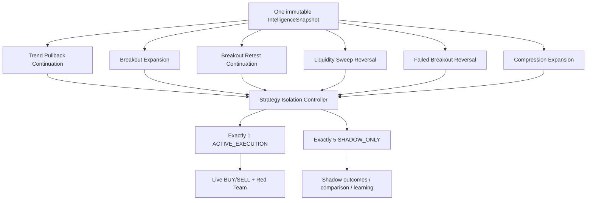
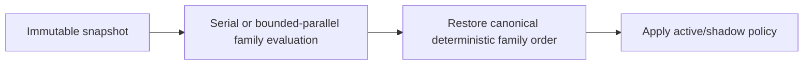

# GoldScalpTrader — Strategy Floor

**Status:** APPROVED STRATEGY CONTRACT — DOCUMENTATION RECONSTRUCTION / CALIBRATION PENDING
**Version:** 2.0-one-active-five-shadow
**Authority:** Six strategy-family definitions, Strategy Isolation Mode, family attribution, shared evidence, analytical scheduling and research handoff.

## 1. Purpose

The Strategy Floor defines six independent market hypotheses while preserving clean live attribution.

> **All six strategies may think; exactly one may trade at a time.**

This is deliberately different from a blended live multi-strategy voting engine. The operator wants to measure the real efficiency of each strategy independently.

The Strategy Floor does not own:

- monetary Risk;
- broker market state;
- controller ownership;
- Execution Gate;
- MT5 writes;
- production promotion without operator approval.

## 2. Six-family map



## 3. Strategy Isolation Mode

### 3.1 States

```text
ACTIVE_EXECUTION
SHADOW_ONLY
RESEARCH_ONLY / DISABLED     # only through governed policy when needed
```

Exactly one preserved family is `ACTIVE_EXECUTION` for live trade origination during an evaluation period.

### 3.2 Active family may

- evaluate independent BUY and SELL cases;
- create the production M5 Opportunity;
- hand that Opportunity to M1 timing;
- progress through TradePlan, Executable Quality, Risk and execution if later authorities pass.

### 3.3 Shadow families may

- analyze the same immutable snapshot;
- publish what they would have done;
- record candidate Opportunity/timing/plan counterfactuals;
- provide bounded challenge/context to Red Team;
- contribute to research, autonomous invention and ML datasets;
- compete statistically with the active family.

### 3.4 Shadow families may not

- create live broker Intent;
- create a second live production Opportunity;
- vote an active-family non-trade into a trade;
- change the active-family live direction;
- size money;
- consume another live position slot.

## 4. Family definitions

| Family | Core question | Distinctive evidence | Common non-requirements |
|---|---|---|---|
| Trend Pullback Continuation | Is an established move resuming after an efficient pullback? | H1/M15 context, M5 pullback/resumption, location, room | every SMC primitive |
| Breakout Expansion | Is accepted structure releasing directional expansion? | qualified break, acceptance, displacement/momentum, path | perfect retest |
| Breakout Retest Continuation | Did a meaningful break hold on an efficient retest? | break, retest zone, M5 response, room | every confluence tool |
| Liquidity Sweep Reversal | Was a pre-existing liquidity pool taken and rejected? | pool, sweep, reclaim/rejection, reversal structure | wick alone |
| Failed Breakout Reversal | Did attempted acceptance fail and reverse? | failed break, opposing response, location/path | identical sweep narrative |
| Compression Expansion | Did compression release with directional evidence? | compression, break/release, volatility/momentum build | pre-guessed direction |

## 5. FamilyReport contract

Each family report should preserve at least:

```text
family
mode: ACTIVE_EXECUTION | SHADOW_ONLY | RESEARCH_ONLY
direction cases: BUY + SELL
score / evidence strength
coverage
required evidence status
supporting evidence[]
opposing evidence[]
causal event/source IDs
M5 setup identity / age
location/room
preferred M1 timing profile
confidence explanation
reasons[]
```

A report is soft analytical evidence. It is never monetary/broker permission.

## 6. Trend Pullback Continuation

Question:

> Is a directional move resuming from a useful pullback rather than already being chased?

Potentially important evidence:

- H1 broad direction/regime;
- M15 structure/location;
- M5 pullback and resumption;
- EMA20/50 relationship;
- RSI reset/pressure;
- ATR/volatility;
- trendline/Fibonacci where useful;
- adequate target path.

Some of these may be strong or family-required after calibration. Missing Fib/POC/FVG does not automatically invalidate the family unless the versioned family definition explicitly requires it.

## 7. Breakout Expansion

Question:

> Is a meaningful break being accepted with enough momentum/path to expand rather than immediately fail?

Potential evidence:

- causal M15/M5 break;
- completed acceptance;
- displacement/expansion;
- rising momentum/volatility;
- liquidity/path room;
- current M5 event freshness.

Late breakout chase belongs to Opportunity/M1/executable-quality logic rather than being hidden inside the family score.

## 8. Breakout Retest Continuation

Question:

> Did a meaningful breakout hold on retest, with an efficient local invalidation boundary and continuation evidence?

Potential evidence:

- causal breakout;
- retest of broken structure/zone;
- M5 hold/rejection/continuation;
- local target room;
- M1 subordinate refinement after M5 Opportunity;
- optional trendline/Fib/POC support.

Its structural invalidation may be M5-first because the actual retest-failure boundary can be materially tighter and more thesis-correct than broad M15 structure.

## 9. Liquidity Sweep Reversal

Question:

> Did price take a pre-existing meaningful pool and reject/reclaim it sufficiently to support reversal?

Potential evidence:

- pre-existing M15/M5 liquidity;
- real sweep/reclaim rather than wick-only penetration;
- M5 rejection/transition;
- location;
- opposing target path;
- M1 micro reclaim/refinement after the setup is armed.

A relevant exact sweep extreme may become family-specific invalidation geometry if causally proven.

## 10. Failed Breakout Reversal

Question:

> Did attempted structural acceptance fail and produce a credible opposing response?

Potential evidence:

- FAILED_BREAK event;
- return through broken level;
- M5 opposing displacement/MSS;
- location/path;
- M1 reversal-entry refinement.

This stays distinct from Liquidity Sweep even when the same episode shares causal evidence.

## 11. Compression Expansion

Question:

> Did a meaningful compression release with actual direction and enough room?

Potential evidence:

- M15/M5 compression;
- break/release;
- directional body/volatility expansion;
- path/liquidity room;
- no severe late extension;
- M1 refinement if an M5 Opportunity already exists.

Do not guess direction before release evidence.

## 12. Important evidence is not universal evidence

The user-approved rule is:

> **EMA, RSI, Fib, FVG, OB, Trendline, POC and related evidence can be extremely important, but must not become unrelated universal restrictions.**

Family contracts classify evidence explicitly:

```text
REQUIRED_FOR_FAMILY
STRONG_SUPPORT
OPTIONAL_SUPPORT
OPPOSITION
NOT_RELEVANT
UNKNOWN
```

A missing family-required fact can stop that family. It must not automatically block another strategy family.

## 13. Physical scheduling

Family calculations are logically independent. Physical parallelism is profiling-driven.



Required invariants:

- identical input snapshot;
- no worker broker call;
- no worker lifecycle mutation;
- bounded worker resources;
- deterministic results/order;
- one-worker and parallel semantic parity.

## 14. Correlation / event lineage

All six families may recognize the same event differently. Research needs those differences; live confidence must not multiply one causal event into fake certainty.

Preserve:

```text
parent event ID
structure/liquidity event IDs
zone/pool identity
timeframe
family interpretation
```

Correlation control is analytical de-duplication, not a limit on how many families can analyze.

## 15. Opportunity handoff

Only active family can drive:

```text
FamilyReport
→ active BUY/SELL debate
→ Red Team
→ persistent M5 Opportunity
→ subordinate M1 timing
```

The shadow reports remain attached for research attribution but cannot alter live production lineage.

## 16. Throughput / quality philosophy

The floor must not optimize for either:

```text
few “perfect” trades
or
forced high trade count
```

Measure jointly:

- active-family Opportunity Recall;
- shadow Opportunity Recall;
- actual trades/day;
- 120/day benchmark gap;
- false blocks;
- missed valid moves;
- Net R/expectancy;
- entry/capture efficiency;
- costs/slippage;
- drawdown/loss streak;
- slot occupancy/hold time.

## 17. Research and family switching

An evaluation period should preserve:

```text
active family
policy/version ID
start/end timestamps
market/data/code identity
actual outcomes
shadow-family counterfactuals
```

Research may propose the next active family or a candidate variant. Production switch is governed/versioned and must follow the project's approval rules.

## 18. Dashboard

```text
STRATEGY FLOOR
ACTIVE      Breakout Retest Continuation
SHADOW      Pullback / Breakout / Sweep / Failed Break / Compression
Active BUY  82
Active SELL 31
Red Team    moderate conflict
Opportunity ARMED
Shadow Best Sweep Reversal BUY 77 • research only
```

The dashboard must clearly label shadow output as **not live authority**.

## 19. Planned ownership / proof

Planned source:

```text
strategies/floor.py
strategies/isolation.py
strategies/parallel.py or equivalent profiling-driven scheduler
strategies/confluence.py
decisions/fusion.py
```

Tests must prove:

- all six families analyze;
- exactly one active;
- five shadow;
- shadow cannot create live Opportunity/Intent;
- active family switch preserves historical attribution;
- BUY/SELL independence;
- optional evidence semantics;
- event correlation lineage;
- one-worker/parallel parity;
- no MT5 import/write authority in strategy layer.

## 20. Calibration

Open items:

- family qualification thresholds;
- family-required vs optional evidence;
- within-family weights;
- Red-Team conflict thresholds;
- event correlation caps;
- session/regime effects;
- M1 preferred timing profiles;
- strategy rotation/evaluation duration.

## 21. Final invariant

> **The strategy floor maximizes auditable opportunity discovery while preserving one-strategy-at-a-time live attribution. Shadow strategies learn and challenge; they do not contaminate live execution. Each family may value its own important evidence without imposing a global filter soup on the whole bot.**
