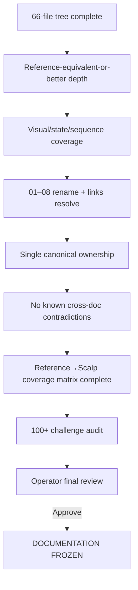

# GoldScalpTrader — Documentation Audit

**Status:** ACTIVE 66-DOCUMENT RECONSTRUCTION AUDIT — NOT FROZEN
**Version:** 1.0-reference-tree-depth-rebuild
**Authority:** Documentation inventory, reference parity, reconstruction completeness, visual-depth requirements, contradiction tracking and final freeze readiness.

## 1. Why this audit was reopened

A prior documentation pass incorrectly treated a **64-file name-matched manual** as structurally complete. A deeper check against the later verified GoldSwingTraderAI `Published_B/Documents` snapshot found:

1. the true latest reference tree contains **66 Markdown documents**;
2. two top-level files were missing from GoldScalpTrader;
3. many current Scalp contracts were materially shorter/shallower than their reference counterparts;
4. Mermaid/state/sequence diagrams were largely absent from current Scalp docs;
5. several earlier design assumptions have since been explicitly changed/approved by the operator.

Therefore the previous “final review ready” status is superseded.

## 2. Verified tree parity

### Reference `Published_B/Documents`

```text
Top-level Markdown documents     9
00-foundation                    5
10-market-intelligence           7
20-trading-decisions             7
30-risk-execution                6
40-research-learning             7
50-operator                      3
60-engineering                  14
90-governance                    8
TOTAL                           66
```

### Prior GoldScalpTrader

```text
Top-level Markdown documents     7
all eight subfolder counts       matched reference
TOTAL                           64
```

### Missing top-level documents

```text
GITHUB_STRICT_USE_POLICY.md
BACKUP_SYNC_AND_RECOVERY_ARCHITECTURE.md
```

Both are required in the reconstructed manual.

## 3. Folder/file-name parity result

Direct subfolder inventories were checked against latest `Published_B`:

| Area | Ref count | Prior Scalp count | Filename parity |
|---|---:|---:|---|
| Foundation | 5 | 5 | PASS |
| Market Intelligence | 7 | 7 | PASS |
| Trading Decisions | 7 | 7 | PASS |
| Risk/Execution | 6 | 6 | PASS |
| Research/Learning | 7 | 7 | PASS |
| Operator | 3 | 3 | PASS |
| Engineering | 14 | 14 | PASS |
| Governance | 8 | 8 | PASS |
| Top level | 9 | 7 | **FAIL: 2 missing** |

No hidden extra subfolder filename gap was found in the eight numbered categories during this tree-level audit.

## 4. Content-depth finding

Filename parity is not content parity.

Representative prior Scalp docs were materially compressed relative to reference depth. Examples observed in the earlier comparison included Architecture, Trading Floor, Build Phases, Entry Timing, Strategy Floor, File/Test Catalog and corrective audit files.

This audit therefore uses **coverage**, not byte count, as the acceptance criterion.

Required result:

> Every useful reference contract section is preserved/adapted or explicitly classified as not applicable, and every new Scalp requirement is added with equal or greater implementation/test/recovery detail.

## 5. Visual-documentation finding

Repository search on the prior Scalp default branch found no meaningful `mermaid`/`flowchart` usage while reference Architecture/Foundation documents used Mermaid diagrams extensively.

This is a quality gap.

Reconstruction requirement:

- flow diagrams for dependency/authority topology;
- state diagrams for lifecycle;
- sequence diagrams for execution/recovery ordering;
- tables for contracts/matrices/thresholds;
- formulas/examples where useful;
- empirical charts only after real replay/DEMO evidence exists.

## 6. Approved architecture changes to integrate

The reconstruction must incorporate these operator-approved decisions:

### News / Fundamentals

- remove News from hard trading permission;
- remove News-triggered cooldown;
- remove mandatory post-News warmup;
- provider/API outage is context-health degradation, not a trading kill switch;
- event impact may still be detected through actual spread/drift/dislocation/quote/cost/broker facts;
- News remains dashboard/research/attribution context.

### Timeframes / entry

- M5 remains primary setup/thesis authority;
- M1 becomes subordinate entry refinement after a valid M5 Opportunity;
- M1 cannot create independent production trades;
- M1 patterns/freshness, M5 event age, chase distance and Approved Entry→Executable Price drift are calibration variables.

### Strategy evaluation isolation

- all six families may analyze;
- exactly one family is `ACTIVE_EXECUTION` at a time;
- remaining five are `SHADOW_ONLY` for clean efficiency comparison;
- shadow families cannot originate live trades;
- active-family switching is versioned/governed;
- live attribution must remain clean.

### Performance architecture

- logical specialist independence preserved;
- physical analytical parallelism profiling-driven;
- shared calculations/vectorization/caching first;
- financial/broker authority remains serial.

### Spread/cost

Approved hybrid design:

```text
absolute emergency spread ceiling
+ spread/SL
+ spread/target
+ recent healthy spread comparison
+ total cost/reward
```

### Risk

Do not change current SMALL/MEDIUM/NORMAL base percentages/bands.

Preserve current 3-loss/30-minute cooldown and one same-episode re-entry; later research may propose calibrated alternatives.

### Research/AI

Autonomous strategy invention, candidate parameter tuning, automatic evidence-stage progression and advanced ML remain active backend improvement capabilities. They may not silently change production; final live promotion requires operator approval.

### Deferred

Operator approved deferral of:

- same-account active-active/distributed writer;
- distributed DB/fencing infrastructure;
- sophisticated partial-close optimization as a release dependency;
- mandatory paid third-party News API;
- GitHub Actions/cloud compute dependency.

### Throughput

120 trades/day is an approved **research throughput benchmark**, never a forced execution quota.

## 7. Approved documentation-quality changes

- documents must be deeply explained and expert/institutional level;
- diagrams/tables/state machines are required where meaningful;
- code later must be optimized, clean, typed and deeply reason-commented;
- useful detail must not be removed merely to reduce duplication;
- exact authority should have one canonical owner while mirrors remain explanatory;
- final numbered folders should become `01` through `08` rather than `00/10/.../90`;
- rename must be atomic with cross-link verification.

## 8. Repository-visibility finding

Reference GitHub policy used a private-repository lock. Current GoldScalpTrader is public. The operator explicitly chose **not to change repository visibility now**.

Therefore current reconstruction must document the fact truthfully and must not perform a visibility mutation.

## 9. Current reconstruction packets

### Packet A — Foundation/policies

Target scope:

- add/adapt `GITHUB_STRICT_USE_POLICY.md`;
- add/adapt `BACKUP_SYNC_AND_RECOVERY_ARCHITECTURE.md`;
- deeply reconstruct Project Vision;
- System Contract;
- Architecture;
- Trading Floor Architecture;
- Build Phases;
- Documentation Standard;
- README;
- this Audit.

This packet establishes the canonical design that later topic documents must follow.

### Later packets

1. Market Intelligence;
2. Trading Decisions;
3. Risk/Execution;
4. Research/Learning;
5. Operator;
6. Engineering/audits/source-test catalog;
7. Governance/manuals/handoff;
8. atomic folder rename/link migration;
9. reference-section coverage matrix;
10. 100+ post-rebuild challenge.

## 10. Acceptance criteria per document

A document is reconstructed only if relevant coverage includes:

```text
purpose / scope / authority / non-authority
inputs / outputs / states / units / IDs
invariants and state machine
chronology / knowledge time
happy / wait / degraded / failure / unknown
restart / recovery / idempotency
concurrency / ordering / performance
risk / broker / persistence implications
operator / dashboard meaning
research / learning effect
security / secrets
source ownership
unit / integration / connected proof
calibration / external proof
cross-links
diagrams / tables / examples
reference-preserved + Scalp/operator deltas
```

## 11. Final freeze gates



## 12. Current verdict

```text
LATEST REFERENCE TREE IDENTIFIED           PASS
66-DOC TARGET CONFIRMED                    PASS
MISSING TOP-LEVEL DOCS IDENTIFIED          PASS
SUBFOLDER FILENAME PARITY                  PASS
CONTENT-DEPTH PARITY                       IN PROGRESS
VISUAL DOCUMENTATION PARITY                IN PROGRESS
APPROVED SCALP DELTAS IN FOUNDATION        IN PROGRESS
ALL 66 DOCS RECONSTRUCTED                  NO
FOLDER NUMBERING MIGRATED                  NO
FULL CROSS-LINK VALIDATION                 NO
POST-REBUILD 100+ CHALLENGE                NO
OPERATOR FINAL APPROVAL                    NO
DOCUMENTATION FREEZE                       NO
IMPLEMENTATION AUTHORIZED                  NO
```

## 13. Final audit invariant

> **No future “documentation complete” statement may be based on filename count or high-level semantic consistency alone. It requires complete tree parity, reference-section coverage, institutional depth, visual clarity, resolvable cross-links, authority ownership, challenge testing and explicit operator final approval.**
