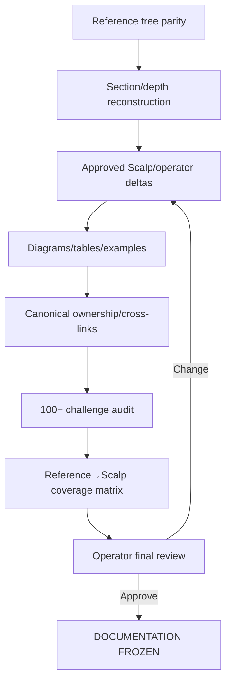

# GoldScalpTrader — Documentation Standard

**Status:** APPROVED DOCUMENTATION GOVERNANCE — INSTITUTIONAL RECONSTRUCTION STANDARD
**Version:** 2.0-expert-baseline
**Authority:** Canonical documentation depth, visual explanation, ownership, synchronization, naming, reconstruction, change control and AI/developer handoff rules.

## 1. Documents are the project baseline

`Documents/` is the durable project contract and build guide for:

- the operator;
- a new developer;
- a future AI with no chat history;
- an auditor/reviewer;
- implementation/test/recovery work.

The source code must implement the documents; it must not silently become a newer design authority than the documents.

```text
DOCUMENTED CONTRACT
→ IMPLEMENTATION
→ TEST / EVIDENCE
→ DOCUMENTATION SYNC
```

## 2. Reference reconstruction rule

Latest verified GoldSwingTraderAI `Published_B/Documents` contains **66 Markdown documents** and is the current structural/depth reference for reconstruction.

GoldScalpTrader may differ when:

- scalping genuinely requires a different design;
- the operator explicitly approved a difference;
- a reference defect/obsolete external fact is identified;
- GoldScalpTrader requires additional detail that Swing did not need.

Reference sections must not be silently dropped merely to make a shorter manual.

For each meaningful reference section, the reconstruction decision is one of:

```text
PRESERVE
ADAPT_FOR_SCALP
OPERATOR_CHANGED
REFERENCE_DEFECT_CORRECTION
EXTERNAL_FACT_UPDATE
NOT_APPLICABLE_WITH_REASON
ADD_NEW_SCALP_REQUIREMENT
```

## 3. Canonical document tree target

The approved final folder numbering is sequential/readable:

```text
Documents/
├── README.md
├── GLOSSARY.md
├── GITHUB_STRICT_USE_POLICY.md
├── BACKUP_SYNC_AND_RECOVERY_ARCHITECTURE.md
├── CODER_GUIDE.md
├── PROJECT_BUILD_AND_RECOVERY_GUIDE.md
├── FINAL_BUILD_PROMPT.md
├── USER_MANUAL.md
├── SETUP_AND_RUN_GUIDE.md
├── 01-foundation/
├── 02-market-intelligence/
├── 03-trading-decisions/
├── 04-risk-execution/
├── 05-research-learning/
├── 06-operator/
├── 07-engineering/
└── 08-governance/
```

During staged reconstruction, current legacy folder paths may temporarily remain until the atomic rename/cross-link packet is ready. Final freeze cannot retain broken/duplicate numbering.

## 4. Document quality bar

A substantive contract must be **complete enough that a capable reader can implement it without relying on chat history**.

Where applicable it must explain:

1. purpose;
2. scope;
3. authority;
4. non-authority;
5. assumptions;
6. typed inputs;
7. typed outputs;
8. IDs/units/timezones;
9. invariants;
10. lifecycle/state machine;
11. chronology/knowledge time;
12. normal/happy path;
13. WAIT/degraded path;
14. failure/UNKNOWN path;
15. restart/recovery path;
16. idempotency/duplicate behavior;
17. concurrency/order/thread-safety;
18. performance/latency concerns;
19. broker/account implications;
20. monetary Risk implications;
21. persistence/state implications;
22. operator/dashboard meaning;
23. research/learning meaning;
24. security/secrets implications;
25. source/module ownership;
26. deterministic unit tests;
27. integration tests;
28. connected/DEMO proof;
29. calibration variables;
30. external-proof variables;
31. cross-document dependencies;
32. reference-preserved behavior;
33. Scalp-specific differences;
34. operator-approved differences;
35. known non-goals/deferred architecture.

Not every file requires 35 literal headings. Every **relevant concept** requires explicit coverage.

## 5. Visual explanation standard

Expert documentation is not prose-only.

### 5.1 Required visual types

Use the most appropriate representation:

- Mermaid `flowchart` for dependencies/authority topology;
- Mermaid `stateDiagram-v2` for lifecycle/state machines;
- Mermaid `sequenceDiagram` for ordered interactions/crash/recovery/broker workflows;
- Mermaid class/entity diagrams where they clarify typed ownership;
- Markdown tables for contracts, comparisons, matrices and thresholds;
- ASCII geometry diagrams for price/SL/target/sweep structures where clearer;
- real charts after actual replay/DEMO evidence exists.

### 5.2 Visual requirement

A document needs diagrams when the concept contains non-trivial:

- dependency flow;
- state transition;
- sequence ordering;
- authority boundary;
- recovery path;
- data lineage;
- strategy/trade geometry;
- deployment/backup topology.

Do not add decorative diagrams that communicate nothing.

### 5.3 Charts

Never fabricate performance charts using made-up data.

Before empirical evidence exists, use:

- conceptual diagrams;
- tables;
- formulas;
- sample schemas clearly labeled examples.

After replay/DEMO evidence exists, relevant research/audit documents should include or link reproducible charts for:

- expectancy;
- drawdown;
- family comparison;
- entry/capture efficiency;
- spread/slippage/latency;
- session/regime segmentation;
- throughput/opportunity recall;
- shadow versus active strategy results.

## 6. One owner, many explained mirrors

Reducing duplicate **authority** does not mean reducing useful explanation.

Example:

```text
RISK_CONTRACT.md
= canonical numerical owner

USER_MANUAL.md
= readable explanation of those exact values

CODER_GUIDE.md
= implementation consequences

DASHBOARD_AND_UX.md
= display requirements
```

A mirror may repeat an important number for readability, but must identify the canonical owner and be validated/synchronized when that owner changes.

## 7. Trading-design documentation principles

The reconstructed manual must explicitly preserve approved product philosophy:

- maximize qualified opportunity recall and entry efficiency;
- exactly one live trade-producing strategy family at a time during strategy-isolation evaluation;
- remaining families shadow/analyze/research;
- M5 setup authority + subordinate M1 entry refinement;
- important indicators may strongly support the relevant family but must not become unrelated universal restrictions;
- News/Fundamentals remain context/research, not hard trade block/cooldown;
- fixed emergency spread safety + context-aware spread/SL, spread/target and cost/reward evaluation;
- current monetary Risk bands/percentages remain unchanged;
- broker/account/lifecycle hard safety remains objective and serial;
- backend invention/tuning/ML remains active but production promotion requires operator approval;
- 120 trades/day is a research throughput benchmark, not a forced quota.

## 8. Code documentation standard

When code implementation begins, source must be expert-level, clean, typed and deeply understandable.

### 8.1 Module documentation

Every material module documents:

- purpose;
- authority boundary;
- key dependencies;
- state/concurrency model;
- what the module must never do.

### 8.2 Function/class documentation

Document where non-trivial:

- input/output semantics;
- units/timezone;
- side effects;
- failure/UNKNOWN behavior;
- idempotency;
- concurrency/thread-safety;
- broker/persistence implications;
- invariant or mathematical meaning.

### 8.3 Inline comments

Comments explain **why**, especially:

- chronology/no-lookahead protections;
- MT5/broker quirks;
- safety invariants;
- recovery ordering;
- numerical formulas;
- cost/risk reasoning;
- non-obvious optimization decisions.

Avoid useless syntax narration such as `# increment x` above `x += 1`.

### 8.4 Code quality

Expected practices:

- full useful type hints;
- dataclasses/immutable DTOs where appropriate;
- explicit enums/reason codes;
- no hidden magic numbers;
- centralized versioned policy/config;
- dependency injection at external boundaries;
- narrow interfaces;
- structured logging;
- deterministic behavior;
- measured optimization;
- comprehensive focused/integration tests;
- safety-critical code receives particularly explicit comments and proof.

## 9. Strategy-isolation documentation rule

Any strategy-related document must distinguish:

```text
family analytical availability
family ACTIVE_EXECUTION authority
family SHADOW_ONLY evaluation
research candidate status
production policy version
```

Do not say “six strategies trade together” when only one family is allowed to originate live trades.

## 10. Evidence wording

Use precise statuses:

```text
DOCUMENTED
APPROVED DESIGN
IMPLEMENTATION PENDING
IMPLEMENTED
DETERMINISTIC PROOF PENDING/PASS
CALIBRATION PENDING
EXTERNAL PROOF PENDING/PASS
CONNECTED DEMO PENDING/PASS
APPROVAL_REQUIRED
DEFERRED
NOT RUN
```

Architecture approval is not implementation proof. Green unit tests are not DEMO proof. DEMO proof is not profitability proof.

## 11. Affected-graph synchronization

For any material change inspect/update as applicable:

```text
canonical topic owner
→ SYSTEM_CONTRACT / Architecture / Trading Floor
→ DESIGN_DECISIONS / OPEN_QUESTIONS
→ DOCUMENTATION_COMPARISON / PRESERVATION_LEDGER
→ Module Structure / File-Test Catalog
→ Coder / Build / Setup / User / Final Build guides
→ operator/dashboard/recovery consequences
→ Testing / Release / Audit surfaces
→ Content Coverage / Documentation Audit
```

A change is incomplete while a canonical consumer states the old behavior.

## 12. Folder/file-name parity audit

Before final freeze, compare latest verified reference tree against Scalp tree at:

- root folder names;
- direct files;
- every subfolder;
- every filename;
- case/spelling;
- expected canonical additions.

Current verified reference finding that triggered this reconstruction:

```text
Published_B reference Documents = 66 Markdown files
prior GoldScalpTrader tree       = 64
missing top-level files          = 2
  GITHUB_STRICT_USE_POLICY.md
  BACKUP_SYNC_AND_RECOVERY_ARCHITECTURE.md
```

Final audit must be generated from the actual trees, not remembered counts.

## 13. Cross-link integrity

All relative document links must resolve after the approved folder renaming. Final freeze includes a link/path validation pass.

No document may reference obsolete `00/10/20/...` paths after migration to `01/02/03/...`.

## 14. Reconstructability test

A new developer/AI with no chat history must be able to answer:

- what exactly the bot is optimizing;
- which family can trade now and why;
- how other strategies are evaluated;
- what M1 may and may not do;
- what evidence is soft/hard;
- what can block a broker action;
- how News is treated;
- exact Risk profiles/aggressive mode/cooldown/re-entry;
- how spread/cost/latency are evaluated;
- how one-shot execution works;
- how state/recovery works;
- how research/ML can progress;
- where operator approval is mandatory;
- what is implemented versus only documented;
- which facts still need calibration/external proof.

If chat history is required for a material answer, documentation is incomplete.

## 15. Documentation review sequence

Before final freeze:



## 16. GitHub/document editing discipline

Use large coherent documentation packets rather than micro-patching every sentence remotely.

Before each packet:

- re-read current `main` ref;
- prepare all interconnected changes;
- ensure no code is accidentally included;
- use one fast-forward commit where practical;
- verify exact changed paths after commit.

## 17. Final standard

> **A GoldScalpTrader document is acceptable only when it is accurate, deeply explained, visually clear where appropriate, authority-safe, implementation-ready, testable, recoverable without chat history and synchronized with every affected canonical surface. “Short” is not a quality goal; clarity, completeness and reconstructability are.**
