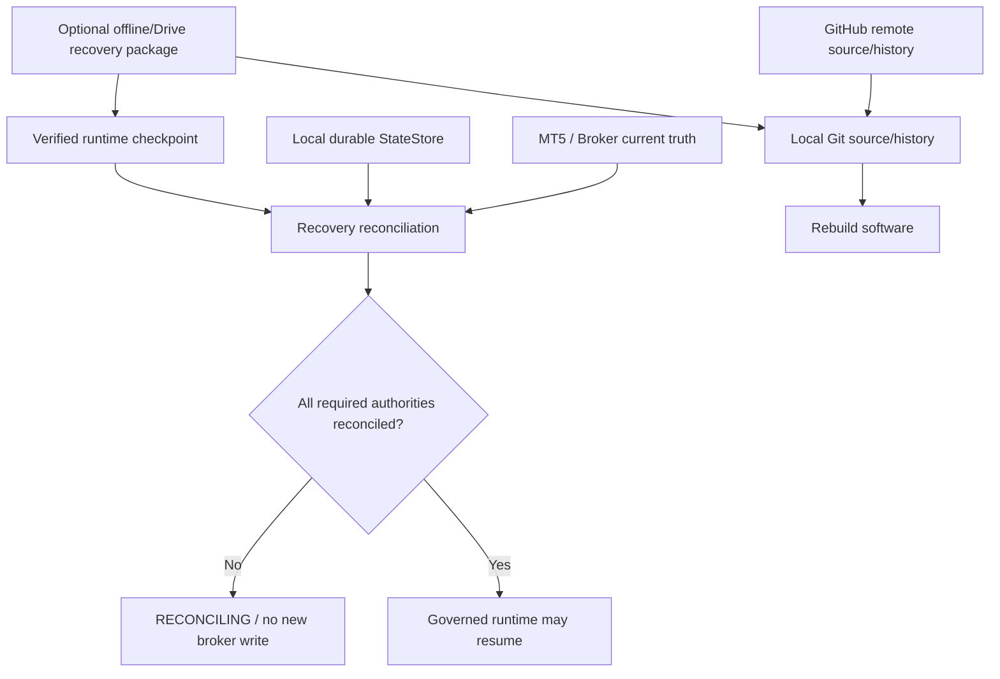
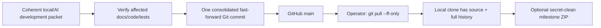
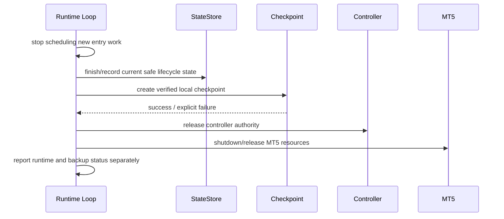
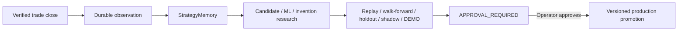
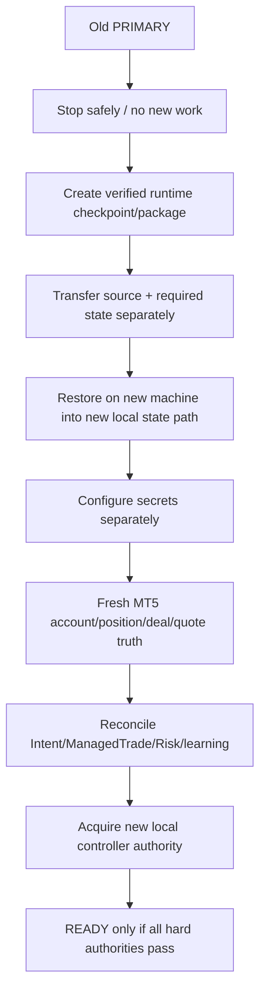

# GoldScalpTrader — Backup, Synchronization and Recovery Architecture

**Status:** APPROVED TARGET ARCHITECTURE — DOCUMENTATION RECONSTRUCTION / IMPLEMENTATION PROOF PENDING
**Version:** 1.0-scalp-local-first-recovery
**Authority:** Source/history recovery, runtime-state durability, learning-state preservation, local/Drive recovery packaging, cross-machine handoff and recovery-proof boundaries.

## 1. Purpose

GoldScalpTrader must remain recoverable even if:

- the Python process crashes;
- Windows reboots;
- MT5 disconnects;
- GitHub is unavailable;
- a local working directory is damaged;
- a laptop must be replaced;
- runtime state must be restored;
- learning/research context must move to another machine.

Recovery must never confuse **restored context** with **current broker truth**.

## 2. Authority hierarchy



Authority order:

1. broker truth for current positions/orders/deals/quote;
2. verified local durable lifecycle state as historical/recovery context;
3. verified checkpoint/package as transport context;
4. source/history as executable-software recovery;
5. dashboard/manual recollection has no recovery authority.

## 3. Separate recovery domains

| Domain | What must survive | What it may never imply |
|---|---|---|
| Source | code/docs/tests/history | current broker exposure |
| Runtime | Risk day, Opportunity, TradePlan, Intent, ManagedTrade, controller/reconcile context | broker permission without fresh reconciliation |
| Learning | observations, outcomes, candidates, experiment/promotion lineage | production promotion without approval |
| Operator config | non-secret policy/configuration | secret credentials |
| Secrets | provisioned separately | publication in source/backup artifacts |

## 4. Local working repository

Intended Windows working path is operator-controlled; a common project location is:

```text
D:\Trading Bot\GoldScalpTrader
```

The bot runs from the local working repository, not from GitHub and not from a cloud-synced live working directory.

Local Git is the immediate development/version-history surface. GitHub is a remote source/history copy, not runtime authority.

## 5. Development/source backup workflow

Approved low-churn workflow:



Do not pull/push after every micro-edit. Do not auto-publish source from trading-runtime startup/shutdown.

## 6. Runtime durability architecture

Runtime state is local and transactional.

Target durability layers:

```text
live StateStore
→ transactionally persisted records/events
→ rolling verified local checkpoints
→ graceful-shutdown final verified checkpoint
→ optional portable runtime recovery package
```

A checkpoint must be created through a consistent snapshot/export method. Never copy an open SQLite database/WAL family blindly.

Minimum runtime recovery content eventually includes:

- schema/version metadata;
- scope/account/symbol identity;
- risk-day state and fixed profile identity;
- aggressive-overlay state;
- non-trading cash-flow reconciliation state;
- cooldown/loss-streak/re-entry state;
- active/past Opportunity and TradePlan identity as required;
- ExecutionIntent lifecycle;
- ManagedTrade lifecycle;
- controller/fencing metadata required for recovery interpretation;
- close receipts/pending learning queue;
- StrategyMemory/raw learning evidence;
- research/candidate/promotion lineage required by the owning contracts;
- checksums/manifest/integrity evidence.

## 7. Graceful shutdown

Runtime shutdown performs no Git operation.



Checkpoint failure does not erase an earlier runtime/execution failure. Backup success does not convert ambiguous broker truth into success.

## 8. Crash recovery

After unexpected process loss:

```text
startup
→ inspect local StateStore integrity
→ restore only if required/explicit
→ initialize fresh MT5 read boundary
→ verify account/server/symbol identity
→ read positions/orders/deals/quote
→ reconcile unresolved Intent
→ reconcile ManagedTrade/close truth
→ reconcile Risk day/cash flow/cooldown
→ remain RECONCILING while required truth unresolved
→ allow new trading only after normal authorities pass
```

If an Intent was `SUBMITTING` or acknowledgement was ambiguous:

> **Never resend merely because the process restarted. Reconcile broker truth first.**

## 9. Source recovery package

An optional source milestone package may contain:

```text
Source/
    committed project tree
GitHistory/
    recoverable Git history artifact or cloned .git history where appropriate
Manifest/
    commit SHA
    file inventory
    hashes
    created timestamp
    verification status
```

It excludes:

- `.env`;
- credentials/keys/tokens;
- live runtime DB/state;
- `.venv`;
- caches/logs/temp/build outputs;
- large datasets/models unless a separate research-data package explicitly owns them.

Source ZIP/package is never committed back into GitHub.

## 10. Optional Google Drive / independent off-site recovery

Google Drive may be used as **independent recovery storage**, not as the live runtime working tree.

Approved principles:

- do not run the bot from a Drive publication folder;
- do not synchronize an active SQLite DB/WAL family;
- publish only verified immutable recovery artifacts;
- secret-scan before publication;
- preserve manifest/hash/commit/checkpoint identity;
- Drive sync success alone does not prove remote byte integrity unless the recovery procedure verifies retrieved artifacts;
- no Drive API credential is required by the trading bot itself.

A future A/B publication layout may be used when implemented/proven:

```text
GoldScalpTrader_Backups/
    Published_A/
    Published_B/
    CURRENT.json
    GitHistory/
    RuntimeBackups/
    LearningBackups/
    WorkingRecovery/
    Manifests/
    Releases/
```

The currently verified slot remains authoritative until the inactive slot is completely transferred and verified.

## 11. Dirty working-tree recovery

Accepted committed source and uncommitted work are different evidence classes.

If a developer wants a portable dirty-work package, store separately:

- base commit identity;
- `git status`;
- staged patch;
- unstaged patch;
- sanitized untracked files;
- exclusions/rejections;
- hashes.

Never auto-commit arbitrary dirty work merely to back it up. Secret-bearing untracked files are rejected, not quarantined into a shared backup.

## 12. Learning/research recovery

Learning/research is valuable project state and must be restorable without silently changing production policy.



A recovered candidate may continue research/testing. Recovery cannot skip the approval gate.

## 13. Cross-machine handoff

Same-account active-active/distributed writer is **deferred by operator approval**.

Supported target model is sequential handoff:



## 14. Distributed database/fencing

Distributed DB/shared-lock infrastructure is **deferred**.

Not required for the approved one-PRIMARY sequential-handoff architecture:

- PostgreSQL cluster;
- Redis distributed lock;
- etcd/ZooKeeper/consensus services;
- active-active cross-laptop broker writers.

Adding them would introduce network dependency, split-brain scenarios, operational cost and new failure modes without current product need.

If active-active same-scope execution is ever proposed, it requires a separate architecture, threat model, durable ordering/fencing proof and operator approval.

## 15. Recovery validation matrix

| Scenario | Required result |
|---|---|
| normal restart, clean state | recover and reconcile before writes |
| corrupt StateStore | block affected authority; restore verified copy to new path |
| missing checkpoint | continue only from verified state/broker truth; never invent state |
| ambiguous OPEN ack | no resend; reconcile |
| position exists but ManagedTrade missing | ownership/recovery investigation; never silently adopt unknown exposure |
| ManagedTrade exists but broker position absent | verify exact close lineage before clearing |
| GitHub unavailable | runtime unaffected; local source/state remain usable |
| Drive unavailable | runtime unaffected; last local verified artifacts remain |
| new laptop | restore source/state then fresh broker reconciliation |
| candidate research restored | continue research; no auto production promotion |

## 16. Backup health versus trading permission

Backup health is visible system health but ordinarily does not create market strategy evidence.

A backup failure:

- must be diagnosed;
- must not be hidden;
- must not grant broker permission;
- does not automatically require closing a safe existing position;
- may become a release/operational blocker depending on durability severity.

The trading contract owns exact fail-closed implications for persistence corruption or loss of required durable lifecycle authority.

## 17. Proof requirements before claiming recovery complete

Recovery capability is not complete until tests/drills prove:

- consistent checkpoint creation;
- manifest/hash validation;
- corruption rejection;
- restore into a new path;
- no secret leakage;
- no raw live-DB copy assumption;
- unresolved Intent reconciliation;
- ManagedTrade/broker-close reconciliation;
- Risk/cooldown preservation;
- learning/candidate lineage preservation;
- fresh-machine source reconstruction;
- sequential laptop handoff;
- external recovery artifact retrieval where applicable.

## 18. Final invariant

> **Backup preserves context; only current broker truth plus current governed authorities can restore trading permission. Source recovery, runtime recovery, learning recovery and remote publication are separate evidence classes and must never be conflated.**
