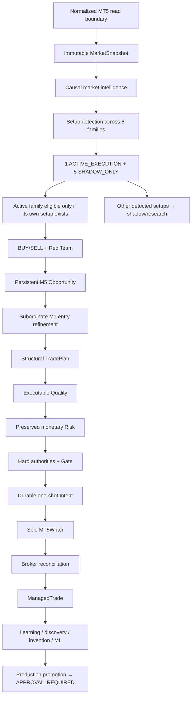

# GoldScalpTrader — Coder Guide

**Status:** FINAL PRE-IMPLEMENTATION DEVELOPER MANUAL — DOCUMENTATION FREEZE BASELINE
**Version:** 2.0-institutional-scalp
**Authority:** Developer/AI navigation, architecture ownership, implementation order, source/test synchronization and completion evidence.

## 1. Read before code

GoldScalpTrader is documentation-first.

```text
66-document institutional manual
→ final architecture / governance freeze
→ implementation
→ deterministic tests
→ replay / calibration
→ connected DEMO
→ release evidence
```

Repository truth beats remembered chat. Code must never get ahead of canonical Documents.

## 2. Preservation-first rule

GoldSwingTraderAI is the reference feature/default baseline.

Before changing inherited behaviour ask:

```text
direct Scalp requirement?
OR explicit operator decision?
OR proven reference defect/current external fact update?
```

If no, preserve it. Do not remove a feature because a simpler implementation is easier.

The exact accepted Swing→Scalp/operator differences are owned by `08-governance/DOCUMENTATION_COMPARISON.md` after folder migration.

## 3. Authority reading order

1. `README.md` and `GLOSSARY.md`;
2. `01-foundation/SYSTEM_CONTRACT.md`;
3. owning topic contract;
4. `08-governance/DESIGN_DECISIONS.md` + `OPEN_QUESTIONS.md`;
5. `DOCUMENTATION_COMPARISON.md` + `PRESERVATION_LEDGER.md` for inherited behaviour;
6. Architecture + Trading Floor;
7. Coding Standard;
8. Module Structure + File/Test Catalog;
9. current source/tests/evidence.

## 4. Final architectural spine



## 5. Setup detection — never force a strategy

This is a hard analytical rule:

```text
chart/market facts
→ detect what setup actually exists
→ map to matching family or NONE
→ active-family eligibility check
```

Wrong:

```text
active family = Breakout Retest
→ reinterpret every market as Breakout Retest
```

Correct:

```text
Detected Setup = Liquidity Sweep
Active Test Family = Breakout Retest
→ live action WAIT
→ Sweep recorded SHADOW_ONLY
```

Exactly one family has live trade authority, but no family has permission to fabricate its own setup.

## 6. Timeframe authority

```text
H4   optional major context
H1   broad soft regime/context
M15  opportunity location/path/target context
M5   primary setup/thesis + normal management structure
M1   subordinate entry refinement after valid M5 Opportunity
quote current executable Bid/Ask/spread/drift truth
```

M1 cannot independently originate a production trade.

## 7. Analytical performance model

Logical specialist independence is mandatory. Physical parallelism is profiling-driven.

Implementation order:

```text
share calculations
→ vectorize/cache
→ deterministic serial baseline
→ profile
→ bounded parallelism only where measured benefit exists
→ prove one-worker/parallel semantic parity
```

Financial/broker authority is always serial.

## 8. Preserved monetary Risk

Do not replace the canonical profiles with one generic `STANDARD` profile.

| Profile | DayStartEquity | Normal | Elevated | Hard ceiling | Daily lock |
|---|---:|---:|---:|---:|---:|
| SMALL | positive < $300 | 3.0–4.5% | >4.5–6.5% | 7% | 12% |
| MEDIUM | $300–$999.99 | 2.0–3.0% | >3.0–4.5% | 5% | 9% |
| NORMAL | >= $1,000 | 1.0–2.0% | >2.0–3.5% | 4% | 7% |

Preserve disabled-by-default aggressive capability:

```text
8%  max single-trade monetary SL-risk ceiling — NOT target
16% max aggregate open risk
16% daily loss ceiling
```

Manual daily-loss reset remains disabled by default. One fresh same-episode re-entry and 3 losses → at least 30m cooldown remain current baselines.

## 9. TradePlan / executable quality separation

TradePlan owns structural invalidation/SL/objectives/gross R.

Executable Quality owns current economics:

```text
emergency spread ceiling
spread/SL
spread/target
recent spread baseline
total cost/reward
slippage allowance
broker deviation
decision→send latency
price drift/chase
```

Do not move structural SL/target to improve ratios.

Swing's 1.20R floor is not automatically a hard Scalp floor.

## 10. Session and News

Hard broker/session facts remain hard:

```text
OPEN / PRE_CLOSE / CLOSED / REOPEN_WARMUP / UNKNOWN
```

Preserved baselines pending current broker proof:

```text
Daily PRE_CLOSE   T-20 no entry / T-10 flatten
Weekend PRE_CLOSE T-60 no entry / T-30 flatten
Daily reopen      1 clean completed M5
Weekend reopen    2 clean completed M5 + gap assessment
```

News/Fundamental is soft context/research only:

- event does not directly block;
- provider failure does not directly block;
- no News cooldown;
- no mandatory post-News warmup;
- actual spread/drift/dislocation/cost deterioration is handled by real market/execution owners.

1800s remains a context-cache freshness baseline, not trade permission.

## 11. Runtime capability progression

```text
READINESS
→ DRY_RUN
→ controlled DEMO PRIMARY
→ future governed REAL
```

REAL is preserved but unavailable until its separate evidence/release gate and explicit operator approval.

## 12. Execution invariants

```text
TradePlan
→ Executable Quality
→ Risk
→ hard authorities
→ Gate
→ persist Intent
→ fresh broker checks / order_check
→ persist SUBMITTING
→ exactly one raw writer call
→ classify acknowledgement
→ reconcile
```

Never blind-retry ambiguous acknowledgement.

`positions=[]` means verified zero. `positions=None/error` means unavailable, not zero.

## 13. Management invariants

```text
HOLD | PROTECT | TRAIL | RUNNER | EXIT
```

- time-efficiency may cause EXIT;
- Runner is exceptional and requires fresh continuation/objective;
- optional partial management where volume is divisible;
- 0.01-lot correctness never depends on partial close;
- stop never intentionally widens beyond approved risk;
- broker verification precedes durable local state mutation.

## 14. Learning / invention / ML

Backend autonomy is active:

- actual and shadow evidence;
- replay/walk-forward/holdout/stress;
- strategy invention;
- candidate parameter tuning;
- advanced ML candidates;
- automated stage progression.

But:

```text
candidate/shadow policy may evolve
production policy cannot silently evolve
```

Final production/live promotion always stops at `APPROVAL_REQUIRED`.

## 15. Dashboard engineering

The approved primary graphical UX is Swing-style institutional one-screen layout adapted to Scalp:

- no scrollbars;
- central interactive chart;
- functional M1/M5/M15/H1/H4 buttons;
- functional Indicators/Drawings/Settings;
- Detected Setup separate from Active Test Family;
- shadow setup clearly labelled research only;
- exact upstream blocker separate from Gate state;
- Account/Risk, TradePlan, execution, activity, learning, system/data and verified closes visible on one screen.

Presentation is read-only and cannot recalculate trading authority.

## 16. Runtime persistence / source backup

Runtime:

```text
transactional StateStore
→ rolling checkpoints
→ graceful-stop verified checkpoint
→ optional portable recovery package
```

No runtime Git operation.

Development/source:

```text
one coherent commit
→ operator git pull --ff-only
→ local clone + full Git history
→ optional secret-clean ZIP
```

## 17. Code quality requirement

Every material module documents:

- purpose and authority;
- inputs/outputs/units;
- side effects;
- UNKNOWN/failure semantics;
- chronology/no-lookahead;
- thread/concurrency expectations;
- persistence/broker implications;
- important invariants.

Inline comments explain **why**, not obvious syntax. Use type hints, frozen DTOs where appropriate, enums/reason codes, no magic numbers, structured redacted logs and narrow external adapters.

## 18. Feature packet before implementation

For every material feature record:

1. canonical owner;
2. preservation/Scalp/operator classification;
3. typed inputs/outputs;
4. chronology/freshness;
5. state machine;
6. failure/UNKNOWN;
7. concurrency/order;
8. persistence/recovery;
9. Risk/broker effect;
10. operator representation;
11. research effect;
12. source owner;
13. tests;
14. calibration/external proof;
15. affected-document graph.

## 19. Context-loss recovery

```text
current main HEAD
→ README / Glossary
→ System Contract / Architecture
→ Documentation Comparison / Preservation Ledger
→ owning topic contract
→ Design Decisions / Open Questions
→ Module Structure / File-Test Catalog
→ current source/tests/evidence
→ first incomplete dependency
```

## 20. Completion classification

Use exact statuses:

```text
DOCUMENTED
IMPLEMENTED
DETERMINISTIC PASS
CALIBRATION PENDING
EXTERNAL PROOF PENDING
CONNECTED DEMO PASS
APPROVAL_REQUIRED
DEFERRED
BROKEN
```

Green tests are not profitability proof.
